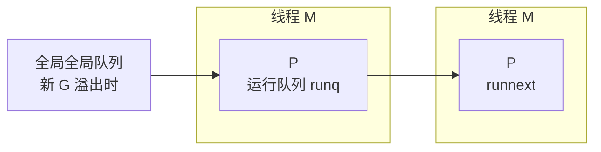

**TL;DR：** Go 调度的三个关键数字：**goroutine 创建 441ns**、**channel 无锁传球 171ns**（M1 Pro 实测）、**时间片抢占最坏等 10ms**（runtime/proc.go 的 `forcePreemptNS`）。调度器的三个组件 G/M/P 各管一件事：G 是协程栈，P 是 CPU 上的调度队列（数量 = GOMAXPROCS），M 是线程。**调度延迟 = 创建/切换的固定开销（百 ns 级）+ 排队与抢占的最坏等待（10ms 级）**。哪个占了你的大头，决定了是换池子、调 GOMAXPROCS 还是本来就没问题。

## 一、直觉错在哪：goroutine 便宜 ≠ 免费

"goroutine 便宜"指与线程比（线程创建 µs 级、栈 8MB），不是零成本。实测分解：

| 操作 | 本机 ns/op | 每秒 100 万次的账单 |
| --- | --- | --- |
| goroutine 创建 | 440.6 | 0.44 秒 CPU |
| channel 双 G 传球 | 171.1 | 0.17 秒 CPU |
| 无锁原子计数（参考） | ~7 | 7ms |

创建要花钱的地方在三个都会遇到：分配栈（初始 2KB）、填调度上下文、链入队列。每秒百万 goroutine 吃掉近半核，这不是"免费"，只是"比其他方案便宜"。任何把 goroutine 当廉价标签堆的代码，最终账单都会寄回 CI 的 CPU 预算上。

## 二、三张表：G 是执行体，M 是线程，P 是"CPU 的调度队列"

GMP 不是三张内存表那么简单，分工决定了你能调的旋钮：



- **G（goroutine）**：栈指针 + 上下文。可以很多，几乎不占用 OS 资源；创建即排队。
- **P（processor）**：数量 **固定 = GOMAXPROCS**（默认 8）。每个 P 有一份本地运行队列 runq（容量 256）和一个 runnext（优先插队位）。**调度器调度的是"哪个 G 上 P"**，P 才是严格并发上限：GOMAXPROCS=8 时最多 8 个 G 同时跑。
- **M（machine/线程）**：数量动态。M 去干 syscall 久不回时要新开 M；本地队列空时从全局队列掏 G。全局队列是溢出的下水道（每 P 256 满后）。

调 GOMAXPROCS 的实际效果：调的是可以同时跑几个 G（P 数），不是"允许多少线程"（M 数自己长）。要并发上的量大，P 是硬顶；要让线程少，P 保持小。

## 三、抢占：10ms 时间片的账

Go 从 1.14 起有异步抢占，但机制简化成一句话：**任何 G 连续运行超过 10ms 就会被标记让路**。源码 `runtime/proc.go`：

```
const forcePreemptNS = 10 * 1000 * 1000 // 10ms
```

- 后台线程 sysmon 每秒几十趟检查各 P，发现某个 G 跑了这么久（`schedwhen+forcePreemptNS <= now`），就给它发抢占信号；
- 被抢占的 G 在下一个安全点（函数入口的栈 check）切换出去；  
- 如果 G 在系统调用里，P maven者"先从 P 拿走等 syscall 结束"。

效果：**单 G 对单核的"最长占时 10ms** 是对有活要跑的另一个 G 的承诺。卡任务用了 5ms 不会被抢占；一样活 100ms 最多等 10ms 就被迫让。

> 注意：这不是实时 10ms 准点：抢占要等安全点，安全点最坏可以离触发点再远个循环——所以"很短的密集计算 9ms <10ms <10ms"毫安然无恙，"循环单次 9.9ms"这类 hairline 会抖动。

## 四、验算：本机三个数字

本机执行（代码见下，10 秒）：

```go
package sched

import (
	"sync"
	"testing"
)

func BenchmarkGoroutineCreate(b *testing.B) {
	var wg sync.WaitGroup
	for i := 0; i < b.N; i++ {
		wg.Add(1)
		go func() { wg.Done() }()
	}
	wg.Wait()
}

func BenchmarkChannelPingPong(b *testing.B) {
	ch := make(chan int)
	var wg sync.WaitGroup
	wg.Add(1)
	go func() {
		defer wg.Done()
		for i := 0; i < b.N; i++ {
			<-ch
		}
	}()
	b.ResetTimer()
	for i := 0; i < b.N; i++ {
		ch <- i
	}
	wg.Wait()
}
```

```bash
$ go test -bench . -benchtime=2s -run=^$
BenchmarkGoroutineCreate-8   	5389287	       440.6 ns/op
BenchmarkChannelPingPong-8   	14045991	       171.1 ns/op
```

（上面就是 M1 Pro + Go 1.25 实测输出。）

另一只眼，看调度轨迹——4 个忙 goroutine 抢 2 个 P（`GOMAXPROCS=2`，循环 50ms 忙 + 10ms 睡）：

```bash
$ GODEBUG=schedtrace=250 go run main.go
SCHED 258ms: gomaxprocs=2 idleprocs=0 threads=5 spinningthreads=1 needspinning=1 idlethreads=2 runqueue=0 [ 0 1 ] schedticks=[ 12 15 ]
SCHED 510ms: gomaxprocs=2 idleprocs=0 threads=5 spinningthreads=1 needspinning=1 idlethreads=2 runqueue=1 [ 0 1 ] schedticks=[ 24 26 ]
SCHED 767ms: gomaxprocs=2 idleprocs=0 threads=5 spinningthreads=1 needspinning=1 idlethreads=2 runqueue=1 [ 0 0 ] schedticks=[ 37 38 ]
SCHED 1020ms: gomaxprocs=2 idleprocs=0 threads=5 spinningthreads=1 needspinning=1 idlethreads=2 runqueue=1 [ 0 0 ] schedticks=[ 49 50 ]
```

**读法**：`schedticks` 是各 P 累计切换次数。258ms 时 P0 切了 12 次、P1 切了 15 次；1020ms 时变成 49/50——**每个 P 平均约 12 次/250ms，即约每 20ms 换一次人**：50ms 忙循环被 10ms 抢占切成几段，sleep 则让出 P。`runqueue=1` 说明还有 G 在全局队列等空位。这就是"10ms 时间片"在现实里的剖面。

## 五、决策：调度慢发生在哪一层

| 症状 | 账单落在哪 | 诊断 | 解法 |
| --- | --- | --- | --- |
| 大量小任务、CPU 突然爆 | 创建 441ns | pprof 里 createGoroutine 帧多 | worker pool 复用 |
| 单请求偶发 ~10ms 延迟 | 时间片 | 火焰图是长函数循环 | 循环内插入 `Gosched`/channel idle |
| 大量 syscall 时线程爆炸 | M 表 | threads 数秒级翻倍 | 改用 polling 或调系统 |
| 极端时上万 goroutine 不跑 | 队列满 | runq 256 满、全局 掏空 | 分片、限并发 |

关键区分：**441ns 和 171ns 是"稳态成本"，10ms 是"最坏延迟"**。业务变卡时先看 pprof 时间线哪一段占最多，调度器只是其中一层。如果创建为主，用池；如果偶发延迟，先确认是"时间片被抢"还是"锁等待"（见[锁的成本](/writing/go-lock-cost-futex-rwlock)）。

## 六、结论

Go 调度器安全的工程三线：

1. **任务粒度很小（每条 < 20µs）**：直接用 `go func`——441ns 的创建成本占任务开销不到 5%，无脑开就行
2. **任务粒度到微秒级批量**：业务里有"每秒百万次级小任务"时，创建成本开始吃 CPU 预算，换成 worker pool（复用 G&M，单次成本降一个量级）
3. **有硬延迟要求（<10ms）**：调度器承诺不了最坏延迟，设计上避免"单 G 长函数循环"，把大计算拆小或主动让出

工程判断不是看"goroutine 贵不贵"，而是看"创建成本占任务总成本的比例"：任务 100µs，441ns 占 0.4%，随便开；任务 1µs，441ns 占 44%，必须复用。

下一步操作（本机 10 秒验证）：

```bash
go test -bench 'GoroutineCreate|ChannelPingPong' -benchtime=2s
GODEBUG=schedtrace=250 go run .
```

## 参考资料

1. Go 源码 `runtime/proc.go`（forcePreemptPreemptNS=10ms、retake、preemptone、schedtrace 实现）—— https://github.com/golang/go/blob/master/src/runtime/proc.go
2. Go 源码 `runtime/runtime2.go`（G、P、M struct 与 runq 256 定义）—— https://github.com/golang/go/blob/master/src/runtime/runtime2.go
3. Go 官方文档 GOMAXPROCS 与环境变量—— https://pkg.go.dev/runtime#GOMAXPROCS
4. GODEBUG 变量列表（schedtrace / scheddetail）—— https://go.dev/wiki/GODEBUG

> 延伸：goroutine 切换的另一半是锁排队（[锁的成本在排队](/writing/go-lock-cost-futex-rwlock)）；调度器的内存账（GC 停顿不是调度）（[Go GC 时间账本](/writing/go-gc-gctrace-account)）；并发保障的先后规则（[happens-before 唯一的裁判](/writing/go-happens-before)）。