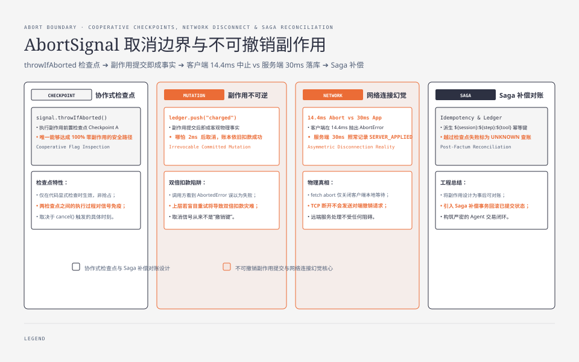
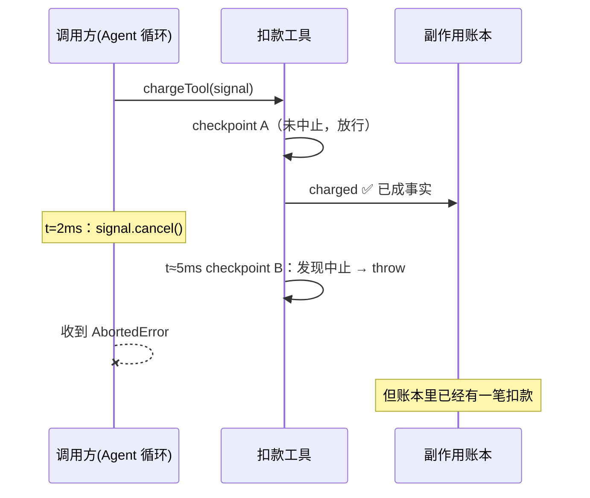
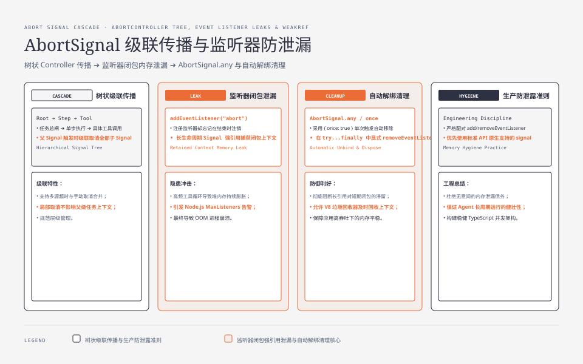
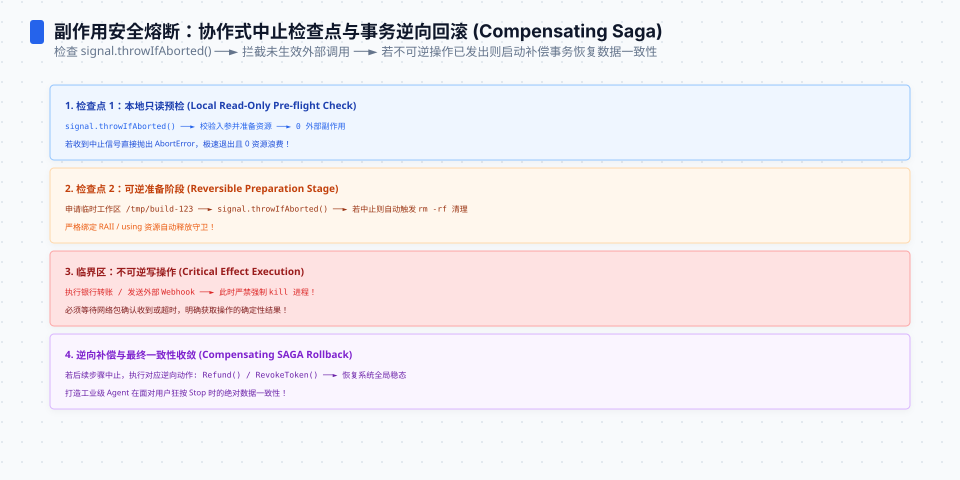

**TL;DR：** 取消信号不是撤销键。对"扣款工具"做三时机 × 两实现的对照实验（`experiments/ts-agent-cancel/`）：唯一零副作用的路径是**调用前信号已中止**（`AbortedError`、账本为空）；一旦副作用已提交，哪怕两毫秒后 cancel，结果也是**调用方看到 `AbortedError`、账本却是 `[charged]`**。真实 HTTP 对照同样：客户端 `fetch` 在 14.4ms 抛出 `AbortError`，服务端 30ms 后照常记录 `SERVER_APPLIED`。结论：AbortSignal 的合同是"停止后续工作"，从来不是"收回已做的工作"——工具循环里真正要设计的是事后对账，不是事前阻止。


---



## 一、取消的合同范围：signal 只在"被检查的地方"生效

[状态机篇](/writing/typescript-agent-state-machine)讲过 Agent 工具循环的事件合法性；这一篇讲它的另一半——**取消的传播边界**。一个配合取消的工具长这样：

```ts
async function chargeTool(signal: AbortSignal, ledger: string[]) {
  signal.throwIfAborted(); // checkpoint A：出发前
  ledger.push("charged");  // ← 不可撤销副作用：执行即成事实
  await delay(5);
  signal.throwIfAborted(); // checkpoint B：事后才发现被取消
  return "receipt-1";
}
```

两个检查点之间的整段代码，取消信号**不存在**。这不是 bug，是 AbortSignal 的设计：它是协作式的旗标，不是抢占式的中断。于是问题变成精确的时刻表——cancel 落在时间线的哪个位置，决定了你得到什么。






## 二、实验矩阵：三个时机 × 两种工具

跑全部组合（原始输出 `evidence/abort-signal-tool-side-effects/2026-08-23-local/sim.log`）：

| 工具实现 | 取消时机 | 调用方看到 | 扣款账本 |
| --- | --- | --- | --- |
| checks(配合取消) | 调用前已中止 | AbortedError | **空** |
| checks(配合取消) | 不取消 | receipt-1 | [charged] |
| checks(配合取消) | t=2ms(副作用后) | **AbortedError** | **[charged]** |
| ignore(不配合) | 调用前已中止 | receipt-1 | [charged] |
| ignore(不配合) | 不取消 | receipt-1 | [charged] |
| ignore(不配合) | t=2ms(副作用后) | receipt-1 | [charged] |

三行读出三条规则：

1. **唯一的零副作用路径是"出发前就已中止"**——checkpoint A 拦下一切；
2. **最危险的是第二行与第三行的组合**：t=2ms 取消让调用方确信"这次调用失败了"，账本却记着一笔成功扣款。上层如果按"抛错 = 没发生"来重试或回滚，就会双倍扣款；
3. **不配合取消的工具对信号完全免疫**——ignore 实现连"调用前已中止"都拦不住，因为代码根本不看旗标。

第三行就是本文标题的那个场景：`cancel()` 之后，钱还是扣了。

## 三、真实网络对照：客户端 abort 拦不住已到达的请求

模拟之外，用真实 `fetch` + 本机 HTTP 服务再确认一次（`real-http.mjs`）：服务端收到请求后等 30ms 才"应用业务处理"，客户端在 10ms 时 abort。结果：

```text
CLIENT Saw: Error after 14.4ms        ← 客户端视角：这次调用失败了
SERVER_APPLIED id=order-1 at=…        ← 服务端视角：请求照常处理完毕
```

机制很直白：abort 关闭的是**客户端这边的等待**，而 HTTP 请求早已完整到达对端，服务端的 handler 会继续跑完。TCP 连接的中断不会给服务器发"请撤销你刚才要做的事"。把这两层混为一谈，就是"超时重试导致重复下单"这类事故的全部成因——[幂等性工程篇](/writing/idempotency-engineering)的 27 次乘法上界，起点正是这里。




## 四、工程答案：把副作用设计成可对账，而不是可阻止

既然"事前阻止"只在窗口极窄的路径上成立，正确的设计目标就变成**让每个副作用事后可裁决**：

1. **副作用携带幂等键**。工具执行前先派生确定性 key（如 `${sessionId}:${stepIndex}:${toolName}`），服务端用唯一约束裁决重复——这样"取消后重试"从危险操作变成安全操作（并发反例怎么审见[幂等 PR 评审篇](/writing/review-idempotent-pr-concurrency)）;
2. **区分"未开始"与"结果未知"两种失败**。checkpoint A 之前的失败可以放心重试；越过副作用提交点的失败必须标记为 UNKNOWN，走查询/对账而不是盲目重来；
3. **账本是事实的唯一来源**。UI 与编排层显示"已取消"之前，先查副作用账本——本实验里的 ledger 就是那个必须先看的表。

## 五、边界

三点诚实声明：其一，模拟中的检查点位置是理想化的，真实工具的检查点分布各不相同，"多窄算安全"没有通用答案；其二，HTTP 对照是单次现象演示而非统计，undici 在 DNS、连接池、响应解析各阶段对 abort 的具体行为未逐段验证；其三，本实验只覆盖单进程 JS 语义，分布式补偿事务（SAGA 的补偿分支同样可能失败）是另一层问题，将在[分布式故障模型](/writing/lamport-vector-clocks)系列展开。

## 六、结论：取消是停止投入，不是追回投资

1. AbortSignal 保证的只有一件事：**没人会再往这个操作上花新的力气**；
2. 已提交的副作用属于世界，不属于你的调用栈——想撤它需要另一笔带幂等保障的事务；
3. 写任何带副作用的工具时先问：我的 checkpoint A 在哪？越过它之后失败，调用方拿到的是什么？

给现有 Agent 工具清单做一次盘点：逐个标注"越过哪一行之后失败必须走对账"。标不出来的那些工具，就是下一次重复扣款的候选现场——它们不是缺少取消功能，而是缺少对"已经发生"的承认。

## 参考资料

- 本篇实验与原始输出：`experiments/ts-agent-cancel/`、`evidence/abort-signal-tool-side-effects/2026-08-23-local/`
- MDN：[AbortSignal.throwIfAborted()](https://developer.mozilla.org/en-US/docs/Web/API/AbortSignal/throwIfAborted)、[Fetch API 的取消语义](https://developer.mozilla.org/en-US/docs/Web/API/AbortController)
- 站内相关：[TypeScript Agent 状态机](/writing/typescript-agent-state-machine)、[评审幂等 PR](/writing/review-idempotent-pr-concurrency)、[重试会放大错误](/writing/idempotency-engineering)
