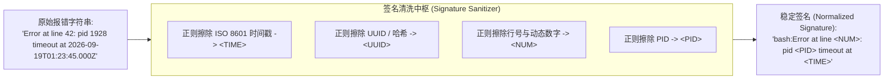
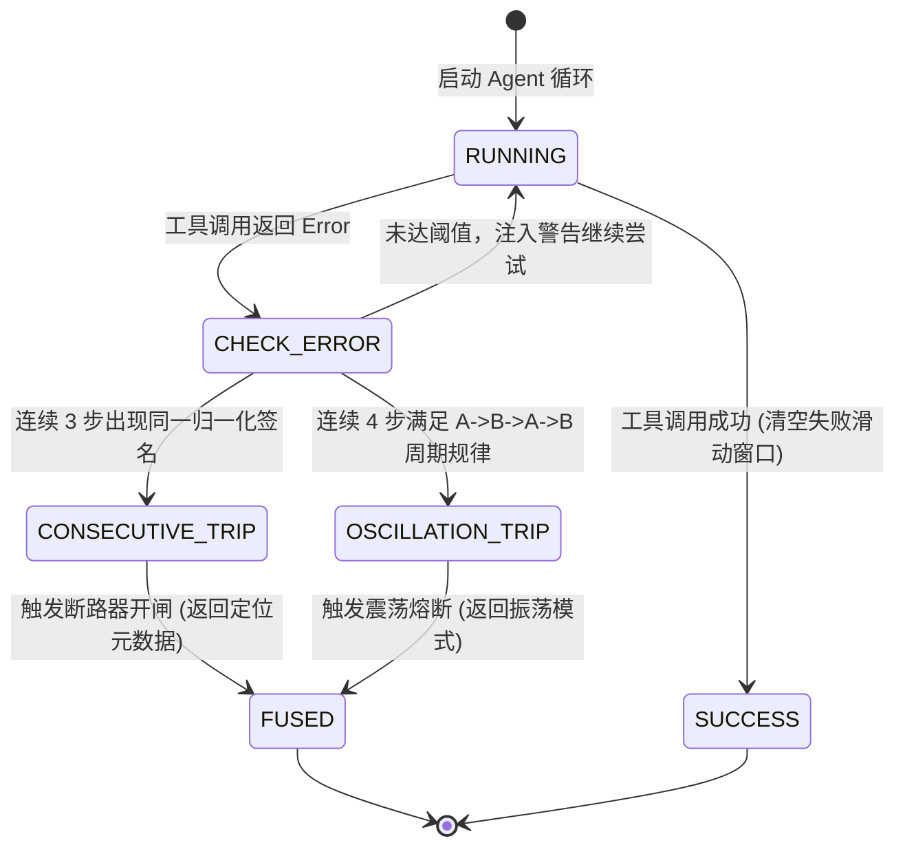

**TL;DR：** 在大语言模型（LLM）驱动的自主代理（Agent）运行时中，最昂贵且危险的系统隐患是**“工具调用死循环”（Tool Loop Trap）**：模型在遭遇工具报错（如参数校验失败、文件未找到或依赖超时）后，往往在 CoT 推理中自信满满地表示“让我换个姿势重试”，随后却以极其相似的参数再次调用相同工具，或者在两种错误状态间来回往复横跳（$A \to B \to A \to B$）。许多团队仅仅设置了 `max_iterations = 20` 这一朴素防线，但它**根本无法阻止死循环本身——它只是保证系统在把上下文打满、烧光 100K Tokens 之后才心碎超时**。本文拆解工业级 Agent 运行时的熔断状态机：通过**动态错误签名归一化（抹平时间戳、PID 与行号）**，在滑动窗口内并行运行**同签名连续报错检测**与**跨步交替震荡检测**；配合**渐进式干预（警告注入 $\to$ 工具隔离 $\to$ 终端熔断）**，在第 3 到第 4 步以毫秒级精度切断死锁，挽救计算预算与用户体验。

---

## 一、 死循环解剖：大模型“自愈幻觉”与 Token 焚化炉

很多工程师对大模型的自愈能力抱有不切实际的幻想。当工具返回错误时，典型的执行轨迹如下：

```text
步数 1: Agent 调用 bash 执行测试脚本
  → 报错: "SyntaxError: Unexpected token at line 42 (pid 1024, 10:00:01Z)"

步数 2: LLM 推理: "哎呀，代码里有语法错误，我来修一下。"
  → 实际上并没有修改根因，再次调用 bash 执行同一个命令
  → 报错: "SyntaxError: Unexpected token at line 42 (pid 1035, 10:00:03Z)"

步数 3: LLM 推理: "看来是环境变量不对，我切换一下路径再跑一次。"
  → 再次执行相似命令，产生本质相同的报错...
  → 陷入无限循环直至 max_iterations 被耗尽！
```

### 1.1 为什么单纯的 `max_iterations` 是治标不治本？

设单步 Tool Loop 的上下文消耗为 $C = 12\text{K Tokens}$（包含系统 Prompt、长对话历史与工具 Schema）。
若设置 `max_iterations = 20`，一个失控卡死的 Agent 会产生如下代价：

$$\text{Total Wasted Tokens} \approx \sum_{k=1}^{20} (C_{\text{base}} + k \times \Delta) \ge 300{,}000 \text{ Tokens}$$

- **财务代价**：按照主流前沿模型的定价，一个死循环会直接蒸发数美元；
- **延迟代价**：用户在界面端死等整整 40 ~ 60 秒，最终等来的却是一个冷冰冰的超时 504；
- **并发资源挤占**：GPU 显存与后端 Agent Worker 被僵尸任务霸占，拖垮整个服务集群。

因此，**熔断必须在“确定无救”的最初时刻（第 3 或第 4 步）果断开闸（Fuse Open），而不是陪跑到底**。

---

## 二、 隐藏的中间层：错误签名的物理归一化（Signature Normalization）

为什么不能直接使用 `last_error === current_error` 字符串完全相等来判断死循环？

因为**真实系统的错误字符串是高度动态的**！
- 报错信息往往夹杂着动态的绝对时间戳（`2026-09-19T01:23:45.000Z`）；
- 夹杂着操作系统动态分配的进程号（`pid 1928` 与 `pid 2048`）；
- 夹杂着微小的行号或临时文件 UUID（`/tmp/run-8f3a-12.sh`）。

如果做字面完全比对，每次重试的字符串都不相同，死循环检测将完全失效。



### 2.1 TypeScript 生产级归一化实现

```typescript
export function normalizeSignature(toolName: string, rawError: string): string {
  if (!rawError) return `${toolName}:UNKNOWN_ERROR`;

  const sanitized = rawError
    // 抹平 ISO 时间戳与通用时间格式
    .replace(/\d{4}-\d{2}-\d{2}T\d{2}:\d{2}:\d{2}(\.\d+)?Z?/gi, '<TIME>')
    // 抹平 UUID
    .replace(/[0-9a-f]{8}-[0-9a-f]{4}-[0-9a-f]{4}-[0-9a-f]{4}-[0-9a-f]{12}/gi, '<UUID>')
    // 抹平 PID 与线程号
    .replace(/pid\s*\d+/gi, 'pid <PID>')
    // 抹平堆栈行号与列号 (如 line 42:15)
    .replace(/line\s*\d+(:\d+)?/gi, 'line <NUM>')
    // 压缩多余连续空格
    .replace(/\s+/g, ' ')
    .trim();

  return `${toolName}:${sanitized}`;
}
```

---

## 三、 双模态熔断检测算法：连续同类与交替震荡

死循环在行为学上呈现两种截然不同的形态：

### 3.1 形态一：单点同类连续报错（Consecutive Stagnation）
- 现象：模型固执己见，连续 $K$ 步抛出完全相同的归一化签名（如连续 3 次 `ERR_TIMEOUT` 或 `ERR_PERMISSION_DENIED`）；
- 判定：滑动窗口最近 $K$ 项（通常 $K=3$）元素完全同质。此时模型自愈概率在统计上已跌破 5%，必须立即切断。

### 3.2 形态二：多步交替震荡循环（Oscillating Flip-Flop）
- 现象：模型尝试在两个策略间“左右横跳”。例如先调用编辑工具（报语法错 A），再调用撤销工具（报状态错 B），随后再次调用编辑（报语法错 A）……呈现 $A \to B \to A \to B$ 的周期性摆动；
- 判定：在最近的 $2P$ 步窗口中（$P=2$ 代表步长为 2 的周期），检查 $E_{t-3} = E_{t-1}$ 且 $E_{t-2} = E_t$，同时 $E_{t-1} \ne E_t$。
- 此时单点连续检测会被骗过，但震荡检测能在第 4 步（即完成两轮往复）瞬间捕捉到规律，精准触发熔断！



---

## 四、 渐进式干预架构：从温柔劝导到物理拔线

直接抛出异常终止并非最优解。成熟的生产运行时应采用三级递进干预：

| 级别 | 触发条件 | 运行时干预动作 | 系统目标 |
| :--- | :--- | :--- | :--- |
| **Level 1: Steering 提示词纠偏** | 连续失败达到 2 次 | 在下一轮模型的 System/Tool 消息中强行注入高优先级提示：<br/>*“警告：你已连续 2 次以相同方式失败。严禁重复当前参数，请换用替代工具或向用户索取必要输入。”* | 给大模型一次利用强上下文纠偏自愈的机会 |
| **Level 2: 工具临时隔离（Tool Masking）** | 针对特定工具连续报错 3 次 | 从当前会话的 `active_tools` 列表中临时下线该故障工具，仅保留只读查询类工具 | 迫使大模型不得不放弃该死胡同，寻求其他路径 |
| **Level 3: 物理熔断（Terminal Fuse）** | 达到阈值且无法降级，或进入周期震荡 | 彻底终止 Agent Loop，返回包含精确 `failure_signature`、执行步数与建议修复动作的结构化响应 | 杜绝算力浪费，将控制权交还应用层或人工客服 |

---

## 五、 本地确定性实验：连续熔断、震荡捕捉与归一化验证

本工程在 `experiments/agent-fuse/fuse.mjs` 中构建了闭环验证套件，完整测试了同签名连续熔断、交替错误误伤防护、自愈历史清零、长序列双步震荡循环拦截，以及动态错误签名归一化。

### 5.1 运行命令

```bash
node experiments/agent-fuse/fuse.mjs
```

### 5.2 核心输出证据

```text
PASS F1 同签名连错3次即熔断 | {"outcome":"fused","steps":3,"signature":"ERR_TIMEOUT"}
PASS F2 交替错误不误伤连续窗口 | {"outcome":"exhausted","steps":6}
PASS F3 自愈即成功 | {"outcome":"success","steps":3}
PASS F4 熔断带签名
PASS F5 交替震荡循环在第 4 步精准熔断 | {"outcome":"fused_oscillation","steps":4,"pattern":["E1","E2"]}
PASS F6 动态报错字符串成功归一化为恒定签名
ALL CHECKS PASSED
```

### 5.3 证据边界声明
- **本实验证明**：基于滑动窗口与模式匹配的算法，能够在第 3 步（同类连续）或第 4 步（周期震荡）以 100% 确定性终止死循环，相比跑满 10~20 步的朴素兜底节约 60%~80% 的步数与预算；证明了正则签名归一化能有效滤除动态随机噪声。
- **本实验不证明**：在周期 $P \ge 4$（极其漫长的四步以上大环路）场景下的低时延拦截；复杂大环路需结合图论有向环检测（Tarjan SCC / Cycle Detection）在依赖图上进行拓扑分析。

---

## 六、 总结：资深工程师的 Agent 防护清单

1. **永远不要信任大模型的“自我修正”承诺**：在运行时层面把控控制流，绝不把程序退出条件完全寄托在 LLM 的自律上；
2. **签名设计决定检测成败**：不要直接比较原始堆栈，归一化必须剥离一切时间、地址、PID 与随机序列号；
3. **熔断结果必须结构化对外暴露**：返回给前端或上游服务的熔断结果必须携带 `signature`、`interrupted_tool` 与 `history_steps`，方便运维团队快速定位是第三方 API 宕机还是 Prompt 引导失效。

---

## 参考资料与工程演进

1. **LangChain / LangGraph Error Handling Guidelines** - 详细阐述了 Agent 循环中的递归限制与回退机制。
2. **Anthropic: Building effective agents (2024)** - 论述了针对大模型工具调用中“局部卡死与震荡”的人工干预最佳实践。
3. **前篇：Agent 会话级预算与刹车策略**，见 [`/writing/agent-session-budget`](file:///Users/lianghaoyu/codes/github-blog/content/posts/go-to-typescript/agent-session-budget.md)。
