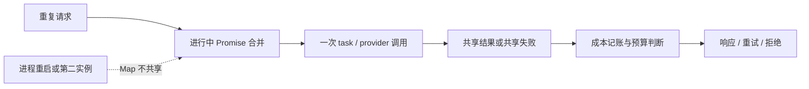
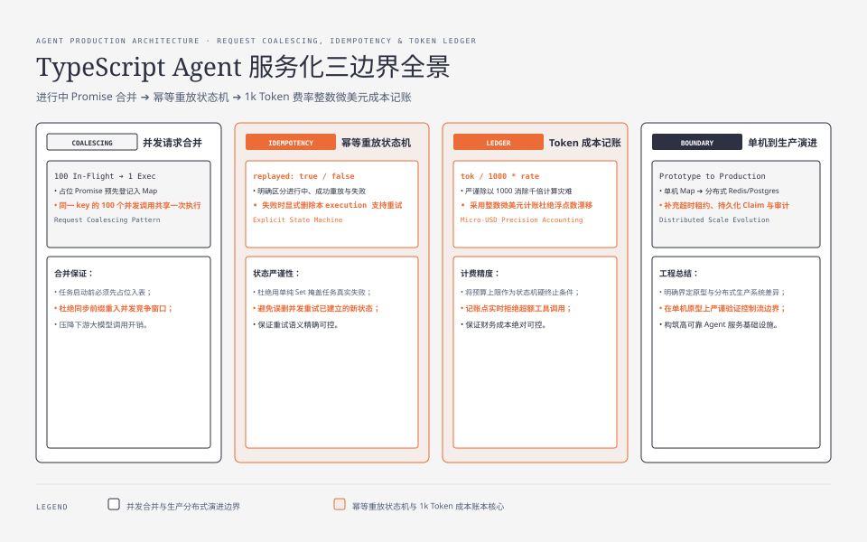
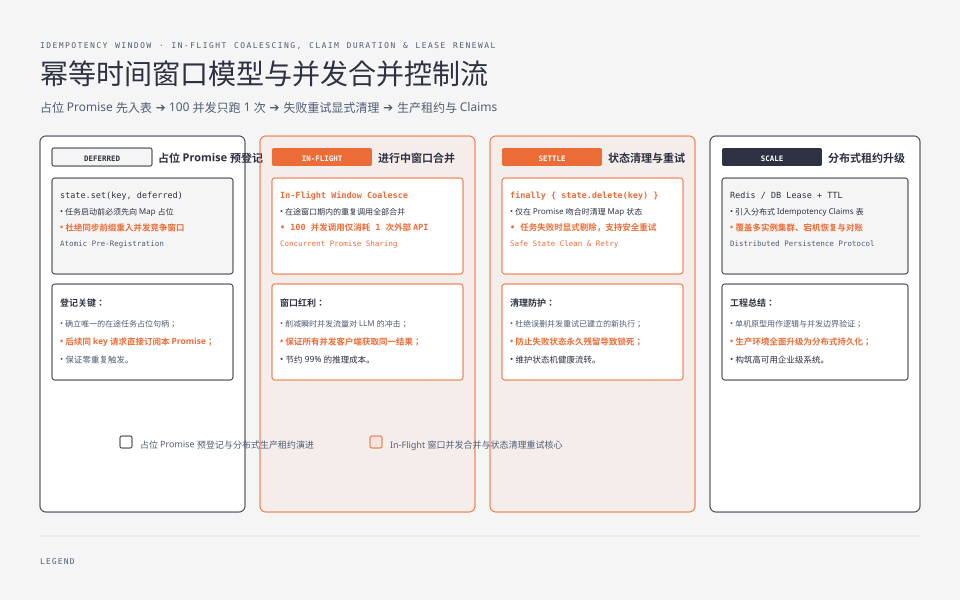

**TL;DR：** Agent 从脚本进入服务后，至少要把三个边界写清楚：同一时刻的重复请求如何合并，先后重试如何表达成功/失败，token 费率的单位如何落到账上。当前 `experiments/ts-agent-prod/` 用单进程 Promise map 验证 100 个并发调用只执行一次，用失败测试验证失败后可显式重试，用整数微美元修正“每 1k token 却按每 token 计费”的 1000 倍错误。它是可运行的局部原型，不是跨实例、重启可恢复的幂等系统。



先把三个容易混淆的命题放在同一张表里：

| 命题 | 覆盖的时间范围 | 当前原型的答案 | 生产还缺什么 |
| --- | --- | --- | --- |
| 并发合并 | 同一 key 的进行中窗口 | 共享一个 Promise，只启动一次 task | 多实例协调、超时租约、取消与未知结果 |
| 幂等重放 | settle 之后的先后重试 | 当前 Map 只保留进行中 Promise；完成后会删除 | 持久化 claim、fingerprint、最终响应与 TTL |
| 成本预算 | 一次 ledger 生命周期 | 记账前拒绝超预算调用 | tenant/用户维度、并发扣款、配额持久化与审计 |

因此，`replayed: true` 只能说明“这次调用等待了同一个进行中 Promise”，不能被解释成“副作用已经持久化且可永久重放”。


---



## 一、并发合并：占位 Promise 必须先入表

请求合并（request coalescing）处理的是“同时到达”：多个调用等待同一个进行中的 Promise，任务只启动一次。关键顺序不是 `task()` 写在哪，而是占位 Promise 必须在 task 启动前入表。下面是关键控制流节选：

```ts
const result = deferred<T>();
state.set(key, { promise: result.promise, startedAt: Date.now() });
void Promise.resolve()
.then(task)
  .then(result.resolve, result.reject)
  .finally(() => {
    // 旧执行不能删除已经替换成新执行的同 key 状态。
    if (state.get(key)?.promise === result.promise) state.delete(key);
  });
```

如果先执行 `task()`，再 `state.set()`，task 的同步前缀可能在第一个 `await` 前重入 `runOnce`，竞争窗口仍然存在。当前测试对同一个 key 发 100 个并发调用，断言执行次数为 1，且所有调用得到同一个结果。

这不是缓存：Promise settle 后 key 会被清理，下一轮请求仍会执行任务。它也不是幂等：它只覆盖“进行中”的时间段。

一个必须保留在测试里的反例是：第一次 task 已经让外部系统产生副作用，但本进程在返回前断开；随后同 key 重试时，当前 Map 没有任何完成记录，只能再次启动 task。即使 task 的业务结果看起来一样，副作用是否重复已经无法由这个原型回答。




## 二、幂等：成功、重放和失败重试不能用一个 Set 糊过去

幂等回答的是“先后重试是否重复副作用”。当前原型用 Map 保存执行 Promise，并返回 `replayed` 标记。下面是关键控制流节选：

```ts
const existing = state.get(key);
if (existing) return { value: await existing, replayed: true };

const execution = Promise.resolve().then(task);
state.set(key, execution);
try {
  return { value: await execution, replayed: false };
} catch (error) {
  // 只删除自己的 execution，避免误删并发重试已经建立的新状态。
  if (state.get(key) === execution) state.delete(key);
  throw error;
}
```

这比“成功后才 `executed.add(key)`”多表达了一件事：并发调用能够共享执行结果，失败可以被观察到，而不是被伪装成已完成。它仍有明确限制：进程重启丢状态，多实例不共享，第一个执行成功但响应丢失时仍需要持久化的结果记录来处理未知结果。

## 三、成本单位：`/1k` 是公式的一部分

模拟费率是输入 `$0.01 / 1k tokens`、输出 `$0.03 / 1k tokens`。正确计算是：

```text
cost = inputTokens  / 1000 × inputRatePer1K
      + outputTokens / 1000 × outputRatePer1K
```

所以当前实验中的三笔账是：

| 调用 | token | 模拟成本 |
| --- | --- | ---: |
| `get_stock` | 300 in + 150 out | `$0.007500` |
| 重试 `get_stock` | 300 in + 150 out | `$0.007500` |
| `create_order` | 500 in + 200 out | `$0.011000` |
| 合计 |  | `$0.037000` |

旧公式直接写 `inputTokens * 0.01 + outputTokens * 0.03`，会把这组结果放大 1000 倍。实验现在用整数微美元计账，避免浮点数在累计预算中制造额外误差；费率明确是模拟值，没有绑定某个模型、币种或当前厂商报价。

## 四、预算是终止条件，不是日志字段

成本账真正影响 Agent 状态机的地方是预算上限。当前 `CostLedger` 在记账点拒绝超过上限的调用：

```ts
const ledger = new CostLedger(simulatedRates, 10_000); // $0.010000
ledger.charge("get_stock", 300, 150);                  // $0.007500
ledger.charge("create_order", 500, 200);               // throw: budget exceeded
```

生产系统还要决定预算维度：每次 run、用户、tenant、日配额，以及超限后是停止、降级到便宜模型还是转人工。本文只实现每个 ledger 的局部上限，不能替代跨请求的持久化配额。

预算检查还有一个并发边界：两个请求同时读取剩余预算，再分别通过检查，单进程 `CostLedger` 若没有原子扣减就可能合计超额。当前实验是顺序记账示例；生产实现需要把“检查 + 扣款”作为同一事务或带版本条件的更新，并记录拒绝原因。

## 五、一次本机运行：结果可以重算，边界不能省略

在 Node 24.19.0 下运行：

```bash
cd experiments/ts-agent-prod
node prod.ts
node --test prod.test.mjs
```

一次输出：

```text
10 个请求拿到 1 个结果，task 实际执行 1 次（期望 1）
11 次调用，副作用执行 1 次，重放 10 次
get_stock ... => $0.007500
get_stock ... => $0.007500
create_order ... => $0.011000
总计 $0.037000
```

测试还覆盖 100 并发、失败后重试、单位换算和预算终止。没有覆盖数据库唯一约束、进程重启、两实例竞争或真实模型账单，因此“实测”只修饰这几个本地行为。

## 六、结论：把本地原型的边界写在 API 旁边

本篇可以交付给读者的不是三个可以直接粘贴进生产的函数，而是一份最小语义清单：

1. 并发合并要先写 Promise 占位，再启动任务。
2. 幂等要表达进行中、成功重放和失败重试，不能只存一个成功 Set。
3. token 价格单位必须进入公式，`/1k` 就意味着除以 1000。
4. 成本预算要在调用前成为可失败的状态转移。
5. 单进程 Map 只证明本地生命周期内的行为；生产幂等仍需要持久化唯一键、结果和恢复合同。

下一步如果要把这些函数放进订单服务，应把同一份并发反例迁移到数据库事务测试，而不是把 `Map` 改个名字就称为“生产化”。

## 参考资料

- [Node.js：Timers](https://nodejs.org/api/timers.html)
- [MDN：Promise](https://developer.mozilla.org/en-US/docs/Web/JavaScript/Reference/Global_Objects/Promise)：Promise 的状态与组合语义。
- [Google SRE：Service Level Objectives](https://sre.google/sre-book/service-level-objectives/)
