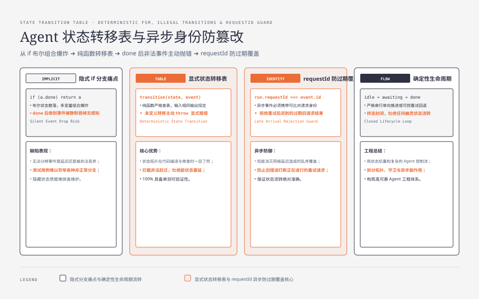
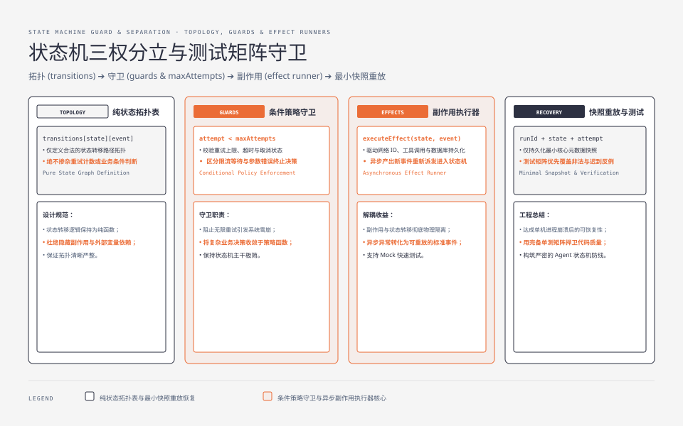
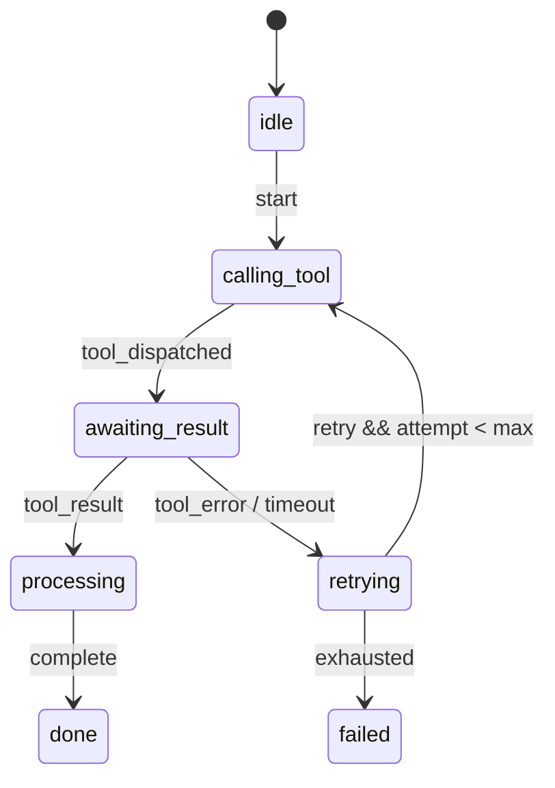

**TL;DR：** 系列第七篇[《流式与背压》](/writing/typescript-streams-backpressure)讲的是数据如何一段段到达；回到 Agent 工具循环，真正难的是“这一段结果现在还合法吗”。核心结论：**只用布尔变量和 if 分支表达 Agent 状态，非法事件很容易被静默吞掉；把状态、事件和转移表拆开，非法转移才能变成可测试的错误。** 本文实验 `experiments/ts-state-machine/fsm.ts` 对同一条事件序列做对照：隐式版本把 `done` 后的 `tool_result` 留在原地，显式版本的 `transition` 主动抛出错误。状态表只是第一步；异步工具还必须携带 `requestId`，把过期结果、重试守卫、持久化和副作用分开处理。


---



## 一、隐式状态为什么会静默吞掉事件

工具循环最初通常很短：调用一次工具，成功就结束，失败就重试。复杂度来自后来加上的规则：最多重试三次、用户可以取消、工具超时要恢复、模型可能在工具返回后又发一条消息。若这些规则都继续追加到原来的 `if`，状态就不再是一个字段，而是多个变量的组合：

```ts
// 节选：实验里的隐式实现。完整代码见 experiments/ts-state-machine/fsm.ts。
type ImplicitAgent = {
  toolCalled: boolean;
  toolName: string;
  retries: number;
  done: boolean;
};

const implicitStep = (a: ImplicitAgent, event: { type: string }): ImplicitAgent => {
  if (event.type === "start") {
    return { ...a, toolCalled: false, toolName: "", retries: 0, done: false };
  }
  if (a.done) return a; // 看似安全，实际把非法事件变成了无声丢弃
  if (a.retries >= 3) return { ...a, done: true };
  if (a.toolCalled && a.toolName === "get_stock") {
    return { ...a, done: true };
  }
  return { ...a, toolCalled: true, toolName: "get_stock" };
};
```

这里的 `done` 分支并没有说明事件为何非法，也没有记录是哪一个请求发来的结果。对调用方而言，三种情况完全相同：事件还没到、事件被延迟、事件已经被错误地丢弃。

这不是“if 写得不够漂亮”的问题，而是状态空间没有被显式定义。`toolCalled × done × retries > 3` 等组合都可能出现；新增一个 `paused` 布尔变量，又会让组合数量翻倍。状态一旦进入组合爆炸，测试通常只覆盖顺序成功路径，覆盖不到“终态后又收到结果”这种更有价值的反例。




## 二、先定义状态与事件，再定义转移

状态机的最小合同不是一个枚举，而是三件东西：状态全集、事件全集、每个状态允许接受的事件。副作用（发起网络请求、写数据库、发消息）不应藏在转移函数里；转移函数最好是纯函数，输入相同就得到相同结果。

```ts
type State =
  | "idle"
  | "calling_tool"
  | "awaiting_result"
  | "retrying"
  | "processing"
  | "done"
  | "failed";

type Event =
  | { type: "start" }
  | { type: "tool_dispatched" }
  | { type: "tool_result" }
  | { type: "tool_error" }
  | { type: "retry" }
  | { type: "exhausted" }
  | { type: "complete" };

const transitions: Readonly<Record<State, Partial<Record<Event["type"], State>>>> = {
  idle: { start: "calling_tool" },
  calling_tool: { tool_dispatched: "awaiting_result" },
  awaiting_result: { tool_result: "processing", tool_error: "retrying" },
  retrying: { retry: "calling_tool", exhausted: "failed" },
  processing: { complete: "done" },
  done: {},
  failed: {},
};

export const transition = (state: State, event: Event): State => {
  const next = transitions[state][event.type];
  if (!next) {
    throw new Error(`非法转移: ${state} x ${event.type}`);
  }
  return next;
};
```

同样重要的是，`transition` 不是“遇到错误就重试”的策略函数。它只回答“拓扑上能不能走”。重试次数、当前请求编号、是否已取消，属于守卫条件；把它们和拓扑混在一张表里，状态表会重新变成一堆隐式条件。



实验中的对照结果是：`idle → calling_tool → awaiting_result → processing → done` 可以正常完成；在 `done` 再发送 `tool_result` 时，`transition` 抛出 `非法转移: done x tool_result`。这和“打印一行被拦截”不是一回事：调用方必须决定记录、丢弃还是把整个运行标成失败，错误不会再无声消失。

## 三、异步结果必须带 requestId，状态正确还不够

显式状态表仍然可能出错。假设第一次工具调用超时，Agent 进入 `retrying`，随后发起第二次调用。如果第一次请求的迟到结果在第二次请求之后到达，仅凭 `tool_result` 这个事件名，状态机无法判断它是否属于当前尝试。

因此事件要携带可比对的身份，而不是只携带业务值：

```ts
type Run = {
  state: State;
  requestId: string | null;
  attempt: number;
};

type ResultEvent = {
  type: "tool_result";
  requestId: string;
  value: unknown;
};

const acceptResult = (run: Run, event: ResultEvent): Run => {
  if (run.state !== "awaiting_result") {
    throw new Error(`当前状态不接受结果: ${run.state}`);
  }
  if (run.requestId !== event.requestId) {
    // 旧请求的迟到结果不能覆盖新尝试的状态。
    throw new Error(`过期结果: ${event.requestId}`);
  }
  return { ...run, state: "processing" };
};
```

这里有一个容易被忽略的取舍：过期结果可以被记录后丢弃，也可以把运行标成需要人工检查。不能默认“谁最后到谁赢”。在本地闭包里，丢弃通常足够；如果状态已经持久化或请求会跨进程重试，则应把 `runId`、`requestId`、`attempt` 一起写入事件或数据库，并让消费者按身份去重。

## 四、重试、取消和持久化是守卫，不是更多布尔变量

一个可执行的状态机至少要把以下三类决策分开：

| 决策 | 它回答的问题 | 适合放在哪里 |
| --- | --- | --- |
| 拓扑 | 当前状态能否接受这个事件 | `transitions` 表 |
| 守卫 | 已重试几次、是否超时、是否已取消 | 纯函数或策略对象 |
| 副作用 | 是否再次调用工具、写事件、发通知 | 转移后的 effect runner |

例如，`retrying → calling_tool` 只表示拓扑允许重试；真正执行前还要判断 `attempt < maxAttempts`，并根据错误类型决定是否值得重试。限流、参数校验失败、用户取消不能共用一个 `retryable: boolean` 就结束，因为它们的恢复动作不同：限流可能等待，参数错误应结束，取消应释放资源。

状态机要支持恢复时，还需要决定持久化什么。只保存当前状态，无法解释“为什么在这里”；只保存全部内存对象，又会把不可序列化的 Promise、AbortController 和工具响应一起写进去。更稳妥的边界是保存可重放的事件或最小快照：`runId + state + attempt + requestId + lastEventId`，并把工具结果的引用或摘要单独保存。恢复后先检查事件版本，再重新建立 effect runner。

## 五、测试矩阵要优先覆盖非法和迟到路径

状态表最有价值的测试不是“start 最后得到 done”，而是把每个状态的非法事件都列出来。最小矩阵可以这样写：

| 场景 | 预期 | 要证明的合同 |
| --- | --- | --- |
| `idle × start` | 进入 `calling_tool` | 正常启动 |
| `awaiting_result × tool_error` | 进入 `retrying` | 可恢复失败有出口 |
| 达到上限后 `retrying × exhausted` | 进入 `failed` | 不会无限重试 |
| `done × tool_result` | 抛非法转移 | 终态不静默吞事件 |
| 新 `requestId` 已发出，旧结果迟到 | 拒绝或隔离旧结果 | 不让旧请求覆盖新尝试 |
| `cancelled` 后 effect 完成 | 不再发下一次工具调用 | 取消语义覆盖副作用 |

实验目前验证了前四项中的对照和非法转移；`requestId`、重试守卫与取消属于生产实现必须补上的合同，不能因为状态机 demo 通过就宣称已经具备分布式恢复能力。

## 六、Go 读者的对应：状态机不是把 switch 换成对象

Go 后端里的订单、工作流通常也是 `status + event + guard`。用 `switch` 写纯转移并没有错；当状态少、事件少、所有调用都在一个进程内时，`switch` 反而更容易读。状态表的收益出现在状态集合需要审查、非法组合需要统一拒绝、测试需要枚举、或产品希望由配置驱动时。

代价也很明确：状态表会把运行时错误推迟到执行路径；类型系统能约束字符串字面量，却不能自动证明所有业务转移都合理；如果把每个细节都升级成状态，图会比原代码更难维护。一个实用边界是：**把跨 await、影响重试/取消/恢复的生命周期建成状态机；把一次函数内部的局部步骤留在普通代码里。**

## 七、FAQ：状态机什么时候反而是过度设计

### 状态少于三个也要建状态机吗？

如果只有成功和失败，Result 或一个返回值通常更清楚。状态机的门槛不是状态数量，而是非法转移、异步迟到、重试和恢复是否已经成为业务合同。

### `throw` 不是已经能阻止非法转移了吗？

`throw` 只表达“此处发现了错误”，不会定义状态全集、事件身份或恢复路径。它应当是状态机的错误出口之一，不是状态模型本身。[《错误处理：throw 是长臂，Result 是管道》](/writing/typescript-errors-result-throw)进一步区分了预期业务失败和程序错误。

### 需要直接上 XState 之类的库吗？

不必从库开始。先用纯 TypeScript 写出状态、事件、转移、守卫和测试矩阵；当需要可视化、actor、持久化或复杂并行状态时，再评估库的运行时模型和调试工具。库不能替你决定过期结果是否可接受。

## 八、结论：状态表只能让非法转移显形

- 布尔变量加 if 会把状态拆散；`done` 后直接返回尤其容易把错误变成静默丢弃。
- 纯 `transition` 让状态拓扑可枚举、非法事件可测试；重试次数、取消和副作用应由守卫与 effect runner 承担。
- 异步 Agent 必须验证 `runId/requestId/attempt`，否则迟到的旧结果仍能污染新状态。
- 本地实验只证明了状态转移的对照和非法转移的运行时行为；持久化、跨进程恢复、取消竞态还需要真实存储与故障注入验证。

下一步：[《错误处理：throw 是长臂，Result 是管道》](/writing/typescript-errors-result-throw)把 `tool_error → retrying` 这条边拆开：哪些失败应该作为 Result 返回，哪些失败应该让程序直接抛错。

## 九、参考资料

- [TypeScript Handbook：Narrowing](https://www.typescriptlang.org/docs/handbook/2/narrowing.html)：联合类型与控制流收窄。
- [TypeScript Handbook：Discriminated Unions](https://www.typescriptlang.org/docs/handbook/2/narrowing.html#discriminated-unions)：用可辨识字段表达事件集合。
- [MDN：有限状态机](https://developer.mozilla.org/en-US/docs/Glossary/State_machine)：状态、事件与转移的基本定义。
