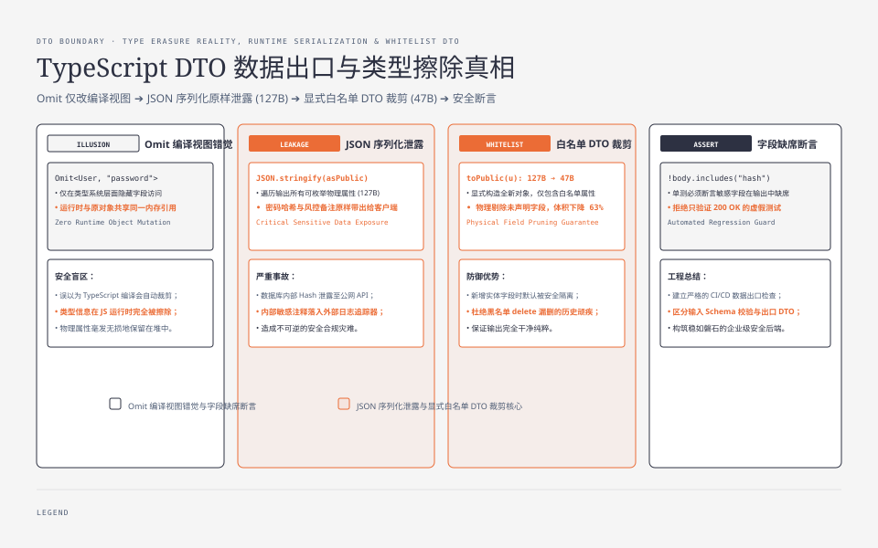
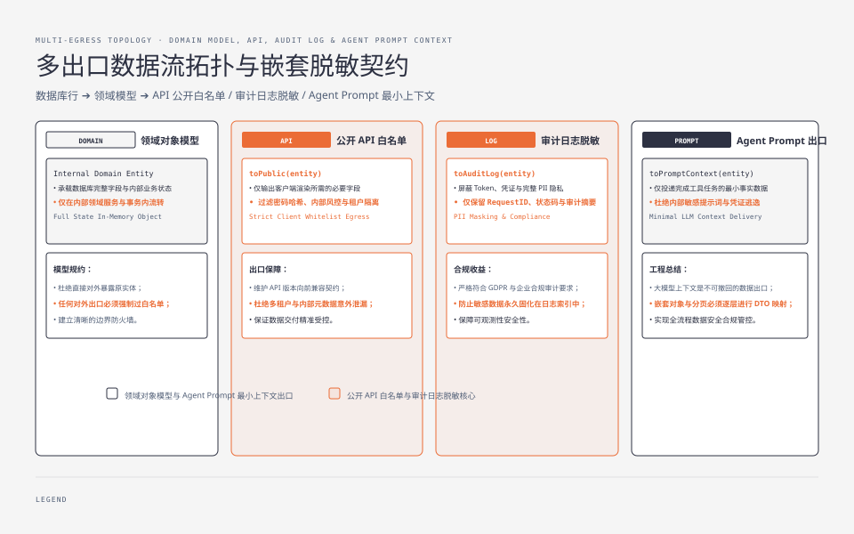
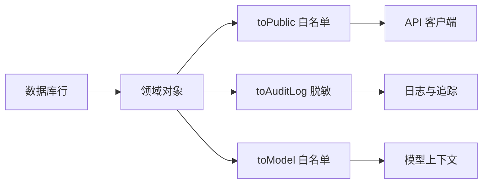

**TL;DR：** 系列第一篇[《给 Go 后端开发者的 TypeScript 语法避坑指南》](/writing/typescript-pitfalls-for-go-backend-developers)说过，类型不会替后端完成数据脱敏。这篇把边界落到可运行实验：`Omit<User, "passwordHash" | "internalNotes">` 只改变编译期视图，`JSON.stringify` 仍会输出运行时对象里的全部字段；显式 DTO 构造才真正把 127B 的泄露对象缩到 47B。**入口 schema 决定“能进什么”，出口 DTO 决定“能走什么”，数据库行、API 响应、日志和 Agent prompt 还必须分别拥有自己的白名单。** `structuredClone` 只复制全部字段，不是脱敏工具。


---



## 一、Omit 删除的是类型成员，不是对象属性

下面的代码来自 `experiments/ts-dto-boundary/main.ts`，不是伪代码：

```ts
type User = {
  id: number;
  name: string;
  email: string;
  passwordHash: string;
  internalNotes: string[];
};

const user: User = {
  id: 1,
  name: "Ada",
  email: "ada@example.com",
  passwordHash: "$2b$10$abcdefghijklmnopqrstuv",
  internalNotes: ["fraud-review"],
};

type PublicUser = Omit<User, "passwordHash" | "internalNotes">;
const asPublic: PublicUser = user;

console.log(JSON.stringify(asPublic));
```

`asPublic.passwordHash` 在 TypeScript 中不可访问，但 `asPublic` 与 `user` 指向同一个运行时对象。`JSON.stringify` 遍历的是对象实际拥有的可枚举属性，不读取 `.d.ts` 或编译器内部的类型信息。实验输出的两行 JSON 完全相同；敏感字段没有被“类型擦除”。

这也是 `Pick`、接口继承和类型断言经常造成的错觉：它们可以限制调用方如何使用一个值，却不会自动创建一个新对象。只要数据进入了序列化、日志、消息队列或模型上下文，就必须回到运行时构造。




## 二、一个领域对象需要多个出口，而不是一个万能 User

数据库行、领域对象、公开 API、内部日志和模型上下文的字段需求不同。把它们都叫 `User`，然后在调用点使用 `Omit`，会让“这个字段能不能离开当前边界”变成约定而不是代码：



三个出口不能共用一份 DTO：

| 出口 | 可以包含 | 必须禁止 | 额外约束 |
| --- | --- | --- | --- |
| 公开 API | 客户端完成页面所需字段 | 密码哈希、内部风控、租户隔离字段 | 版本兼容、授权范围 |
| 日志/追踪 | 请求 ID、结果分类、耗时 | token、原始请求体、完整 PII | 可检索、可留存、可删除 |
| Agent prompt | 完成当前工具任务的最小事实 | 凭据、无关客户数据、内部评分 | 最小上下文、注入隔离、不可撤回 |

“领域对象能读到”不等于“每个出口都能带走”。出口越多，越不应该依赖一个模糊的 `User` 名称表达安全边界。

## 三、显式构造 DTO，字节数和字段风险一起下降

白名单 DTO 的优点不是代码更短，而是每个字段都必须在构造函数里出现：

```ts
type PublicUser = Pick<User, "id" | "name" | "email">;

const toPublic = (u: User): PublicUser => ({
  id: u.id,
  name: u.name,
  email: u.email,
});

const safe = JSON.stringify(toPublic(user));
```

本机实验在固定输入下得到：直接序列化与 `Omit` 视图都是 127B，显式 DTO 是 47B。这里的 2.7 倍只是这个输入的序列化体积差，不是通用性能结论；更重要的证据是 `passwordHash` 和 `internalNotes` 不再出现在输出里。字节数可以帮助发现异常，但不能替代字段级断言。

因此测试不应只断言响应状态码，还应断言敏感字段缺席：

```ts
const body = JSON.stringify(toPublic(user));
if (body.includes("passwordHash") || body.includes("internalNotes")) {
  throw new Error("public DTO 包含禁止字段");
}
```

生产代码可以用 schema 的 `.pick()` 或专门的序列化层减少手写重复，但仍要保留“允许哪些字段”的显式清单。黑名单 `delete value.passwordHash` 更容易在新增敏感字段时失效：新字段默认会泄露，白名单则默认不外发。

## 四、嵌套对象、数组和分页元数据要逐层定义

浅拷贝不是出口：

```ts
const copy = { ...user };       // 顶层的 passwordHash 仍然存在
const cloned = structuredClone(user); // 深拷贝，但所有字段仍然存在
```

`structuredClone` 解决的是引用隔离与可克隆性，不解决“哪些字段可以离开边界”。嵌套数据要逐层构造，数组也要明确单项 DTO：

```ts
type PublicOrder = {
  id: string;
  customer: { email: string };
  items: Array<{ sku: string; quantity: number }>;
};

const toPublicOrder = (order: InternalOrder): PublicOrder => ({
  id: order.id,
  customer: { email: order.customer.email },
  items: order.items.map((item) => ({ sku: item.sku, quantity: item.quantity })),
});
```

上面的 `InternalOrder` 省略了领域无关字段，因此示例只展示出口形状；真实实现应让它成为仓库中可导入的类型，并为 `items` 为空、字段缺失和数量越界写测试。分页响应还要把 `items` 和 `nextCursor` 分开建模，不能把数据库查询结果原样返回。

## 五、Agent prompt 是不可撤回的另一种数据出口

API 泄露通常还能通过撤回、轮换凭据或修复序列化器止损；数据一旦进入模型上下文，就已经被消费，并可能出现在模型输出、追踪记录或后续工具参数中。实验构造了带有 `passwordHash`、`riskScore` 和 `flagged` 的工具结果，直接序列化时它们全部进入上下文。

```ts
type ToolValue = {
  orderId: string;
  status: string;
  customer: { id: number; email: string; passwordHash: string };
  internal: { riskScore: number; flagged: boolean };
};

type ToolResult = { ok: true; value: ToolValue };
type ModelToolResult = {
  ok: true;
  value: { orderId: string; status: string; customerEmail: string };
};

const toModel = (r: ToolResult): ModelToolResult => ({
  ok: r.ok,
  value: {
    orderId: r.value.orderId,
    status: r.value.status,
    customerEmail: r.value.customer.email,
  },
});
```

这里的 DTO 还不等于授权：`toModel` 只能证明字段被裁剪，不能证明当前 Agent 有权读取这个订单。正确顺序应是“先检查租户和资源权限，再读取最小领域数据，最后为当前工具任务构造模型 DTO”。不要为了方便先把完整对象放进 prompt，再指望系统提示词让模型忽略敏感字段。

## 六、日志、版本化与失败测试决定出口能否长期维护

DTO 的难点会在字段迭代时出现。新增 `riskLabel` 后，白名单 API 不会自动外发它，但日志 DTO 可能需要它，模型 DTO 可能永远不应该看到它。建议把每个出口视为独立合同：

- 公开 API 用 `PublicUserV1`、`PublicUserV2` 或明确的 schema 版本，避免客户端被隐式加字段影响。
- 日志保留稳定的 `requestId`、错误码和耗时，原始输入使用字段级脱敏或摘要，不记录完整 token 和凭据。
- Agent 工具结果区分“给模型的视图”和“给审计系统的视图”；后者可以保留更多证据，但仍需权限、留存周期和删除策略。
- 对每个出口加入反例测试：新增敏感字段、嵌套敏感字段、空数组、未知额外字段都不能绕过白名单。

这也是为什么仅有 `npm test` 的内容构建通过不能证明安全：站点能编译只说明 Markdown 和 React 合法，不说明实验中的序列化路径或生产 API 的字段合同已经被验证。

## 七、FAQ：DTO、schema 和序列化器怎么分工

### `zod.pick()` 能替代 DTO 吗？

它可以把运行时校验和输出形状绑定起来，减少手写错误；但 `.pick()` 仍然需要明确列出允许字段，而且要确认 schema 的输入输出方向。它不能自动解决授权、日志留存和模型上下文最小化。

### 直接 `delete` 敏感字段为什么不够？

黑名单对新增字段不安全，也可能因为共享引用修改了领域对象。白名单构造返回新对象，默认拒绝未来字段；性能敏感时可以优化实现，但要保留同样的字段合同。

### 只把密码哈希删掉就够了吗？

不够。内部备注、租户 ID、风控分数、访问 token、精确地址和原始错误堆栈都可能是敏感数据。脱敏清单应由出口目的、授权范围和留存策略决定，而不是只盯着一个字段。

## 八、结论：类型视图不是运行时出口

- `Omit`、`Pick` 和类型断言改变的是编译期可见性，不会裁剪对象；真正序列化的是运行时属性。
- 白名单 DTO 同时降低字段泄露面和输出体积；本文固定输入的实验是 127B 对 47B，但数字不应外推成通用性能结论。
- API、日志和 Agent prompt 是三个不同出口，必须分别建模；进入 prompt 的数据尤其要遵循最小权限，因为它不可撤回。
- `structuredClone` 只负责复制，不负责脱敏；嵌套对象、数组、分页元数据都要逐层构造并测试。

与全系列的接口：入口 schema 见[《接口不是运行时验证：TypeScript 的 zod 三合一》](/writing/typescript-interface-schema-zod)，出口 DTO 解决的是另一半问题。下一篇[《事件循环 vs Go 的 GMP》](/writing/typescript-event-loop-vs-gmp)继续追问：当这些边界代码运行在 Node 事件循环里，“并发”到底意味着什么。

## 九、参考资料

- [TypeScript Handbook：Utility Types](https://www.typescriptlang.org/docs/handbook/utility-types.html)：`Pick`、`Omit` 等类型工具的编译期语义。
- [MDN：JSON.stringify](https://developer.mozilla.org/en-US/docs/Web/JavaScript/Reference/Global_Objects/JSON/stringify)：运行时序列化属性的行为。
- [MDN：structuredClone](https://developer.mozilla.org/en-US/docs/Web/API/Window/structuredClone)：深拷贝与可克隆值的边界。
- [OWASP：API Security Top 10](https://owasp.org/API-Security/editions/2023/en/0x11-t10/)：API 过度暴露与对象级授权风险。
- [Zod API：Objects](https://zod.dev/api#objects)：运行时 schema 与对象形状操作。
