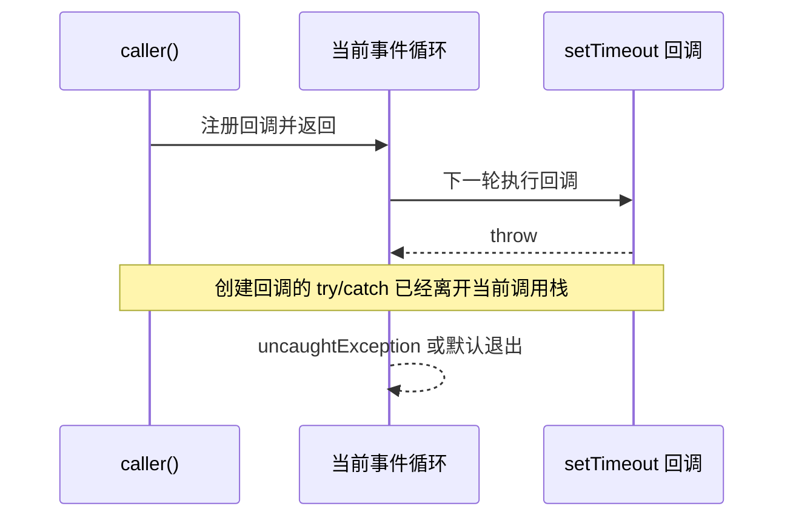

**TL;DR：** [《Agent 状态机》](/writing/typescript-agent-state-machine)把 `tool_error → retrying` 建成了转移；这篇回答错误怎样到达这条边。**throw 是长臂：错误沿当前调用栈传播，类型系统不知道谁会接；Result 是管道：预期失败成为返回值，调用方必须先收窄 `ok` 才能读取成功值。** 本机实验还展示了一个更容易误判的边界：定时器回调里的 throw 不会被创建定时器的外层 `try/catch` 接住。`uncaughtException` 只能用来记录演示，不能作为生产恢复策略；预期的限流、超时和参数错误应使用结构化 Result，程序 bug 则让进程按边界崩溃并由监督系统重启。

## 一、先区分预期失败与程序错误

工具循环会遇到两类完全不同的“错误”：

| 类型 | 例子 | 调用方应做什么 | 更适合的表达 |
| --- | --- | --- | --- |
| 预期业务失败 | 限流、权限拒绝、参数校验失败、工具超时 | 分类、重试、降级或回复用户 | `Result` / 可辨识错误值 |
| 程序错误 | 不变量破坏、不可达分支、配置缺失、代码 bug | 记录上下文，让进程或请求边界失败 | `throw` |

把两类错误都塞进 `throw`，调用方就很难从类型上看出哪些失败可以恢复；把所有东西都包成 `Result`，又会把真正的 bug 当成普通业务分支，继续运行在不可信状态上。选择不是“哪个语法更优雅”，而是错误的恢复责任归谁。

## 二、throw 沿调用栈走，catch 是运行时约定

`throw` 的调用方不需要在函数签名中声明可能抛出的错误集合：

```ts
const toolCall = async (name: string): Promise<{ data: string }> => {
  if (name === "rate_limit") throw new Error("rate limited by provider");
  if (name === "malformed") throw new Error("invalid JSON from model");
  return { data: "price: 100" };
};

const caller = async (): Promise<string> => {
  try {
    const result = await toolCall("rate_limit");
    return result.data;
  } catch (cause: unknown) {
    const error = cause instanceof Error ? cause : new Error(String(cause));
    return `fallback: ${error.message}`;
  }
};
```

这里的 `catch (cause: unknown)` 是安全的边界写法：JavaScript 可以抛出字符串、数字或任意对象，不能假定捕获值一定是 `Error`。但即使 `catch` 写对，类型系统仍不知道 `toolCall` 会抛什么、哪一层负责重试、错误是否已经被记录。`throw new Error(message, { cause })` 可以保留底层原因，但不会自动建立错误码、重试预算或脱敏规则。

## 三、定时器回调会换调用栈，外层 catch 接不住

实验 `experiments/ts-errors/result-vs-throw.ts` 注册 `uncaughtException` 只是为了让演示继续打印结果；默认情况下，未捕获异常会到达进程级边界。关键时序如下：



实验输出是“全局兜底收到异常，外层 try/catch 正常结束”，不是“外层 catch 接住了”。全局监听器改变了默认退出行为，因此只能证明异常逃逸到了进程级边界；它没有证明进程仍然安全。Node 官方文档明确警告，捕获 `uncaughtException` 后继续正常运行是不安全的，因为堆可能处于未知状态。生产做法应是：记录最少但足够的上下文，停止接收新工作，优雅关闭并交给 supervisor 重启；不要在监听器里继续处理新的 Agent 请求。

Promise 也有相同的边界：`await` 只能捕获当前 Promise 链上的 rejection。一个没有被返回或等待的 Promise，即便创建它的函数有 `try/catch`，失败也可能成为未处理 rejection。事件回调、流事件和 worker 消息都应在自己的入口建立错误边界。

## 四、Result 让预期失败变成可分类的数据

Result 的价值不在于 TypeScript 会自动逼你读取返回值——TypeScript 不会阻止你忽略一个返回值；价值在于你不能在未收窄联合类型前直接读取 `value`，并且错误码可以进入重试策略：

```ts
type ToolError =
  | { kind: "rate_limited"; retryAfterMs: number }
  | { kind: "invalid_input"; field: string }
  | { kind: "timeout"; elapsedMs: number };

type Result<T> =
  | { ok: true; value: T }
  | { ok: false; error: ToolError };

const callTool = async (name: string): Promise<Result<{ data: string }>> => {
  if (name === "rate_limit") {
    return { ok: false, error: { kind: "rate_limited", retryAfterMs: 200 } };
  }
  return { ok: true, value: { data: "price: 100" } };
};

const step = async () => {
  const result = await callTool("rate_limit");
  if (!result.ok) {
    if (result.error.kind === "rate_limited") return "retry-later";
    if (result.error.kind === "invalid_input") return `ask-for-${result.error.field}`;
    return "timeout-fallback";
  }
  return result.value.data;
};
```

`result.ok` 是可辨识字段，收窄后成功值和错误值各自可安全访问。相比一个 `error: string`，可辨识错误还把“如何恢复”留在数据里：限流可以读取等待时间，参数错误可以指出字段，超时可以记录耗时。Result 不会替你设计错误分类；分类过粗，调用方仍只能回到字符串匹配。

## 五、Result 也要处理并发、取消和部分成功

工具循环常常并发调用多个工具。`Promise.all` 遇到第一个 rejection 就拒绝，但其他工作可能仍在运行；把所有调用先转成 Result，能够把业务失败收集起来，却仍然不能自动取消已经发出的网络请求：

```ts
const results = await Promise.all([
  callTool("get-stock"),
  callTool("rate_limit"),
]);

const failures = results.filter((item) => !item.ok);
// 失败是数据，但是否取消、是否重试、是否允许部分成功，仍是策略。
```

如果用户取消了 Agent，策略层应调用 `AbortController.abort()`，工具适配器也必须把 signal 传给实际 I/O；仅仅返回 `{ ok: false, kind: "cancelled" }` 不会停止已经占用的 socket、计时器或 worker。一个成熟的合同要同时回答：

- 哪些错误可重试，最多几次，退避由谁计算；
- 哪些并发结果允许部分成功，哪些必须整体失败；
- 取消是用户意图、超时还是进程关闭，指标如何区分；
- 错误日志是否带原始 prompt、凭据或个人数据，如何脱敏。

Result 解决的是传递形状，不是可靠执行的全部问题。

## 六、把 throw 和 Result 放在正确的边界

一个实用的分层方式是：底层适配器把外部系统的预期失败归一成 Result；领域层根据错误码选择重试、降级或终止；HTTP、队列或 Agent runtime 的最外层把未预期的 throw 转成 5xx、失败事件或进程退出。

| 边界 | 预期失败 | 非预期错误 |
| --- | --- | --- |
| HTTP handler | 4xx/业务错误 DTO | 交给统一错误中间件并记录 requestId |
| 工具适配器 | `Result`，保留 retryable 与 cause 摘要 | `throw`，不伪装成工具返回 |
| 状态机 reducer | 明确的 `tool_error` 事件 | 非法转移直接抛出 |
| 进程入口 | 关闭与重启 | 不用 `uncaughtException` 继续接流量 |

这和 Go 的 `error` 更接近：错误是返回值，调用方通常在同一行检查；Go 的 `panic` 也应保留给不可恢复的程序错误。TypeScript 没有强制所有 `Result` 被消费的编译器规则，因此要用 lint、代码审查和测试保证每个边界都做了 `ok` 收窄，不能把“有联合类型”误称为完整错误安全。

## 七、FAQ：什么时候不该用 Result

### 参数错误也要 throw 吗？

如果参数来自用户、模型或远程服务，它是预期输入失败，应返回可分类的 Result；如果参数违反了内部已经验证过的不变量，说明程序有 bug，更适合 throw 并让边界失败。

### `uncaughtException` 能不能记录后继续跑？

不应把它当恢复机制。它可以帮助测试或进程退出前写最后一条诊断，但堆状态可能已经不可信；生产应让 supervisor 负责重启，并通过幂等和持久化恢复未完成任务。

### Result 会不会让代码太啰嗦？

对一次性脚本可能会。对限流、重试、部分成功和可观测性都属于业务合同的 Agent 工具循环，显式字段通常比“每层都猜 catch 了什么”更便宜。可以用小型 `map`、`andThen` 帮助函数降噪，但不要隐藏错误分类。

## 八、结论：错误形状决定恢复责任

- throw 适合表达程序错误，但沿调用栈传播，事件回调和未等待 Promise 可能越过原来的 catch。
- Result 适合表达预期失败，`ok + 可辨识错误码` 让重试、降级和用户反馈有数据基础；TypeScript 仍不会自动阻止你忽略 Result。
- `uncaughtException` 只应作为诊断或退出边界，不能用来证明进程可以继续安全服务。
- 并发、取消、部分成功、错误日志脱敏仍需独立合同；错误传递模型不是可靠执行的全部。

下一篇[《类型体操：写一次让编译器替你做 100 次检查》](/writing/typescript-type-gymnastics)继续追问：当 Result 和工具注册表越来越多时，哪些类型复杂度真的在防错，哪些只是把运行时问题藏到类型表达式里。

## 九、参考资料

- [Node.js：Process `uncaughtException`](https://nodejs.org/api/process.html#event-uncaughtexception)：未捕获异常的进程边界与继续运行风险。
- [TypeScript Handbook：Narrowing](https://www.typescriptlang.org/docs/handbook/2/narrowing.html)：可辨识联合与控制流收窄。
- [Go Blog：Working with Errors in Go 1.13](https://go.dev/blog/go1.13-errors)：Go 错误包装、检查与 `errors.Is/As`。
- [MDN：Promise.all](https://developer.mozilla.org/en-US/docs/Web/JavaScript/Reference/Global_Objects/Promise/all)：并发 Promise 的拒绝语义。
