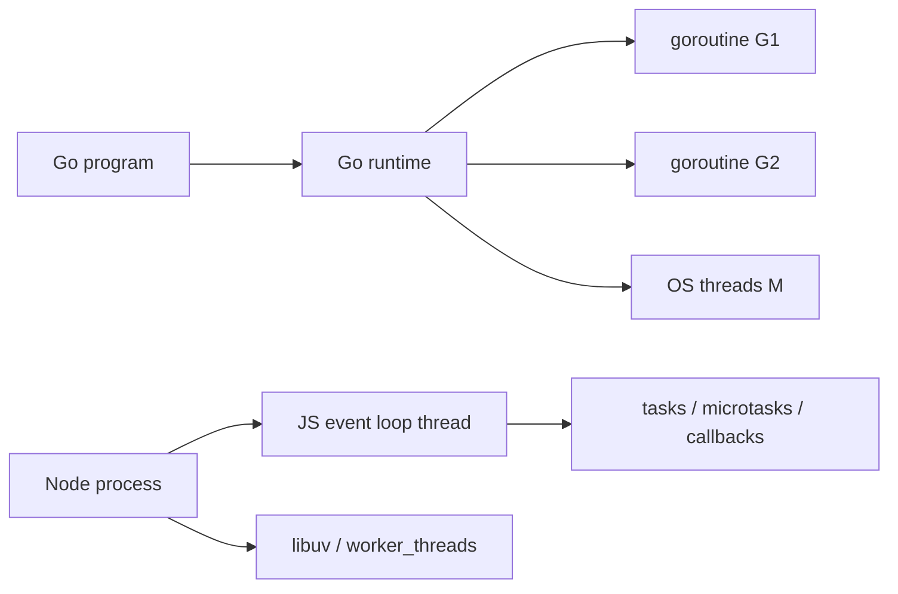

**TL;DR：** “Go 的 goroutine 是内核级线程，Node 是单线程”是一个方便但错误的类比。goroutine 由 Go runtime 在用户态调度，并复用到操作系统线程；Node 的 JavaScript 主线程确实不能被同步 CPU 代码抢占，但 Node 仍可通过 libuv 与 `worker_threads` 使用其他执行资源。当前实验把两个问题分开，并用 30 轮分布替代单次输出：Go `time.Sleep(10ms)` 唤醒延迟 p50=1ms、max=2ms；Node 10ms timer 基线 p50=11.2ms，前置 50ms busy loop 后 p50=61ms。前者说明可等待操作会让出 runtime，后者说明同步 CPU 工作占住了事件循环，它们不是同一场景的对照。

## 一、先纠正调度层级：runtime 调度 goroutine，内核调度线程

Go 的 G、M、P 是 runtime 的抽象：G 是 goroutine，M 是操作系统线程，P 是执行 Go 代码所需的调度资源。操作系统看见的是线程，不会直接把每个 goroutine 当作一个内核调度实体。Go runtime 会把可运行 goroutine 复用到线程上，也会在等待、系统调用或抢占时调整运行队列。

Node 的 JavaScript 代码通常由一个事件循环线程推进，但这句话只描述 JavaScript 执行上下文，不等于整个 Node 进程只有一条线程。文件、DNS 等任务可能由 libuv 处理，显式 CPU 并行可以使用 `worker_threads`。真正危险的边界是：同步 CPU 代码如果跑在主线程，就会阻止下一个 JavaScript task、timer callback 和 I/O callback 获得执行机会。



## 二、实验 A：可等待操作让出执行资源

`experiments/ts-event-loop/go-sleep.go` 固定 `GOMAXPROCS=1`，启动一个睡眠 50ms 的 goroutine 和一个睡眠 10ms 的 goroutine：

```bash
go run go-sleep.go
```

本机 Go 1.25.1 的一次输出是（计时会随调度和机器负载抖动）：

```text
10ms goroutine finished at 12ms
50ms goroutine finished at 52ms
```

这里的结论很窄：`time.Sleep` 让当前 goroutine 进入等待，runtime 可以运行另一个 goroutine。它没有证明 Go 的所有阻塞系统调用都相同，也没有和 Node 的 busy loop 构成同语义性能基准。

## 三、实验 B：同步 CPU 工作会推迟 Node timer

Node 对照使用 `experiments/ts-event-loop/blocking2.ts`：先安排一个 10ms timer，再在 JavaScript 主线程 busy loop 约 50ms。

```bash
node blocking2.ts
```

Node 24.19.0 本机一次输出（不是固定延迟）：

```text
主线程同步 CPU 工作结束于 50.1ms
定时器声明 10ms，实际执行于 52.6ms，lateness 42.6ms
```

这组数字是当前机器的一次观察，不是 Node timer 的固定延迟。它证明的是同步工作阻塞了主线程，timer 没有抢占当前 JavaScript 调用栈。JSON 解析、同步加密和失控正则都可能触发同类问题；Agent 的超时和取消也只能在事件循环重新获得执行机会后处理。

单次输出只证明控制流，不提供分布。`experiments/ts-event-loop/multi-round.ts` 对三组场景各跑 30 轮，用子进程隔离每轮计时，避免主进程自身负载污染样本：

```text
A Go 10ms 唤醒延迟(30 轮, GOMAXPROCS=1): n=30 min=0.0ms p50=1.0ms p95=1.0ms max=2.0ms
B Node 10ms timer 基线延迟:               n=30 min=10.2ms p50=11.2ms p95=11.3ms max=11.3ms
C Node 10ms timer + 50ms busy loop 延迟:  n=30 min=59.6ms p50=61.0ms p95=61.5ms max=64.7ms
```

三组分布给出比单次输出更硬的判断：Go 的 `time.Sleep(10ms)` 唤醒延迟集中在 0–2ms（runtime 在睡眠期间把执行权交给其他 goroutine，唤醒后回队列很快）；Node 空事件循环下 10ms timer 的 p50 是 11.2ms；同一个 timer 前插 50ms busy loop 后 p50 变成 61.0ms——多出的约 50ms 正是 busy loop 完整占住主线程的代价，timer 必须等当前调用栈结束才有执行机会。p95 与 p50 相差不到 0.5ms，说明这是结构性推迟，不是随机抖动。30 轮原始样本、Node/Go 版本与命令见 `evidence/typescript-event-loop-vs-gmp/2026-08-19-local/multi-round-dist.txt` 与 `run.out`。

本次 raw、Node/Go 版本和命令保存在 `evidence/typescript-event-loop-vs-gmp/2026-08-17-local/`；运行 `.ts` 文件需要 Node 24.19.0 这一执行环境，旧 Node 版本可能把 `.ts` 当作未知扩展名拒绝。

## 四、不要把 `time.Sleep`、busy loop 和系统调用混成“阻塞”

迁移 Go 心智时，至少要把实验拆成这些维度：

| 场景 | Go 实验 | Node 实验 | 能回答什么 |
| --- | --- | --- | --- |
| 可等待操作 | `time.Sleep` / channel receive | `await` timer / Promise I/O | 等待时其他任务能否推进 |
| 主线程 CPU | goroutine CPU loop，分别设 `GOMAXPROCS=1/N` | 主线程 CPU loop | 单执行资源与多执行资源的差异 |
| CPU 下放 | 多 goroutine + runtime 调度 | `worker_threads` | 如何获得真正的 CPU 并行 |
| 阻塞系统调用 | 指定 syscall/文件场景 | 同 API 的同步与异步版本 | 哪一层承担等待成本 |

当前仓库只保存了第一行和第二行的最小教学实验，没有把四行都伪装成完整 benchmark。多轮分布（上一节 30 轮三组）已经固定了版本、轮次和有界环境，可以较“唤醒/推迟”的相对结构；要断言绝对吞吐仍必须固定核心数、输入规模与预热，并且一次 52.6ms 输出只用来解释控制流，绝对时间会随机器和负载变化。

## 五、timer 顺序是阶段观察，不是业务合同

`experiments/ts-event-loop/order.ts` 运行 5 轮，当前 Node 24.19.0 一次得到：

```text
1: sync:start -> sync:end -> queueMicrotask -> Promise.then -> setImmediate -> setTimeout(0)
2: sync:start -> sync:end -> queueMicrotask -> Promise.then -> setImmediate -> setTimeout(0)
...
```

完整 5 轮原始输出见 `evidence/typescript-event-loop-vs-gmp/2026-08-17-local/raw/order.txt`。它只记录当前 Node 版本和顶层环境的观察；不要把这个顺序外推到 I/O callback、不同 Node 版本或浏览器。

同步代码先结束、microtask 在后续 macrotask 前执行，是可用于解释 Promise 编排的事实。可是顶层 `setImmediate` 与 `setTimeout(0)` 的先后会受到事件循环进入阶段和环境影响；I/O callback 内的阶段关系也不同。Node 文档把 timeout delay 定义为“最早执行阈值”，不是精确 deadline。需要业务 deadline 时，使用 `AbortSignal`、明确的超时状态和可观测的 lateness，不要依赖一次顶层顺序。

## 六、结论：按场景谈并发，别用“单线程”盖住边界

这组实验留下四个可复核判断：

1. goroutine 是 Go runtime 管理的用户态任务，OS 调度的是线程。
2. Go 的 `time.Sleep` 和 Node 的同步 busy loop 不等价，不能放在同一张“谁更快”表里。
3. Node 主线程上的同步 CPU 工作会推迟 timer，但 Node 进程仍有 libuv 和 worker 执行路径。
4. timer delay 是最早阈值；顶层 `setImmediate`/`setTimeout(0)` 顺序应当实测并收窄表述。

读者可以先运行 `experiments/ts-event-loop/README.md` 中的三个命令，再为 CPU loop 增加 `GOMAXPROCS` 与 `worker_threads` 对照。下一篇 streams 文章继续沿用同一纪律：先区分 generator、Readable 和 socket 的语义，再谈背压和内存。

## 参考资料

- [Go FAQ：goroutines 与线程](https://go.dev/doc/faq#goroutines)
- [Effective Go：Concurrency](https://go.dev/doc/effective_go#concurrency)
- [Node.js：Timers](https://nodejs.org/api/timers.html)
- [Node.js：worker_threads](https://nodejs.org/api/worker_threads.html)
