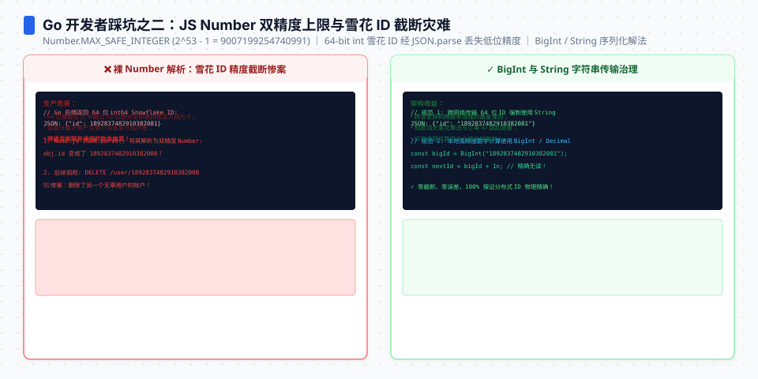

**TL;DR：** TypeScript 不是“带类型的 Go”，而是 JavaScript 加了一层编译期检查。`interface` 不会校验 JSON，`as` 不会转换值，`const` 不会冻结对象，`await` 也不会自动把一组任务变成并发。Go 后端迁移到 TS 时，最该先记住的是：类型边界、对象语义和 Promise 语义必须分开看。

如果你已经会 Go，TypeScript 最容易让你写出隐蔽 bug 的地方，不是泛型语法，而是“看起来相似、承诺却不同”的语法：

| Go 里的直觉 | TypeScript 的实际语义 | 后端代码里的风险 |
| --- | --- | --- |
| `struct` 描述了运行时的数据形状 | `interface` / `type` 默认只在编译期存在 | 把不可信 JSON 直接当成业务对象 |
| 类型转换会产生一个目标类型的值 | `as` 只是告诉编译器“相信我” | 错误数据穿过边界，运行时才爆炸 |
| `const` 绑定不可重新赋值 | `const` 只保护变量绑定，不保护内部对象 | 误以为配置或状态不可变 |
| `nil` 是一个需要显式处理的值 | `undefined` 还代表“属性不存在” | 默认值、序列化和更新语义混在一起 |
| goroutine / channel 表达并发执行 | `async` 函数返回 Promise，数组方法不会自动等待 | 以为 `map(async ...)` 已经拿到了结果 |

下面的示例都按 `strict: true` 理解。刻意展示编译错误的地方用 `@ts-expect-error` 标记，这样示例本身仍然可以交给 TypeScript 编译器检查。


---


## 一、先划清边界：类型不会替你验证外部输入

### `interface` 和 `type` 会被擦掉

TypeScript 的类型注解服务于编译器，不会自动生成一个运行时检查器。下面的 `User` 在编译后的 JavaScript 里不存在：

```ts
type User = {
  id: number;
  name: string;
};

const payload: unknown = JSON.parse(
  '{"id":"not-a-number","name":"Ada"}',
);
const unchecked = payload as User;

console.log(typeof unchecked.id); // "string"
```

`unchecked.id` 的静态类型是 `number`，但真实值仍然是字符串。`as User` 没有做转换，也没有检查字段；它只是关闭了这一处编译器的怀疑。不要把它当成 Go 里的类型转换，也不要把它当成校验库。

HTTP、队列、数据库驱动和 `JSON.parse` 都是信任边界。边界处应该先接收 `unknown`，再通过运行时检查缩小类型：

```ts
type User = {
  id: number;
  name: string;
};

function isUser(value: unknown): value is User {
  if (typeof value !== "object" || value === null) return false;

  const candidate = value as Record<string, unknown>;
  return (
    typeof candidate.id === "number" &&
    typeof candidate.name === "string"
  );
}

function decodeUser(body: string): User {
  const value: unknown = JSON.parse(body);
  if (!isUser(value)) throw new Error("invalid user payload");
  return value;
}

const user = decodeUser('{"id":7,"name":"Ada"}');
console.log(user.id + 1); // 8
```

生产项目通常会把这段检查交给 Zod、Valibot 或其他 schema 库，但语法原则不变：**`unknown` 表示“我还没有证明它是什么”，类型守卫才是证明过程。**

### TS 是结构化类型，不是按名字相等

Go 开发者容易把 `type User struct` 的名字感带到 TS 里。TypeScript 主要比较“值是否至少拥有目标类型需要的结构”：

```ts
interface User {
  id: number;
  name: string;
}

const databaseRow = {
  id: 1,
  name: "Ada",
  passwordHash: "sensitive",
};

const user: User = databaseRow; // 合法：结构满足 User
console.log(user.name);

// 新鲜对象字面量会触发额外属性检查。
const directUser: User = {
  id: 1,
  name: "Ada",
  // @ts-expect-error passwordHash 不在 User 中
  passwordHash: "sensitive",
};
```

这里有一个很容易漏掉的安全含义：赋值给 `User` 不会自动删除 `passwordHash`。如果你把 `databaseRow` 继续交给序列化层，敏感字段仍然在对象里。类型只约束“你通过这个变量名能访问什么”，不负责裁剪对象。

### 三种写法不要混用：注解、断言、`satisfies`

```ts
type ServerConfig = {
  port: number;
  mode: "dev" | "prod";
};

const annotated: ServerConfig = {
  port: 8080,
  mode: "prod",
};

// 断言不做运行时检查，还可能掩盖缺字段。
const asserted = { port: 8080 } as ServerConfig;
console.log(asserted.mode); // undefined

// satisfies 会检查形状；as const 让字面量保持最窄的类型。
const checked = {
  port: 8080,
  mode: "prod",
} as const satisfies ServerConfig;

const onlyProd: "prod" = checked.mode;
console.log(annotated.port, onlyProd);
```

经验规则很简单：

- 变量本来就应该被限制为某个类型时，用类型注解：`const config: ServerConfig = ...`。
- 你确实已经在运行时验证过，只是要把结果告诉编译器时，才用 `as`；它不应该替代验证。
- 你想检查一个对象是否符合约定，同时保留它更具体的推断类型时，用 `satisfies`，常和 `as const` 一起出现。


## 二、值语义比类型注解更容易出错

### `undefined`、`null` 和“属性不存在”不是一回事

可选属性首先表达的是“这个 key 可以不存在”，而不是“这个字段永远有一个业务零值”：

```ts
type RetryConfig = {
  maxRetries?: number;
};

function retriesOf(config: RetryConfig): number {
  return config.maxRetries ?? 3;
}

console.log(retriesOf({})); // 3：属性不存在
console.log(retriesOf({ maxRetries: undefined })); // 3：值是 undefined
console.log(retriesOf({ maxRetries: 0 })); // 0：0 是一个有效配置

// strictNullChecks 下，null 不是 number，也不是 undefined。
// @ts-expect-error null 必须被单独加入类型
const invalid: RetryConfig = { maxRetries: null };
```

如果项目打开 `exactOptionalPropertyTypes`，`maxRetries?: number` 会进一步区分“属性不存在”和“显式赋值为 `undefined`”。这对 PATCH 接口尤其重要：

- `{}` 可以表示“不修改这个字段”；
- `{ maxRetries: undefined }` 可能表示“清空”，也可能应该被拒绝；
- `{ maxRetries: null }` 是第三种业务协议，只有显式写进类型才有意义。

不要用一个 `?:` 把这三种协议混成一团。先定义接口语义，再决定是否允许 `null` 或显式 `undefined`。

### 默认值只处理 `undefined`；`||` 会吞掉合法的零值

后端配置里最常见的错误是用 `||` 代替“没有值”：

```ts
const configuredPort = 0;
const configuredName = "";

const portWithOr = configuredPort || 8080;
const portWithNullish = configuredPort ?? 8080;
const nameWithOr = configuredName || "default-worker";
const nameWithNullish = configuredName ?? "default-worker";

console.log(portWithOr); // 8080：0 被当成 false
console.log(portWithNullish); // 0：只有 null/undefined 才触发默认值
console.log(nameWithOr); // default-worker：空字符串被替换
console.log(nameWithNullish); // ""
```

把它记成一句话：`||` 判断 truthy，`??` 判断 nullish。端口、重试次数、超时毫秒数、分页 offset 等字段经常允许 `0`，优先考虑 `??`。

解构默认值遵循同一条规则，只对 `undefined` 生效：

```ts
function hostOf({ host = "127.0.0.1" }: { host?: string }) {
  return host;
}

console.log(hostOf({})); // 127.0.0.1
console.log(hostOf({ host: undefined })); // 127.0.0.1
console.log(hostOf({ host: "" })); // ""
```

### `const` 只保护绑定，`readonly` 也默认是浅的

这段代码不会报错，因为 `const` 禁止的是重新给 `options` 赋值：

```ts
const options = {
  tags: ["api"],
};

options.tags.push("http");
console.log(options.tags); // ["api", "http"]
```

如果你需要在编译期禁止这一层修改，要把属性和数组都标成只读：

```ts
type ReadonlyOptions = {
  readonly tags: readonly string[];
};

const options: ReadonlyOptions = {
  tags: ["api"],
};

// @ts-expect-error readonly 数组不能 push
options.tags.push("http");
```

但 `readonly` 仍然是编译期约束，且默认只读到声明的那一层。对象展开也只是浅复制：

```ts
type State = {
  meta: {
    retryCount: number;
  };
};

const before: State = { meta: { retryCount: 0 } };
const after = { ...before };
after.meta.retryCount = 1;

console.log(before.meta.retryCount); // 1：meta 仍然是同一个对象
```

所以 `{ ...state }` 适合做浅层字段更新，不等于深拷贝，更不等于不可变数据结构。需要深拷贝或不可变更新时，必须明确选择 `structuredClone`、专门的数据结构或逐层展开。

## 三、函数类型和 Promise：`async` 不是“自动并发”

### `void` 不是“函数绝对没有返回值”

`void` 在回调位置有一个反直觉的规则：一个返回值的函数可以传给 `() => void`，因为调用方承诺忽略这个返回值：

```ts
function visit(callback: () => void) {
  callback();
}

visit(() => 42); // 合法：visit 不使用 42
```

这不等于 `Promise<void>`。异步函数返回的仍然是 Promise，不能把它当成同步的 `void`：

```ts
async function save(): Promise<void> {
  // 写入数据库
}

// @ts-expect-error Promise<void> 不是 void
const ignored: void = save();

void save(); // 语法上表示“我明确选择不等待”
```

`void save()` 只是抑制“这个 Promise 没被使用”的意图表达，不会等待、重试或处理错误。后台任务要么 `await` 并处理失败，要么把它交给明确的任务队列；不要把 `void` 当成可靠的异步执行器。

### `map(async ...)` 得到的是 Promise 数组

Go 里的循环通常会让你明确控制 goroutine、等待和结果收集；JS 的数组方法不会替你补上这些语义：

```ts
async function fetchOne(id: number): Promise<string> {
  return `user-${id}`;
}

async function loadUsers(ids: number[]): Promise<string[]> {
  const pending: Promise<string>[] = ids.map((id) => fetchOne(id));
  return Promise.all(pending);
}

async function demo(): Promise<void> {
  const users = await loadUsers([1, 2, 3]);
  console.log(users); // ["user-1", "user-2", "user-3"]
}

void demo();
```

`map` 负责生成任务，`Promise.all` 负责等待全部任务并按输入顺序收集结果。下面这种写法经常“看起来执行了”，实际返回时回调还没有完成：

```ts
async function wrongLoad(ids: number[]): Promise<string[]> {
  async function fetchOne(id: number): Promise<string> {
    return `user-${id}`;
  }

  const users: string[] = [];

  ids.forEach(async (id) => {
    users.push(await fetchOne(id));
  });

  return users; // 通常还是 []
}

void wrongLoad([1, 2, 3]);
```

需要串行时用 `for...of` 加 `await`；需要并发时用 `map` 加 `Promise.all`；需要“每个都完成并保留失败信息”时用 `Promise.allSettled`。这是执行语义，不是类型推断能替你决定的。

### `try/catch` 只能接住你等待的 Promise

```ts
async function failLater(): Promise<never> {
  throw new Error("network failed");
}

async function handled(): Promise<void> {
  try {
    await failLater();
  } catch (error) {
    if (error instanceof Error) {
      console.log(error.message);
    }
  }
}

function notHandled(): void {
  try {
    void failLater();
  } catch {
    // 不会捕获异步 Promise 的 rejection
  }
}

void handled();
notHandled();
```

Go 代码里错误通常作为返回值沿着调用栈传递；JavaScript 里有人可以 `throw` 字符串、数字甚至普通对象，Promise rejection 也不一定是 `Error`。`catch` 变量在严格配置下应该先当成 `unknown`，再做 `instanceof Error` 或自定义守卫。




## 四、`this` 是运行时绑定，不是方法的永久属性

后端开发者常把类方法当作“带着接收者的函数”。JavaScript 的普通方法不是这样：调用形式决定 `this`。给方法写显式的 `this` 参数，可以让 TypeScript 把这个运行时要求暴露出来：

```ts
class Counter {
  count = 0;

  increment(this: Counter) {
    this.count += 1;
  }
}

const counter = new Counter();
const increment = counter.increment;

// @ts-expect-error 调用时丢失了 this
increment();

const boundIncrement = counter.increment.bind(counter);
boundIncrement();
console.log(counter.count); // 1
```

如果方法经常作为回调传递，可以显式绑定，或者使用箭头属性：

```ts
class CallbackWorker {
  name = "api-worker";

  log = () => {
    console.log(this.name);
  };
}

const worker = new CallbackWorker();
const callback = worker.log;
callback(); // api-worker
```

箭头函数捕获创建时的 `this`；普通方法依赖调用时的 `this`。不要把所有方法机械地改成箭头函数：箭头属性会为每个实例创建函数，是否值得要看对象数量和传递回调的需求。关键是先知道两者的语义差异。

## 五、用联合类型表达状态，不要把非法状态都塞进可选字段

Go 开发者有时会用一个 struct 加多个指针字段表达不同命令；在 TypeScript 里，可辨识联合通常更直接：

```ts
type Command =
  | { kind: "create"; name: string }
  | { kind: "delete"; id: number };

function execute(command: Command): string {
  switch (command.kind) {
    case "create":
      return `created ${command.name}`;
    case "delete":
      return `deleted ${command.id}`;
  }
}

console.log(execute({ kind: "create", name: "cache" }));
console.log(execute({ kind: "delete", id: 7 }));
```

不要写成下面这种“所有字段都可选”的形状：

```ts
type WeakCommand = {
  kind?: "create" | "delete";
  name?: string;
  id?: number;
};
```

`WeakCommand` 允许 `{}`、`{ kind: "create", id: 7 }` 和 `{ name: "cache" }`。编译器无法替你证明这些字段组合有业务意义；联合类型则把非法组合挡在调用点。

### 用 `never` 让新增状态变成编译错误

当联合类型会持续增加时，把默认分支收窄到 `never`：

```ts
type ConnectionEvent =
  | { type: "connected"; at: number }
  | { type: "disconnected"; reason: string };

function assertNever(value: never): never {
  throw new Error(`unhandled event: ${JSON.stringify(value)}`);
}

function describe(event: ConnectionEvent): string {
  switch (event.type) {
    case "connected":
      return `connected at ${event.at}`;
    case "disconnected":
      return `disconnected: ${event.reason}`;
    default:
      return assertNever(event);
  }
}

console.log(describe({ type: "connected", at: 10 }));
```

以后如果加入 `{ type: "reconnecting" }` 却忘记更新 `describe`，`assertNever(event)` 处就会报错。这和 Go 的 type switch 做穷举检查的目标相似，但 TypeScript 需要你显式写出这个 `never` 断点。

## 六、`any`、索引访问和类型收窄：不要让编译器替你猜

### `any` 是关闭检查，`unknown` 是要求证明

两者都可以暂时承接外部值，但后续行为完全不同：

```ts
function useAny(value: any) {
  return value.notARealMethod().deeply.nested;
}

function useUnknown(value: unknown): string {
  if (typeof value === "string") return value.toUpperCase();
  return "unknown value";
}

console.log(useUnknown("ok"));
```

`any` 会让错误沿着调用链扩散：它可以读不存在的属性、调用不存在的方法，也可以赋给几乎任何类型。`unknown` 则要求你在每一步使用前先收窄。对于 HTTP body、`catch`、插件返回值和 `JSON.parse`，默认优先 `unknown`。

### `Record<string, T>` 不保证每个 key 真的存在

```ts
type User = { id: number };
const users: Record<string, User> = {};

const missing = users["does-not-exist"];
console.log(missing); // 运行时是 undefined
```

在没有打开 `noUncheckedIndexedAccess` 时，`missing` 可能被 TypeScript 推成 `User`，但运行时仍然是 `undefined`。这不是 `Record` 帮你创建了一个用户，而是索引签名表达了“任意字符串都允许作为 key”。

两种常见的修正方式：

```ts
type User = { id: number };
const users: Record<string, User> = {};

function findUser(id: string): User | undefined {
  return users[id];
}

const user = findUser("does-not-exist");
if (user) console.log(user.id);
```

或者在项目配置中打开 `noUncheckedIndexedAccess`，让索引访问自动带上 `| undefined`。配置不能替你处理业务逻辑，但能把“字典里可能没有这个 key”暴露在类型层。

## 七、结论：Go 后端转 TS，先建立这八条肌肉记忆

1. 外部输入先是 `unknown`，通过运行时检查后才成为业务类型。
2. `interface` / `type` 只描述编译期形状；它们不会验证、清洗或隐藏多余字段。
3. `as` 是断言，不是转换；优先用真实校验，再用类型守卫或 `satisfies` 表达结果。
4. `?:`、`undefined`、`null` 和“属性不存在”对应不同协议，尤其要认真处理 PATCH 请求。
5. `??` 只替换 nullish 值；端口、计数、offset 等字段不要随手用 `||`。
6. `const`、`readonly` 和对象展开都不等于深层不可变；展开默认是浅复制。
7. `map(async ...)` 是 Promise 数组；串行用 `for...of`，并发收集用 `Promise.all`，失败汇总用 `Promise.allSettled`。
8. 优先用可辨识联合表达互斥状态，用 `never` 把遗漏的分支变成编译错误。

如果只带走一个判断，那就是：**TS 能减少“写错后还没发现”的范围，但不会替你完成运行时验证、并发编排和数据脱敏。** 这些仍然是后端代码自己的责任。

## 八、参考资料：类型擦除、异步与配置语义

- [TypeScript Handbook：The Basics](https://www.typescriptlang.org/docs/handbook/2/basic-types.html)：静态类型、类型擦除与 JavaScript 运行时边界。
- [TypeScript Handbook：Everyday Types](https://www.typescriptlang.org/docs/handbook/2/everyday-types.html)：`unknown`、`any`、联合类型与类型收窄。
- [TypeScript Handbook：2.0 Release Notes](https://www.typescriptlang.org/docs/handbook/release-notes/typescript-2-0.html)：`strictNullChecks` 与 nullish 语义。
- [MDN：Promise.all](https://developer.mozilla.org/en-US/docs/Web/JavaScript/Reference/Global_Objects/Promise/all)：并发等待与首个 rejection 语义。
- [TypeScript TSConfig Reference](https://www.typescriptlang.org/tsconfig)：`noUncheckedIndexedAccess` 等配置的正式定义。
