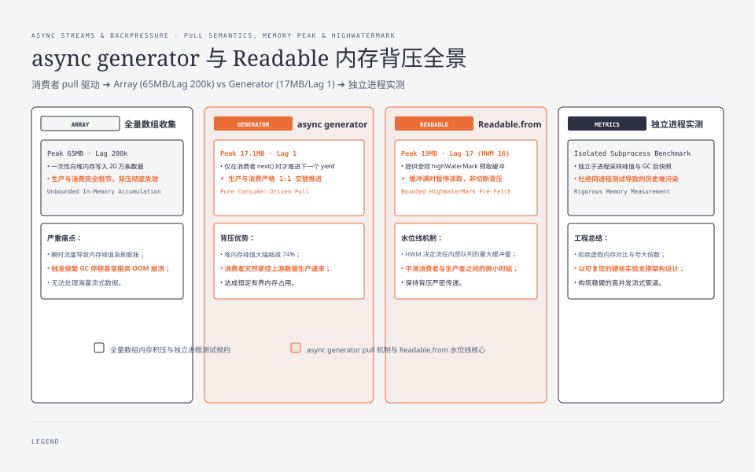

**TL;DR：** `for await` 让 async generator 以 pull 方式推进，但它不会替整个下游链路自动提供“恒定一条记录”的内存保证。当前实验把数组、直接 generator 和 `Readable.from` 放到独立进程，用相同的 20 万条记录和 128 字节 payload 记录运行期峰值与 producer-consumer lag：数组 lag 为 200000，直接 generator 为 1，`Readable.from` 在 `highWaterMark=16` 时观察到 17。再接上每条 20ms 的慢 Writable 后，三条路径的 Lag 都是 0–1、缓冲上限随 HWM 缩小（16→15B、2→1B），说明背压沿 generator → Readable → Writable 全程生效，但它来自每一层对下游的等待，不是任何单层的语法糖。


---



## 一、pull 只保证“下一项由消费者请求”

async generator 的关键语义是：调用方请求下一项后，generator 才继续执行到下一个 `yield`。`experiments/ts-streams/pull-push.ts` 用两个消费者把这件事打印出来：

```text
=== 慢消费者 (每条处理 100ms) ===
slow 生产 0
  消费 0
slow 生产 1
  消费 1
...
=== 贪婪消费者 (先全部收集) ===
eager 生产 0
eager 生产 1
eager 生产 2
eager 生产 3
eager 生产 4
  收集到 5 条后统一处理
```

慢消费者在下一次 `next()` 之前等待，所以生产和消费交替；贪婪消费者主动把数据收集到数组，背压已经被调用方自己取消。`for await` 不是“免费缓冲”，而是把拉取时机放在消费循环里。


## 二、内存实验必须隔离进程，并同时记录峰值与 GC 后快照

旧实现先在同一个进程构造数组，再运行 generator；它还在读取前强制 GC，把某个时刻的 `heapUsed` 写成峰值。当前 `memory.ts` 让三种模式每次在新进程运行，记录：

- `peakHeapUsedMb` 与 `peakRssMb`：运行期间采样到的峰值；
- `afterGcHeapUsedMb` 与 `afterGcRssMb`：结束后的一次快照；
- `maxProducerConsumerLag`：已 yield 与已完成消费的最大差；
- 输入数量、payload 大小、`highWaterMark` 和消费者延迟。

固定 Node 24.19.0、20 万条记录、每条共享 128 字节 payload，三次命令的一次本机输出是：

| 模式 | peak heap | peak RSS | after-GC heap | max lag |
| --- | ---: | ---: | ---: | ---: |
| array | 65.0 MB | 155.6 MB | 7.6 MB | 200000 |
| direct generator | 17.1 MB | 88.1 MB | 7.6 MB | 1 |
| `Readable.from`, HWM 16 | 19.0 MB | 82.2 MB | 7.7 MB | 17 |

完整命令和本轮原始 JSON 输出保存在 `evidence/typescript-streams-backpressure/2026-08-16-local/`；README 仍保留可重跑入口。它们是当前机器的一轮结果，不是 Node 的固定内存常数；改变 payload、Node/V8、采样间隔或进程启动参数都会改变绝对值。

## 三、`Readable.from` 有有限缓冲，不等于“背压被切断”

Node Readable 的背压协议由 `highWaterMark`、`push()` 返回值、消费者读取速度和下游写入状态共同决定。当前实验用同一个 async generator 包进 `Readable.from`，只改变 `highWaterMark`：

```text
HWM 1  -> maxProducerConsumerLag 2
HWM 16 -> maxProducerConsumerLag 17
HWM 64 -> maxProducerConsumerLag 65
```

这说明实现会有有限的预取/队列边界，不能从单次高内存结果推断“生产者全速跑”。要定位真实原因，还要增加慢消费者、不同 HWM、generator yield 次数和 Writable `drain` 等变量。正确的结论是：`Readable.from` 改变了链路的缓冲语义，开发者需要测并设置这个边界，而不是把它描述成天然切断背压。

把链路接到慢 Writable 后，背压语义才完整。`experiments/ts-streams/downstream-pipe.ts` 让同一条 generator 分别经过三条路径进入每条处理 20ms 的慢 Writable（HWM=16），测量生产者/消费者最大差、readable 缓冲峰值和 drain 次数：

```text
A 直接 for-await → 慢 Writable (每步等 drain): produced=2000 consumed=2000 maxLag=0  maxBuffered=0B  drain=2000
B Readable.from HWM=16 → pipe → 慢 Writable:    produced=2000 consumed=2000 maxLag=1  maxBuffered=15B drain=1999
C Readable.from HWM=2  → pipe → 慢 Writable:    produced=2000 consumed=2000 maxLag=1  maxBuffered=1B  drain=1999
```

路径 A：应用层在 `write()` 返回 false 时等待 `drain`，生产与消费逐条交替，Lag=0。路径 B/C：`pipe` 协议在 readable 侧最多预取一条（HWM 16 时缓冲 15B、HWM 2 时 1B），drain 节流与 A 几乎一致，但缓冲上限随 HWM 缩小。三路实测的 Lag 都是 0–1，说明整条链路（generator → Readable → Writable）的推进都受慢下游约束——这和第四节说的“把 chunk 放进另一个无界数组，积压只是换地址”是同一件事的两面：背压不是 `Readable.from` 或 `for await` 任何单层的礼物，而是每一层都等待下游的结果。原始输出与命令见 `evidence/typescript-streams-downstream/2026-08-19-local/`；本机单进程 2000 条，不含 OS socket 与真实网络吞吐。

```mermaid
flowchart LR
  generator["async generator"] -->|next() / yield| readable["Readable.from\n有限缓冲"]
  readable --> consumer["for await consumer"]
  consumer --> writable["Writable / SSE / socket"]
  writable -."drain / ready / write backpressure".-> consumer
```

图中最后一条虚线很重要：本地 `for await` 消费得慢，只能约束它前面的队列；如果 `emitToUI()` 把 chunk 放进另一个无界数组，积压只是换了地址。

## 四、Go channel 不是无界 push

Go channel 的容量在创建时确定：`make(chan T)` 是无缓冲，`make(chan T, n)` 是容量为 `n` 的有限缓冲。无缓冲 send 需要 receiver 就绪，有缓冲 channel 满时 send 阻塞。它不是无界队列，也不能因为“除非缓冲满才阻塞”就写成无界。

| | Go channel | async generator |
| --- | --- | --- |
| 推进方向 | producer push | consumer pull |
| 队列上限 | 0 或创建时指定的 `n` | generator 自身通常只推进到下一项 |
| 背压何时生效 | receiver 不在场或 buffer 满 | consumer 不请求下一项 |
| 额外风险 | 把 buffer 设过大仍会积压 | 下游 Writable/socket 可能另有缓冲 |

如果一个 Go producer 需要受控内存，给 channel 明确容量并在满时阻塞；如果一个 Node SSE producer 需要受控内存，除了 `for await` 还要等待 writable 的 `drain` 或 Web Streams 的 ready 信号。

## 五、结论：背压要沿整条链路验收

这次修订撤掉了不能由旧脚本支持的“55 倍”“806.7MB”和“Readable.from 切断背压”三个结论，保留并验证了更窄的判断：

1. async generator 的 pull 语义能约束 generator 本身的推进时机。
2. 数组、generator、Readable 的内存比较必须独立进程，并区分峰值与 GC 后保留量。
3. `Readable.from` 有缓冲边界；是否形成可控背压，要观察 HWM、生产/消费差和真正的下游写入——慢 Writable 三路实测 Lag 均为 0–1，缓冲上限随 HWM 缩小。
4. Go channel 是有界或无缓冲的 push，不是无界队列。

读者可以按 README 的三条命令改变 `--high-water-mark` 和 `--delay-ms`，再运行 `node downstream-pipe.ts` 把不等待 `drain` 的 Writable 接到末端观察 Lag 增长。只有那时，结论才从“generator 这一层看起来很省内存”推进到“整条输出链路有上限”。

## 参考资料

- [Node.js：Streams API](https://nodejs.org/api/stream.html)
- [Go 语言规范：Channel types](https://go.dev/ref/spec#Channel_types)
