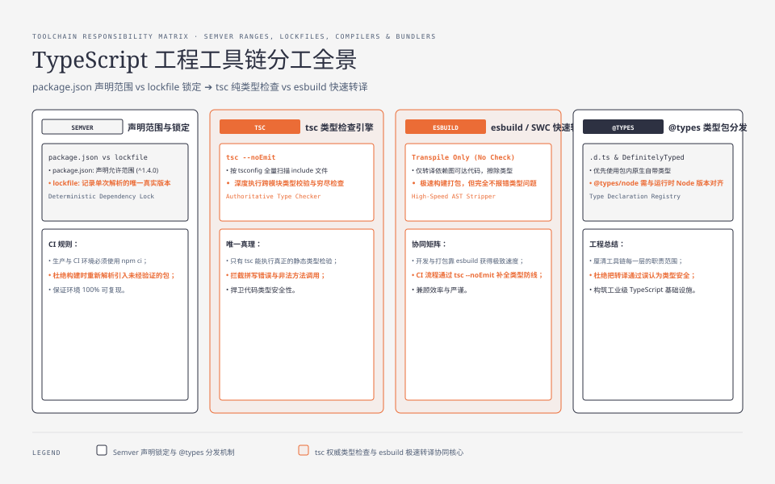
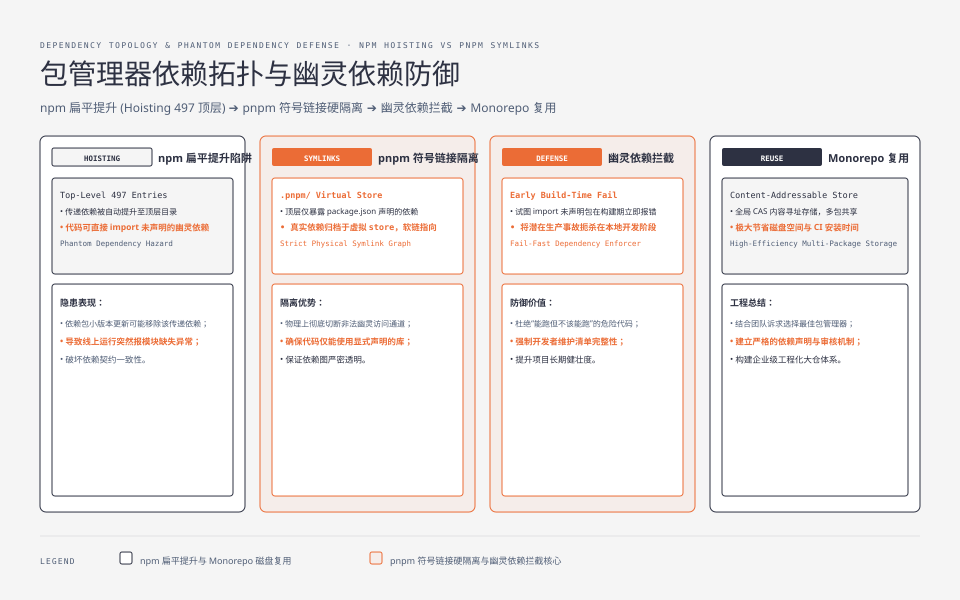
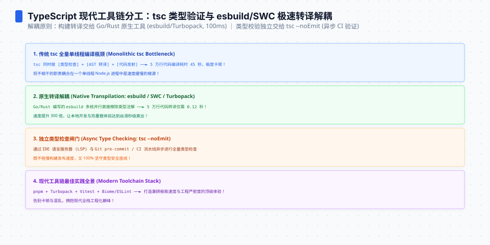

**TL;DR：** 上一篇[《接口边界三合一》](/writing/typescript-interface-schema-zod)结尾丢了钩子：zod 是 `npm install` 装的，`package.json` 里写的 `^1.4.0` 是什么规则？这篇把语法外的规则拆开。核心结论：**Go 的 `go.mod` 记录已选择的模块版本，npm 的 `package.json` 声明允许范围，lockfile 记录一次解析后的具体版本**；新安装、`npm install` 和 `npm ci` 不是同一个动作。当前仓库快照是 Node v24.19.0、npm 11.17.0、TypeScript 5.9.3、esbuild 0.28.0、zod 声明 `^4.4.3` 且锁定 `4.4.3`，运行时依赖 17 个、开发依赖 7 个。npm 的 497 个顶层目录条目只是本次布局观察；没有当前 pnpm 安装或速度 benchmark。最后，**esbuild 转译不等于 tsc 类型检查**，职责必须分开。


---



## 一、npm 的"动态更新"是怎么发生的：semver 范围 + lockfile

Go 开发者的心智是 `go.mod` 里 `require foo v1.2.3`——精确版本，`go get` 才动。npm 完全不是这套：

```jsonc
// package.json——声明的是"允许范围"
{ "dependencies": { "zod": "^4.4.3" } }
// package-lock.json——锁定的才是这次解析的"实际版本"
{ "packages": { "node_modules/zod": { "version": "4.4.3" } } }
```

semver 范围符号的精确规则（本机用 semver 规则逐条核对）：

| 写法 | 实际含义 | 例子 |
| --- | --- | --- |
| `^1.4.0` | `>=1.4.0 <2.0.0` | 主版本号不涨 |
| `^0.2.3` | `>=0.2.3 <0.3.0` | **0.x 下只锁次版本** |
| `^0.0.3` | `>=0.0.3 <0.0.4` | 0.0.x 只锁补丁 |
| `~1.4.0` | `>=1.4.0 <1.5.0` | 只锁次版本 |
| `1.4.0` | 就是 `1.4.0` | 精确 |

两个坑值得单独说：

1. **`^` 对 0.x 的处理**：`^0.2.3` 允许到 `0.3.0` 以下，但不允许 `1.0.0`——因为 0.x 阶段每个 minor 都可能破坏兼容。很多事故来自"项目还在 0.x，以为 `^` 很安全"。
2. **`^` 的安全承诺是"语义化"的，而语义化是自律的**：包作者遵守 semver 才成立。即使一个包声明遵循 semver，lockfile 仍然负责把团队当前已经验证过的具体解析结果固定下来；这就是范围声明和锁文件必须同时审查的理由。

**"动态更新"的机制**可以先用规则说明，再用安装器复现：

```
目录 A：有 lockfile，记录某一次解析的具体版本
目录 B：只有 package.json（例如 `^4.4.3`），需要重新解析允许范围

目录 A 用 lockfile 的 npm ci    → 按 lockfile 安装
目录 B 裸声明 npm install       → 在允许范围内重新解析，并写回 lockfile
```

因此，同一个范围在不同 lockfile 或不同解析时刻可能得到不同的具体版本。**`npm install` 可以在允许范围内重新解析并更新 lockfile；`npm ci` 要求 lockfile 与 `package.json` 一致，并按 lockfile 安装**。这不是“npm 随机升级”，而是两个命令的合同不同。所以：

- **CI 默认用 `npm ci`**（不是 install），否则每次构建的依赖都可能重新解析。
- 升级依赖是**显式动作**（`npm install zod@^4`），不是"它自己悄悄变了"。
- 代码审查里 `package-lock.json` 的 diff 必须看——它是唯一记录"实际装了什么"的地方。




## 二、包管理器布局：npm 扁平 vs pnpm 严格

`node_modules` 怎么摆，决定了你会不会踩"幽灵依赖"（用到没声明的包）。

**npm（默认）**：扁平化 + 提升（hoisting）。传递依赖可能被提升到顶层。当前博客仓库的 npm 布局快照是：

```
npm 布局：node_modules 顶层 497 个非隐藏条目（运行时依赖 17 个、开发依赖 7 个）
npm ls 看不到"用了没声明"的包——你 import 的包可能只是别人的依赖
```

**pnpm**：只放直接依赖在顶层，所有包的真正内容进 `.pnpm/<name>@<version>/` 虚拟 store，符号链接接入：

```
pnpm 的典型布局：直接依赖通过链接进入顶层，真实内容放在
          node_modules/.pnpm/<name>@<version>/node_modules/<name>
幽灵依赖：import 未声明的包 → 在严格布局下更早暴露
```

**取舍**：npm 布局简单、与工具兼容最好（老工具默认找顶层）；pnpm 严格、省磁盘（store 内容寻址，多项目共享）、更容易暴露幽灵依赖。本次没有在仓库中执行 pnpm 安装，因此不声称 pnpm 的目录数量、磁盘占用或速度。幽灵依赖的危害不是报错——**是"能跑但不该能跑"**：你 import 了 A 的传递依赖 B，A 升级后 B 版本变了，你的代码悄悄坏。严格布局把这类问题更早暴露出来，但仍要把直接依赖写进 `package.json`。

## 三、tsc vs esbuild vs swc：转译与类型检查是两件事

这是"语法外"最容易搞混的一层。**TypeScript 编译 ≠ 类型检查**：

| 工具 | 类型检查 | 转译（去类型） | 当前职责 |
| --- | --- | --- | --- |
| `tsc` | ✅ | ✅（按 tsconfig 产出） | 检查配置覆盖的 TypeScript，并可转译 |
| `esbuild` | ❌ 不做 | ✅ | 快速转译/打包可达依赖 |
| `swc` | ❌ 不做 | ✅ | Rust 转译器；具体能力需按配置核对 |

当前仓库的可复验入口是两个不同命题：

```bash
node node_modules/typescript/bin/tsc --noEmit
node_modules/.bin/esbuild components/post/article-body.tsx \
  --loader:.tsx=tsx --outfile=/tmp/article-body.js
```

不要用这两条命令的单次 wall-clock 直接做性能排名：入口、配置、缓存、产物检查和机器都不同。语义差异在这里：

1. **tsc 按配置检查文件集合**：哪怕某个文件没有从入口 import，也可能被 `include` 纳入检查。esbuild 主要处理**依赖图可达**的模块，二者的工作集合不是同一个分母。
2. **esbuild 完全不做类型检查**：`string` 拼成 `number` 它不报错。Vite 默认用 esbuild 转译 = 开发时不查类型，构建时靠 `tsc --noEmit` 补查。
3. 所以现代项目通常需要**两个都跑**：`esbuild`（转译）+ `tsc --noEmit`（类型检查），或 Vite + `vue-tsc` 这类组合。别以为"esbuild 能产出 JS"就能替代 tsc。




## 四、@types 从哪来：类型包的分发机制

后端同学还容易困惑：`import express from "express"` 的类型是谁提供的？

- **自带类型**：包发布时含 `.d.ts`（package.json 的 `types` 字段）。zod、react 都是。
- **@types/* 包**：没自带类型的走 DefinitelyTyped 仓库分发，如 `@types/express`、`@types/node`。**注意**：`@types/node` 的版本要跟 Node 运行时版本对应（装 `@types/node@20` 对应 Node 20），版本错配会出现"类型说有、运行时没有"。
- 判定方法：装了包后看 `node_modules/<pkg>/package.json` 有没有 `types` 字段；没有就去 `@types/<pkg>` 找。

`@types/*` 也是普通 npm 包，受同样的 semver/lockfile 规则管辖——**类型依赖也会漂移**，升级类型包可能让既有代码开始报错（`@types/node` 最常见）。

## 五、版本选择现场：一个新项目的工具链账单

假设从零起一个 Node + TS 后端，按顺序：

```bash
# 1. 装 Node——用版本管理器（nvm/fnm），别用系统包
nvm install 22        # 先按 Node release schedule 选择维护线，再和部署环境对齐

# 2. 初始化项目
npm init -y

# 3. 装依赖：devDependencies 放工具链，dependencies 放运行时
npm i -D typescript @types/node
npm i zod                 # 运行时依赖

# 4. tsconfig 核心三开关（详见 tsconfig 篇）
#    target: 产物 JS 语法版本（es2022）
#    module: 产物模块格式（nodenext = 跟随 package.json 的 type 字段）
#    moduleResolution: 解析规则（nodenext 或 bundler，取决于用不用打包器）

# 5. CI 里：npm ci（不是 install）+ tsc --noEmit
```

**Node 版本管理的本质**：Node 按 release schedule 发布 Current 与 LTS 维护线；不能只用“偶数版就是 LTS”这句口诀替代日期和维护状态。`package.json` 里的 `"engines": { "node": ">=20" }` 只是约束声明，是否阻止安装取决于包管理器配置——**运行时版本、`@types/node` 和 CI/deploy 镜像要一起对齐**，否则很容易出现“类型说能跑、部署环境炸”。

## 六、结论：lockfile 锁住解析，工具链分工锁住责任

工具链的账本可以收成四句话：

1. **`package.json` 声明范围，lockfile 锁定真相**：`^` 的安全感来自包作者的自觉；锁依赖用 `npm ci`，升级依赖是显式动作。
2. **包管理器选型是布局决策**：npm 扁平兼容好、pnpm 严格杜绝幽灵依赖；幽灵依赖的危害是"能跑但不该能跑"。
3. **转译 ≠ 类型检查**：esbuild 快是因为不做检查；生产管线里两个都要，各司其职。
4. **类型包也是依赖**：`@types/*` 受同样规则管辖，版本错配 = 类型谎言。

这些规则全部"语法外"——你写 `import { z } from "zod"` 时，背后是这套机制在决定"zod 到底是谁"。本次仓库快照、完整命令和边界记录在 `evidence/typescript-toolchain-rules/2026-08-17-local/`；它是当前安装状态的证据，不是所有项目的依赖数量或构建速度合同。

下一步：在 CI 中固定 Node 维护线、使用 `npm ci`，分别执行 `tsc --noEmit` 与构建器命令；升级依赖时审查 `package-lock.json`，并在目标环境重新验证 `@types/node` 与运行时版本。

## 七、参考资料：依赖解析、编译与 Node 生命周期

- [npm：package-lock.json](https://docs.npmjs.com/cli/v11/configuring-npm/package-lock-json)：lockfile 的作用与可复现安装。
- [npm：npm ci](https://docs.npmjs.com/cli/v11/commands/npm-ci)：CI 安装时严格使用 lockfile 的语义。
- [pnpm：Dependency Resolution](https://pnpm.io/npmrc#dependency-resolution)：严格依赖布局与幽灵依赖边界。
- [TypeScript：Compiler Options](https://www.typescriptlang.org/tsconfig)：`target`、`module`、`moduleResolution` 和类型检查配置。
- [esbuild：TypeScript](https://esbuild.github.io/content-types/#typescript)：esbuild 只负责去除类型语法，不做 TypeScript 类型检查。
- [Node.js：Release schedule](https://github.com/nodejs/release#release-schedule)：Node 版本线、Current 与 LTS 生命周期。
