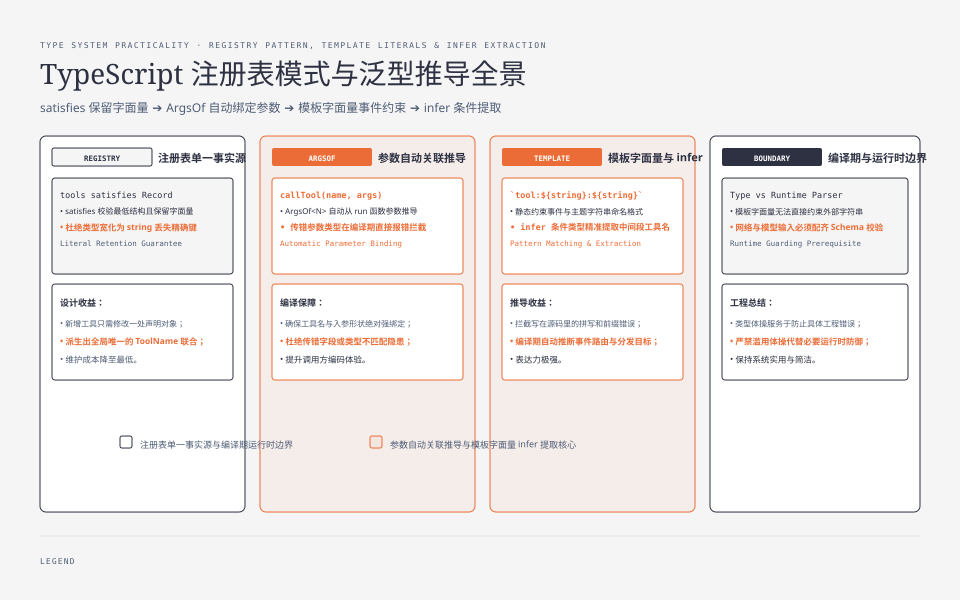
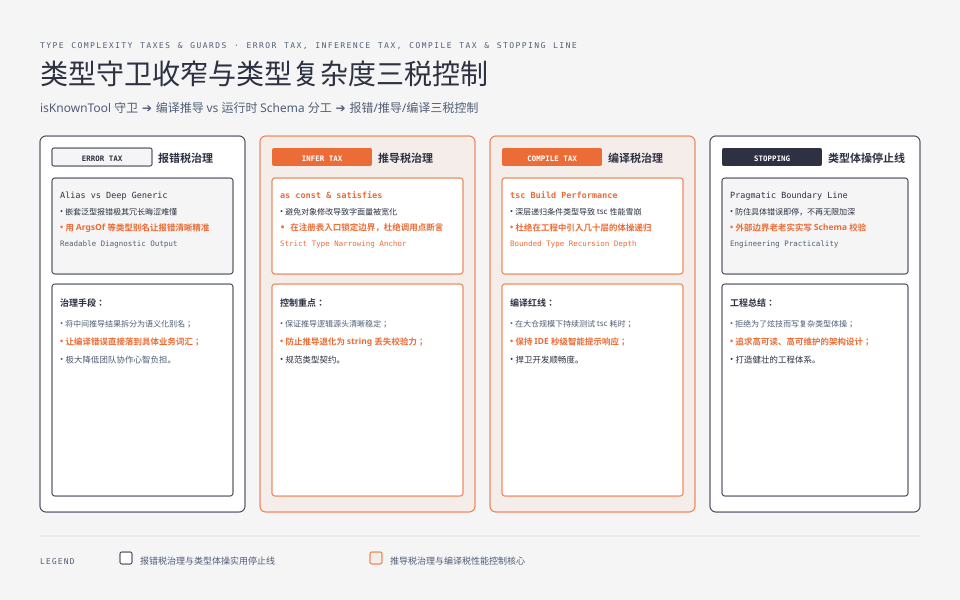

**TL;DR：** [《错误处理：throw 是长臂，Result 是管道》](/writing/typescript-errors-result-throw)使用了泛型 Result，这篇把“复杂类型什么时候值得维护”落到 Agent 工具注册表。**泛型推导能把工具名和参数类型绑定，模板字面量类型能约束已知事件格式，条件类型能从字面量中提取信息，类型守卫能把运行时字符串重新收窄。** 实验 `experiments/ts-type-gymnastics/` 用 `@ts-expect-error` 证明 `callTool("get_stock", { symbol: 42 })` 编译不过；但这些类型不会验证外部 JSON，也不会在运行时存在，所以必须用 schema 或手写解析器守住边界。类型体操的收益到“防止一个具体错误”为止，再深就是维护成本。


---



## 一、注册表是泛型推导最值得落地的场景

如果工具名、参数和执行函数分别维护，新增一个工具要改多个联合类型和分支。把工具定义作为唯一来源，调用函数可以从工具名推导参数：

```ts
const tools = {
  get_stock: {
    name: "get_stock",
    run: ({ symbol }: { symbol: string }) => `price(${symbol})=100`,
  },
  create_order: {
    name: "create_order",
    run: ({ userId, items }: { userId: number; items: number[] }) =>
      `order ${userId}:${items.join("+")}`,
  },
} satisfies Record<string, { name: string; run: (args: never) => string }>;

type Tools = typeof tools;
type ToolName = keyof Tools;
type ArgsOf<N extends ToolName> = Parameters<Tools[N]["run"]>[0];

const callTool = <N extends ToolName>(name: N, args: ArgsOf<N>) => {
  const tool = tools[name];
  return tool.run(args as never);
};
```

这里有三个值得写进评审意见的细节：

1. `satisfies` 检查注册表满足最低结构，但保留了 `get_stock`、`create_order` 这些字面量 key；直接写 `: Record<string, ...>` 往往会把信息宽化。
2. `ArgsOf<N>` 从对应 `run` 的第一个参数推导形状，调用名和参数不会脱钩。
3. `args as never` 是一个局部的不安全接缝：TypeScript 在泛型索引后无法证明每个具体函数都接受同一个参数类型。它只能出现在注册表已经通过同一结构检查、且没有动态修改的地方；如果工具来自外部配置，不能靠这个断言当作运行时验证。

实验用 TypeScript 5.9.3 执行 `tsc -p experiments/ts-type-gymnastics/tsconfig.json --noEmit`，错误调用由 `@ts-expect-error` 消费；删除错误注释后，编译器会报 `number` 不能赋给 `string`。运行时 demo 则打印两个合法调用，说明编译期合同和运行时行为分别被验证。

## 二、satisfies、类型注解和 as 断言不是一回事

三种写法的风险不同：

| 写法 | 做了什么 | 保留字面量信息 | 失败时机 |
| --- | --- | --- | --- |
| `const x: Shape = value` | 要求值可赋给 `Shape` | 可能被宽化 | 编译期拒绝 |
| `const x = value satisfies Shape` | 检查形状但保留推导结果 | 通常保留 | 编译期拒绝 |
| `const x = value as Shape` | 告诉编译器“相信我” | 取决于断言 | 可能完全不检查 |

`satisfies` 不是运行时 schema。下面的 JSON 即使通过了 `unknown` 到 `ToolCall` 的断言，数据仍可能没有 `name` 或把 `symbol` 写成数字：

```ts
type ToolCall = { name: "get_stock"; args: { symbol: string } };

const fromNetwork = JSON.parse('{"name":"get_stock","args":{"symbol":42}}') as ToolCall;
// 编译器相信断言；运行时没有任何校验，fromNetwork.args.symbol 实际是 number。
```

这个反例是类型体操的边界：编译器只能检查它看到的静态值，不能替你检查网络、数据库、模型输出或消息队列。入口仍应走[《接口不是运行时验证：TypeScript 的 zod 三合一》](/writing/typescript-interface-schema-zod)中讨论的 schema，体操负责让已验证的数据在进程内保持关联。

## 三、模板字面量类型能约束格式，但约束不到外部字符串

Agent 事件常用字符串表示，例如 `tool:get_stock:start`。模板字面量类型可以检查写在源码里的格式：

```ts
type ToolEvent = `tool:${string}:${string}`;

const valid: ToolEvent = "tool:get_stock:start";
// @ts-expect-error 前缀不符合事件合同
const invalid: ToolEvent = "event:get_stock";

type ExtractTool<E extends string> =
  E extends `tool:${infer Tool}:${string}` ? Tool : never;

type StockTool = ExtractTool<"tool:get_stock:start">; // "get_stock"
type NotAnEvent = ExtractTool<"event:whatever">;       // never
```

它解决的是拼写和格式错误，不是协议解析。`const incoming: string` 即使内容是 `tool:get_stock:start`，仍然只是 `string`；要让它成为 `ToolEvent`，必须先检查前缀、分隔符数量、工具名白名单和动作白名单。否则直接 `as ToolEvent` 只是把错误从编译器隐藏到运行时。

模板字面量也有可读性边界。格式越来越多时，`tool:${string}:${string}:${string}:${string}` 只会产生一个难以解释的类型；这时用对象联合表达 `type/name/action/payload`，通常比继续扩展字符串更容易记录字段级错误。




## 四、类型守卫把运行时名称重新接回注册表

从配置、HTTP 或模型输出读到的工具名都是 `string`。类型守卫把运行时检查和编译器收窄连接起来：

```ts
const toolsRegistry = ["get_stock", "create_order"] as const;
type KnownTool = (typeof toolsRegistry)[number];

const isKnownTool = (name: string): name is KnownTool =>
  (toolsRegistry as readonly string[]).includes(name);

const route = (name: string) => {
  if (!isKnownTool(name)) return { ok: false as const, error: "unknown tool" };
  // 此处 name 已经是 "get_stock" | "create_order"。
  return { ok: true as const, name };
};
```

不要用 `name in toolsRegistry` 代替 `includes`：`in` 检查的是数组属性名（例如 `"0"`、`"length"`），不是元素值。实验 `literal.ts` 同时验证模板字面量、条件类型和运行时 `includes` 分支，输出“已知工具/未知工具被拦截”。

对于真正的工具调用，守卫还不够。它只证明名字属于集合，不能证明参数与名字匹配；应当先按名字找到对应 schema，再解析参数，最后调用已推导的函数。类型系统可以让这三步之间保持关联，但不能跳过第二步。

## 五、泛型复杂度有三种可观察的税

类型表达式开始影响工程时，关注的不是字符数，而是它对反馈和维护的影响：

- **报错税**：`Parameters<Tools[N]["run"]>[0]` 出错时，开发者需要读一串嵌套泛型才能知道是参数还是工具名错。用 `ArgsOf`、`ToolName` 等别名拆开，让错误落到领域词汇。
- **推导税**：数组、对象和回调稍微加上可变性，字面量可能被宽化，泛型推导就会退化成 `string` 或 `unknown`。把 `as const`、`satisfies` 和显式边界放在注册处，不要在每个调用点补断言。
- **编译税**：递归条件类型、大型联合和模板字面量组合会增加类型检查时间，也可能让 IDE 失去响应。类型方案应在真实项目规模下测 `tsc` 时间，而不是只在两个工具的 demo 中看起来优雅。

一条可执行的停止线是：类型表达式防住了一个可复现的错误，就先停；如果只能证明类型系统本身很强，却不能减少运行时校验、测试或线上事故，应该退回普通类型、schema 或运行时函数。

## 六、Go 读者的对应：类型推导不等于运行时反射

Go 的泛型适合表达容器和算法约束，接口与类型 switch 适合运行时分派；字符串格式通常由解析器或 regexp 验证。TypeScript 的模板字面量和条件类型能在源码字面量层面提供更细的约束，但代价是类型信息会在编译后消失，跨边界数据仍需运行时校验：

| 需求 | 编译期能力 | 运行时仍需做的事 |
| --- | --- | --- |
| 工具名与参数绑定 | 泛型索引、`ArgsOf` | 根据外部 name 选择 schema |
| 事件格式 | 模板字面量、`infer` | 解析未知字符串并拒绝畸形输入 |
| 工具白名单 | `keyof`、字面量联合 | `includes` 或对象查找 |
| 参数字段 | 结构类型 | JSON 类型、范围、权限与业务不变量 |

这也是为什么“类型体操让错误根本进不了运行时”只能对源码中的错误成立；网络和模型输出不在编译器的视野里。

## 七、FAQ：什么时候该把类型体操换成普通代码

### `as const` 越多越安全吗？

不一定。它能保留字面量并把属性变成只读，但不能验证动态数据；滥用会让后续更新困难。只在值本身就是静态注册表、且不可变性是合同的一部分时使用。

### 条件类型能不能代替 schema？

不能。条件类型只计算类型，不读取运行时字节。它适合从已验证的类型中提取关系，schema 负责检查未知输入并返回错误。

### 一个工具注册表应该直接上复杂框架吗？

先用 `satisfies + keyof + 参数推导 + runtime schema` 写出最小合同。只有当并行状态、插件生命周期、版本兼容或大量工具让这套基础设施出现重复时，才评估库；库不能消除运行时边界。

## 八、结论：类型体操的终点是更早的具体错误

- 泛型注册表能让工具名和参数类型保持关联，`satisfies` 能在保留字面量信息的同时检查结构。
- 模板字面量与条件类型适合约束源码中的事件格式；外部字符串仍必须解析，不能靠断言冒充验证。
- 类型守卫把运行时白名单检查接回编译器，但参数 schema、授权和业务不变量仍是运行时责任。
- `as never`、深层条件类型和大型联合都是明确的维护成本；先证明它们防住了具体错误，再决定是否值得保留。

下一步是系列终篇[《Agent 生产化：从脚本到服务的最后一段》](/writing/typescript-agent-production)：类型合同完成后，如何面对并发请求、幂等、预算、观测和真实故障，而不是停在一个编译通过的 demo。

## 九、参考资料

- [TypeScript Handbook：Generics](https://www.typescriptlang.org/docs/handbook/2/generics.html)：泛型约束与推导。
- [TypeScript Handbook：Template Literal Types](https://www.typescriptlang.org/docs/handbook/2/template-literal-types.html)：模板字面量类型与字符串组合。
- [TypeScript Handbook：Conditional Types](https://www.typescriptlang.org/docs/handbook/2/conditional-types.html)：条件类型与 `infer`。
- [TypeScript 4.9：The `satisfies` Operator](https://devblogs.microsoft.com/typescript/announcing-typescript-4-9/#the-satisfies-operator)：`satisfies` 的设计动机与示例。
- [TypeScript Handbook：Utility Types](https://www.typescriptlang.org/docs/handbook/utility-types.html)：`Parameters` 等工具类型。
