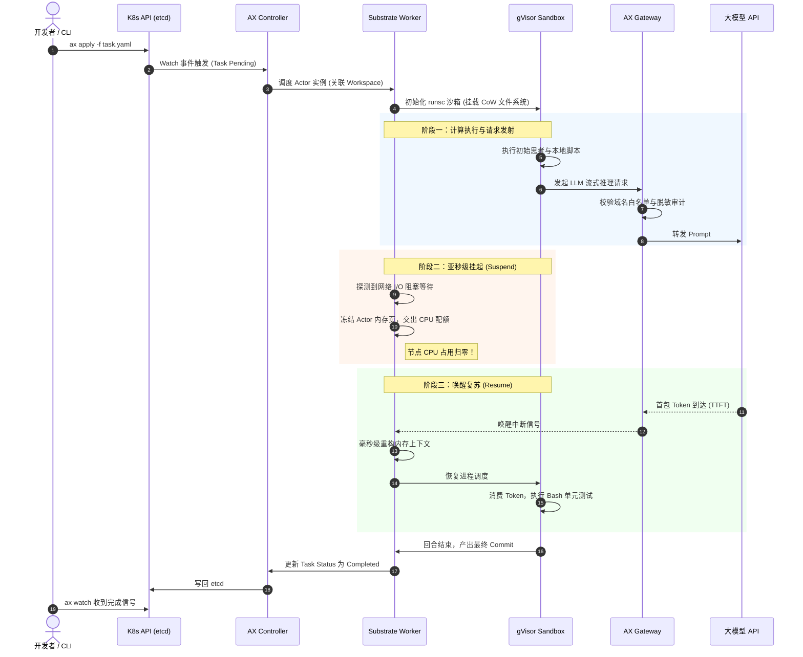

**TL;DR：** 作为 Google 在 2026 年开源的颠覆性 Agent 编排底座，**Google AX（Agent Executor）** 并未推倒重来发明一套全新的基础设施，而是极其巧妙地将整个系统架构深度锚定在 **Kubernetes 声明式体系** 之上。AX 的物理架构严格分为**控制面（Control Plane）**与**数据面（Data Plane）**：控制面由基于 Kubernetes CRD 构建的 `ax-controller-manager` 与 `ax-webhook` 驱动，负责管理 `Task`、`Workspace`、`Gateway` 和 `Model` 四大核心资源；数据面则由常驻节点池的 **`agent-substrate-worker`**（负责 Actor 协程级密集多路复用与亚秒级挂起唤醒）与 **`ax-gateway-proxy`**（基于 Envoy 的零信任出站流量网关）组成，底层直接对接 **Google gVisor (`runsc`)** 独立内核沙箱。本文将通过“物理组件拆解 -> 环境安装部署 -> 4 份核心 YAML 清单剖析 -> `ax` 极客命令行全周期实战（`apply` / `watch` / `logs` / `ssh` 穿透沙箱排障）”，带你以纯粹的工程师视角从零跑通第一个自主 Agent，并彻底摸清端到端的数据流转与状态机闭环。

---

## 一、 架构全景：AX 在 Kubernetes 集群中到底长什么样？

很多工程师在初次接触 AX 时，容易将其误解为一个单纯的 Python/TypeScript Agent 框架（如 LangChain 或 CrewAI）。**这是根本性的认知偏差。** 

AX 是一个真正的**集群级基础设施软件（Cluster-Level Infrastructure）**。如果登录到部署了 Google AX 的 Kubernetes 生产集群，通过 `kubectl get pods -n ax-system`，你看到的是如下分工明确的系统级组件拓扑：

```
                    ┌────────────────────────────────────────────────────────┐
                    │            Google AX 生产集群物理拓扑全景               │
                    └────────────────────────────────────────────────────────┘
                                                │
   [ 开发者终端 / CI/CD 流水线 ] ───────────────┼──────────────────────────────┐
                                                │                              │
                                        ax CLI / kubectl                       │
                                                │                              │
                                                ▼                              │
   ┌────────────────────────────────────────────────────────────────────────┐  │
   │               【控制平面: ax-system 控制节点】                         │  │
   │                                                                        │  │
   │   ┌───────────────────────────┐    ┌───────────────────────────────┐   │  │
   │   │   kube-apiserver          │◄───┤  ax-controller-manager        │   │  │
   │   │   (持有 ax.io/v1alpha1 CRD)│    │  (Reconcile Task/Workspace/   │   │  │
   │   └─────────────┬─────────────┘    │   Gateway/Model 期望状态)     │   │  │
   │                 │                  └───────────────────────────────┘   │  │
   │                 ▼                                                      │  │
   │   ┌───────────────────────────┐                                        │  │
   │   │   ax-webhook-server       │  (准入拦截、配置 Schema 校验、          │  │
   │   │   (Validating/Mutating)   │   安全上下文默认值强制注入)             │  │
   │   └───────────────────────────┘                                        │  │
   └────────────────────────────────────────────────────────────────────────┘  │
                                                │                              │
                                   gRPC / Unix Domain Socket                   │
                                                │                              │
                                                ▼                              │
   ┌────────────────────────────────────────────────────────────────────────┐  │
   │               【数据平面: 计算节点 (Node) 运行拓扑】                    │  │
   │                                                                        │  │
   │   ┌────────────────────────────────────────────────────────────────┐   │  │
   │   │  agent-substrate-worker (DaemonSet / Worker Pod 资源池)         │   │  │
   │   │                                                                │   │  │
   │   │   ┌────────────────────────────────────────────────────────┐   │   │  │
   │   │   │  Actor Multiplexer (高密多路复用调度内核)              │   │   │  │
   │   │   │  • 活跃 Actor 协程队列 (500+ Sessions / Worker)        │   │   │  │
   │   │   │  • Suspend/Resume 快照控制器 (内存增量换出引擎)        │   │   │  │
   │   │   └───────────────────────────┬────────────────────────────┘   │   │  │
   │   │                               │                                │   │  │
   │   │               ┌───────────────┴───────────────┐                │   │  │
   │   │               ▼                               ▼                │   │  │
   │   │     [ Task Sandbox 01 ]             [ Task Sandbox 02 ]        │   │  │
   │   │     ┌─────────────────┐             ┌─────────────────┐        │   │  │
   │   │     │ gVisor Sentry   │             │ gVisor Sentry   │        │   │  │
   │   │     │ (独立用户态内核) │             │ (独立用户态内核) │        │   │  │
   │   │     │  • Bash / Python│             │  • Node / Tools │        │   │  │
   │   │     │  • Workspace 卷 │             │  • Workspace 卷 │        │   │  │
   │   │     └────────┬────────┘             └────────┬────────┘        │   │  │
   │   └──────────────┼───────────────────────────────┼─────────────────┘   │  │
   │                  │                               │                     │  │
   │                  ▼                               ▼                     │  │
   │   ┌────────────────────────────────────────────────────────────────┐   │  │
   │   │  ax-gateway-proxy (节点级出站侧车 / Envoy 透明代理)             │   │  │
   │   │  • 域名/端口白名单过滤 (api.github.com, llm.openai.com)        │   │  │
   │   │  • 出站数据流检测与 Secret Redaction (凭据脱敏剥离)            │   │  │
   │   └───────────────────────────────┬────────────────────────────────┘   │  │
   └───────────────────────────────────┼────────────────────────────────────┘  │
                                       │                                       │
                                       ▼                                       ▼
                             [ 外部 LLM API 提供商 ]               [ 外部 Git / 依赖源 ]
                             (Gemini / Claude / OpenAI)           (GitHub / npm / PyPI)
```

### 控制面三大核心服务
1. **`ax-controller-manager`**：
   - 核心控制器守护进程。它持续监听 Kubernetes API Server 中 `ax.io/v1alpha1` 组下的所有自定义资源（CRD）；
   - 负责驱动四大原语的状态机调和循环（Reconcile Loop），例如：当收到新的 `Task` 时，定位并绑定对应的 `Workspace` 和 `Model`，将调度请求下发至计算节点的 `agent-substrate-worker`。
2. **`ax-webhook-server`**：
   - 准入控制 Webhook。负责在资源持久化到 etcd 前进行强校验；
   - 强制为所有未经授权的 Agent 注入 `gVisor`（`runtimeClassName: gvisor`）沙箱运行时，杜绝研发误配置裸 runc 容器；
   - 校验 `Gateway` 白名单格式，防御非法通配符（如禁止配 `*` 放行全网）。
3. **`ax-agent-registry`（可选内置组件）**：
   - 管理预置的 Agent 技能包（Skills Bundle）与 Model Context Protocol (MCP) 镜像元数据，加速节点端加载。

### 数据面三大支柱
1. **`agent-substrate-worker`（核心计算引擎）**：
   - 采用类似虚拟化超级宿主（Hyper-host）的设计，在每个算力节点常驻。
   - 它不直接为每个 Agent 起一个 K8s Pod，而是在进程内通过协程与精细的 Linux cgroups v2 目录切片，将数百个 Agent 会话组织为高并发 Actor；
   - 负责在 Agent 等待模型回复时执行内存 Checkpoint，并在事件到来时亚秒级复苏。
2. **`ax-gateway-proxy`（零信任网络护栏）**：
   - 基于 Envoy 与自定义 Go/Wasm ExtProc 插件构建；
   - 劫持沙箱的所有出站网络流量（Egress Traffic）。沙箱内甚至不需要配置代理环境变量，所有 TCP/HTTP 流量被 iptables 透明重定向至此网关；
   - 阻止一切未经白名单批准的外部连接，并把沙箱内可能无意打印或外泄的平台级 API Key 动态替换为一次性握手令牌。
3. **`gVisor (runsc)` 沙箱隔离层**：
   - 提供硬件级隔离的安全性，同时保留轻量级容器的启动开销。

---

## 二、 生产集群安装与环境前置要求

在运行首个 AX 任务之前，集群必须具备支持 gVisor 的运行时环境。

### 1. 节点前置检查：确认 gVisor RuntimeClass 就绪
登录任意 Kubernetes 1.28+ 工作节点，确保底层已安装 `runsc`，并在 containerd 中配置了运行时管道：

```bash
# 1. 验证节点物理宿主机是否具备 runsc 可执行文件
runsc --version
# 输出示例: runsc version release-20260815.0 (x86_64)

# 2. 查看集群是否已注册 gvisor 运行时类
kubectl get runtimeclass
```

若未注册，应用以下极简 `RuntimeClass` 声明：

```yaml
# gvisor-runtimeclass.yaml
apiVersion: node.k8s.io/v1
kind: RuntimeClass
metadata:
  name: gvisor
handler: runsc
```

### 2. 通过官方 Helm 部署 AX 控制平面
Google 提供了开箱即用的 Helm Chart：

```bash
# 1. 添加 Google AX 官方仓库
helm repo add google-ax https://charts.agentexecutor.io
helm repo update

# 2. 安装 AX 核心组件至 ax-system 命名空间
helm install ax-core google-ax/ax-operator \
  --namespace ax-system \
  --create-namespace \
  --set substrate.workerReplicas=3 \
  --set gateway.enableSecretRedaction=true \
  --set security.defaultSandbox=gvisor

# 3. 校验组件就绪状态
kubectl get pods -n ax-system -o wide
```
输出应展示 `ax-controller-manager`、`ax-webhook` 以及就绪的 `agent-substrate-worker` Pod 处于 `Running` 状态。

### 3. 安装并配置开发者命令行工具 `ax`
`ax` 是官方专门为开发者打造的交互式 CLI，其语法设计完全继承了 `kubectl` 的肌肉记忆，但针对 Agent 的流式输出、终端交互与快照调试进行了深度特化。

```bash
# 1. 下载并安装 ax 二进制
curl -fsSL https://dl.agentexecutor.io/cli/install.sh | bash

# 2. 验证版本与当前 K8s 上下文
ax version
# Client Version: v0.4.2-alpha
# Server Version: v0.4.2-alpha
# Cluster Context: gke_prod_cluster_us-central1

# 3. 检查与集群 AX 控制面的连通性
ax doctor
# [✓] Kubernetes API Server reachable
# [✓] AX CRDs installed (ax.io/v1alpha1)
# [✓] Agent Substrate Worker Pool healthy (3/3 nodes ready)
# [✓] gVisor RuntimeClass detected
```

---

## 三、 四大声明式原语实战：一套可直接运行的生产级 YAML 清单

理解 AX 的最好方式不是看抽象规范，而是亲手写一套完整的资源清单。假设我们要编排一个专门负责**“支付微服务重构与自动化单元测试补全”**的自主 Coding Agent。

我们需要依次声明：
1. **`Model`**：声明 LLM 访问端点与凭证；
2. **`Gateway`**：声明沙箱出站网络白名单；
3. **`Workspace`**：预先加载 Git 仓库与 Python 虚拟环境；
4. **`Task`**：装配上述资源，下发具体的执行指令。

### 1. `Model`：大模型连接与预算配额管理
杜绝在代码里明文硬编码 `OPENAI_API_KEY` 或 `GEMINI_API_KEY`。在 AX 中，模型被视作第一等受控基础设施：

```yaml
# 01-model.yaml
apiVersion: ax.io/v1alpha1
kind: Model
metadata:
  name: gemini-2-5-pro
  namespace: default
spec:
  provider: Google
  modelName: gemini-2.5-pro-preview
  temperature: 0.2
  credentialSecretRef:
    name: google-cloud-gemini-secret
    key: api-key
  budget:
    maxTokensPerTurn: 8192
    maxTotalTokens: 500000
    alertThresholdPercentage: 80
  fallback:
    secondaryModelRef:
      name: claude-3-7-sonnet
```

### 2. `Gateway`：出站网络零信任围栏
Agent 在自主执行过程中需要从 GitHub 拉代码、向企业内部代码分析平台推报告，但**绝不允许其随意扫描内网或连接未授权公网服务器**：

```yaml
# 02-gateway.yaml
apiVersion: ax.io/v1alpha1
kind: Gateway
metadata:
  name: payment-agent-egress
  namespace: default
spec:
  mode: StrictAllowlist
  rules:
    - host: "github.com"
      ports: [443]
      description: "允许拉取 GitHub 仓库"
    - host: "*.githubusercontent.com"
      ports: [443]
      description: "允许下载 Git LFS 与 Raw 文件"
    - host: "pypi.org"
      ports: [443]
      description: "允许安装 Python 依赖"
    - host: "files.pythonhosted.org"
      ports: [443]
      description: "PyPI 静态二进制分发节点"
  security:
    blockPrivateSubnets: true  # 强制屏蔽 10.0.0.0/8, 172.16.0.0/12, 192.168.0.0/16
    redactHeaders:
      - "Authorization"
      - "X-Vault-Token"
```

### 3. `Workspace`：代码仓库预热与 MCP 工具托管
传统 Pod 最让人崩溃的就是每次启动花几十秒克隆几百兆的仓库。`Workspace` 原语使得环境准备与 Agent 执行生命周期完全解耦：

```yaml
# 03-workspace.yaml
apiVersion: ax.io/v1alpha1
kind: Workspace
metadata:
  name: payment-repo-workspace
  namespace: default
spec:
  source:
    git:
      repository: "https://github.com/my-org/payment-core.git"
      branch: "feature/refactor-v2"
      depth: 1
      authSecretRef:
        name: git-deploy-token
  storage:
    size: 20Gi
    storageClassName: "nvme-fast-local" # 推荐使用本地快速盘
    ephemeralCoW: true                  # 启用写时复制差分层，支持毫秒级重置
  tools:
    mcpServers:
      - name: filesystem-mcp
        image: "docker.io/modelcontextprotocol/server-filesystem:v1.0"
        mountPath: "/workspace"
      - name: postgres-inspector-mcp
        image: "docker.io/my-org/mcp-pg-inspector:latest"
        env:
          - name: PG_RO_URL
            valueFrom:
              secretKeyRef:
                name: staging-pg-ro-secret
                key: dsn
```

### 4. `Task`：编排装配与执行下发
最后，我们编写 `Task` 实体，将上述定义拼装在一起，并设定资源配额与具体指令：

```yaml
# 04-task.yaml
apiVersion: ax.io/v1alpha1
kind: Task
metadata:
  name: payment-refactor-job-001
  namespace: default
spec:
  workspaceRef:
    name: payment-repo-workspace
  gatewayRef:
    name: payment-agent-egress
  modelRef:
    name: gemini-2-5-pro
  securityContext:
    sandbox: gVisor
  resources:
    requests:
      cpu: "1"
      memory: "2Gi"
    limits:
      cpu: "4"
      memory: "8Gi"
  instructions: |
    你是一个资深支付系统架构师。请分析 /workspace 目录下的账单对账核心模块，
    1. 找到所有存在隐式浮点精度丢失的地方，将其重构为 decimal 运算；
    2. 为修正后的模块编写覆盖率不低于 90% 的 pytest 单元测试；
    3. 运行测试套件并确保全部通过。
  timeoutSeconds: 3600
```

---

## 四、 极客体验：`ax` CLI 全生命周期运维与排障实录

准备好上述 YAML 后，我们可以直接使用 `ax` 命令行发起一整套现代化的 Agent 编排流水线。

### 1. 一键提交任务并观察集群调度
```bash
# 批量应用配置清单
ax apply -f 01-model.yaml
ax apply -f 02-gateway.yaml
ax apply -f 03-workspace.yaml
ax apply -f 04-task.yaml

# 查看当前运行中的所有 Agent 任务
ax get tasks
```

控制台将输出清晰的结构化状态表格：

```text
NAME                        STATUS       SUSPENDED   WORKSPACE                 MODEL            AGE   NODE
payment-refactor-job-001    Starting     false       payment-repo-workspace    gemini-2-5-pro   3s    node-us-c1-04
code-review-agent-082       Suspended    true        frontend-dashboard        claude-3-7       42m   node-us-c1-02
```

### 2. `ax watch`：交互式观测状态机跃迁
Agent 的运行状态非常复杂（在思考、在等待流式响应、在调用本地 Shell、在挂起休眠）。`ax watch` 提供了一个如同 `htop` 般的实时动态 TUI 界面：

```bash
ax watch payment-refactor-job-001
```

```text
┌── Task: payment-refactor-job-001 [Namespace: default] ──────────────────────┐
│ Status: RUNNING (Executing Tool)    Active Time: 00:04:12    Cost: $0.142    │
│ Node: node-us-c1-04                 Sandbox: gVisor (runsc)  PID: 10482      │
├─────────────────────────────────────────────────────────────────────────────┤
│ Lifecycle State Machine:                                                    │
│ [Pending] ──> [Prewarming Workspace] ──> [Running] ──> [Suspended (0.8s)]   │
│                                                ▲               │            │
│                                                └────── [Resumed] ◄──────────┘
├─────────────────────────────────────────────────────────────────────────────┤
│ Current Phase: Invoking Shell                                               │
│ Command: pytest tests/test_billing.py -v                                    │
│ Egress Traffic: 12.4 KB/s [Gateway: payment-agent-egress (Allowlisted)]     │
└─────────────────────────────────────────────────────────────────────────────┘
```

仔细观察状态跃迁：
- 当 Agent 把修改好的代码写入磁盘并调用大模型生成单元测试时，状态栏在 **800 毫秒内闪烁切换为 `Suspended`**；
- 此时检查底层节点的 CPU 监控，该任务占用的 CPU 配额**立刻被降为 0**；
- 当 LLM 吐出第一批 Token 时，任务以惊人的速度直接 `Resumed`，无缝拉起。

### 3. `ax logs -f`：追踪流式思考与工具执行流
```bash
ax logs -f payment-refactor-job-001
```

终端将清晰以不同颜色区分 Agent 的内心思考链（Thinking Trace）、工具输入以及底层执行输出：

```text
[THINKING] 扫描到 billing/reconcile.py 第 142 行存在浮点数相除操作，可能引发精度截断。
[TOOL_CALL] Workspace.writeFile -> billing/reconcile.py
[TOOL_OUTPUT] File written successfully (24 lines modified).
[THINKING] 正在生成对应的 pytest 单元测试...
[AGENT SUBSTRATE] Turn complete. Suspending actor state to memory cache.
... (等待模型流式响应 12 秒，期间不消耗节点 CPU 周期) ...
[AGENT SUBSTRATE] Model stream arrived. Resuming actor in 140ms.
[TOOL_CALL] Bash.execute -> pytest tests/test_billing.py -v
[TOOL_OUTPUT] ===================== 12 passed in 1.45s =====================
```

### 4. `ax ssh`：穿透 gVisor 物理沙箱排查疑难杂症
当 Agent 在执行代码时卡住或遇到意想不到的环境依赖错误时，平台工程师最痛苦的就是无法复现现场。在传统 K8s 中，由于 Pod 可能处于 CrashLoop 或已经完成退出，现场极其脆弱。

AX 提供了杀手级特性 —— **`ax ssh`**。它允许你在不破坏当前 Agent 运行时状态的前提下，直接穿透到 Agent 所在的 gVisor 沙箱内部：

```bash
ax ssh payment-refactor-job-001
```

```text
Connecting to sandbox payment-refactor-job-001 via gVisor Sentry bridge...
Spawned debug sub-shell in /workspace. Notice: You are within runsc sandbox.

(sandbox-env) root@ax-sandbox:/workspace# ls -la
total 48
drwxr-xr-x 8 axuser axuser 4096 Sep 27 10:14 .
drwxr-xr-x 3 axuser axuser 4096 Sep 27 10:12 ..
drwxr-xr-x 8 axuser axuser 4096 Sep 27 10:12 .git
drwxr-xr-x 2 axuser axuser 4096 Sep 27 10:14 billing
drwxr-xr-x 2 axuser axuser 4096 Sep 27 10:14 tests

# 尝试在沙箱内发起一次未授权的外部访问
(sandbox-env) root@ax-sandbox:/workspace# curl -I https://www.google.com
curl: (7) Failed to connect to www.google.com port 443: Connection refused by AX Gateway: host not in allowlist!

# 退出调试会话，Agent 丝毫不受干扰继续推进
(sandbox-env) root@ax-sandbox:/workspace# exit
Connection closed.
```
这不仅验证了交互排障的丝滑程度，更直接证明了 **Gateway 的出站白名单在沙箱内部被内核级透明强制拦截**！

---

## 五、 端到端运转剖析：一个执行回合（Turn）的内部时序闭环

为了彻底看清控制面与数据面如何协同，我们梳理出一个 Agent 单次回合（Turn）从指令下发到执行完成的真实时序图：



在这个闭环中，**整个生命周期的核心精髓就是“只有真正在执行计算的几百毫秒才消耗 CPU，其余漫长的等待期全部处于静默冻结”**。这就是为什么单台节点能够容纳数十倍于传统 K8s 的 Agent 规模。

---

## 六、 生产落地三大陷阱与防御建议

在实际生产集群中使用 AX 时，以下三个“深坑”必须提前防范：

### 1. 宿主机内核模块缺失导致 gVisor 静默降级
- **事故现象**：Task 跑得非常顺畅，但安全团队扫描发现 Agent 竟然可以直接看到宿主机的 `/proc/cpuinfo` 和所有物理网卡。
- **底层根因**：节点未正确配置 `RuntimeClass`，或 containerd 配置中回退到了裸 `runc`。
- **防御准则**：在 `ax-webhook` 配置中启用 `strictSandboxValidation: true`。凡未命中 `runsc` 运行时的节点，严禁创建任何 `Task`。

### 2. Gateway 白名单漏配导致的“神秘超时”
- **事故现象**：Agent 在执行 `pip install pytest` 时频繁报错 `ReadTimeout` 或连接失败，Agent 不明所以陷入重试死循环。
- **底层根因**：很多依赖管理工具（如 npm、pip）其元数据服务与包下载 CDN 域名并不相同。例如 pip 不仅要放行 `pypi.org`，还必须放行 `files.pythonhosted.org`。
- **防御准则**：善用 `ax inspect gateway <name> --audit-logs`，网关会精确打印拦截日志（Blocked Domain），根据审计日志一键生成推荐的补丁声明。

### 3. Workspace 存储卷选型不当引发挂起唤醒抖动
- **事故现象**：当同时有 100 个 Agent 被唤醒时，系统的 Resume 耗时从 200ms 飙升至 5 秒以上，出现严重的 I/O 等待尖刺。
- **底层根因**：将 `Workspace` 挂载在基于网络的低性能 NFS 或云厂商普通分布式块存储（EBS/云硬盘）上，无法承受并发的 CoW 随机快照读写。
- **防御准则**：**Workspace 的临时差分层必须强制使用节点本地 NVMe SSD（Local SSD / hostPath 配额卷）**；只有当任务完成需要归档时，再异步将最终产物推至远程对象存储。

---

## 总结与专栏预告

通过本文的实战演练，我们彻底厘清了 Google AX 的底座全景：
1. **控制面遵循标准的 Kubernetes 哲学**：使用 `ax.io/v1alpha1` CRD 驱动一切，开发者零心智负担上手；
2. **数据面依托 Agent Substrate 与 gVisor**：彻底破除了一 Pod 一 Agent 的算力浪费，将 Actor 密集多路复用与零信任沙箱做成了云原生标准件；
3. **`ax` CLI 提供极致调试体验**：让 Agent 的运维、追踪和排障如同传统 Linux 进程般透明可控。

但是，一个最关键的技术迷局依然笼罩在底层：**Agent Substrate 到底是如何在单个 Worker Pod 内部组织成百上千个 Agent 的？它的协程调度与 cgroups 隔离是如何协作的？**

下一篇，我们将直接拆解 AX 最核心的数据面黑盒：**《核心底座：Agent Substrate 高密度 Actor 多路复用与资源池化》**，深入剖析其底层运行时与协程调度引擎的每一行核心设计！

---

## 参考资料与权威出处

1. **Google AX 开源项目代码仓库**：[github.com/google/ax](https://github.com/google/ax)
2. **Google AX 官方快速上手与架构规范**：[agentexecutor.io/docs/getting-started](https://agentexecutor.io/docs/getting-started)
3. **Google gVisor 架构与安全模型**：[gvisor.dev/docs/architecture_guide](https://gvisor.dev/docs/architecture_guide/)
4. **Kubernetes CRD 与 Operator 设计规范**：[kubernetes.io/docs/concepts/extend-kubernetes/operator/](https://kubernetes.io/docs/concepts/extend-kubernetes/operator/)
5. **Model Context Protocol (MCP) 生产规范与集成**：[modelcontextprotocol.io](https://modelcontextprotocol.io)

