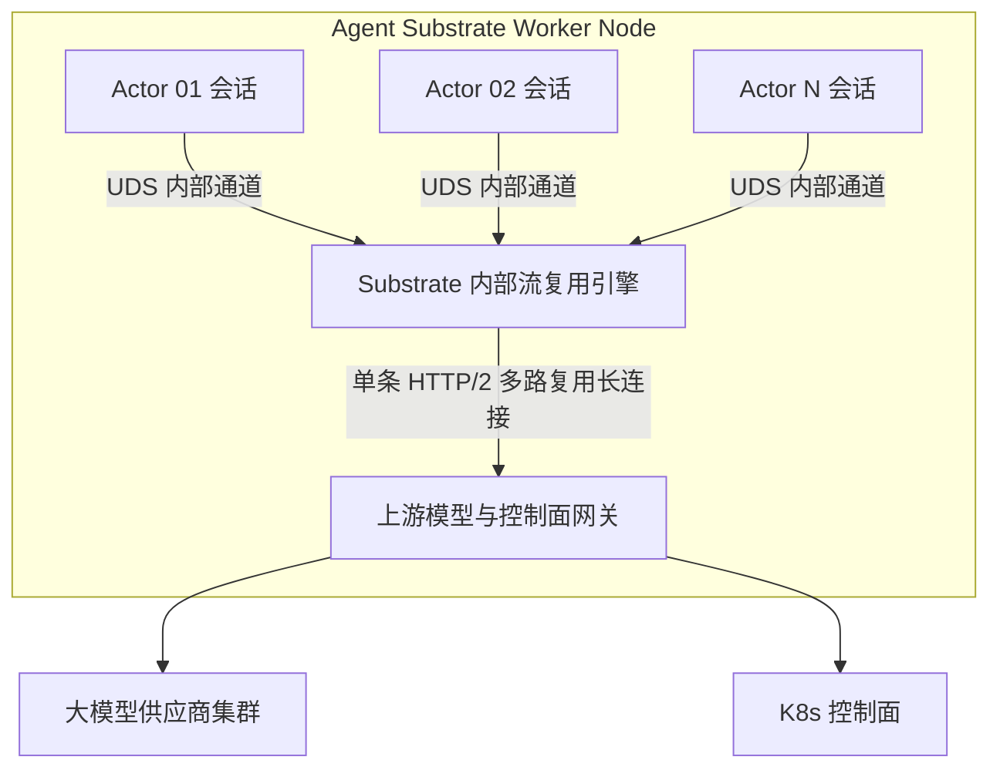

**TL;DR：** 传统 Kubernetes 之所以无法承载大规模 AI Agent，核心矛盾在于“容器隔离层级太粗”：**Pod 是操作系统进程级的粗粒度包装，天然无法适应高并发、低活跃比、状态高度动态的突发 Actor**。Google AX 的突破性核心底座是 **Agent Substrate** —— 一个常驻节点的超融合密集运行时。它在物理上彻底解耦了“Agent 会话”与“Kubernetes Pod”的一对一绑定，将单个庞大的底层 Worker Pod 转化为一个**高密度 Actor 多路复用池（Actor Multiplexing Pool）**。在内部，Agent Substrate 采用“事件驱动异步协程引擎 + Linux cgroups v2 动态子目录切片”的双层资源拓扑：当 Agent 处于计算期时，为其动态挂接微秒级 CPU 配额切片；当 Agent 陷入模型推理或外部 I/O 阻塞时，调度器就地交出物理线程并剥离 CPU 计数，仅保留微量堆上下文。通过这一架构，单个节点承载的活跃 Agent 数量从原生的 30~50 个瞬间跃升至 **500~1000 个**，不仅将服务器 CPU 实际利用率从 3% 提升至 60% 以上，更实现了企业级 Agent 集群在规模化并发下的成本跳水。

---

## 一、 核心痛点：为什么传统的“一 Pod 一 Agent”会遭遇密度死锁？

在深入 Agent Substrate 源码机理之前，我们先通过一组物理数字量化传统 Kubernetes 在多 Agent 场景下的**“密度死锁（Density Deadlock）”**：

假设一个 64 核 256GB 内存的标准生产节点：
- 如果运行传统微服务（如 Java/Go RPC），每个 Pod 持续承载稳定 QPS，节点塞入 30 个 2 核 Pod，整机 CPU 跑在 60%~75%，属于极佳的健康水准。
- 但如果运行 30 个 AI Coding Agent Pod：
  - 每个 Agent 的挂钟生命周期为 30 分钟；
  - 在这 30 分钟内，Agent 真正调用本地编译器、运行 Python 脚本或执行本地 Git 操作的**真实计算时间累计不足 2 分钟**；
  - 剩余 **28 分钟**，Agent 都在挂起等待：等待大模型逐字吐出 4000 个 Token（耗时 20s）、等待外部 API 返回、等待研发人员在前端点击“确认重构”。

```
传统 K8s Pod 资源占用透视：
┌────────────────────────────────────────────────────────────────────────┐
│ 节点物理 CPU 配额 (64 Cores)                                            │
├──────────────┬──────────────┬──────────────┬──────────────┬────────────┤
│ Pod-1 (2C)   │ Pod-2 (2C)   │ Pod-3 (2C)   │ ...          │ Pod-30 (2C)│
│ [95% 时间空转]│ [95% 时间空转]│ [95% 时间空转]│              │ [95%空转]  │
└──────────────┴──────────────┴──────────────┴──────────────┴────────────┘
实际整机有效 CPU 利用率：(2 min / 30 min) * 100% ≈ 6.6% ！
```

平台工程师如果尝试**“超卖（Overcommit）”**：把 CPU Requests 设为 0.1 核，Limits 设为 4 核。
- 致命后果立刻显现：当 10 个 Agent 偶发同时触发本地单元测试或构建时，节点瞬间触发 **CPU 剧烈争抢（Throttling）**，导致所有正在运行的测试超时崩溃；
- 更严重的是内存超卖：Agent 在执行 Python 脚本或构建静态资源时内存会出现瞬时突发，直接触发 Linux 内核的 **OOM Killer**，将无辜的邻居 Agent 进程就地绞杀。

**根因在于：Kubernetes 原生调度器（kube-scheduler）是以 Pod 为不可分割粒度的静态配额分配器，它完全无法感知 Agent 内部以秒级、毫秒级为周期的“活跃-静默”交替脉冲。**

---

## 二、 Agent Substrate 的分层架构解密

为了粉碎这一死锁，Google 团队抽离出了 **Agent Substrate**。它的本质是：**在 Kubernetes 节点之上，构建专门针对 Agent 工作负载的“第二层轻量级微调度器”**。

```
                  ┌────────────────────────────────────────────────────────┐
                  │          Agent Substrate 物理与逻辑双层架构            │
                  └────────────────────────────────────────────────────────┘
                                              │
    [ Kubernetes 集群视角 ]                   │  (只看到极少量的静态 Worker Pod)
    ┌─────────────────────────────────────────▼────────────────────────────────────────┐
    │  Kubelet Daemon                                                                  │
    │    └── 托管静态 DaemonSet Pod: `agent-substrate-worker` (配额: 32C / 128GiB)       │
    └─────────────────────────────────────────┬────────────────────────────────────────┘
                                              │
    [ Agent Substrate 内部视角 ]              │  (内部高密托管数百个动态 Agent Actor)
    ┌─────────────────────────────────────────▼────────────────────────────────────────┐
    │  agent-substrate-worker 核心进程                                                  │
    │                                                                                  │
    │   ┌──────────────────────────────────────────────────────────────────────────┐   │
    │   │  Actor Supervisor & Dispatcher (轻量级协程与事件循环)                      │   │
    │   │  • 活跃 Actor 注册表 (Active Registry: 500+ Sessions)                     │   │
    │   │  • I/O 多路复用等待队列 (Waiting Queue: 监听 gRPC / LLM SSE / Webhook)     │   │
    │   └───────────────────────┬──────────────────────────────────────────────────┘   │
    │                           │ 派发就绪 Actor                                       │
    │                           ▼                                                      │
    │   ┌──────────────────────────────────────────────────────────────────────────┐   │
    │   │  Dynamic cgroups v2 Controller (动态资源切片控制器)                       │   │
    │   │  • 计算活跃期: 挂载到 /sys/fs/cgroup/ax/actors/{id} (cpu.max = 200000)   │   │
    │   │  • 静默等待期: 动态写回 cpu.max = 0 (完全剥离调度权重)                     │   │
    │   └───────────────────────┬──────────────────────────────────────────────────┘   │
    │                           │ 沙箱边界注入                                         │
    │                           ▼                                                      │
    │   ┌──────────────────────────────────────────────────────────────────────────┐   │
    │   │  gVisor Micro-Sandbox Pool (轻量级用户态沙箱实例池)                       │   │
    │   │  ┌───────────────────────┐             ┌───────────────────────┐         │   │
    │   │  │ Actor-001 (Sentry 内核)│             │ Actor-089 (Sentry 内核)│   ...   │   │
    │   │  │  • 隔离工作区文件系统 │             │  • 隔离工作区文件系统 │         │   │
    │   │  └───────────────────────┘             └───────────────────────┘         │   │
    │   └──────────────────────────────────────────────────────────────────────────┘   │
    └──────────────────────────────────────────────────────────────────────────────────┘
```

### 1. 宿主解耦：将 Worker Pod 作为弹性资源池
在 Agent Substrate 模式下，Kubelet 不再频繁创建、销毁 Pod。
- 集群管理员只需预先在每个计算节点上通过 DaemonSet 部署 1~2 个大型的 **`agent-substrate-worker` 容器**（例如声明 32 核 128GB）。
- Kubelet 只负责保障该 Worker 进程本身的健康；
- 所有提交到集群的 `Task`（即一个个独立的 Agent），直接被 AX 控制器下发给这个常驻的 Worker，转化为其内部受管的 **Actor 实例**。

### 2. 双层调度模型（Two-Tier Scheduling）
- **L1 调度（宏观）**：Kubernetes 的 `ax-controller-manager` 负责将新的 `Task` 路由到拥有足够内存余量的节点 Worker 上。
- **L2 调度（微观）**：节点内的 `Agent Substrate` 运行时接管该 Task。它不依赖 Linux 原生线程一对一映射，而是基于 **Tokio 异步协程池（Async Task Pool）** 管理 Agent 的思维流、工具回调与网络监听。

---

## 三、 动态 cgroups v2 切片：微秒级资源抢占与回收

Agent Substrate 能够在单个 Worker 内部支撑数百个执行任意命令的 Agent，最硬核的技术在于它对 **Linux cgroups v2 统一层次结构（Unified Hierarchy）** 的动态操控。

### 1. 传统 cgroups 的静态死板
在标准 Docker/containerd 中，容器启动时由底层 shim 写入 `/sys/fs/cgroup/system.slice/.../cpu.max`。一旦分配了配额，不管进程是否在 sleep，cgroup 控制器都为其维持核算状态机，无法将配额瞬时让渡给真正饥饿的计算进程。

### 2. Substrate 的“呼吸式”动态配额控制器
Agent Substrate 内置了一个由内核事件驱动的 **动态 cgroups 控制器**。每一个被拉起的 Agent Actor，在宿主机 cgroups v2 目录树下拥有一个动态子控制组：

```text
/sys/fs/cgroup/ax-worker.slice/
  ├── cgroup.subtree_control (+cpu +memory +io)
  ├── actor-001/
  │     ├── cpu.max          # 动态可变！
  │     ├── memory.high      # 弹性内存防线
  │     └── memory.max       # 硬性 OOM 边界
  └── actor-002/
        ├── cpu.max
        ├── memory.high
        └── memory.max
```

当 Actor 经历状态跃迁时，Substrate 的驱动逻辑如下：

```rust
// 伪代码：Agent Substrate 动态 cgroup 配额状态机
impl ActorLifecycleManager {
    pub async fn transition_to_active(&self, actor_id: &str) -> Result<()> {
        let cgroup_path = format!("/sys/fs/cgroup/ax-worker.slice/{}/cpu.max", actor_id);
        // 瞬间赋予 2 核突发算力配额 (200,000 / 100,000)
        tokio::fs::write(&cgroup_path, "200000 100000").await?;
        Ok(())
    }

    pub async fn transition_to_waiting(&self, actor_id: &str) -> Result<()> {
        let cgroup_path = format!("/sys/fs/cgroup/ax-worker.slice/{}/cpu.max", actor_id);
        // 仅保留微量保活权重，剥离绝大部分调度配额，彻底让出 CPU
        tokio::fs::write(&cgroup_path, "1000 100000").await?;
        Ok(())
    }
}
```

```
           Actor 状态跃迁与 cgroups 配额动态伸缩时序

     [ Agent 发起模型推理 ]                [ LLM 首包 Token 到达 ]
              │                                      │
              ▼                                      ▼
    状态变更为 WAITING                     状态变更为 ACTIVE
    Substrate 写入 cpu.max = 1000          Substrate 写入 cpu.max = 200000
    释放 99.5% CPU 调度周期                恢复完整双核计算算力
    ──────────┬──────────────────────────────────────┬─────────────► 时间轴
              │                                      │
              └───────── 处于极致休眠态 ──────────────┘
                         节点 CPU 占用 ≈ 0%
```

这种被业界称为**“呼吸式配额（Breathing cgroups）”**的机制，确保了哪怕节点上同时挂起 800 个 Agent，宿主机的 CPU 负荷也近乎于零；而只要某一个 Agent 需要执行 `cargo build` 或 `pytest`，它瞬间就能获得满血的物理核心性能。

---

## 四、 进程与内存隔离机制：轻量 Actor 如何运行任意 Shell？

很多人会产生疑问：*如果多个 Agent 共享一个底层 Worker 进程，那某个 Agent 执行 `rm -rf /` 或者执行死循环，会不会把 Worker 搞崩？*

答案是：**Agent Substrate 共享的是调度与资源池，绝不共享操作系统用户空间！**

### 1. gVisor Sentry 微沙箱化
每个由 Substrate 派生的 Actor，虽然由同一个父进程进行生命周期调度，但其执行代码与 Shell 的底层运行环境被深深封装在 **独立的用户态内核（gVisor Sentry）** 之中：

```
                    ┌──────────────────────────────────────────────┐
                    │      Agent Substrate 的沙箱多实例隔离架构    │
                    └──────────────────────────────────────────────┘
                                           │
  ┌────────────────────────────────────────▼────────────────────────────────────────┐
  │ 物理宿主机 Linux 内核 (Host Kernel)                                             │
  └────────────────────────────────────────┬────────────────────────────────────────┘
                                           ▲ (仅放行不可绕过的基础系统调用: futex/epoll)
                                           │
  ┌────────────────────────────────────────┼────────────────────────────────────────┐
  │  gVisor runsc 隔离边界 (Ring 3 用户态) │                                        │
  │                                        │                                        │
  │   ┌───────────────────────────────┐    │   ┌───────────────────────────────┐    │
  │   │  Actor-A: Sentry 内核         │    │   │  Actor-B: Sentry 内核         │    │
  │   │  • 专有虚拟文件系统 (VFS2)    │    │   │  • 专有虚拟文件系统 (VFS2)    │    │
  │   │  • 独立进程树 (PID 1 ~ PID N) │    │   │  • 独立进程树 (PID 1 ~ PID N) │    │
  │   │  • 隔离网络命名空间 (Netstack)│    │   │  • 隔离网络命名空间 (Netstack)│    │
  │   │  • 执行: rm -rf / (仅破坏沙箱)│    │   │  • 完全不受 A 的行为影响      │    │
  │   └───────────────────────────────┘    │   └───────────────────────────────┘    │
  └────────────────────────────────────────┴────────────────────────────────────────┘
```

- **文件系统隔离**：Actor-A 只能看见自己专属的挂载命名空间（挂载点映射到各自的 Workspace 目录）；
- **进程树隔离**：Actor 内部可以通过 `bash` 随意 `fork` 几百个子进程，在它自己的视角里它是 `PID 1`，但所有子进程在宿主机看来，全是由同一个 `runsc` 托管的用户态内存对象；
- **网络栈隔离**：Agent 内部发起的网络连接直接流经 gVisor 自带的用户态网络协议栈（Go-netstack），随后透明重定向到节点的 `ax-gateway-proxy`，物理宿主机的网卡和网络命名空间根本不暴露给 Agent。

---

## 五、 Actor 多路复用下的高并发通信模型

当节点内同时运行数百个 Actor 时，它们如何与外部的控制器及大模型网关高效通信？

传统模式下，每个 Pod 都需要开启独立的 gRPC / HTTP 客户端连接，导致网络连接数爆炸（Connection Flooding）。在 Agent Substrate 中，Google 引入了**连接合并代理（Connection Multiplexing Proxy）**：



1. **节点内零拷贝通信**：
   - Actor 与 Substrate 核心守护进程之间，不走 TCP Loopback，而是走高吞吐的 **Unix Domain Socket (UDS)** 或共享内存环形缓冲区（Shared Memory RingBuffer）；
2. **上游长连接池化**：
   - 无论节点内挂载了 10 个还是 500 个 Agent，Substrate 对外向大模型服务商（如 Google Vertex AI / OpenAI）发起请求时，统一走预建好的 **HTTP/2 或 HTTP/3 物理复用连接池**；
   - 彻底消除了频繁 TLS 握手的开销，将网络往返时延（RTT）损耗压制在微秒级别。

---

## 六、 架构师视角：Agent Substrate vs. Ray Actor 深入辨析

很多有分布式背景的工程师会问：*“Ray 也是做 Actor 调度的，Agent Substrate 和 Ray 有什么本质不同？”*

理解这两者的分水岭，是高级架构师面试中的绝佳加分项：

| 对比维度 | Ray Actor 架构 | Google Agent Substrate 架构 |
| :--- | :--- | :--- |
| **设计初心** | 分布式 Python 机器学习计算、参数服务器与状态维护 | **完全自主不可信 AI Agent 的云原生编排与长时执行** |
| **安全隔离能力** | **近乎为零**（多个 Actor 共享 Python 运行时与宿主权限） | **极强**（每个 Actor 强制运行在独立的 gVisor 用户态沙箱内） |
| **代码执行权限** | 仅运行预先定义好的可信 Python 函数与类 | **允许 Agent 执行任意外部生成的 Bash/Python/二进制代码** |
| **休眠资源释放** | 基于内存驻留，空闲时仍需占用常驻线程与显存 | **毫秒级挂起换出（Suspend）**，等待外部输入时 CPU 彻底归零 |
| **云原生对齐度** | 依赖自身 Raylet 与 GCS，与 K8s 调度体系存在两层隔阂 | **原生集成 K8s cgroups v2、CRD 与 OCI 容器运行时规范** |
| **工具生态集成** | 需手写 Python RPC 封装 | **原生集成 MCP（Model Context Protocol）与 Workspace 热装载** |

> **架构结论**：Ray 适合**“内部受信任的纯计算密集型分布式协同”**；而 Agent Substrate 才是专门解决**“不受信任、拥有外部系统交互权、处于不可预知空等周期”的自主智能体**的唯一工程解。

---

## 总结与专栏预告

通过深入剖析 Agent Substrate，我们终于解开了单机支撑千级 Agent 的底座秘密：
1. **解耦 Pod 与 Actor**：将 K8s 的粗粒度调度转化为超融合 Worker 内部的细粒度多路复用；
2. **动态 cgroups v2 配额切片**：用“呼吸式”资源供给彻底解决了计算突发与空转浪费的尖锐冲突；
3. **gVisor 微沙箱化**：在单进程池内实现了军工级的多租户安全隔离。

然而，还有一个至关重要的状态机环扣尚未揭晓：**当调度器决定将一个正在运行的 Agent 挂起时，它复杂的内存页、打开的文件描述符和进行中的 Bash 进程到底是如何在亚秒级（<1s）内无损冻结并随后毫秒级复苏的？**

下一篇，我们将深入内核快照机制的核心腹地：**《状态冻结机制：亚秒级 Suspend 与 Resume 的内存/磁盘快照第一性原理》**！

---

## 参考资料与权威出处

1. **Google AX Agent Substrate 架构规范**：[agentexecutor.io/docs/architecture/substrate](https://agentexecutor.io/docs/architecture/substrate)
2. **Linux Kernel cgroups v2 官方规范文档**：[kernel.org/doc/Documentation/cgroup-v2.txt](https://www.kernel.org/doc/Documentation/cgroup-v2.txt)
3. **Google gVisor 用户态内核（Sentry）实现原理解密**：[gvisor.dev/docs/architecture_guide/sentry/](https://gvisor.dev/docs/architecture_guide/sentry/)
4. **Tokio 异步事件调度器工程实践**：[tokio.rs/tokio/tutorial](https://tokio.rs/tokio/tutorial)
5. **Ray Distributed Actor 架构白皮书**：[docs.ray.io/en/latest/ray-core/actors.html](https://docs.ray.io/en/latest/ray-core/actors.html)
