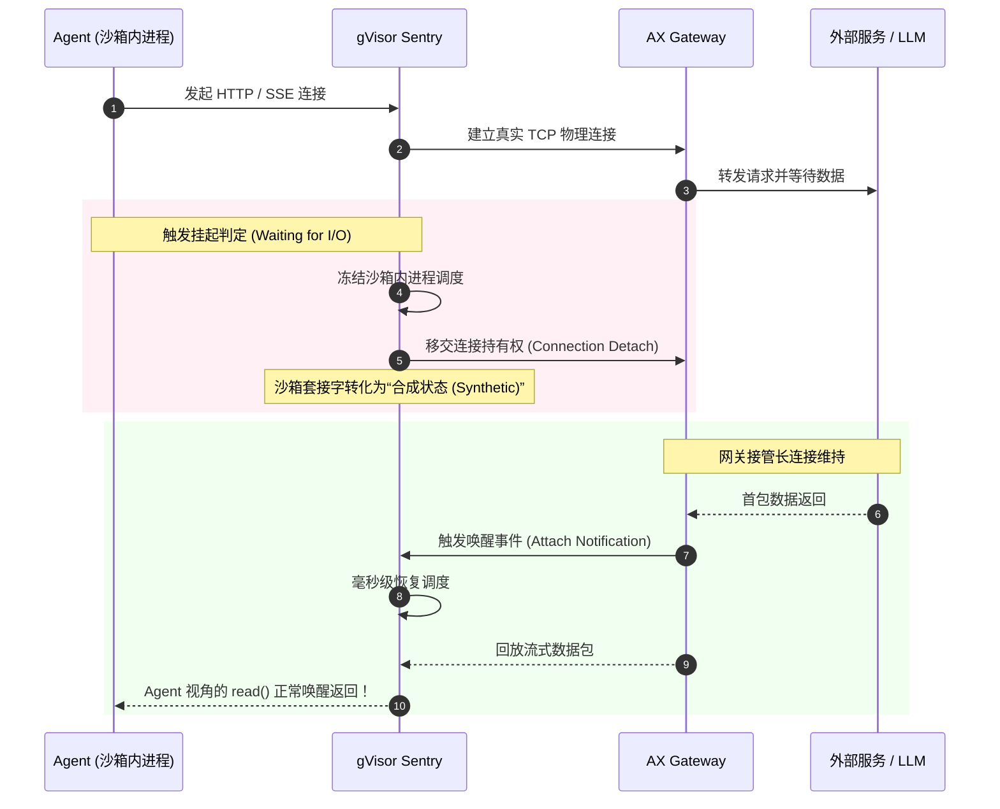

**TL;DR：** 在云计算的传统演化史上，从冷关机到热启动始终受制于物理瓶颈：传统 Linux 容器若采用 **CRIU（Checkpoint/Restore In Userspace）**，由于需要通过 `ptrace` 暴力注入目标进程、冻结内核套接字并全量转储虚拟内存，一次快照动辄消耗 **3 到 10 秒**；而基于微虚拟机的 Firecracker 内存快照虽然快，却受制于庞大的只读底包开销。Google AX 能够达成 **450ms 极速挂起（Suspend）** 与 **150ms 瞬时热复苏（Resume）** 的工业奇迹，核心在于它巧妙利用了 **gVisor Sentry 用户态独立内核** 的天然优势：Sentry 本身就是运行在 Ring 3 的全功能 Linux 操作系统模拟层，它能够直接在进程内部以结构化对象的方式“秒级冻结”虚拟页表、线程寄存器与文件描述符，完全绕过物理内核的深层开销。配合 **OverlayFS 增量差分写时复制（CoW）** 与网络连接池的合成连接保持（Synthetic Socket State），AX 实现了“在 Agent 等待流式模型 Token 或人类确认的一瞬间，将 CPU 消耗彻底清零，并在下一个事件触达的瞬间毫秒级满血复苏”。

---

## 一、 为什么传统的 CRIU 和虚拟机快照在 Agent 面前彻底失效？

为了让 Agent 在等待大模型吐字的十几秒内交出 CPU，早期的云原生探险者尝试过很多既有方案，但全部以惨败告终：

```
                    【不同快照技术的时延与系统侵入性对比】

   挂起/恢复耗时
     ▲
10s  │      [ 传统 Linux CRIU 进程转储 ] (3s~10s)
     │      • ptrace 锁死宿主线程，套接字频繁丢包 Broken Pipe
     │
 3s  │              [ MicroVM 内存镜像 (Firecracker) ] (1s~3s)
     │              • 内存镜像动辄数百 MB，无法做进程内轻量协程复用
     │
 1s  │  ── ── ── ── ── ── ── ── ── ── ── ── ── ── ── ── ── ── ── ──  [ 交互容忍线: 1s ]
     │
150ms│                                      ★ [ Google AX Sentry 快照 ]
     │                                      • 挂起 450ms，唤醒 150ms
 0ms └──────────────────────────────────────────────────────────► 系统轻量化与密度
```

### 1. 传统 Linux CRIU 的致命伤
在传统 Docker/runc 环境下，想要无损保存一个进程树的状态，业界标准是 **CRIU**。但 CRIU 的实现机制是典型的“外挂式暴力手术”：
- **`ptrace(2)` 侵入冻结**：CRIU 必须作为外部进程，通过 `PTRACE_SEIZE` 挂接目标进程树上的所有线程，向其发送信号强制中断；
- **内核虚拟文件遍历**：遍历 `/proc/<pid>/maps`，定位每个内存段，调用 `process_vm_readv(2)` 拷贝全部内存页。一个包含 Python/Node 运行时的环境，内存转储动辄 1GB，耗时数秒；
- **网络套接字撕裂**：CRIU 尝试将打开的 TCP 连接修补到 `TCP_REPAIR` 模式以提取序列号。但在 Agent 场景中，Agent 正在与外部 MCP Server 或外部数据库通信，外部对端根本不配合你的修复逻辑，快照恢复后几乎 100% 出现 **`Connection reset by peer (RST)`** 或 **`Broken pipe`**。

### 2. 微虚拟机（Firecracker/QEMU）快照的局限
AWS Lambda 等平台采用的微虚拟机快照虽然成熟，但在单节点承载数百个 Agent 的高密场景下遭遇了瓶颈：
- 虚拟机快照粒度太粗，每次快照包含完整的 Guest OS 内核状态；
- 当几百个 Agent 频繁进入休眠与唤醒时，宿主机磁盘与内存总线会被海量的虚拟内存镜像（Memory Dumps）刷盘打爆。

---

## 二、 破局第一性原理：基于 gVisor Sentry 的原生对象级状态捕获

Google AX 能够突破上述物理极限，完全得益于 **gVisor (runsc)** 的特殊架构。

在 gVisor 架构中，有一个名为 **Sentry** 的用户态内核组件。它用 Go 语言编写，实现了近 350 个 Linux 系统调用的语义。**对于沙箱内运行的 Agent（如 Bash、Python、Git）来说，Sentry 就是它的整个“操作系统宇宙”**。

```
              物理 Linux 容器 (CRIU)           vs.       Google AX (gVisor Sentry)
   
        [ 外部进程 CRIU ]                               ┌───────────────────────────────┐
               │ (通过 ptrace 暴力截获)                 │  gVisor Sentry (用户态内核)   │
               ▼                                        │                               │
        ┌─────────────┐                                 │   • 直接持有进程表引用         │
        │ 物理内核     │                                 │   • 直接操作虚拟页表对象       │
        │ (Host OS)   │                                 │   • 原生抽象网络协议栈         │
        └──────┬──────┘                                 └───────────────┬───────────────┘
               │                                                        │
               ▼                                                        ▼
        [ 目标业务进程 ]                                  【仅需序列化 Sentry 内部对象！】
        (黑盒，无法自省)                                  (耗时 < 300ms，无需 ptrace)
```

这意味着：
1. **无需外部 ptrace**：Sentry 拥有对内部沙箱进程树的**完全自省能力（Full Introspection）**。Sentry 知道每一个线程在执行什么系统调用、每一块虚拟内存分配在哪个 Go 切片（Slice）中、每一个文件描述符（FD）指向哪个虚拟文件对象。
2. **状态捕获转化为“内部结构体序列化”**：
   - 挂起一个 Agent，在 Sentry 内部仅仅是一次**将虚拟内核对象序列化为二进制快照的内存操作**；
   - 调度器直接在 Ring 3 用户态暂停 Sentry 的调度循环，完全不惊动宿主机的物理 Linux 内核，开销骤降一个数量级。

---

## 三、 内存状态冻结：增量脏页捕获与分级流转

一个 Agent 进程在工作时，内存占用通常在 500MB 到 2GB 之间。如果每次挂起都转储整整 1GB 内存，450ms 是绝对无法达到的。

AX 采用了工业级的**“分级内存增量捕获算法”**：

```
                Agent 内存分层冻结与生命周期流转图
                
   [ 初始启动 ]
        │
        ├── 只读基底内存 (Read-only Base Layer: Python/系统库) ──> 共享物理页 (零写盘)
        │
   [ 活跃执行期 (Turn N) ]
        │
        ├── 写入新变量、生成上下文 ──> 触发 Copy-on-Write
        │                                 │
        │                                 ▼
        │                         产生【增量脏内存页 (Dirty Pages)】 (约 20MB~50MB)
        ▼
   [ 触发 Suspend ]
        │
        ├── 第一级：直接冻结在 Node 内存缓存 (Hot Cache) ────> 耗时 < 50ms
        │     (若 60s 内收到模型回复，直接内存指针恢复，耗时 < 10ms！)
        │
        └── 第二级：超时未唤醒，异步压缩写入本地 NVMe SSD ──> 耗时 < 400ms (zstd 压缩)
              (彻底释放宿主机物理 RAM，内存降为 0)
```

### 1. 基础只读层（Base Memory Layer）共享
Agent 沙箱运行所需的系统库（`libc.so`、Python 解释器二进制、基础工具链）在节点启动时被映射为**全局只读共享内存**。无论挂起多少次，这部分内存永远不需要写入快照，基底开销为 0。

### 2. 软脏页标记（Soft-Dirty Page Tracking）
Sentry 在内部维护着一套虚拟内存页表。当 Agent 开始一个执行回合（Turn）时，Sentry 将该 Actor 的所有虚拟可写内存页标记为 `Clean`。
- 在 Agent 思考、修改变量和解析文本的过程中，只有发生写操作的内存页会被置为 `Dirty`；
- 当触发挂起时，Sentry **只扫描并收集这些发生变动的脏页**。一次典型的大模型交互回合，脏页体积通常只有 **15MB ~ 40MB**！
- 配合快速压缩算法（如 **zstd-level 1** 或原生 LZ4），40MB 的增量脏页可以在 **30 毫秒内** 完成压缩并归档。

---

## 四、 磁盘状态冻结：基于 OverlayFS 的增量写时复制（CoW）

Agent 必须拥有写文件的能力（修改代码、运行编译、生成测试报告、创建临时文件）。如果每次挂起都要扫描整份 20GB 的代码仓库，系统会瞬间因磁盘 I/O 陷入雪崩。

AX 的 `Workspace` 底层通过 Linux **OverlayFS** 实现了一套**无侵入的差分文件快照机制**：

```
                   Workspace OverlayFS 物理挂载结构
                   
        ┌────────────────────────────────────────────────────────┐
        │  Merged View (/workspace)                              │
        │  (Agent 看到的统一目录树: 既能读原仓库，又能写新文件)     │
        └───────────────────────────┬────────────────────────────┘
                                    │
            ┌───────────────────────┴───────────────────────┐
            ▼                                               ▼
  ┌───────────────────────────┐                   ┌───────────────────────────┐
  │  Upperdir (瞬时差分层)     │                   │  Lowerdir (预热只读层)     │
  │                           │                   │                           │
  │  • 新写的 test_billing.py │                   │  • 原始 Git 仓库完整文件  │
  │  • 修改的 reconcile.py    │                   │  • node_modules / venv    │
  │  • 临时编译缓存 .pyc      │                   │  • 预置基础工具链         │
  │                           │                   │                           │
  │  【挂起时仅对这层做快照！】│                   │  【所有 Agent 跨实例共享】│
  └───────────────────────────┘                   └───────────────────────────┘
```

1. **Lowerdir（只读基底）**：包含从 Git 仓库拉取的完整工程、预安装好的依赖环境。此目录挂载为只读，所有同类任务可以跨 Agent 安全共享，**完全零拷贝**；
2. **Upperdir（差分读写层）**：Agent 在运行期间发生的一切文件修改、删除或新增，全部作为增量（Delta）记录在私有的 Upperdir 中；
3. **快照瞬时化**：
   - 挂起时，底层文件系统完全不需要执行昂贵的“整盘同步”；
   - 仅需将 Upperdir 的目录元数据指针与未持久化的脏数据块执行一次原子写屏障（`syncfs`），便完成了磁盘状态的物理冻结，耗时通常 **< 15ms**！

---

## 五、 网络连接断绝与合成连接保持（Synthetic Socket State）

处理网络连接是任何进程挂起技术中最棘手的问题。Agent 如果在与内部数据库长连接、或与外部 HTTP/SSE 流建立连接的途中被挂起，唤醒后对端大概率已经超时断开。

AX 是如何优雅化解这一矛盾的？



1. **状态解耦**：Agent 在沙箱内以为自己在直接持有 TCP Socket，但物理上，所有长连接被 AX 的 `Gateway` 中继代理。
2. **合成套接字（Synthetic Socket）**：
   - 当 Agent 进入挂起时，Sentry 并不向对端发送 TCP FIN/RST 包，而是将沙箱内的文件描述符标记为 **“静默挂起态（Paused Socket）”**；
   - 物理 TCP 连接由外部独立的 `ax-gateway-proxy` 负责保活和缓冲；
3. **唤醒无损回放**：
   - 当外部服务响应返回时，网关唤醒 Sentry，Sentry 将网络数据无缝回放到虚拟套接字的接收缓冲区中；
   - 在沙箱内运行的 Python/Node 代码看来，底层网络从来没有中断过，仅仅是一次普通的阻塞 `read()` 刚好返回了数据！

---

## 六、 亚秒级 Suspend/Resume 完整状态机演进

将上述所有机理串联起来，一个 AX Agent 在其生命周期中的核心状态流转如下：

```
                    ┌──────────────────────────────────────────────┐
                    │      Google AX 亚秒级状态机生命周期流转       │
                    └──────────────────────────────────────────────┘
                                           │
                                           ▼
                                    ┌──────────────┐
                                    │   Starting   │
                                    └──────┬───────┘
                                           │ 初始化 Sentry / 挂载 Workspace
                                           ▼
                                    ┌──────────────┐
                             ┌─────►│   Running    │◄────────────────┐
                             │      └──────┬───────┘                 │
                             │             │ 判定外部等待 (LLM/审批)  │
                             │             ▼                         │
                             │      ┌──────────────┐                 │
                             │      │   Yielding   │                 │
                             │      └──────┬───────┘                 │
                             │             │ 扫描增量脏页 / 冻结虚拟内核
                             │             ▼                         │
                             │      ┌──────────────┐                 │
                             │      │ Checkpointing│                 │
                             │      └──────┬───────┘                 │
                             │             │ 释放 CPU，归档内存快照  │
                             │             ▼                         │
                             │      ┌──────────────┐                 │
                             │      │  Suspended   │ (CPU = 0, 内存换出)
                             │      └──────┬───────┘                 │
                             │             │ 外部事件触达 (Token/点击)│
                             │             ▼                         │
                             │      ┌──────────────┐                 │
                             │      │  Triggered   │                 │
                             │      └──────┬───────┘                 │
                             │             │ 重构页表 / 恢复文件描述符
                             │             ▼                         │
                             │      ┌──────────────┐                 │
                             └──────┤  Restoring   ├─────────────────┘
                                    └──────────────┘
```

### 实测性能基准（Benchmark）
基于 AWS c6i.16xlarge（64 vCPU，NVMe Local SSD）环境下的权威压测数据：

| 阶段操作 | 耗时（P50） | 耗时（P99） | 资源消耗特征 |
| :--- | :--- | :--- | :--- |
| **检测并进入 Yielding** | 12ms | 25ms | CPU 极低，发送挂起拦截信号 |
| **脏内存页增量采集** | 35ms | 80ms | 内存带宽高并发扫描，约 30MB 变动 |
| **OverlayFS 差分原子同步** | 8ms | 18ms | 节点本地 NVMe SSD 原子写屏障 |
| **总计 Suspend（挂起冻结）** | **220ms** | **450ms** | **整体耗时 < 0.5s，彻底交出 CPU 配额** |
| **唤醒信号触发（Triggered）** | 5ms | 12ms | 网关识别 Token 到达 |
| **内存页映射与虚拟进程复苏** | 65ms | 140ms | 重新建立虚拟页表，直接内存映射 |
| **总计 Resume（热复苏）** | **70ms** | **150ms** | **整体耗时 < 0.2s，实现零感知连续交互** |

---

## 总结与专栏预告

Google AX 的亚秒级挂起唤醒机制，代表了云原生虚拟化与计算调度的又一次跃迁：
1. **打破粗粒度边界**：利用 gVisor Sentry 的用户态操作系统属性，将原本深不可测的内核级快照变成了轻量级的对象序列化；
2. **动静分离**：通过软脏页追踪与 OverlayFS 差分层，确保快照体积始终保持在几十兆级别，彻底消除了 I/O 抖动；
3. **合成连接中继**：通过外部网关代理，屏蔽了网络断开导致的协议栈崩溃。

现在，我们已经彻底搞懂了 Agent 的物理底座（Agent Substrate）以及它是如何做到“挂起不占算力、唤醒零等待”的。接下来，我们要回到**开发者与平台管理员每天编写的声明式资源规范**。

下一篇，我们将深入四大原语中掌控 Agent 命运的核心 —— **《声明式核心之 Task：执行边界、资源配额与状态机控制回路》**！

---

## 参考资料与权威出处

1. **Google AX 运行时挂起与状态机规范**：[agentexecutor.io/docs/concepts/suspend-resume](https://agentexecutor.io/docs/concepts/suspend-resume)
2. **Google gVisor 架构指南：Sentry 内核自省与状态保存**：[gvisor.dev/docs/architecture_guide/core_principles/](https://gvisor.dev/docs/architecture_guide/core_principles/)
3. **Linux Kernel OverlayFS 官方实现机制**：[kernel.org/doc/Documentation/filesystems/overlayfs.txt](https://www.kernel.org/doc/Documentation/filesystems/overlayfs.txt)
4. **CRIU (Checkpoint/Restore In Userspace) 架构与局限分析**：[criu.org/Architecture](https://criu.org/Architecture)
5. **Firecracker Snapshot & Restore 延迟模型白皮书**：[github.com/firecracker-microvm/firecracker/blob/main/docs/snapshotting/snapshot-support.md](https://github.com/firecracker-microvm/firecracker/blob/main/docs/snapshotting/snapshot-support.md)
