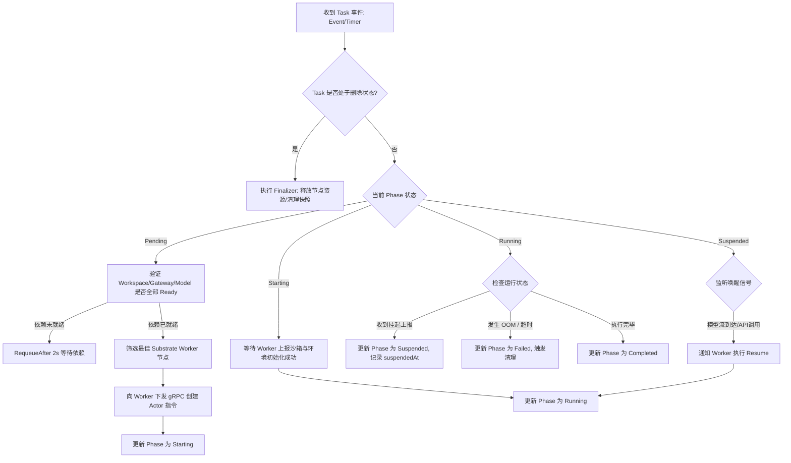

**TL;DR：** 在 Google AX 架构中，如果说 `Agent Substrate` 是承载算力的血肉，那么 **`Task` 原语就是掌管 Agent 命运的灵魂中枢**。不同于传统 Kubernetes 中粗放的 `Pod` 或仅仅执行完即退出的 `Job`，`Task` 是专为**多回合、异步突发、需要挂起恢复且伴随工具交互**的自主智能体量身定制的自定义资源（CRD）。`Task` 规范精确约束了 Agent 的**执行指令、安全沙箱类型、生命周期钩子（`preRun` / `postRun`）、超时熔断阈值**，以及通过 Linux **cgroups v2 严格换算的 CPU/内存双层配额**。在控制面，`ax-controller-manager` 运行着高抗并发的**声明式调和循环（Reconcile Loop）**：它时刻比对 etcd 中的期望状态与底层节点 Substrate 上报的真实 Actor 状态，优雅处理节点宕机、内存 OOM 熔断、工具死循环驱逐与跨回合状态推进。深入理解 `Task` 的设计规范与控制回路，是掌握云原生企业级多智能体系统工程治理的必经之路。

---

## 一、 重新思考执行抽象：为什么有了 Pod 和 Job 还需要 Task？

在 Kubernetes 原生生态中，我们已经拥有了管理长期服务的 `Deployment/Pod`，以及管理一次性计算的 `Job`。为什么 Google AX 必须在 `ax.io/v1alpha1` API 组中独创一个 `Task` 原语？

```
                         Kubernetes 三大计算实体模型对比
                         
  [ Deployment / Pod ]       [ K8s Job / Batch ]         [ Google AX Task ]
  ┌──────────────────┐       ┌──────────────────┐        ┌──────────────────┐
  │ 长期运行微服务   │       │ 一次性批处理任务 │        │ 自主 AI 智能体   │
  │ • 无状态或外挂盘 │       │ • 跑满算力算完即死│       │ • 多回合复杂交互 │
  │ • 毫秒级请求响应 │       │ • 无中间挂起休眠 │        │ • 80% 时间空等   │
  │ • 被杀直接重新拉 │       │ • 失败全量重算   │        │ • 亚秒级挂起换出 │
  └──────────────────┘       └──────────────────┘        │ • 伴随工作区状态 │
                                                         └──────────────────┘
```

1. **Pod 无法表达“挂起休眠（Suspension）”**：
   - K8s Pod 的生命周期状态（`Pending` -> `Running` -> `Succeeded` / `Failed`）是单向向前的；
   - Pod 根本没有“进程暂停、交出 CPU 调度权、原地等待外部 Token 唤醒”的合法状态定义。如果强行把 Pod 停止，其网络端点会被摘除，内存会被清空。
2. **Job 无法容纳“多回合交互（Multi-turn Interaction）”**：
   - K8s Job 假设任务是确定性的批处理流水线（Batch Pipeline）。
   - 但 Agent 的行为高度非确定：它可能会思考 5 步、调用 3 次工具、挂起等待人类审批 10 分钟，然后再继续执行。如果把 Agent 当成 Job，一旦发生阶段性阻断，整个 Job 就会陷入超时失败。
3. **Task 破茧而出**：
   - `Task` 原语的诞生，为分布式系统补全了**第三种生命周期语义**：它将“指令（Instructions）”、“环境挂载（Workspace）”、“网络门禁（Gateway）”和“模型算力（Model）”作为一等公民装配在一起，原生支持多回合状态机的持久化与恢复。

---

## 二、 `Task` 规范全解：一份生产级 CRD 声明的解剖学

在实际生产中，一个定义严密的 `Task` 清单如下所示：

```yaml
apiVersion: ax.io/v1alpha1
kind: Task
metadata:
  name: security-audit-agent-409
  namespace: security-team
  labels:
    tier: production
    agent-type: code-vulnerability-scanner
spec:
  # 1. 外部依赖绑定
  workspaceRef:
    name: main-repo-cache
  gatewayRef:
    name: zero-trust-internal-gw
  modelRef:
    name: gemini-2-5-pro

  # 2. 安全与沙箱配置
  securityContext:
    sandbox: gVisor
    runAsUser: 10001
    readOnlyRootFilesystem: false # 根文件系统是否只读 (工作区挂载在 /workspace)

  # 3. 资源配额 (精准映射 cgroups v2)
  resources:
    requests:
      cpu: "500m"
      memory: "1Gi"
    limits:
      cpu: "4"
      memory: "8Gi"

  # 4. 生命周期钩子 (Lifecycle Hooks)
  lifecycle:
    preRun:
      - name: verify-git-integrity
        command: ["git", "status", "--porcelain"]
    postRun:
      - name: generate-sarif-report
        command: ["python", "/tools/export_sarif.py", "--output", "/workspace/report.sarif"]

  # 5. 核心业务指令
  instructions: |
    全面扫描 /workspace 目录下的 Go 源码：
    1. 检测是否存在 SQL 拼接注入和未经过滤的外部反序列化路径；
    2. 生成符合 SARIF 规范的漏洞审计清单；
    3. 如果发现高危漏洞，在本地生成修复补丁分支。

  # 6. 超时与重试策略
  timeoutSeconds: 7200           # 单任务最大挂钟时间上限 (2小时)
  maxTurnCount: 50               # 限制最大工具交互回合数，防止死循环刷爆账单
  restartPolicy: OnInfraFailure  # 仅在基础设施故障(节点宕机/沙箱崩溃)时重试，逻辑错误不重试
```

### 关键字段的物理映射法则

1. **`resources` 与 cgroups v2 的精确换算**：
   - `requests.cpu: "500m"` -> 映射到宿主机对应 Actor cgroup 的 `cpu.weight`（权重相对份额，保证基础底线）；
   - `limits.cpu: "4"` -> 换算为 `cpu.max = 400000 100000`（每 100ms 周期最多使用 400ms CPU 时间，允许瞬间计算突发）；
   - `limits.memory: "8Gi"` -> 写入 `memory.max = 8589934592`（硬性上限，防爆物理机）；
   - 此外，AX 会自动注入 `memory.high`（通常为 Limits 的 85%），当 Agent 内存逼近阈值时，Linux 内核会主动抑制该 Actor 的分配速率并触发页面回收，**而不是暴力直接 SIGKILL**。
2. **`lifecycle` 钩子设计**：
   - `preRun`：在 Agent 主思维循环启动前执行。常用于校验依赖完整性、解密轻量凭证，**如果 preRun 失败，Task 直接置为 Failed，绝不消耗任何昂贵的大模型 Token**；
   - `postRun`：当 Agent 宣布工作结束或输出最终答案后执行。用于归档产物（Artifacts）、生成日志摘要或清理临时缓存。
3. **`maxTurnCount`（防死循环安全阀）**：
   - 许多自主 Agent 由于大模型幻觉，容易在“执行报错 -> 尝试修改 -> 依然报错”之间陷入永无止境的震荡循环；
   - `maxTurnCount` 从调度器层级强制切断失控 Agent，保障集群财务安全。

---

## 三、 控制面中枢：`ax-controller-manager` 的调和循环（Reconcile Loop）

`Task` 从提交到运行，其背后的 `ax-controller-manager` 遵循与 Kubernetes 标准 Controller 完全一致的**水平触发（Level-Triggered）**调和哲学，但其状态机流转却远比普通控制器复杂。



### 控制器核心调和逻辑的源码逆向（Go 伪代码）

```go
func (r *TaskReconciler) Reconcile(ctx context.Context, req ctrl.Request) (ctrl.Result, error) {
    task := &axv1alpha1.Task{}
    if err := r.Get(ctx, req.NamespacedName, task); err != nil {
        return ctrl.Result{}, client.IgnoreNotFound(err)
    }

    // 1. 处理删除逻辑 (Finalizer 保护机制)
    if !task.DeletionTimestamp.IsZero() {
        return r.finalizeTask(ctx, task)
    }

    // 2. 核心状态机驱动分支
    switch task.Status.Phase {
    case "":
        task.Status.Phase = axv1alpha1.TaskPhasePending
        return ctrl.Result{Requeue: true}, r.Status().Update(ctx, task)

    case axv1alpha1.TaskPhasePending:
        // 校验关联的 Workspace、Gateway、Model 存在且处于就绪态
        if err := r.validateDependencies(ctx, task); err != nil {
            r.Recorder.Event(task, "Warning", "DependencyNotReady", err.Error())
            return ctrl.Result{RequeueAfter: 2 * time.Second}, nil
        }
        
        // 调度：选择拥有最高缓存亲和性与内存余量的 Node Worker
        targetNode, err := r.selectBestWorkerNode(ctx, task)
        if err != nil {
            return ctrl.Result{RequeueAfter: 5 * time.Second}, err
        }

        // 下发 gRPC 绑定
        if err := r.substrateClient.DispatchActor(ctx, targetNode, task); err != nil {
            return ctrl.Result{}, err
        }

        task.Status.Phase = axv1alpha1.TaskPhaseStarting
        task.Status.AssignedNode = targetNode
        return ctrl.Result{}, r.Status().Update(ctx, task)

    case axv1alpha1.TaskPhaseRunning, axv1alpha1.TaskPhaseSuspended:
        // 检查全局挂钟超时
        if time.Since(task.CreationTimestamp.Time) > time.Duration(task.Spec.TimeoutSeconds)*time.Second {
            return r.terminateTaskWithTimeout(ctx, task)
        }
        // 周期性轮询与健康检查由底层 Worker 的长连接流回传状态触发
    }

    return ctrl.Result{}, nil
}
```

---

## 四、 异常与故障容错：当 Agent 崩溃时发生了什么？

在真实的分布式生产集群中，Agent 会遭遇各种千奇百怪的非正常死亡。AX 的 `Task` 控制器设计了极其严密的故障分流决策树：

```
                              Task 异常故障分流决策树
                              
                                [ 监测到 Actor 异常 ]
                                          │
                  ┌───────────────────────┼───────────────────────┐
                  ▼                       ▼                       ▼
            【内存 OOM 杀戮】        【工具无限死循环】       【底层物理节点宕机】
                  │                       │                       │
      检测 cgroups memory.events   检测超过 maxTurnCount     Worker 心跳超时丢帧
                  │                       │                       │
                  ▼                       ▼                       ▼
      区分是沙箱内还是宿主 OOM    控制器强制置为 Failed    触发 OnInfraFailure 策略
      • 记录退出码 137            • 拒绝扣费或重试          • 在其他节点无损复苏快照
      • 打印沙箱内存爆破栈        • 打印死循环工具轨迹      • 从云盘/缓存重载 Upperdir
```

### 1. 内存 OOM 的精准识别与归因
传统 K8s 中，一个容器被 OOM 杀死后，往往只在 Describe 中显示一个冷冰冰的 `OOMKilled: true`，研发根本无法分清是宿主机被打满还是内部进程超限。
- AX 的 Substrate 持续读取 `/sys/fs/cgroup/ax/actors/{id}/memory.events`；
- 当捕获到 `oom_kill` 事件时，Sentry 会在被销毁的前一刻捕获崩溃进程上下文，并明确写入 `Task.status.conditions`：
  ```yaml
  conditions:
    - type: Evicted
      status: "True"
      reason: ActorOOMKilled
      message: "Agent bash process (python) exceeded limit (8GiB). RSS peaked at 8.12GiB."
  ```

### 2. 状态机死锁与僵尸驱逐（Zombie Eviction）
如果 Agent 因为网络震荡、对端没有返回流式 Token，且自身代码没有设置客户端超时，它会不会在 `Suspended` 状态中挂起一万年？
- `Task` 控制器在启动时便在调度轮询队列中插入了一个带有 **全局绝对超时时间（`ActiveDeadlineSeconds`）** 的时间轮定时器；
- 一旦挂钟时间触顶，控制器主动越过当前 Actor，向宿主 Worker 发送 `SIGKILL_FORCE`，强行回收其在本地 SSD 上的 OverlayFS 差分层与临时快照，防止磁盘泄漏。

---

## 五、 状态自愈实战：`Task.status` 的完整生命周期字段透视

通过 `kubectl get task <id> -o yaml`，一个运行良好的 `Task` 呈现出如下清晰的生产级状态记录：

```yaml
status:
  phase: Running
  assignedNode: node-us-central1-09
  turnCount: 14                  # 已推进 14 个回合
  metrics:
    totalExecutionTimeMs: 18450  # 真实消耗 CPU 计算时间: 仅 18 秒！
    totalSuspendedTimeMs: 245000 # 挂起休眠时间: 4 分钟 (节点算力零浪费)
    totalTokensConsumed: 38400
    estimatedCostUsd: 0.115
  lastSuspendedTime: "2026-09-30T10:14:22Z"
  lastResumedTime: "2026-09-30T10:14:48Z"
  conditions:
    - type: Ready
      status: "True"
      lastTransitionTime: "2026-09-30T10:10:00Z"
    - type: WorkspaceMounted
      status: "True"
      lastTransitionTime: "2026-09-30T10:10:02Z"
    - type: GatewayEgressEnforced
      status: "True"
      lastTransitionTime: "2026-09-30T10:10:03Z"
```

注意这组数字的对比：
- **`totalExecutionTimeMs: 18450`（18 秒）** vs. **`totalSuspendedTimeMs: 245000`（245 秒）**；
- 在超过 4 分钟的总生命周期中，**真正的物理计算只发生了不到 20 秒**。在传统的 K8s 体系下，你必须为这 4 分钟全额付费；而在 AX 体系下，另外 90% 以上的空闲算力被彻底释放给了其他并发 Actor。

---

## 总结与专栏预告

通过本文的层层拆解，我们掌握了 `Task` 原语的全部精髓：
1. **打破粗放模型**：引入专为突发状态化智能体设计的生命周期模型；
2. **严密的资源配额与熔断**：将 cgroups v2 细粒度参数、生命周期钩子与防死循环阈值融为一体；
3. **高韧性控制器闭环**：通过声明式 Reconcile 循环屏蔽底层的故障与重启，确保生产运行的高可靠。

然而，细心的架构师一定会发现一个前置瓶颈：在 `Task` 启动的那一刻，代码仓库与依赖环境到底从何而来？**如果每个 Task 启动都要重新拉取一个几个 G 的代码库，那再快的调度也是空中楼阁。**

下一篇，我们将直击环境秒级组装的核心：**《声明式核心之 Workspace：代码仓库热装载与环境预热的第一性原理》**！

---

## 参考资料与权威出处

1. **Google AX Task 原语设计规范**：[agentexecutor.io/docs/reference/task-spec](https://agentexecutor.io/docs/reference/task-spec)
2. **Kubernetes API Machinery 与 Controller-Runtime 核心机制**：[github.com/kubernetes-sigs/controller-runtime](https://github.com/kubernetes-sigs/controller-runtime)
3. **Linux Kernel cgroups v2 memory.events 详解**：[kernel.org/doc/Documentation/cgroup-v2.txt](https://www.kernel.org/doc/Documentation/cgroup-v2.txt)
4. **Google gVisor 安全隔离模型与 OCI 运行时规范**：[gvisor.dev/docs/user_guide/compatibility/](https://gvisor.dev/docs/user_guide/compatibility/)
5. **Level-Triggered vs. Edge-Triggered Controllers in Cloud Native Systems**：[kubernetes.io/docs/concepts/architecture/controller/](https://kubernetes.io/docs/concepts/architecture/controller/)
