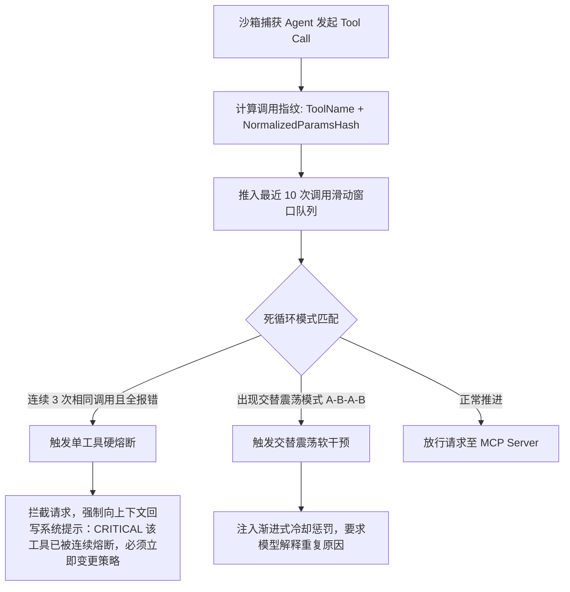

**TL;DR：** 随着 **Model Context Protocol (MCP)** 成为大模型与外部工具生态交互的事实标准协议，AI Agent 的能力边界得到了指数级扩展。然而，在以原生 Kubernetes 为代表的多租户生产集群中，散装的 MCP 架构迅速引发了**“进程风暴（Process Explosion）”**：如果一个节点运行 500 个 Agent，每个 Agent 绑定 5 个常规 MCP 服务（如 Git、Postgres、Filesystem、Brave Search、Slack），节点内将瞬间堆积 **2,500 个独立的 Python/Node 散装子进程**，仅 JSON-RPC 握手与空闲常驻内存就将吃光数百吉字节算力。Google AX 在业内首次将 MCP 作为一等公民深度纳入云原生治理体系：通过**“读写分流的共享服务守护池”**替代粗暴的子进程派生，结合 **`Workspace` 期的 Schema 预热缓存**与**跨会话长连接复用池**，将工具协商延迟彻底清零；更在网关层内置了**工具递归死循环熔断断路器（Circuit Breaker）**，从基础设施层筑牢了大规模 Agent 工具调用的可靠性护栏。

---

## 一、 进程风暴：散装 MCP 部署在生产集群中的灾难现场

在本地单机开发场景（如使用 Claude Desktop 或 Cursor 本地调试）中，MCP 的运行机制非常简单直白：客户端通过 `stdio`（标准输入输出）启动一个本地命令行工具（如 `npx -y @modelcontextprotocol/server-postgres`），两者通过 JSON-RPC 2.0 协议在标准管道中收发文本数据。

但当这种单机开发模型被直接照搬到拥有成百上千个 Agent 的生产 Kubernetes 集群时，**平台工程团队会立刻遭遇灾难性的“进程风暴”**：

```
                    【原生模式 vs. Google AX MCP 治理模型】

  原生模式 (每个 Agent 自行启动子进程):
  500 Agents × 5 MCP Servers = 2,500 个独立 Node/Python 进程！
  ┌──────────────┐     ┌──────────────┐     ┌──────────────┐
  │ Agent-1      │     │ Agent-2      │     │ Agent-500    │
  │ ├─ pg-mcp    │     │ ├─ pg-mcp    │     │ ├─ pg-mcp    │
  │ ├─ git-mcp   │     │ ├─ git-mcp   │     │ ├─ git-mcp   │
  │ └─ search-mcp│     │ └─ search-mcp│     │ └─ search-mcp│
  └──────────────┘     └──────────────┘     └──────────────┘
  • 消耗内存: 2,500 × 80MB ≈ 200 GB 纯损耗！
  • 每次启动协商 tools/list: 1.5s ~ 3s 延迟
  • 无法管控连接数与凭证扩散

  ─────────────────────────────────────────────────────────────

  Google AX 治理模式 (读写分流 + 节点级共享连接池):
  ┌────────────────────────────────────────────────────────────┐
  │ 节点级共享 MCP 守护进程池 (Node-Level MCP Pool)             │
  │ ┌─────────────────┐  ┌──────────────────┐  ┌─────────────┐ │
  │ │ Read-only DB-MCP│  │ Search-Proxy-MCP │  │ Git-Hub-MCP │ │
  │ └────────┬────────┘  └────────┬─────────┘  └──────┬──────┘ │
  └──────────┼────────────────────┼───────────────────┼────────┘
             ▲                    ▲                   ▲
             └──────────┬─────────┴─────────┬─────────┘
                        │ UDS 多路复用通道   │ Schema 预载
             ┌──────────┴───┐       ┌───────┴──────┐
             │ Agent Task 1 │  ...  │ Agent Task N │
             │ (仅挂载沙箱FS)│       │ (仅挂载沙箱FS)│
             └──────────────┘       └──────────────┘
  • 节点内存常驻: < 500 MB (下降 99%！)
  • 工具能力协商延迟: 0 ms (Workspace 预热期注入)
```

### 生产环境的三大核心危机
1. **内存与文件描述符枯竭（Resource Exhaustion）**：
   - 每个基于 Node.js 或 Python 编写的 MCP 服务，空载运行时内存至少占用 60MB ~ 120MB；
   - 2,500 个常驻子进程不仅直接吃掉 200GB 内存，还会持有着数以万计的管道句柄（Pipes）与套接字，直接触顶 Linux 系统的 `fs.file-max` 上限。
2. **每次唤醒的协议协商握手税（Handshake Tax）**：
   - 按照 MCP 规范，客户端在初次连上服务端后，必须依次完成：`initialize` 握手 -> 协议版本协商 -> `tools/list` 工具清单遍历；
   - 这套握手流程在复杂工具链下需要耗费 **1.5 ~ 3 秒**。若 Agent 在挂起唤醒后无法维持连接，每次回合都要重走握手，交互体验彻底断裂。
3. **数据库连接池被打爆（Connection Flooding）**：
   - 如果 500 个 Agent 的 `Postgres MCP` 各自向企业后台数据库发起直连，后台 PostgreSQL 瞬间涌入上千个活跃连接，直接引发数据库端连接池耗尽与锁雪崩。

---

## 二、 Google AX 的破解之道：读写分流的 MCP 治理拓扑

Google AX 没有采用一刀切的思路，而是从**“数据所有权与副作用隔离”**的第一性原理出发，对 MCP 服务进行了严格的**读写分流分级治理**：

```
                        Google AX 的 MCP 分级运行模型
                        
                                 [ 评估 MCP 服务类型 ]
                                           │
                    ┌──────────────────────┴──────────────────────┐
                    ▼                                             ▼
          【只读与外部 API 类】                         【具备本地文件写副作用类】
          (Read-Only & Gateway MCP)                     (Stateful / Sandboxed MCP)
                    │                                             │
                    ▼                                             ▼
       部署在【节点共享层 / 集群服务层】                封装在【Task gVisor 独立沙箱内部】
       • PostgreSQL Read-Only Inspector               • Local Filesystem MCP
       • Brave/Google Search MCP                      • Local Git Committer MCP
       • Jira / Slack API Proxy MCP                   • Terminal Bash Execution MCP
                    │                                             │
                    ▼                                             ▼
       通过 Unix Domain Socket (UDS) 多路复用          作为专属受限子进程，随沙箱生死
       连接池化，千个 Agent 共享单个实例                严格受限于 cgroups 与 gVisor 隔离
```

### 1. 节点共享级只读服务池（Node-Shared MCP Pool）
- 对于不改变本地磁盘状态、纯粹提供外部查询或数据检索的工具（如查数据库表结构、查外部文档、查网络搜索），AX 将其托管在节点 `ax-system` 命名空间下的轻量 Daemon 守护池中；
- 多个并发运行的 Agent Task 通过挂载在 `/var/run/ax/mcp/` 目录下的 **Unix Domain Socket (UDS)** 接入共享服务；
- 节点内仅需常驻一个实例，便可轻松支撑几百个 Agent 的并发查询，数据库连接被严格约束在预建的连接池内。

### 2. 沙箱专属状态化工具（Sandboxed Stateful MCP）
- 对于必须对当前 Agent 的 `Workspace` 进行实际文件读写的工具（如 Filesystem MCP），AX 则将其直接注入到该 Agent 的 **gVisor 沙箱内部**；
- 确保这类拥有写权限的工具无法越界窥探其他 Agent 的文件，彻底封死租户间数据投毒与横向渗透的可能。

---

## 三、 Schema 预热与零延迟注入：终结握手等待

传统系统中最浪费时间的环节，是每次 Agent 启动都要通过 JSON-RPC 向 MCP Server 询问：“请问你支持哪些工具？参数结构是什么？”

AX 依托其前置的 `Workspace` 原语，实现了 **Schema 静态化与预热注入机制**：

```yaml
# 在 Workspace 中声明 MCP 工具集
apiVersion: ax.io/v1alpha1
kind: Workspace
metadata:
  name: billing-refactor-workspace
spec:
  tools:
    mcpServers:
      - name: pg-inspector
        transport:
          uds: "/var/run/ax/mcp/pg-inspector.sock"
        # 核心参数：开启编译期预热缓存
        prewarmSchemaCache: true
        toolFilter:
          - "list_tables"
          - "describe_table"
          - "explain_query"
          # 显式禁止 DROP、DELETE 等高危工具被模型感知
```

### 零延迟注入的工作原理
1. **预热期提取**：在 `Workspace` 初始化的数十毫秒内，Substrate 守护进程率先向 MCP 服务发起一次握手，拉取全部 `tools/list` 的 JSON Schema 定义；
2. **Schema 预过滤与安全裁剪**：通过 `toolFilter` 过滤掉不合规的工具，将合规工具规范预先编译为结构化只读缓存（Serialized Context Object）；
3. **注入沙箱上下文**：当 `Task` 正式启动时，这套工具 Schema 已经在 Agent 的系统 Prompt 与初始上下文（System Instruction）中**就绪可见**。Agent 发起初次思考时，完全不需要经过任何网络 I/O 握手，直接输出符合 Schema 的精准 Tool Call！

---

## 四、 生产防线：工具死循环与状态震荡熔断器（Circuit Breaker）

在多智能体自主执行中最常见的事故，不是系统报错，而是**“模型陷入逻辑死循环”**。

典型场景：Agent 尝试调用数据库工具查表，因权限不足报错；大模型产生幻觉，以为参数格式写错了，微调参数后重新调用；再次报错后，又去调用另一个工具，随后再次绕回原工具。这种 **A -> B -> A -> B 的双步交替震荡循环**，会在短短几分钟内烧光几十万 Token，并死锁后台服务。

AX 在 `agent-substrate-worker` 的网关拦截层中，构建了**基于滑窗指纹的工具调用熔断器（Tool Call Circuit Breaker）**：



### 熔断器核心判定算法（Rust 伪代码）

```rust
pub struct ToolLoopBreaker {
    window_size: usize,
    call_history: VecDeque<ToolCallSignature>,
}

impl ToolLoopBreaker {
    pub fn inspect_and_intercept(&mut self, call: &ToolCall) -> PolicyDecision {
        let sig = ToolCallSignature::from(call);
        self.call_history.push_back(sig);
        if self.call_history.len() > self.window_size {
            self.call_history.pop_front();
        }

        // 1. 检查单一工具连续失败死循环 (A -> A -> A)
        if self.detect_consecutive_failures(3) {
            return PolicyDecision::TripBreaker {
                reason: "Single tool repeated failure threshold reached".into(),
            };
        }

        // 2. 检查双步交替震荡死循环 (A -> B -> A -> B)
        if self.detect_alternating_oscillation() {
            return PolicyDecision::InjectSystemFeedback {
                warning: "Oscillating loop detected between tool A and B. Forcing strategy change.".into(),
            };
        }

        PolicyDecision::Allow
    }
}
```

通过这一基础设施级的熔断拦截，**即便上层使用的大模型产生严重幻觉，底座也能像断路保险丝一样精准切断死循环**，杜绝失控 Agent 打爆后端 MCP 服务或刷空企业信用额度。

---

## 五、 端到端实战：在 AX 中编排一个全功能的 MCP 生产流水线

我们来看一个真实完整的编排案例。让 Agent 结合 **PostgreSQL 只读探针** 与 **GitHub 提交流水线** 协同工作：

```yaml
# mcp-pipeline-task.yaml
apiVersion: ax.io/v1alpha1
kind: Task
metadata:
  name: database-migration-validator
  namespace: data-platform
spec:
  workspaceRef:
    name: sql-migration-workspace
  gatewayRef:
    name: restricted-egress-gateway
  modelRef:
    name: gemini-2-5-pro
  
  # 挂载受管 MCP 工具集
  mcpContext:
    serverBindings:
      - serverRef: "ax-shared-mcp/pg-readonly-inspector"
        alias: "db_inspector"
        rateLimit:
          maxCallsPerMinute: 60
      - serverRef: "ax-shared-mcp/github-pr-helper"
        alias: "gh_helper"

  instructions: |
    1. 使用 db_inspector 查看当前 staging 数据库中的 orders 表物理索引结构；
    2. 分析 /workspace/migrations/V14__add_index.sql 中的新建索引语句，
       确认其是否会引发整表排他锁（ShareLock/ExclusiveLock）；
    3. 如果存在锁表隐患，修改 SQL 为 CREATE INDEX CONCURRENTLY 并使用 gh_helper 提交 Pull Request。
```

当该任务被 `ax apply` 提交后：
- Agent 对 `db_inspector` 的调用直接走宿主机 UDS 毫秒级复用，读取 staging 数据库，不创建多余子进程；
- 对 `gh_helper` 的外发调用被透明网关捕获，仅放行至 `api.github.com`；
- 所有工具调用的耗时、入参、出参和异常，全部被自动结构化记录进 `Task.status.toolMetrics`，供可观测大盘统一聚合。

---

## 总结与专栏预告

通过深入剖析 Google AX 对 MCP 的生产级治理，我们看清了工具生态从“单机玩具”走向“云原生企业级中枢”的演进脉络：
1. **读写分流架构**：用节点共享守护池消灭 2,500 个散装子进程，拯救集群内存与连接数；
2. **Schema 预热缓存**：将工具协商从动态握手提前到编译期注入，彻底消灭首字延迟；
3. **基础设施级断路器**：在内核网关层筑起防死循环的铜墙铁壁，终结模型幻觉导致的资源失控。

然而，当 Agent 获得了调用各种强大工具（尤其是本地 Bash 执行器）的权限后，一个终极安全梦魇随之而来：**如果恶意攻击者通过提示词注入，诱导 Agent 执行内核提权脚本，试图攻破容器攻陷宿主机怎么办？**

下一篇，我们将全面进入安全内核的最前线：**《安全沙箱防线：深入 gVisor 独立内核拦截与防容器逃逸物理隔离》**！

---

## 参考资料与权威出处

1. **Model Context Protocol (MCP) 官方开放规范**：[modelcontextprotocol.io/specification](https://modelcontextprotocol.io/specification)
2. **Google AX MCP 工具集成与网关设计文档**：[agentexecutor.io/docs/tools/mcp](https://agentexecutor.io/docs/tools/mcp)
3. **Anthropic MCP 开源参考实现仓库**：[github.com/modelcontextprotocol](https://github.com/modelcontextprotocol)
4. **分布式系统断路器（Circuit Breaker）模式与状态机实践**：[martinfowler.com/bliki/CircuitBreaker.html](https://martinfowler.com/bliki/CircuitBreaker.html)
5. **Unix Domain Socket 高性能进程间通信（IPC）在云原生中的应用**：[man7.org/linux/man-pages/man7/unix.7.html](https://man7.org/linux/man-pages/man7/unix.7.html)
