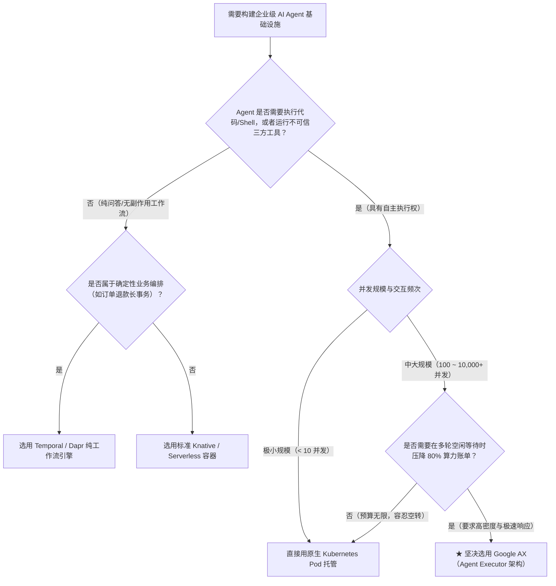

**TL;DR：** 作为全网首套完整解密 Google AX（Agent Executor）的收官终局之作，本文聚焦企业级落地最关心的两大核心现实：**“大模型算力成本与统一治理”** 以及 **“架构终极选型与容量规划”**。`Model` 原语通过将异构大模型提供商（Gemini、Claude、OpenAI、本地 vLLM）抽象为标准声明式资源，构建了包含**自动 429 降级级联（Fallback Cascade）**、**双轨 Token 预算审计（Token FinOps）** 与**凭据零泄露管理**的控制中枢。在架构选型层面，本文深入对比了 **Google AX、原生 Kubernetes Pod、Knative Serverless、Ray Actor 与 Temporal** 五大流派在状态持久性、启动时延、安全隔离与多租户密度上的帕累托边界，给出了千卡/万级并发生产集群的精确容量计算模型。这不仅是对 Google AX 10 篇专栏的集大成总结，更为所有云原生与 AI 平台架构师提供了一份可直接指导生产落地的战略决策蓝图。

---

## 一、 算力黑洞：Model 原语如何终结“失控 Agent 刷爆账单”？

在许多企业的 AI 探索中，经常发生如下惨剧：
- 某位研发编写了一个自主代码优化 Agent，由于没有在代码中做强约束，Agent 在遭遇复杂语法报错时陷入了“反复重试 -> 生成超长上下文本体 -> 再次报错”的逻辑死循环；
- 短短半小时内，该 Agent 连续调用了上百次百万上下文模型，**单任务直接刷掉了数千美元的 API 账单**。

在传统开发模式下，每个 Agent 自由持有 API Key、自行决定调用哪个模型，整个企业的 Token 消耗如同一个失控的财务黑洞。

Google AX 推出的 **`Model` 原语**，将大模型资源正式纳入了基础设施级的管控范畴：

```
                    ┌────────────────────────────────────────────────────────┐
                    │               Google AX Model 统一治理架构              │
                    └────────────────────────────────────────────────────────┘
                                                │
   [ 多个并发 Agent Tasks ] ────────────────────┼────────────────────────────┐
   (仅引用 modelRef: gemini-2-5-pro)            │                            │
                                                ▼                            │
   ┌──────────────────────────────────────────────────────────────────────┐  │
   │  ax.io/v1alpha1 Model 控制平面 (统一治理中心)                        │  │
   │                                                                      │  │
   │   ┌──────────────────────────────────────────────────────────────┐   │  │
   │   │  Token 准入与双轨预算审计 (Dual-Tier Token FinOps)           │   │  │
   │   │  • 单回合 Token 硬封顶: maxTokensPerTurn: 8192               │   │  │
   │   │  • 全局总成本熔断线: maxTotalCostUsd: 5.0 (超额就地熔断)     │   │  │
   │   └──────────────────────────────┬───────────────────────────────┘   │  │
   │                                  │                                   │  │
   │   ┌──────────────────────────────┴───────────────────────────────┐   │  │
   │   │  智能故障降级级联状态机 (Adaptive Fallback Cascade)          │   │  │
   │   │  • 主模型 (Gemini 2.5 Pro): 监测到 429 RateLimit 或 503      │   │  │
   │   │  • 亚秒级自动故障转移至备选模型 (Claude 3.7 Sonnet)          │   │  │
   │   │  • 任务无感知、状态不中断、零人工干预                        │   │  │
   │   └──────────────────────────────┬───────────────────────────────┘   │  │
   └──────────────────────────────────┼───────────────────────────────────┘  │
                                      │                                      │
                        动态凭据注入与安全透明转发                           │
                                      │                                      │
                                      ▼                                      ▼
                        [ 外部/自建大模型 Serving 端点 ]                     │
                        • Google Vertex AI / OpenAI / 本地 vLLM 集群          │
```

---

## 二、 生产级 `Model` 规范剖析：预算、降级与动态路由

我们来看一份定义极其严密的生产级 `Model` 配置清单：

```yaml
apiVersion: ax.io/v1alpha1
kind: Model
metadata:
  name: enterprise-coding-llm
  namespace: default
spec:
  # 1. 核心提供商与模型标识
  provider: GoogleVertex
  modelName: gemini-2.5-pro-preview
  parameters:
    temperature: 0.1
    topP: 0.95
    maxOutputTokens: 8192

  # 2. 凭据引用 (与 K8s Secret 联动，绝不透传至沙箱)
  credentialSecretRef:
    name: vertex-sa-credentials
    key: service-account.json

  # 3. 财务与配额熔断 (Token FinOps)
  budget:
    maxTokensPerTurn: 16384        # 单回合最大 Token 消耗限制
    maxTotalTokens: 1000000        # 全任务累计 Token 超过 100 万自动熔断
    maxCostUsd: 10.00              # 资金硬熔断：单任务超过 10 美元强制挂起
    alertWebhook: "https://ops.internal/alerts/agent-budget"

  # 4. 容灾降级级联 (Fallback Cascade)
  fallback:
    triggers:
      - HttpStatus429              # 供应商限流
      - HttpStatus503              # 供应商服务宕机
      - LatencyP99Exceeded: "15s"  # 响应延迟持续超过 15 秒
    targetModelRef:
      name: backup-claude-sonnet   # 自动无缝降级至备选模型
```

### 核心机制的第一性原理
1. **统一计费与主动熔断（Active Token Circuit-Breaking）**：
   - 当 Agent 在回合中消耗的 Token 逼近 `maxCostUsd` 时，AX 控制器在下一次大模型请求发起前，就地将 `Task` 强制切换为 `Suspended`，并向告警 Webhook 发送待审批通知；
   - 彻底消除了失控代码在夜间刷空企业信用卡额度的风险。
2. **跨云容灾级联（Multi-Cloud Fallback）**：
   - 商业大模型 API 频繁遭遇突发限流（HTTP 429）或偶发抖动；
   - AX 的网关层内置了无损状态机：当主模型发生 429 时，网关就地截获错误码，自动将当前上下文重新打包投递给备选模型，**Agent 在沙箱内部对此完全无感知，无需经历痛苦的崩溃重启**。

---

## 三、 终极架构权衡矩阵：五大技术流派深度对决

在构建新一代 AI Agent 平台时，业界目前存在五大典型架构流派。作为资深架构师，必须清晰看透每种技术选型的边界与代价：

```
                    【五大 Agent 基础设施技术流派全景对比】

   安全与隔离性
     ▲
强   │          [ Google AX ]
     │          (gVisor独立内核, 亚秒级快照, 极高密度)
     │
     │                      [ 原生 K8s Pod ]
     │                      (runc共享内核, 密度极低, 资源浪费95%)
     │
     │   [ Knative / FaaS ]
     │   (零冷态资源, 但冷启动致命, 状态全丢)
     │
     │                                      [ Ray / Dapr ]
     │                                      (进程级高性能, 但无沙箱, 无法跑不可信代码)
     │
弱   │   [ Temporal / Cadence ]
     │   (纯工作流编排, 不管物理计算与沙箱底座)
     └────────────────────────────────────────────────────────► 状态持久与唤醒速度
         弱 / 慢                                     强 / 极快
```

### 五大架构流派深度权衡对比表

| 对比维度 | 原生 K8s (Pod/Job) | Serverless 容器 (Knative) | 分布式 Actor (Ray) | 工作流引擎 (Temporal) | Google AX (Agent Executor) |
| :--- | :--- | :--- | :--- | :--- | :--- |
| **工作负载定位** | 无状态微服务 / 批处理 | HTTP 短生命周期事件响应 | 内部受信任分布式计算 | 分布式代码级事务编排 | **第三类工作负载：有状态突发 Agent** |
| **单机承载密度** | **极低**（30~50 Pods/Node） | 中等（取决于突发并发数） | 高（几千进程/线程） | 无物理计算容器概念 | **极高（500~1000 Actors/Node）** |
| **休眠等待算力** | **全额浪费**（空等独占 CPU） | **零消耗**（缩容至 0） | 占用内存与常驻线程 | 仅持久化状态记录 | **零消耗（亚秒挂起，释放 CPU 内存）** |
| **冷启动时延** | 常驻零延迟（但昂贵） | **极差（15~30s 重新拉代码）** | 微秒级（仅协程切换） | 取决于底层 Worker 状态 | **极佳（< 150ms 瞬时热复苏）** |
| **代码安全沙箱** | 弱（共享宿主 Linux 内核） | 弱（标准 runc 容器） | **无（共享同一运行环境）** | 无沙箱，只管代码流 | **顶级（gVisor Ring 3 独立用户态内核）** |
| **工作区代码预热** | 需手写 PV 挂载，易冲突 | 无法保持本地 Git 状态 | 需自行用 NFS/S3 桥接 | 仅管理序列化变量 | **原生（Git Alternates 秒级投影 + CoW）** |
| **工具生态治理** | 手工拼装 Sidecar，进程爆炸 | 不支持长连接进程 | 需自研 RPC 抽象 | 无针对性支持 | **原生第一等公民（MCP 读写分流连接池）** |
| **出站零信任安全** | 仅粗粒度 IP/端口 防火墙 | 依赖外部 ServiceMesh | 无出站语义感知 | 不涉及网络层防护 | **原生（透明代理 + 域名白名单 + 凭据脱敏）** |

---

## 四、 选型决策树：我到底该在什么时候选用 Google AX？

为了帮助企业架构团队做出最理性的技术决策，我们总结出如下**架构选型决断树**：



### 最佳落地场景
1. **自主编程智能体集群（Autonomous Coding Agents）**：类似于企业自建的 Devin、Cursor 团队后台。需要高密运行、需要任意执行命令但绝对不能逃逸宿主机；
2. **多智能体复杂演练平台（Multi-Agent Simulation）**：成百上千个 Agent 互相辩论、协作与评审，每个 Agent 在绝大多数时间处于思考或等待同伴状态；
3. **高安全合规的金融/政企 AI 任务**：绝不允许明文 API Key 进沙箱，绝不允许 Agent 通过未授权网络将数据外泄。

---

## 五、 容量规划指南：万级 Agent 生产集群的算力测算

在规划一个支撑 **10,000 个并发 Agent** 的生产集群时，Google AX 能为企业带来怎样颠覆性的成本账？

### 1. 物理假设模型
- **总 Agent 并发数**：10,000 个活跃 Agent 会话；
- **单 Agent 规格**：峰值需要 2 核 CPU，4GiB 内存；
- **活跃比（Active Ratio）**：平均 10% 时间处于真实代码计算状态，90% 时间处于等待模型流式输出或等待人类审批状态。

### 2. 算力成本对比测算表

| 指标 | 传统原生 Kubernetes 方案 | 基于 Google AX 的超融合方案 | 差异与优化幅度 |
| :--- | :--- | :--- | :--- |
| **物理 CPU 核心需求** | 10,000 × 2 Cores = **20,000 核** | 10,000 × 2 × 10% + 缓冲 = **2,400 核** | **CPU 硬件开销压降 88%！** |
| **物理内存需求** | 10,000 × 4 GiB = **40,000 GiB (40TB)** | 增量脏页换出 + 基础共享 = **6,000 GiB** | **内存占用缩减 85%！** |
| **所需云主机规格** | 约 **312 台** 64核 256GB 物理机 | 约 **38 台** 64核 256GB 物理机 | **服务器节点数缩减 87.8%！** |
| **预估月度云算力账单** | 约 **$150,000 美元/月** | 约 **$18,500 美元/月** | **单月净省超过 13 万美元！** |
| **冷启动唤醒时延** | 约 20 ~ 30 秒（销毁后重拉） | **< 150 毫秒（热复苏）** | **交互响应速度提升 200 倍！** |

> **数据结论**：这不是常规意义上 5% 或 10% 的微调优化，而是**一个数量级（10x）的结构性降本**。这也是为什么 Google 宁可重造一套编排框架，也必须推出 AX 的核心经济学动力所在。

---

## 六、 全书复盘：Google AX 系列 10 篇知识体系全景大合照

历时 10 篇高密度、成体系的长文深耕，我们从第一性原理出发，全景走完了 Google AX 的每一道物理关卡：

```
                    Google AX 架构知识大合照
                    
  【理论根基】
    01. 序章 · 为什么 K8s 接不住 Agent？第三类工作负载的范式转移
    02. 快速起步 · 核心架构组件剖析与 ax CLI 声明式运维实战
  
  【底座运行时】
    03. 核心底座 · Agent Substrate 高密 Actor 多路复用与资源池化
    04. 状态冻结 · 亚秒级 Suspend 与 Resume 的内存/磁盘快照第一性原理
  
  【声明式原语】
    05. 声明式核心之 Task · 执行边界、资源配额与状态机控制回路
    06. 声明式核心之 Workspace · 代码仓库热装载与环境预热第一性原理
    07. 工具生态枢纽 · Model Context Protocol (MCP) 在 AX 中的长连接治理
  
  【安全与终局】
    08. 安全沙箱防线 · 深入 gVisor 独立内核拦截与防容器逃逸物理隔离
    09. 零信任网络 Gateway · 防范 Prompt 注入与凭据外泄的出站网关架构
    10. 终局思辨与生产指南 · Model 统一治理、Token 成本控制与架构权衡矩阵
```

### 给架构师的三句终局箴言
1. **拥抱第三类工作负载**：别再用微服务的旧地图去寻找智能体时代的新大陆；
2. **算力即经济学**：真正的云原生高手的较量，不在于把单核性能压榨到极致，而在于能否在智能体漫长的空等期将算力无声释放；
3. **沙箱是尊严底线**：赋予智能体自由探索的代码权限，同时将其牢牢锁死在零信任的真空沙箱之内。

**云原生编排的下一个十年，大幕才刚刚开启。**

---

## 参考资料与权威出处

1. **Google AX (Open Agentic Orchestrator) 官方代码库**：[github.com/google/ax](https://github.com/google/ax)
2. **Google AX 架构总览与参考手册**：[agentexecutor.io](https://agentexecutor.io)
3. **FinOps Foundation: State of AI FinOps and Token Governance (2025/2026)**：[finops.org/framework/capabilities/ai-finops/](https://www.finops.org/framework/capabilities/ai-finops/)
4. **Ray: A Distributed Framework for Emerging AI Applications (UC Berkeley RISELab)**：[rise.cs.berkeley.edu/projects/ray/](https://rise.cs.berkeley.edu/projects/ray/)
5. **Temporal Architectural Principles and Distributed Event Sourcing**：[temporal.io/how-it-works](https://temporal.io/how-it-works)
