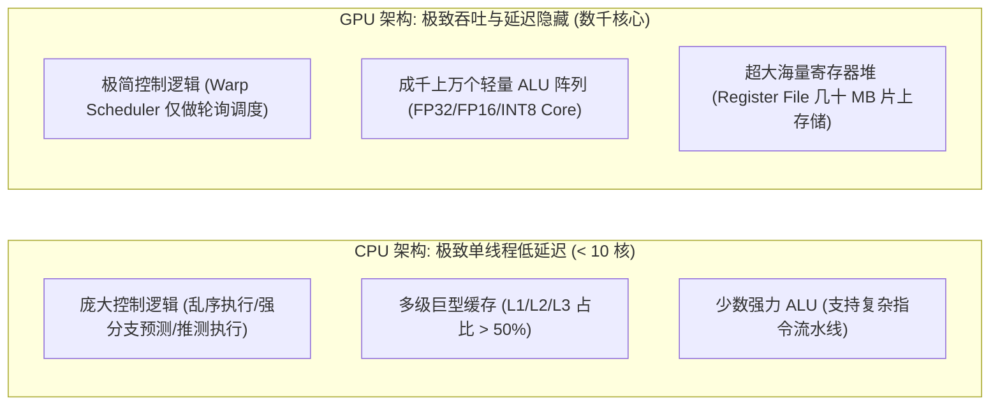
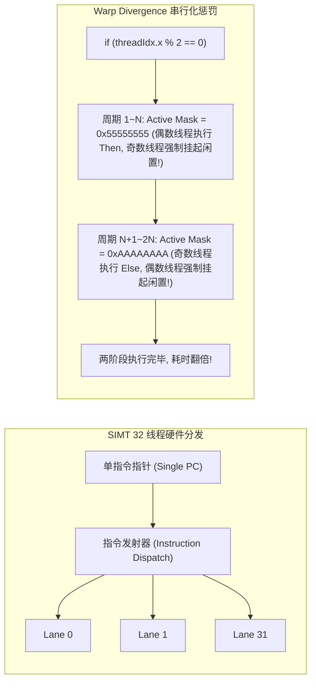
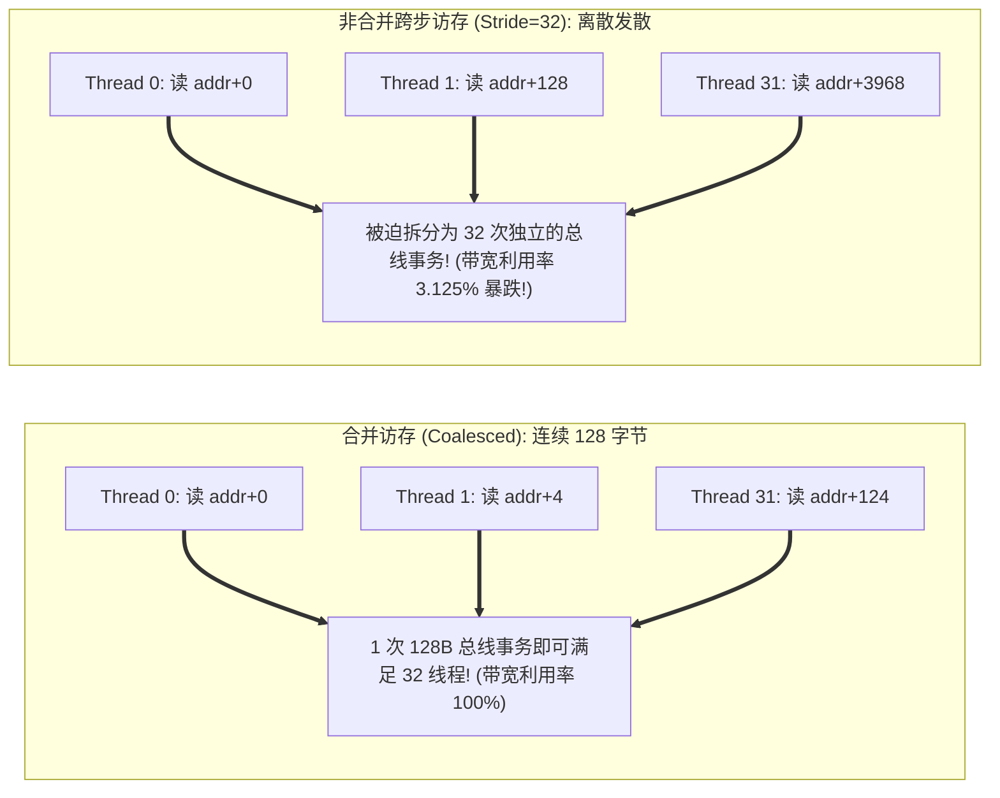
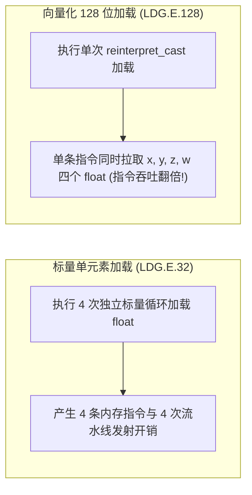

**TL;DR：** 许多工程师初学 CUDA 编程时，常有一种误解——“GPU 拥有数万个独立线程，就像一个放大版的超级多核 CPU”。但在硅片微架构层面，这种心理模型是致命的：CPU 将大部分晶体管预算投向了超大 L3 缓存、乱序执行逻辑（Out-of-Order Engine）与分支预测器，旨在追求**极致的单线程低延迟**；而 GPU 则将 80% 以上的晶体管全部堆叠为纯粹的 ALU 计算单元与海量寄存器堆，追求**极高吞吐的吞吐延迟隐藏（Latency Hiding）**。GPU 的最小硬件调度执行单元并非单个线程，而是由 **32 个物理线程绑定的 Warp（线程束）**。在 **SIMT（Single Instruction, Multiple Threads）** 架构下，一个 Warp 内的 32 个核心在同一时钟周期内**必须执行完全相同的机器指令**。如果在代码中写下朴素的 `if-else` 分支，硬件将触发灾难性的 **Warp Divergence（分支分歧）**：通过掩码（Active Mask）将未命中的线程全部挂起，原本并行的两段分支被迫完全串行化执行，硬件计算效率瞬间暴跌 **50% 甚至 32 倍**；同时，若 32 个线程未能对齐访问全局内存，总线事务将膨胀 32 倍，把高达 3TB/s 的 HBM 高带宽彻底沦为瓶颈。本文系统解构 GPU 底层指令发射流水线、分支谓词化消除与 **128 字节全局内存合并访问（Memory Coalescing）** 的物理法则。

---

## 一、 晶体管预算的哲学抉择：CPU vs GPU 硬件微架构

计算机硬件设计始终受限于芯片制造工艺的晶体管预算（Transistor Budget）与散热功耗墙（TDP）。CPU 与 GPU 对这笔预算做出了截然相反的分配：



### 1. 延迟隐藏（Latency Hiding）的魔法

- **CPU 的策略**：当一条访存指令发生 Cache Miss 需要去主存读数据时，CPU 依靠数百项的重排序缓冲区（ROB）尝试乱序执行后续无关指令，或依赖超大分支预测器猜测路径。一旦内存停顿无法化解，整个核心陷入空转；
- **GPU 的破局之道**：GPU 根本不做复杂的乱序执行与推测！一个流式多处理器（Streaming Multiprocessor, SM）内部同时驻留着数千个活跃线程（In-flight Threads）。
  - 当当前 Warp 发起一次需要 200~400 个周期的 HBM 显存读取时；
  - **Warp 调度器（Warp Scheduler）在 1 个时钟周期内以零开销瞬间切换到另一个已经就绪的 Warp 执行计算**；
  - 通过成百上千个并发 Warp 的交替推进，GPU 将漫长的内存延迟彻底掩盖在并发计算的洪流之中！

---

## 二、 SIMT 架构与 Warp Divergence 的物理惩罚

在 NVIDIA GPU 中，网格（Grid）与线程块（Block）是逻辑组织，而真正驻留在硬件 SM 上的最小物理调度单元是 **Warp（固定包含 32 个线程）**。



### 1. 为什么 SIMT 无法自由分支？

许多初学者疑惑：“既然有 32 个核心，为什么它们不能各自执行不同的代码？”
- 硬件层面上，**一个 Warp 内的 32 个 Lane 共用同一个程序计数器（Program Counter, PC）**！
- 芯片并没有为每一个线程配备独立的指令译码器与控制流逻辑；
- 当发生条件分支（如 `if (threadIdx.x < 16)`）时，硬件无法同时执行两段路径。

### 2. 执行屏蔽（Execution Masking）与性能骤降

面对条件分歧，GPU 硬件只能采用**分步串行化执行**：
1. **阶段一（执行 True 分支）**：硬件将 `Active Mask` 寄存器置为 `0x0000FFFF`（低 16 位为 1，高 16 位为 0）。高 16 个线程的核心时钟被物理屏蔽（NOP 门控），低 16 个线程执行 True 块指令；
2. **阶段二（执行 False 分支）**：硬件翻转 `Active Mask` 为 `0xFFFF0000`。低 16 个线程被冻结，高 16 个线程执行 False 块指令。

**惩罚结论**：原本只需要 1 个周期的计算，被硬生生拉长为 2 个周期，**算力直接折半**！在最极端的恶劣情况下（如 32 个线程各自命中了不同的分支），执行时间将被拉长 **32 倍**。

### 3. Branchless 汇编谓词消除（Predicated Instructions）

现代高性能算子通过**无分支计算**规避 Warp Divergence：

```cpp
// 产生严重 Warp Divergence 的反模式
__global__ void naive_relu(float* out, const float* in, int n) {
    int idx = blockDim.x * blockIdx.x + threadIdx.x;
    if (idx < n) {
        if (in[idx] > 0.0f) {
            out[idx] = in[idx];
        } else {
            out[idx] = 0.0f;
        }
    }
}

// 经过编译优化的无分支实现 (利用 PTX 指令 fmaxf 直接单周期下发)
__global__ void optimized_relu(float* out, const float* in, int n) {
    int idx = blockDim.x * blockIdx.x + threadIdx.x;
    if (idx < n) {
        out[idx] = fmaxf(in[idx], 0.0f); // 单条无分支硬件汇编指令!
    }
}
```

在底层 PTX 汇编中，`fmaxf` 直接被编译为单条硬件机器指令，无需跳转指令与掩码翻转，32 个 Lane 保持 100% 满负荷同步狂奔。

---

## 三、 全局内存合并访问（Memory Coalescing）物理定律

即便算力没有分歧，如果访存无法高效喂饱计算单元，算子依然会深陷“内存墙（Memory Bound）”泥潭。



### 1. 128 字节缓存行与总线事务机制

在现代 NVIDIA Ampere/Hopper 架构中：
- 全局显存（HBM3 / GDDR6X）通过统一的 L2 缓存与 SM 互联；
- L2 缓存行的最小硬件访问事务粒度为 **128 字节（或 32 字节扇区）**；
- **合并访问黄金定律**：如果一个 Warp 的 32 个线程在同一条访存指令中，请求的地址全部落在同一个**对齐的 128 字节物理内存段内**（例如 32 个 `float` 连续排布：$32 \times 4\text{B} = 128\text{B}$），内存控制器只需发射 **1 次物理总线事务** 就能同时喂饱全部 32 个线程！

### 2. 跨步访存（Strided Access）的带宽崩塌

如果在矩阵乘法或转置中，写出了跨列读取的代码：`data[threadIdx.x * stride]`：
- 当 `stride = 32` 时，每个线程请求的地址跨越了 128 字节；
- 内存控制器不得不将这单次访存指令拆分为 **32 次独立的 32 字节总线传输**；
- 每次传输 32 字节却只使用了其中的 4 字节有效数据，**总线有效利用率暴跌至 $\frac{4}{32} \times \frac{1}{32} \approx 3.125\%$**！高达数 TB/s 的物理显存带宽被无谓的空洞数据彻底吞噬。

---

## 四、 向量化加载（Vectorized Memory Access）：`float4` 神技

为了进一步榨干内存流水线，现代 CUDA 算子广泛采用 **128 位向量化访存指令**。



### 1. 128 位指令的硬件优势

- 标准 `float` 加载编译为 `LDG.E.32`；
- 使用 `float4` 类型，编译器会将其发射为底层硬件指令 **`LDG.E.128`**；
- 单条指令直接搬运 16 个字节，**指令发射开销减少了 75%**，大幅减轻了 Warp 调度器的指令分派压力，显著拉高内存吞吐上限。

---

## 五、 生产级 CUDA 与 C++20 访存合并度与分歧量化评估引擎

以下代码完整实现了基于现代体系结构的 GPU 访存合并度计算器、Warp 分支分歧惩罚评估与向量化流水线收益仿真：

```cpp
#include <iostream>
#include <vector>
#include <cstdint>
#include <iomanip>
#include <cmath>
#include <cassert>

// 模拟 GPU Warp 硬件执行环境
class GpuWarpSimulator {
public:
    static constexpr uint32_t kWarpSize = 32;
    static constexpr uint32_t kCacheLineBytes = 128; // L2 缓存行事务对齐大小

    // 评估分支分歧惩罚
    template <typename ConditionFunc>
    static void evaluate_warp_divergence(ConditionFunc&& cond) {
        uint32_t active_lanes_true = 0;
        uint32_t active_lanes_false = 0;

        for (uint32_t lane_id = 0; lane_id < kWarpSize; ++lane_id) {
            if (cond(lane_id)) {
                ++active_lanes_true;
            } else {
                ++active_lanes_false;
            }
        }

        std::cout << "========== [Warp Divergence 分歧分析] ==========" << std::endl;
        std::cout << "True 分支活跃线程数 : " << active_lanes_true << " / 32" << std::endl;
        std::cout << "False分支活跃线程数 : " << active_lanes_false << " / 32" << std::endl;

        if (active_lanes_true == 32 || active_lanes_false == 32) {
            std::cout << "状态: 100% 完美无分歧 (Zero Divergence, 效率 100%)" << std::endl;
        } else {
            double efficiency = (32.0 / (active_lanes_true > 0 && active_lanes_false > 0 ? 64.0 : 32.0)) * 100.0;
            std::cout << "状态: ⚠️ 触发严重硬件分支分歧！执行被迫拆为 2 阶段串行化" << std::endl;
            std::cout << "硬件计算槽位综合效率: " << efficiency << " %" << std::endl;
        }
    }

    // 评估内存合并访问效率
    template <typename AddressGenerator>
    static void evaluate_memory_coalescing(AddressGenerator&& addr_gen, uint32_t element_size_bytes) {
        std::vector<uint64_t> addresses(kWarpSize);
        std::vector<uint64_t> hit_cache_lines;

        for (uint32_t lane_id = 0; lane_id < kWarpSize; ++lane_id) {
            uint64_t addr = addr_gen(lane_id);
            addresses[lane_id] = addr;

            uint64_t line_id = addr / kCacheLineBytes;
            bool already_hit = false;
            for (uint64_t existing_line : hit_cache_lines) {
                if (existing_line == line_id) {
                    already_hit = true;
                    break;
                }
            }
            if (!already_hit) {
                hit_cache_lines.push_back(line_id);
            }
        }

        size_t total_bus_transactions = hit_cache_lines.size();
        uint64_t total_bytes_transferred = total_bus_transactions * kCacheLineBytes;
        uint64_t useful_bytes = kWarpSize * element_size_bytes;
        double bus_efficiency = (static_cast<double>(useful_bytes) / total_bytes_transferred) * 100.0;

        std::cout << "\n========== [内存合并访问 (Memory Coalescing) 分析] ==========" << std::endl;
        std::cout << "32 线程请求总有效数据量 : " << useful_bytes << " 字节" << std::endl;
        std::cout << "物理硬件触发总线事务次数: " << total_bus_transactions << " 次 (128B Cache Lines)" << std::endl;
        std::cout << "物理实际传输总字节数   : " << total_bytes_transferred << " 字节" << std::endl;
        std::cout << "总线带宽有效利用率 (Bus Efficiency): " << std::fixed << std::setprecision(2) << bus_efficiency << " %" << std::endl;

        if (total_bus_transactions == 1) {
            std::cout << "评估: 完美合并访问 (Coalesced)！单次事务喂饱整个 Warp" << std::endl;
        } else {
            std::cout << "评估: ⚠️ 严重访存发散！总线事务膨胀了 " << total_bus_transactions << " 倍！" << std::endl;
        }
    }
};

int main() {
    std::cout << ">>> 启动 GPU SIMT 微架构与合并访存物理特性仿真 <<<" << std::endl;

    // 1. 模拟偶数判断产生的 Warp Divergence: if (threadIdx.x % 2 == 0)
    GpuWarpSimulator::evaluate_warp_divergence([](uint32_t lane) {
        return (lane % 2) == 0;
    });

    // 2. 模拟完美连续连续访存: float A[threadIdx.x] (基地址 0)
    std::cout << "\n---------------- [场景 A: 连续对齐访问] ----------------" << std::endl;
    GpuWarpSimulator::evaluate_memory_coalescing([](uint32_t lane) {
        return static_cast<uint64_t>(lane * sizeof(float)); // 0, 4, 8, ..., 124
    }, sizeof(float));

    // 3. 模拟跨步访存: float A[threadIdx.x * 32] (行优先读取列)
    std::cout << "\n---------------- [场景 B: 跨步访存 (Stride=32)] ----------------" << std::endl;
    GpuWarpSimulator::evaluate_memory_coalescing([](uint32_t lane) {
        return static_cast<uint64_t>(lane * 32 * sizeof(float)); // 0, 128, 256, ...
    }, sizeof(float));

    return 0;
}
```

---

## 六、 总结与下篇预告

编写高性能 GPU 算子，绝不是把循环映射为 `threadIdx` 的语法练习，而是对底层执行流水线的精确驾驭：
- 理解 **SIMT 32 线程单 PC 架构**，时刻警惕 Warp Divergence，用汇编级无分支操作消除执行屏蔽；
- 遵循 **128 字节缓存行对齐**，确保全局内存请求以单一总线事务完成合并；
- 利用 **`float4` 向量化加载**，削减 75% 的指令发射开销。

然而，全局显存（HBM）的物理延迟终究在数百个周期。当需要跨线程复用数据、打碎频繁的显存回写时，我们必须依靠位于 SM 片上的真正极速内存——**共享内存（Shared Memory, 19TB/s 超大带宽）**。

下一篇，我们将深入解构 **《共享内存与 Bank Conflict 破局：32 Banks 交叉寻址、Padding 填充技巧与跨线程数据洗牌 Shuffle》**，揭秘如何规避硬件冲突、榨干片上 SRAM 的每一滴吞吐！
