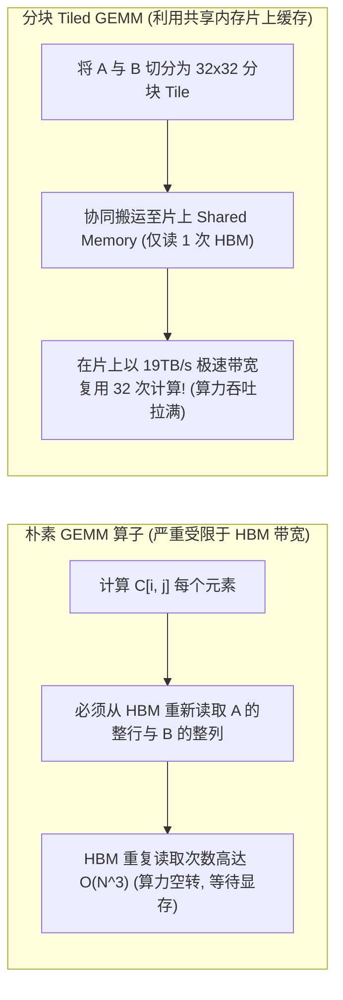
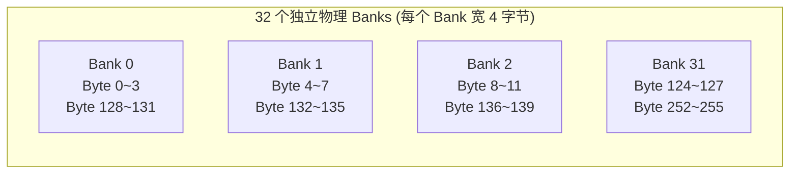
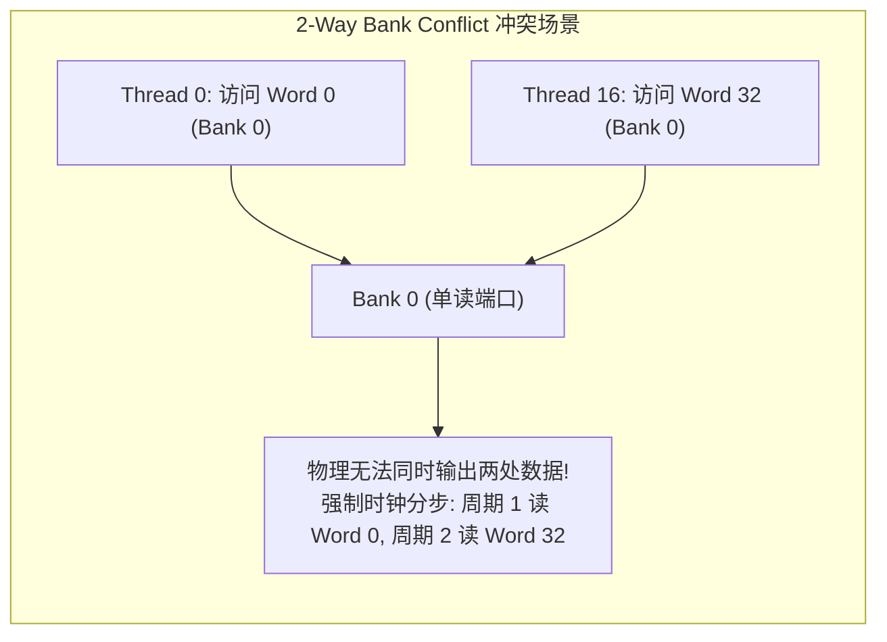
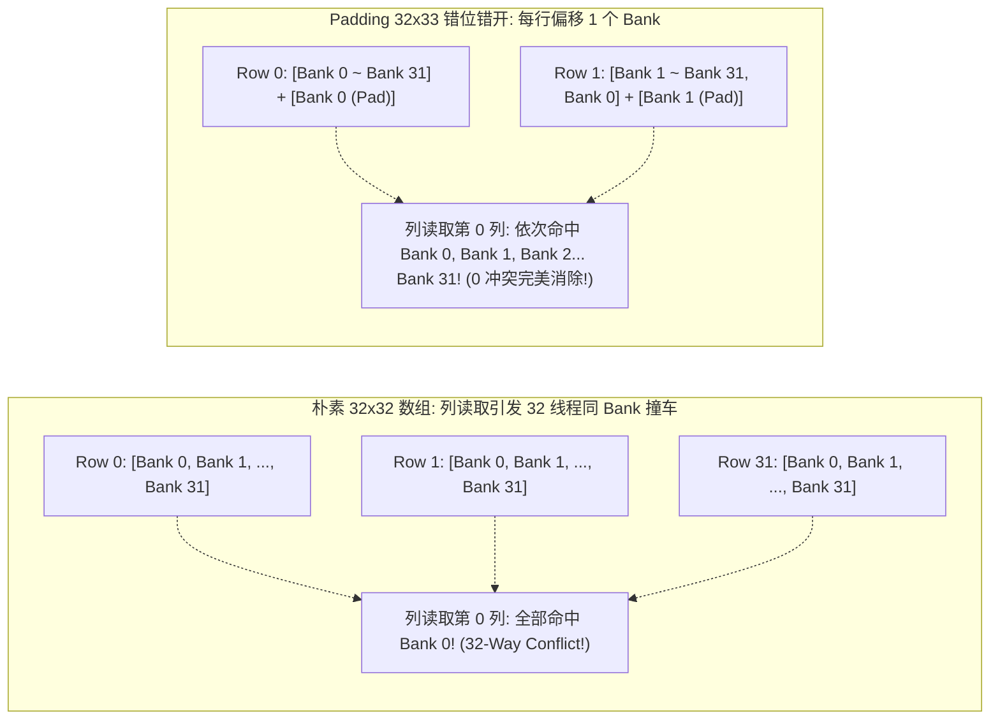
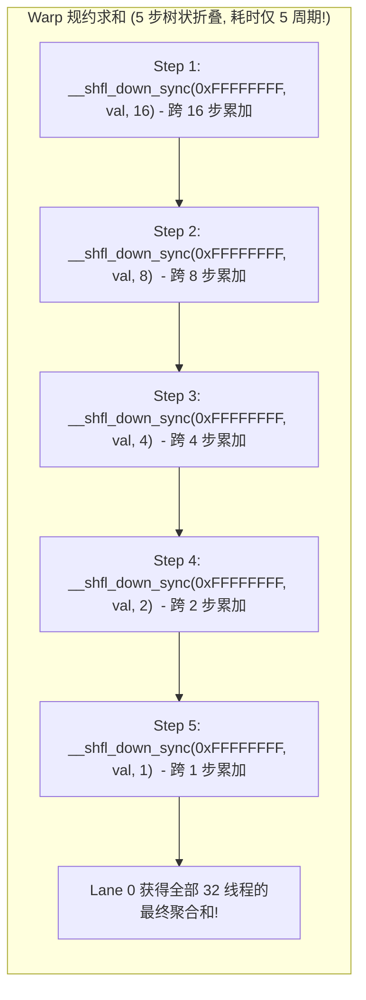

**TL;DR：** 在 GPU 算子优化中，全局显存（HBM3/GDDR）虽然具备数 TB/s 的理论吞吐，但其高达 **200~400 个时钟周期** 的访问延迟依然是性能杀手。为了在线程块（Block）内高效复用数据，NVIDIA 在每个 SM 片上集成了与 L1 缓存共享硬件资源的**共享内存（Shared Memory / 片上 SRAM）**：其全卡聚合带宽突破惊人的 **19TB/s**，访问延迟低至 **20~30 个时钟周期**。然而，天下没有无条件的超高速——为了在物理芯片上兼顾布线面积与读写端口数，共享内存被等分为 **32 个独立的存储模块，称为 32 个 Banks（每个 Bank 宽 4 字节）**。当一个 Warp 内的 32 个线程并发访问共享内存时，如果多个线程不幸命中了**同一个 Bank 中的不同地址**，硬件将被迫退化为时钟维度的逐一串行排队，这就是著名的 **Bank Conflict（Bank 冲突）**。最严重情况下，一次访存将被拆解为 **32 次串行传输，带宽瞬间暴跌 96.8%**！本文系统拆解 32 Banks 交叉寻址数学规律、多线程读同一地址的硬件多路广播（Broadcast）特性；详解利用 `[32][33]` 错位填充（Padding）消灭矩阵转置冲突的经典工程绝技；并深入基于寄存器互联的 **Warp Shuffle（寄存器数据洗牌）** 原语，展示无需任何共享内存的极速单周期 Warp 级并行归约。

---

## 一、 为什么需要共享内存：打碎 HBM 内存墙

在深度学习与高性能计算中，通用矩阵乘法（GEMM: $C = A \times B$）是最基础的算子。



### 1. 软件可控的片上高速缓存（Scratchpad Memory）

不同于 CPU 由硬件自动管理的透明 L1/L2 缓存，CUDA 共享内存（`__shared__`）是完全由程序员在代码中**显式控制的片上 SRAM**：
- 它的物理位置直接坐落于 SM 芯片内部，与算术计算单元物理距离极短；
- 延迟仅为 HBM 的 $\frac{1}{10}$，带宽则是 HBM 的 **6~8 倍**；
- 它充当了线程块内部数据复用的“临时中转站”。

---

## 二、 32 Banks 交叉寻址与 Bank Conflict 数学本质

共享内存的极速并非来自于魔法，而是来自于**高度并发的物理分行交错（Interleaving）**。



### 1. Bank 映射的数学公理

在 32 位访问模式下，连续的 4 字节字（Word）依次循环映射到 32 个独立的 Bank 中：

$$\text{Bank Index} = \left( \frac{\text{Byte Address}}{4} \right) \pmod{32} = \text{Word Index} \pmod{32}$$

- 地址 `0x00 ~ 0x03`（Word 0）$\to$ **Bank 0**
- 地址 `0x04 ~ 0x07`（Word 1）$\to$ **Bank 1**
- ...
- 地址 `0x7C ~ 0x7F`（Word 31）$\to$ **Bank 31**
- 地址 `0x80 ~ 0x83`（Word 32）$\to$ **循环回到 Bank 0**！

### 2. 三种硬件访存模式

当一个 Warp 的 32 个线程同时访问共享内存时，硬件仲裁逻辑面临三种截然不同的情境：

| 硬件访存模式 | 发生条件 | 硬件处理行为 | 周期消耗与性能损耗 |
| :--- | :--- | :--- | :--- |
| **无冲突 (Conflict-Free)** | 32 个线程命中了 32 个**互不相同的 Bank** | 32 个 Bank 同时独立输出数据 | **单周期直出 (1 Cycle, 100% 性能)** |
| **多路广播 (Broadcast)** | 多个线程读取**同一个 Bank 内完全相同的内存地址** | 硬件单次读出后，广播总线分发给所有目标线程 | **单周期直出 (1 Cycle, 零性能损耗)** |
| **Bank 冲突 (Bank Conflict)** | 多个线程访问了**同一个 Bank 内不同的内存地址** | 硬件无法同时读取不同行，强制拆分串行化处理 | **N-Way Conflict (消耗 N 个周期, 带宽暴跌)** |



---

## 三、 经典血案：矩阵转置中的 32-Way 冲突与 Padding 破局

在实际深度学习算子中，最经典的 Bank Conflict 发生在**矩阵转置（Matrix Transpose）**中。

### 1. 朴素转置的性能塌陷

假设一个线程块处理 $32 \times 32$ 的浮点数分块：

```cpp
__shared__ float tile[32][32]; // 二维连续数组
```

在行写列读过程中：
1. **写入阶段（按行写入）**：
   - 线程 `i` 写入 `tile[threadIdx.y][threadIdx.x]`；
   - 同一行内，32 个线程的 `threadIdx.x` 为 $0 \sim 31$；
   - 目标 Bank 为 $(y \times 32 + x) \pmod{32} = x \pmod{32}$；
   - 刚好依次命中 Bank $0 \sim 31$：**完美无冲突（0-Way Conflict）！**
2. **读取阶段（按列读取）**：
   - 线程 `i` 读取 `tile[threadIdx.x][threadIdx.y]`；
   - 同一列内，32 个线程的 `threadIdx.x` 为 $0 \sim 31$；
   - 线程 $i$ 的地址对应：$(i \times 32 + y)$ 个 float；
   - 计算对应的 Bank：
     $$\text{Bank}_i = (i \times 32 + y) \pmod{32} = y \pmod{32}$$
   - **灾难降临！32 个线程的 Bank 编号严格恒等于 $y$，全部挤在同一个 Bank 上！**
   - **硬件触发 32-Way Bank Conflict，原本 1 个周期的读取被硬生生拉长为 32 个周期，共享内存吞吐暴跌 96.8%！**



### 2. Padding 填充的几何消除神技

破局方案优雅得令人惊叹——**在每行末尾多声明一个无用的浮点数（Padding）**：

```cpp
__shared__ float tile[32][33]; // 每一行占用 33 个 float
```

此时重新推导列读取的 Bank 分配：
- 线程 $i$ 访问元素 `tile[i][y]` 的逻辑偏移为：$(i \times 33 + y)$；
- 计算对应的 Bank：
  $$\text{Bank}_i = (i \times 33 + y) \pmod{32} = (i \times 32 + i \times 1 + y) \pmod{32} = (i + y) \pmod{32}$$
- 随着 $i$ 从 $0$ 变到 $31$，$\text{Bank}_i$ 依次为 $y, y+1, y+2, \dots, (y+31) \pmod{32}$；
- **原本全部撞在 Bank $y$ 上的 32 个线程，被瞬间均匀打散到全部 32 个不同的 Bank 之中！**

**代价**：仅仅多消耗了 $32 \times 4\text{B} = 128\text{B}$ 的微小内存；
**收益**：**完全抹除全部 32-Way 冲突，读取吞吐瞬间暴增 32 倍！**

---

## 四、 Warp Shuffle 寄存器级跨线程数据洗牌

在现代 GPU 架构（Volta / Ampere / Hopper）中，如果仅仅是为了在同一个 Warp 内部的 32 个线程之间交换数据（例如执行 Softmax 规约求和），**根本不需要经过共享内存！**

NVIDIA 提供了极速的 **Warp Shuffle 原语**：它直接利用芯片内部的**跨 Lane 交叉开关网络（Crossbar Network）**，在寄存器与寄存器之间直接传递数据。



### 1. 经典 Warp 规约求和实现

```cpp
__device__ inline float warp_reduce_sum(float val) {
    // 32 个线程全部参与，逐级折半累加
    val += __shfl_down_sync(0xFFFFFFFF, val, 16);
    val += __shfl_down_sync(0xFFFFFFFF, val, 8);
    val += __shfl_down_sync(0xFFFFFFFF, val, 4);
    val += __shfl_down_sync(0xFFFFFFFF, val, 2);
    val += __shfl_down_sync(0xFFFFFFFF, val, 1);
    return val; // Lane 0 持有最终累加和
}
```

- **零内存分配**：无需在片上分配任何 `__shared__` 数组，完全不消耗宝贵的共享内存配额；
- **零同步屏障**：无需调用 `__syncthreads()`，指令完全在 Warp 内部隐式同步；
- **极致速度**：仅需 $\log_2(32) = 5$ 条汇编指令，在 **5 个时钟周期** 内完成 32 线程全量数据聚合！

---

## 五、 生产级 C++20 共享内存 Bank 冲突与 Padding 消除仿真器

以下代码模拟了现代 NVIDIA GPU 的 32 Banks 共享内存硬件控制器行为：它能够精确检测多线程的 Bank 冲突次数、分析广播模式、并量化证明 Padding 填充对性能的巨大提升：

```cpp
#include <iostream>
#include <vector>
#include <cstdint>
#include <iomanip>
#include <cassert>
#include <map>

// 模拟 GPU 共享内存 32 Banks 控制器
class SharedMemoryBankSimulator {
public:
    static constexpr uint32_t kNumBanks = 32;
    static constexpr uint32_t kBankWidthBytes = 4; // 32 位访问模式 (每个 Bank 4 字节)

    struct AccessProfile {
        uint32_t max_conflicts;     // 最大单 Bank 冲突阶数 (N-way)
        uint32_t broadcast_lanes;   // 命中了硬件广播的线程数
        uint32_t cycles_consumed;   // 硬件实际消耗的时钟周期
    };

    // 针对一个 Warp (32 线程) 的访问地址模式进行仲裁仿真
    template <typename AddressFunc>
    static AccessProfile evaluate_warp_access(AddressFunc&& addr_func) {
        // bank_id -> (word_offset -> count_of_threads)
        std::map<uint32_t, std::map<uint32_t, uint32_t>> bank_access_map;

        for (uint32_t lane = 0; lane < 32; ++lane) {
            uint32_t byte_addr = addr_func(lane);
            uint32_t word_addr = byte_addr / kBankWidthBytes;
            uint32_t bank_id = word_addr % kNumBanks;

            bank_access_map[bank_id][word_addr]++;
        }

        uint32_t max_conflicts = 1;
        uint32_t broadcast_count = 0;

        for (const auto& [bank_id, words] : bank_access_map) {
            // 一个 Bank 内若访问了多个不同的 word 地址，则产生真正的物理串行冲突
            uint32_t distinct_words = words.size();
            if (distinct_words > max_conflicts) {
                max_conflicts = distinct_words;
            }

            // 若某个 word 被多于 1 个线程读取，属于硬件广播
            for (const auto& [word_addr, count] : words) {
                if (count > 1) {
                    broadcast_count += (count - 1);
                }
            }
        }

        return {
            .max_conflicts = max_conflicts,
            .broadcast_lanes = broadcast_count,
            .cycles_consumed = max_conflicts // 硬件必须串行执行 max_conflicts 个周期
        };
    }
};

int main() {
    std::cout << ">>> 启动 GPU 共享内存 32 Banks 交叉寻址与冲突仿真 <<<" << std::endl;

    // 1. 模拟朴素 32x32 矩阵转置列读取: tile[lane][0] (每行 32 个 float)
    std::cout << "\n---------------- [场景 1: 朴素 32x32 转置列读取] ----------------" << std::endl;
    auto res_naive = SharedMemoryBankSimulator::evaluate_warp_access([](uint32_t lane) {
        // tile[lane][0] 的字节地址 = (lane * 32 + 0) * 4
        return (lane * 32 + 0) * 4;
    });

    std::cout << "硬件检测最大 Bank 冲突阶数: " << res_naive.max_conflicts << "-Way Conflict!" << std::endl;
    std::cout << "硬件仲裁消耗执行时钟周期 : " << res_naive.cycles_consumed << " 周期 (严重串行排队!)" << std::endl;
    std::cout << "相对理论峰值带宽效率     : " << (1.0 / res_naive.cycles_consumed) * 100.0 << " %" << std::endl;
    assert(res_naive.max_conflicts == 32);

    // 2. 模拟 Padding 优化后的 32x33 矩阵转置列读取: tile[lane][0] (每行 33 个 float)
    std::cout << "\n---------------- [场景 2: Padding 错位 32x33 优化] ----------------" << std::endl;
    auto res_padded = SharedMemoryBankSimulator::evaluate_warp_access([](uint32_t lane) {
        // tile[lane][0] 的字节地址 = (lane * 33 + 0) * 4
        return (lane * 33 + 0) * 4;
    });

    std::cout << "硬件检测最大 Bank 冲突阶数: " << res_padded.max_conflicts << "-Way Conflict!" << std::endl;
    std::cout << "硬件仲裁消耗执行时钟周期 : " << res_padded.cycles_consumed << " 周期 (100% 单周期直出!)" << std::endl;
    std::cout << "相对理论峰值带宽效率     : " << (1.0 / res_padded.cycles_consumed) * 100.0 << " %" << std::endl;
    assert(res_padded.max_conflicts == 1);

    // 3. 模拟全 Warp 广播读取同一地址: 32 个线程同时读取 tile[0][0]
    std::cout << "\n---------------- [场景 3: 多线程全量硬件广播] ----------------" << std::endl;
    auto res_broadcast = SharedMemoryBankSimulator::evaluate_warp_access([](uint32_t) {
        return 0; // 全读地址 0
    });

    std::cout << "硬件检测最大 Bank 冲突阶数: " << res_broadcast.max_conflicts << "-Way (非冲突)" << std::endl;
    std::cout << "命中了多路广播的线程数   : " << res_broadcast.broadcast_lanes << " 线程" << std::endl;
    std::cout << "硬件仲裁消耗执行时钟周期 : " << res_broadcast.cycles_consumed << " 周期 (单周期广播完成!)" << std::endl;
    assert(res_broadcast.cycles_consumed == 1);

    std::cout << "\n>>> 仿真通过：Padding 技巧成功将 32-Way 致命冲突降维消除为 1 周期直出！ <<<" << std::endl;

    return 0;
}
```

---

## 六、 总结与下篇预告

共享内存是连接慢速显存与计算单元之间的超高速立交桥：
- 深刻理解 **32 Banks 交叉存储结构** 与寻址模运算，是避免算子性能暗中塌陷的前提；
- 熟练运用 **Padding 错位填充法**，可以在几乎不增加内存负担的前提下彻底粉碎步长撞车；
- 善用 **Warp Shuffle 寄存器原语**，可以在寄存器堆内部完成单周期通信，将片上 SRAM 留给更关键的数据分块。

然而，即便我们将内存访存压榨到了极致，传统的通用 FP32/FP16 CUDA Core 在面对万亿参数大模型密集矩阵乘法时，算力依然捉襟见肘。为此，NVIDIA 在硬件层面构建了终极算力怪兽——**Tensor Core（张量核心）**。

下一篇，我们将直接穿透到底层硬件微架构，深入解构 **《Tensor Core 硬件微架构与 MMA 指令：从 WMMA API 到 PTX 内联汇编矩阵乘极致优化》**！
