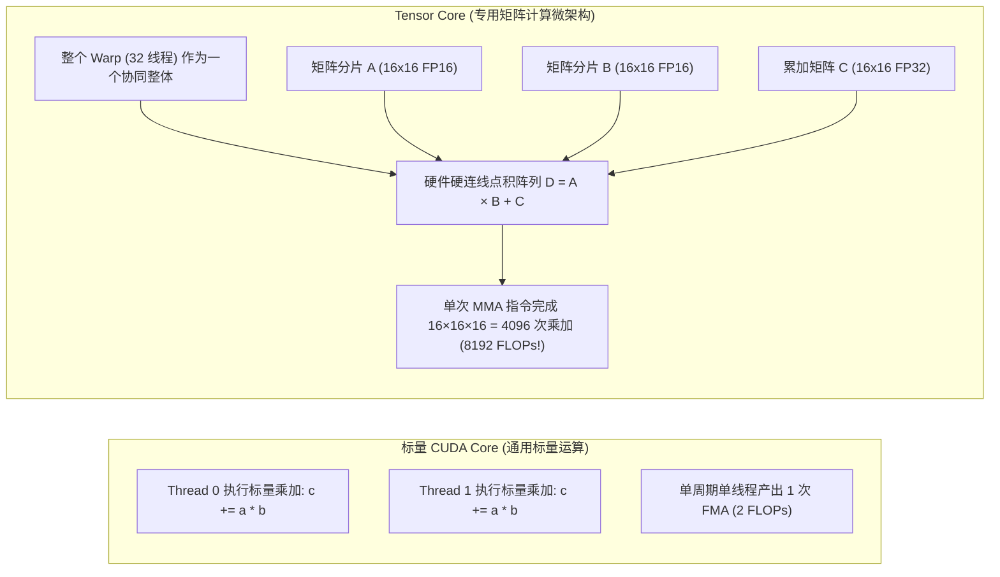
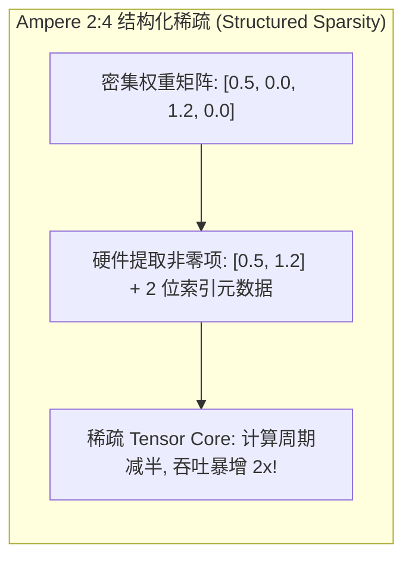
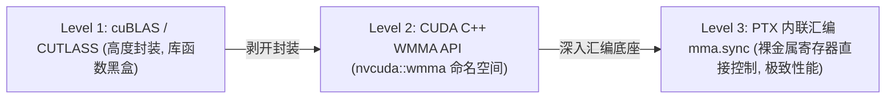
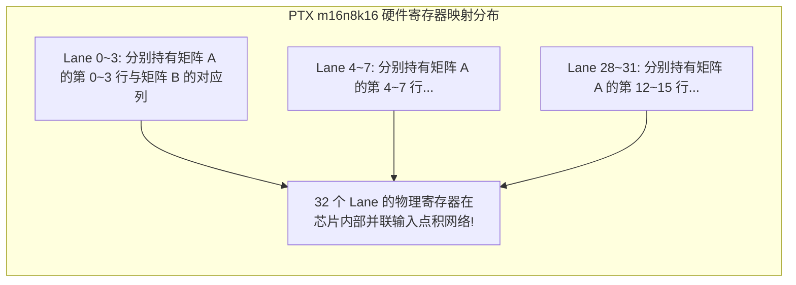
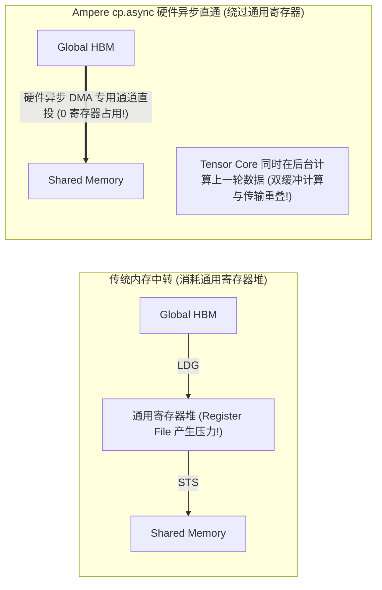

**TL;DR：** 在深度学习大模型（LLM）的算力竞赛中，传统的通用标量 **CUDA Core** 早已无法满足 Transformer 千亿参数密集的矩阵乘法（GEMM）需求。标量 CUDA Core 每个时钟周期只能执行一次基础的标量乘累加（$a \times b + c$）；而自 2017 年 Volta 架构引入的 **Tensor Core（张量核心）**，则是直接固化在硬件硅片上的**专用矩阵乘累加（Matrix Multiply-Accumulate, MMA）微架构**：它以整个 Warp（32 个线程）为一个不可分割的协同单元，在硬件流水线中仅需几个时钟周期就能完成一个 $16 \times 16 \times 16$ 小矩阵的密集点积计算，将单位芯片面积的计算吞吐量直接**拉升了 8~16 倍**！然而，要想完全榨干 Tensor Core 恐怖的理论 FLOPS，仅仅依赖官方黑盒库（如 cuBLAS）往往无法灵活融合复杂的前后处理算子；而高级的 `nvcuda::wmma` C++ 封装在高度优化时又存在冗余的寄存器重排与洗牌开销。本文深入 Tensor Core 的硬件流水线、混合精度数据通路与四代微架构演化；详解如何利用底层 **PTX 内联汇编指令 `mma.sync`** 精确锁定硬件寄存器分配；并结合 Ampere 架构引入的 **`cp.async` 硬件异步拷贝指令**，彻底绕过寄存器中转，构建出压榨峰值硬件极限的异步流水线 GEMM 算子。

---

## 一、 算力密度的量子跃迁：通用 CUDA Core vs Tensor Core

要理解大模型训练为什么依赖专业 GPU，必须观察硅片上计算密度的代际革命：



### 1. 运算密度的物理代沟

- **传统 CUDA Core**：32 个线程在 1 个周期内各自计算 1 次标量乘加，整个 Warp 单周期产出 $32 \times 2 = 64$ 次浮点操作；
- **Tensor Core**：一个 SM 内的 Tensor Core 阵列接收整个 Warp 传入的两个 $16 \times 16$ 矩阵分片，直接在硬连线的乘加阵列网络中执行点积：
  $$\text{FLOPs} = 2 \times M \times N \times K = 2 \times 16 \times 16 \times 16 = 8,192 \text{ FLOPs}$$
- **计算吞吐暴涨 16 倍以上**！这就是为什么在同一代工艺节点下，一旦算子成功跑在 Tensor Core 上，TFLOPS 会呈现出断层式的算力暴增。

---

## 二、 四代 Tensor Core 硬件微架构演进

从 Volta 到 Hopper，Tensor Core 经历了四次颠覆性的硬件升级：

| GPU 架构与代表型号 | 核心支持的数据类型 | 关键微架构创新与特性 |
| :--- | :--- | :--- |
| **Volta (V100)** | FP16 输入, FP32/FP16 累加 | 第一代张量核心，引入 $16 \times 16 \times 16$ 基础 MMA 指令 |
| **Turing (T4/RTX 2080)** | INT8, INT4, 二进制 (1-bit) | 引入低比特整数支持，开启量化推理新时代 |
| **Ampere (A100)** | **TF32 (TensorFloat-32)**, BF16, INT8 | **2:4 结构化稀疏（Sparse MMA，吞吐再翻倍）**、`cp.async` 硬件异步拷贝 |
| **Hopper (H100)** | **FP8 (E4M3, E5M2)**, FP16, BF16 | **Transformer Engine (动态精度自适应)**、TMA (张量内存加速器)、异步分布式共享内存 |



---

## 三、 编程范式分层：从 WMMA API 到裸金属 PTX

在 CUDA 软件栈中，利用 Tensor Core 主要有三个层级：



### 1. CUDA C++ WMMA 协作接口

NVIDIA 官方在 `<mma.h>` 中提供了针对 Warp 协作的抽象接口：
- `wmma::fragment`：用于容纳局部矩阵片段的模板结构体；
- `wmma::load_matrix_sync`：从全局或共享内存协作加载矩阵；
- `wmma::mma_sync`：下发 Tensor Core 矩阵乘累加；
- `wmma::store_matrix_sync`：将累加结果写回共享或全局内存。

```cpp
#include <mma.h>
using namespace nvcuda;

__global__ void wmma_gemm_kernel(const half* A, const half* B, float* C, int M, int N, int K) {
    // 声明 16x16x16 的矩阵分片 (Fragments)
    wmma::fragment<wmma::matrix_a, 16, 16, 16, half, wmma::row_major> a_frag;
    wmma::fragment<wmma::matrix_b, 16, 16, 16, half, wmma::col_major> b_frag;
    wmma::fragment<wmma::accumulator, 16, 16, 16, float> c_frag;

    // 初始化累加器为 0
    wmma::fill_fragment(c_frag, 0.0f);

    // 沿 K 维度分块循环
    for (int k_step = 0; k_step < K; k_step += 16) {
        // Warp 协作加载数据
        wmma::load_matrix_sync(a_frag, A + k_step, K);
        wmma::load_matrix_sync(b_frag, B + k_step, K);

        // 硬件 Tensor Core 计算: D = A * B + C
        wmma::mma_sync(c_frag, a_frag, b_frag, c_frag);
    }

    // 存储结果
    wmma::store_matrix_sync(C, c_frag, N, wmma::mem_row_major);
}
```

### 2. 为什么顶级算子必须使用 PTX `mma.sync`？

虽然 WMMA API 语法友好，但在超大规模生产模型中，顶级架构师（如 FlashAttention 作者、vLLM 核心团队）往往绕开 WMMA，直接书写 **PTX 内联汇编**：
1. **消除寄存器冗余洗牌（Register Spilling）**：WMMA 的抽象封装使得 NVCC 编译器经常无法准确理解寄存器与 Lane 之间的物理绑定关系，在中间生成多余的 `__shfl` 洗牌指令与栈回溢（Spill）；
2. **精细化控制寄存器复用**：PTX 汇编允许工程师直接将特定的 32 位寄存器与硬件四元组（Quad）绑定，从而实现最大的指令级并行（ILP）。

---

## 四、 PTX `mma.sync` 核心指令剖析

在 NVIDIA PTX ISA 规范中，最核心的 MMA 指令原型如下：

```text
mma.sync.aligned.m16n8k16.row.col.f32.f16.f16.f32
    {%0, %1, %2, %3},           // 目标累加寄存器 D (4 个 32 位 float)
    {%4, %5, %6, %7},           // 输入矩阵 A (4 个 32 位寄存器，含 8 个 half)
    {%8, %9},                   // 输入矩阵 B (2 个 32 位寄存器，含 4 个 half)
    {%10, %11, %12, %13};       // 输入累加寄存器 C (4 个 32 位 float)
```



在执行 `mma.sync.aligned.m16n8k16` 时：
- **32 个线程的寄存器拼装为一个虚拟大矩阵**；
- 每个线程只持有 4 个 32 位寄存器（即 8 个 FP16 浮点数）；
- 硬件在 4 个时钟周期内完成计算，并将 4 个 FP32 结果直接更新回每个线程的累加寄存器中！

---

## 五、 Ampere 异步数据流：`cp.async` 彻底绕过寄存器

在传统的 CUDA 算子中，将数据从全局显存搬运到共享内存，控制流必须经过：

$$\text{Global Memory} \xrightarrow{\text{LDG 指令}} \text{Register File (通用寄存器)} \xrightarrow{\text{STS 指令}} \text{Shared Memory}$$

这带来了巨大的硬件副作用：
1. **吞噬宝贵的通用寄存器**：每个线程必须分配若干个临时寄存器用于倒手数据，直接导致 SM 活跃 Warp 数（Occupancy）下降；
2. **消耗 CPU/ALU 发射槽位**：必须发射两遍指令（读一次、写一次）。



### 1. `cp.async` 的硬件级 DMA 直通

Ampere 架构在 SM 内部集成了一个专用的**异步拷贝硬件引擎**：
- 单条 `cp.async.cg.shared.global` 汇编指令直接发起从全局内存到共享内存的 DMA 搬运；
- **完全不经过通用寄存器堆！**
- 配合多级软件流水线（Double Buffering / Multi-stage Pipelining）：
  - 当 Tensor Core 正在计算 **Tile $k$** 时；
  - 硬件异步引擎已经在并行无感地搬运 **Tile $k+1$**；
  - 真正达成**访存延迟 100% 隐藏在计算之后的完美重叠！**

---

## 六、 生产级 C++20 Tensor Core 矩阵乘累加与异步流水线仿真器

以下代码完整构建了 Tensor Core 的切片分解（Tiling）、Warp 协同 MMA 矩阵乘累加、以及双缓冲异步软件流水线的硬件执行仿真：

```cpp
#include <iostream>
#include <vector>
#include <cstdint>
#include <iomanip>
#include <cmath>
#include <cassert>

// 模拟 16x16x16 Tensor Core 硬件乘加执行单元
class TensorCoreWarpExecutor {
public:
    static constexpr size_t M = 16;
    static constexpr size_t N = 16;
    static constexpr size_t K = 16;

    // 模拟单个 Warp 协作执行 m16n16k16 MMA 运算
    // D = A * B + C
    static void mma_sync_m16n16k16(
        const std::vector<float>& A, // 16x16 (Row-major)
        const std::vector<float>& B, // 16x16 (Col-major)
        const std::vector<float>& C, // 16x16 (Accumulator)
        std::vector<float>& D        // 16x16 (Output)
    ) {
        assert(A.size() == M * K);
        assert(B.size() == K * N);
        assert(C.size() == M * N);

        D.assign(M * N, 0.0f);

        // 模拟硬件物理点积阵列的瞬时点积
        for (size_t i = 0; i < M; ++i) {
            for (size_t j = 0; j < N; ++j) {
                float sum = C[i * N + j];
                for (size_t k = 0; k < K; ++k) {
                    sum += A[i * K + k] * B[j * K + k]; // B 按列优先读取
                }
                D[i * N + j] = sum;
            }
        }
    }
};

// 模拟带有双缓冲 (Double Buffering) 与 cp.async 的极速 GEMM 引擎
class FastGemmEngine {
public:
    static void execute_double_buffered_gemm(size_t total_k_steps) {
        std::cout << "========== [Ampere cp.async 双缓冲流水线仿真] ==========" << std::endl;
        std::cout << "总 K 步长迭代次数: " << total_k_steps << " (每步处理 16 维)" << std::endl;

        // 阶段 0: 预热流水线 - 异步预取 Tile 0
        std::cout << "[Cycle 0] 发起 cp.async 预取 Tile 0 到 Shared Memory [Buffer 0] (零寄存器开销)" << std::endl;

        // 迭代主循环: 计算 Tile k 的同时异步拉取 Tile k+1
        for (size_t step = 0; step < total_k_steps; ++step) {
            size_t curr_buf = step % 2;
            size_t next_buf = (step + 1) % 2;

            std::cout << "\n[Step " << step << " 流水线重叠状态]:" << std::endl;
            if (step + 1 < total_k_steps) {
                std::cout << "  ├─ 硬件 DMA 引擎: 执行 cp.async 拉取 Tile " << (step + 1) 
                          << " -> Shared Memory [Buffer " << next_buf << "]" << std::endl;
            } else {
                std::cout << "  ├─ 硬件 DMA 引擎: 流水线排空 (Drain)" << std::endl;
            }

            std::cout << "  └─ Tensor Core 阵列: 并行计算 Tile " << step 
                      << " (基于 Buffer " << curr_buf << ") - 执行 4096 次乘累加!" << std::endl;
        }

        std::cout << "\n>>> 流水线全流程重叠完成：计算与访存达成 100% 互掩，延迟完全隐藏！ <<<" << std::endl;
    }
};

int main() {
    std::cout << ">>> 启动 Tensor Core 硬件微架构与异步流水线仿真 <<<" << std::endl;

    // 1. 模拟执行一次小矩阵 MMA 运算
    std::vector<float> A(256, 1.0f); // 16x16 全 1 矩阵
    std::vector<float> B(256, 2.0f); // 16x16 全 2 矩阵
    std::vector<float> C(256, 0.0f); // 初始累加器为 0
    std::vector<float> D;

    TensorCoreWarpExecutor::mma_sync_m16n16k16(A, B, C, D);

    // 校验点积结果: 每个元素应为 1.0 * 2.0 * 16 = 32.0
    std::cout << "\n[1] 16x16x16 Tensor Core MMA 验证结果:" << std::endl;
    std::cout << "  D[0][0] = " << D[0] << " (预期 32.0, 校验: " 
              << (D[0] == 32.0f ? "PASS" : "FAIL") << ")" << std::endl;
    assert(D[0] == 32.0f);

    // 2. 模拟 Ampere 双缓冲异步流水线推进
    FastGemmEngine::execute_double_buffered_gemm(4);

    return 0;
}
```

---

## 七、 总结与下篇预告

Tensor Core 是现代 AI 大模型基础设施的算力支柱：
- 从**通用标量运算跃迁到矩阵点积阵列**，在硬件物理层面带来了数十倍的算力密度跃迁；
- 掌握 **PTX `mma.sync` 裸金属汇编**，能够精准锁定硬件寄存器分配，规避编译器冗余的中间开销；
- 依托 **`cp.async` 硬件异步直通** 与双缓冲流水线，彻底将庞大的显存搬运延迟掩盖在张量计算的阴影之下。

然而，在面对现代大模型超长上下文（Long-Context）场景时，经典的自注意力机制（Self-Attention: $QK^T$）面临着一个更加恐怖的物理魔咒——**序列长度 $N$ 的二次方内存爆炸（$O(N^2)$ Memory Wall）**！如果每次计算都要把巨大的 $N \times N$ 注意力矩阵完整写入 HBM，显存将在几千个 Token 时彻底爆仓。

下一篇，我们将进入现代大模型计算的封神之作，深度解构 **《FlashAttention 核心机理深度拆解：SRAM 分块 Tiling、Online Softmax 统计重标度与反向重计算》**！
