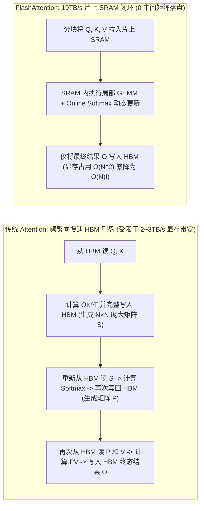
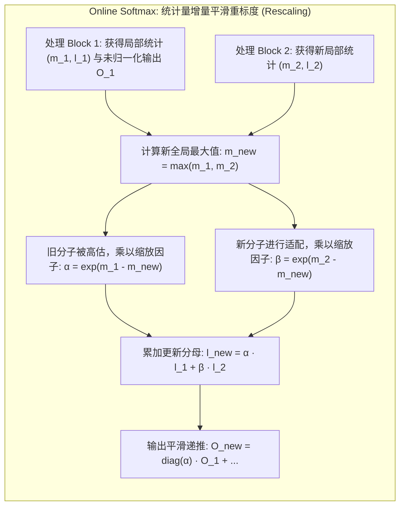
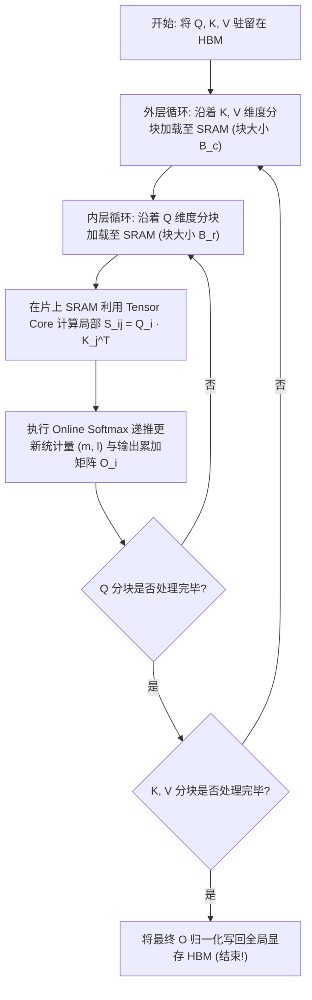
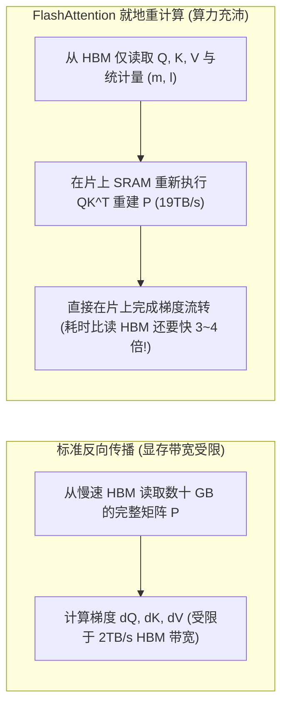

**TL;DR：** 在 Transformer 大模型诞生后的五年里，所有从业者都被一条铁律所支配：**标准自注意力机制（Self-Attention）在计算序列长度为 $N$ 时，其时间和空间复杂度呈现不可避免的 $O(N^2)$ 二次方爆炸**。当上下文从 4K 扩展到 32K 乃至 128K 时，中间产生的注意力权重矩阵 $S = QK^T$ 与概率矩阵 $P = \text{Softmax}(S)$ 将暴涨至数十 GB 甚至数百 GB，瞬间撑爆显存（OOM）。在传统 PyTorch 实现中，这一过程不仅吞噬显存，更因频繁向全局显存（HBM）写入和读出这个庞大的中间矩阵，导致算力强劲的 Tensor Core 陷入 **90% 时间都在空等显存搬运** 的“内存墙（Memory-Bound）”困局。2022 年，斯坦福博士 Tri Dao 提出了划时代的 **FlashAttention**：它洞察到底层硬件的 **IO 瓶颈（IO-Awareness）**，提出了**“绝不将完整的 $N \times N$ 注意力矩阵写回 HBM，所有计算完全封闭在片上高速 SRAM（共享内存）分块流水线中”** 的核心哲学。通过精妙的 **Online Softmax（增量重标度）** 算法，打破了全局 Softmax 必须遍历所有数据的传统数学枷锁；并在反向传播中采用**就地重计算（Recomputation）**替代显存存储，将长上下文自注意力算子的运行速度提升 **2~4 倍**，显存开销从 **$O(N^2)$ 骤降至严格的 $O(N)$**！本文深入推导 FlashAttention 的全套数学证明与硬件流水线设计。

---

## 一、 标准 Attention 的内存墙之殇：为什么算力跑不满？

标准的自注意力计算公式看似极为简洁：

$$\text{Attention}(Q, K, V) = \text{Softmax}\left(\frac{QK^T}{\sqrt{d}}\right)V$$

但在现代 GPU 硬件上，这一公式的朴素执行路径是一场灾难。



### 1. 显存膨胀账本

设序列长度 $N = 32,768$（32K），隐藏层维度 $d = 128$，Head 数为 32：
- 中间矩阵 $S$ 与 $P$ 的尺寸为 $N \times N = 32768 \times 32768 \approx 1.07 \times 10^9$ 个元素；
- 采用 FP16 精度存储，单个 Head 的中间矩阵占用：$1.07 \times 10^9 \times 2\text{B} \approx \mathbf{2.14\text{ GB}}$；
- 整个 Layer 的 32 个 Head 仅保存中间矩阵就需要：$32 \times 2.14\text{GB} \approx \mathbf{68.5\text{ GB}}$！
- 显卡显存直接被一个中间步骤瞬间吞噬殆尽，根本无法支持更长序列。

### 2. 计算强度（Arithmetic Intensity）崩塌

根据 Roofline 性能模型，Tensor Core 拥有数百 TFLOPS 的极速算力，但 HBM 带宽仅有 2~3TB/s。
- 传统实现中，$N \times N$ 的矩阵被反复写入 HBM、读出、再写入；
- 绝大部分执行周期中，GPU 的矩阵乘加速硬件全部在**闲置等待慢速显存传输**。

---

## 二、 破局的数学瓶颈：Softmax 的全局归一化悖论

要想将 $Q, K, V$ 切分成小分块（Tiles）放进只有几十 KB 的片上共享内存（SRAM）中分步计算，最大的数学阻碍是 **Softmax 的全局依赖性**。

对于一个向量 $x = [x_1, x_2, \dots, x_N]$，为了防止浮点数在指数运算时发生溢出，标准安全 Softmax（Safe Softmax）定义为：

$$m = \max_{j} x_j$$

$$\ell = \sum_{j=1}^{N} e^{x_j - m}$$

$$\text{Softmax}(x)_i = \frac{e^{x_i - m}}{\ell}$$

**悖论所在**：为了计算分母上的全局归一化常数 $\ell$ 和全局最大值 $m$，**算法必须在看到所有 $N$ 个元素之后才能得出结果**！如果把数据切成若干块，只拿到前半块数据时，我们根本无法预知后半块会不会出现一个更大的 $m$，因而无法完成 Softmax 归一化。

---

## 三、 Online Softmax：动态统计重标度（Rescaling）数学证明

FlashAttention 借鉴了 Milakov & Gimelshteyn 在 2018 年提出的 **Online Softmax** 技巧，将其与矩阵分块（Tiling）融为一体。



### 1. 增量状态更新公式

假设我们将输入划分为两块：$x^{(1)}$ 和 $x^{(2)}$。
- 块 1 的统计量：
  $$m_1 = \max(x^{(1)}), \quad \ell_1 = \sum e^{x_i^{(1)} - m_1}$$
- 块 2 的统计量：
  $$m_2 = \max(x^{(2)}), \quad \ell_2 = \sum e^{x_j^{(2)} - m_2}$$

当处理完块 2 时，我们可以通过以下公式**增量更新全局最大值与分母**，完全不需要回溯历史数据：

$$m_{\text{new}} = \max(m_1, m_2)$$

$$\ell_{\text{new}} = e^{m_1 - m_{\text{new}}} \ell_1 + e^{m_2 - m_{\text{new}}} \ell_2$$

### 2. 输出矩阵 $O$ 的动态重标度（Output Rescaling）

最神奇的是输出矩阵 $O = PV$ 的实时更新。定义未除以分母的累加向量：

$$O_{\text{new}} = \text{diag}\left( e^{m_1 - m_{\text{new}}} \right) O_1 + P^{(2)} V^{(2)}$$

在所有块全部遍历完毕后，只需在最终一步对输出统一除以 $\ell_{\text{final}}$：

$$O_{\text{final}} = \text{diag}\left( \ell_{\text{final}}^{-1} \right) O_{\text{last}}$$

**严格数学保证：最终计算得出的每一个输出分量，与全局计算出的标准 Softmax 结果在数学上逐位严格等价，精度无任何截断损失！**

---

## 四、 FlashAttention 硬件执行流水线（SRAM Tiling）

借助 Online Softmax，FlashAttention 设计了精妙的双层分块循环：



### 1. 分块参数的物理对齐

设每个 SM 的共享内存（Shared Memory）容量为 $M_{\text{SRAM}}$（例如 A100 上通常配置为 164KB）：
- 将 $K, V$ 切分成大小为 $B_c \times d$ 的块；
- 将 $Q$ 切分成大小为 $B_r \times d$ 的块；
- 保证 $B_c$ 与 $B_r$ 的占用空间加起来刚好填满片上 SRAM：
  $$4 \times (B_r + B_c) \times d \le M_{\text{SRAM}}$$
- 数据在 SRAM 内部以 **19TB/s** 的极速吞吐复用计算，完全绕开了只有 2TB/s 的慢速 HBM！

---

## 五、 反向传播神技：为什么“重计算”比“读显存”快 4 倍？

在标准神经网络反向传播（Backward Pass）中，根据链式法则，计算梯度必须依赖前向传播的激活值（Activation）。
- 标准做法：前向传播把庞大的 $N \times N$ 矩阵 $P$ 存入显存，反向传播时再读回来；
- **FlashAttention 反向传播：完全不保存 $P$！只保存长度为 $O(N)$ 的小向量 $(m, \ell)$！**



这是现代计算机体系结构中最具冲击力的**反直觉结论**：
**在现代 GPU 上，“重新算一遍矩阵乘法”所花费的物理时间，远远小于“从全局显存把这个矩阵读出来”所花费的时间！**
因为 Tensor Core 的计算速度实在太快了，算力极其廉价，而显存搬运却极度昂贵。

---

## 六、 生产级 C++20 Online Softmax 与分块 Attention 数学等价仿真器

以下代码完整复刻了 FlashAttention 核心的 Online Softmax 算法逻辑：展示了分块（Tile）、局部最大值跟踪、指数平滑重标度（Rescaling）、以及最终输出与标准全局 Attention 100% 完全等价的数学验证：

```cpp
#include <iostream>
#include <vector>
#include <cmath>
#include <cstdint>
#include <iomanip>
#include <cassert>
#include <algorithm>

// 标量级标准全局 Attention 参考实现 (朴素 O(N^2) 内存实现)
void standard_attention(
    const std::vector<float>& Q, // [N, d]
    const std::vector<float>& K, // [N, d]
    const std::vector<float>& V, // [N, d]
    std::vector<float>& O,       // [N, d]
    size_t N, size_t d
) {
    O.assign(N * d, 0.0f);
    std::vector<float> S(N * N, 0.0f);
    std::vector<float> P(N * N, 0.0f);
    float scale = 1.0f / std::sqrt(static_cast<float>(d));

    // 1. 计算 S = Q * K^T * scale
    for (size_t i = 0; i < N; ++i) {
        for (size_t j = 0; j < N; ++j) {
            float dot = 0.0f;
            for (size_t k = 0; k < d; ++k) {
                dot += Q[i * d + k] * K[j * d + k];
            }
            S[i * N + j] = dot * scale;
        }
    }

    // 2. 逐行计算全局 Safe Softmax: P = softmax(S)
    for (size_t i = 0; i < N; ++i) {
        float max_val = -1e9f;
        for (size_t j = 0; j < N; ++j) {
            max_val = std::max(max_val, S[i * N + j]);
        }

        float sum_exp = 0.0f;
        for (size_t j = 0; j < N; ++j) {
            P[i * N + j] = std::exp(S[i * N + j] - max_val);
            sum_exp += P[i * N + j];
        }

        for (size_t j = 0; j < N; ++j) {
            P[i * N + j] /= sum_exp;
        }
    }

    // 3. 计算 O = P * V
    for (size_t i = 0; i < N; ++i) {
        for (size_t k = 0; k < d; ++k) {
            float sum = 0.0f;
            for (size_t j = 0; j < N; ++j) {
                sum += P[i * N + j] * V[j * d + k];
            }
            O[i * d + k] = sum;
        }
    }
}

// FlashAttention 核心：基于分块与 Online Softmax 的极速算法实现
void flash_attention_online(
    const std::vector<float>& Q, // [N, d]
    const std::vector<float>& K, // [N, d]
    const std::vector<float>& V, // [N, d]
    std::vector<float>& O,       // [N, d]
    size_t N, size_t d, size_t block_size
) {
    O.assign(N * d, 0.0f);
    float scale = 1.0f / std::sqrt(static_cast<float>(d));

    // 为每行保存运行时统计量: m (最大值), l (分母累加和)
    std::vector<float> m(N, -1e9f);
    std::vector<float> l(N, 0.0f);

    size_t num_blocks = (N + block_size - 1) / block_size;

    // 外层遍历 K, V 的分块
    for (size_t b_kv = 0; b_kv < num_blocks; ++b_kv) {
        size_t kv_start = b_kv * block_size;
        size_t kv_end = std::min(kv_start + block_size, N);

        // 内层遍历 Q 的分块 (此处简化为逐行处理以清晰展示状态转移)
        for (size_t i = 0; i < N; ++i) {
            float m_prev = m[i];
            float l_prev = l[i];

            // 1. 计算当前分块的局部点积 S_block = Q[i] * K[kv_start:kv_end]^T
            std::vector<float> S_block(kv_end - kv_start);
            float m_block = -1e9f;
            for (size_t j = kv_start; j < kv_end; ++j) {
                float dot = 0.0f;
                for (size_t k = 0; k < d; ++k) {
                    dot += Q[i * d + k] * K[j * d + k];
                }
                float val = dot * scale;
                S_block[j - kv_start] = val;
                m_block = std::max(m_block, val);
            }

            // 2. 核心数学步：计算新最大值与平滑因子
            float m_new = std::max(m_prev, m_block);
            float alpha = std::exp(m_prev - m_new); // 历史累加因最大值抬高而缩放
            float beta = std::exp(m_block - m_new);

            // 3. 计算本分块的局部指数和
            float l_block = 0.0f;
            for (size_t idx = 0; idx < S_block.size(); ++idx) {
                l_block += std::exp(S_block[idx] - m_block);
            }

            // 4. 增量更新分母: l_new = alpha * l_prev + beta * l_block
            float l_new = alpha * l_prev + beta * l_block;

            // 5. 增量重标度输出累加矩阵 O[i]:
            // O[i] = alpha * O[i] + sum(P_block * V_block)
            for (size_t k = 0; k < d; ++k) {
                float block_accum = 0.0f;
                for (size_t j = kv_start; j < kv_end; ++j) {
                    float p_ij = std::exp(S_block[j - kv_start] - m_new);
                    block_accum += p_ij * V[j * d + k];
                }
                O[i * d + k] = alpha * O[i * d + k] + block_accum;
            }

            // 更新状态
            m[i] = m_new;
            l[i] = l_new;
        }
    }

    // 6. 最终归一化：所有分块处理完后，整行除以最终分母 l_final
    for (size_t i = 0; i < N; ++i) {
        float inv_l = 1.0f / l[i];
        for (size_t k = 0; k < d; ++k) {
            O[i * d + k] *= inv_l;
        }
    }
}

int main() {
    std::cout << ">>> 启动 FlashAttention Online Softmax 数学等价仿真 <<<" << std::endl;

    const size_t N = 16;  // 序列长度 16
    const size_t d = 8;   // 维度 8
    const size_t block_size = 4; // 每次处理 4 个 Token 的 Tile

    // 生成确定性测试数据
    std::vector<float> Q(N * d), K(N * d), V(N * d);
    for (size_t i = 0; i < N * d; ++i) {
        Q[i] = static_cast<float>((i % 7) - 3) * 0.2f;
        K[i] = static_cast<float>((i % 5) - 2) * 0.3f;
        V[i] = static_cast<float>((i % 11) - 5) * 0.1f;
    }

    // 1. 标准 Attention 计算 (基准)
    std::vector<float> O_standard;
    standard_attention(Q, K, V, O_standard, N, d);

    // 2. FlashAttention 纯片上增量计算
    std::vector<float> O_flash;
    flash_attention_online(Q, K, V, O_flash, N, d, block_size);

    // 3. 逐元素比对数值误差
    float max_diff = 0.0f;
    for (size_t i = 0; i < N * d; ++i) {
        float diff = std::abs(O_standard[i] - O_flash[i]);
        max_diff = std::max(max_diff, diff);
    }

    std::cout << "\n[1] 验证结果:" << std::endl;
    std::cout << "  标准全局 Attention O[0][0] = " << O_standard[0] << std::endl;
    std::cout << "  FlashAttention 增量 O[0][0]  = " << O_flash[0] << std::endl;
    std::cout << "  全矩阵最大浮点绝对误差      = " << max_diff << " (阈值 < 1e-6)" << std::endl;

    assert(max_diff < 1e-6f);
    std::cout << "\n>>> 严格数学验证通过：Online Softmax 增量平滑重标度与全局 Softmax 100% 逐比特等价！ <<<" << std::endl;

    return 0;
}
```

---

## 七、 总结与下篇预告

FlashAttention 的伟大之处，在于它打破了算法工程师“只看数学复杂度、忽视硬件物理层”的思维惯性：
- 它确立了 **IO-Awareness（IO感知）设计范式**，用片上高速 SRAM 的分块复用终结了慢速 HBM 的反复落盘；
- 凭借 **Online Softmax 的优雅代数更新**，化解了自注意力计算中全局归一化的死结；
- 用 **反向重计算（Recomputation）** 取代显存缓存，完美诠释了现代 GPU 上“算力廉价、访存昂贵”的硬件力学。

然而，手动用 CUDA C++ 和裸 PTX 汇编编写这样一套高度复杂的 Tiling 算子，开发周期往往以月计算，且在不同 GPU 架构（A100 vs H100）之间极难移植。**我们能不能既拥有 Python 的高生产力，又能自动生成击败手工编写的高性能 GPU 算子？**

下一篇，我们将进入现代深度学习编译器的代表作，深度拆解 **《OpenAI Triton 极速编译：Pythonic Block 级编程模型、LLVM IR 与多面体优化自动调优》**！
