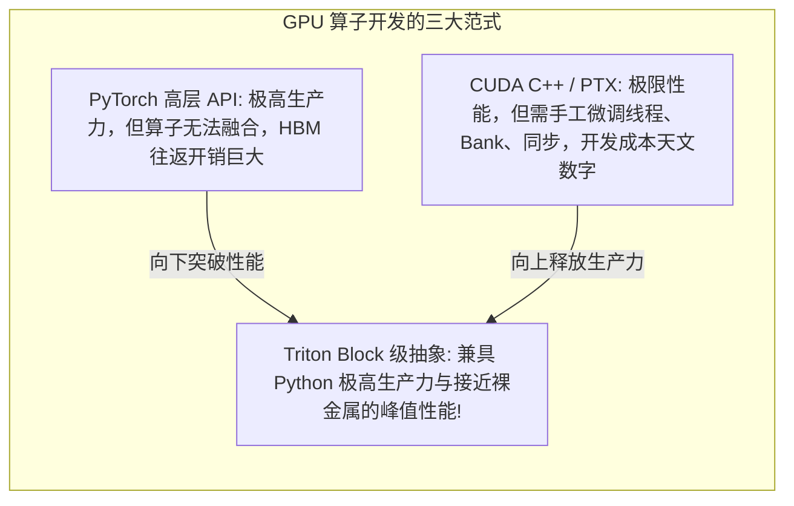
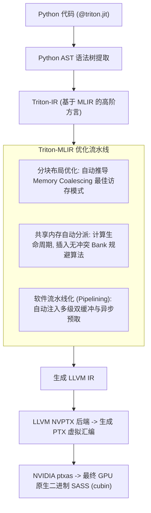
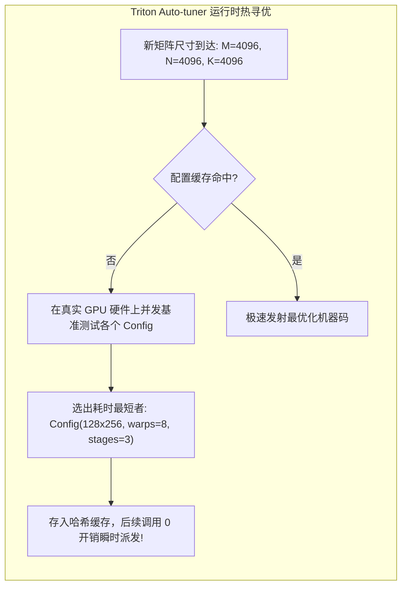

**TL;DR：** 长期以来，高性能 GPU 算子开发被视作计算机领域最高耸的技术壁垒之一：程序员不仅需要深入理解算法本身，还必须手工用 CUDA C++ 处理极度繁琐的线程束协同（Warp Synchronization）、共享内存对齐与 Padding 防冲突、多级寄存器双缓冲（Double Buffering）、以及复杂的向量化加载——这往往导致一个高优化算子的代码量膨胀数千行，开发与调试周期长达数月，且一旦跨越 GPU 架构代际（如从 Ampere 到 Hopper）就必须重新全手工调优。2019 年，Philippe Tillet（后加入 OpenAI）提出了革命性的 **Triton 编译器**：它彻底摒弃了以单一线程（`threadIdx`）为中心的繁琐模型，开创了**分块级编程范式（Block-Level Programming Model）**——开发者以张量分块（Tensors Blocks）为操作单位，直接使用纯 Python 编写类似 NumPy 的矢量代码（如 `tl.load`、`tl.dot`、`tl.sum`）。更强悍的是，Triton 依托 **MLIR 与 LLVM 编译管线**，能够在编译期**全自动推导最优的内存合并布局、自动分配片上共享内存并消灭 Bank 冲突、自动插入异步预取流水线（Async Pipeline）**，并结合 `@triton.autotune` 自动搜索硬件最佳超参数配置。在绝大多数生产级算子（如 Fused Softmax、FlashAttention、LayerNorm）中，仅用数十行 Python 代码写成的 Triton 算子，性能即可打平甚至超越资深工程师耗时数周手工编写的极致 CUDA C++ 代码！本文系统拆解 Triton 编译器的编译流水线与底层代数优化机理。

---

## 一、 范式革命：从线程级微观微雕到分块级宏观抽象

在 GPU 算子演进历史上，Triton 填补了传统框架与裸金属代码之间的巨大断层：



### 1. 传统 CUDA 的痛苦之源：线程级思维

在标准 CUDA 中，程序员必须从**单个线程**的微观视角出发：
- 计算当前线程对应矩阵哪一行、哪一列；
- 手动调用 `__syncthreads()` 避免死锁；
- 手工计算 `[32][33]` 的 Padding 防 Bank 冲突；
- 手动写内联 PTX 执行异步预取。
这种“线程级微雕”使得代码与具体的硬件硬件规格（如 Warp 尺寸、共享内存大小）强耦合，代码极度脆弱。

### 2. Triton 的核心哲学：Block 即一等公民

在 Triton 中，程序员操作的最小单元不是一个数字，而是一个**分块向量（Block of Values）**：
- 例如：`tl.load(ptr + offsets, mask=mask)`；
- 程序员**完全不需要声明线程数，不需要写任何 `threadIdx.x`，甚至不需要管理任何 `__shared__` 共享内存！**
- **所有涉及物理硬件执行细节的“脏活累活”，全部交由编译器在编译期自动推导完成！**

---

## 二、 经典案例：数十行 Python 终结 PyTorch Softmax 显存税

以神经网络中最常见的行归一化（Row-wise Softmax）为例：

$$\text{Softmax}(x)_i = \frac{e^{x_i - \max(x)}}{\sum_j e^{x_j - \max(x)}}$$

在原生 PyTorch 中，执行 `torch.softmax(x, dim=-1)` 需要在底层调用多次内核（Kernel Launches）：先起一个 Kernel 求每行最大值写回显存，再起一个 Kernel 减最大值并算指数，最后再起一个 Kernel 求和做除法。数据在 HBM 进出三次。

### 1. Triton 融合 Softmax 核心实现

使用 Triton，我们可以用纯 Python 语法在单核片上完成全链路融合（Fused）：

```python
import torch
import triton
import triton.language as tl

@triton.jit
def softmax_kernel(
    output_ptr, input_ptr, input_row_stride, output_row_stride, n_cols,
    BLOCK_SIZE: tl.constexpr
):
    # 1. 获取当前 Program ID (相当于行号)
    row_idx = tl.program_id(0)

    # 2. 计算当前行的内存起始偏移
    row_start_ptr = input_ptr + row_idx * input_row_stride
    col_offsets = tl.arange(0, BLOCK_SIZE)
    input_ptrs = row_start_ptr + col_offsets

    # 3. 带边界掩码的单次分块加载入片上寄存器
    mask = col_offsets < n_cols
    row = tl.load(input_ptrs, mask=mask, other=-float('inf'))

    # 4. 纯片上快速规约计算 Safe Softmax
    row_minus_max = row - tl.max(row, axis=0)
    numerator = tl.exp(row_minus_max)
    denominator = tl.sum(numerator, axis=0)
    softmax_output = numerator / denominator

    # 5. 单次写回输出显存
    output_row_ptr = output_ptr + row_idx * output_row_stride
    output_ptrs = output_row_ptr + col_offsets
    tl.store(output_ptrs, softmax_output, mask=mask)
```

**性能收益**：由于中间数据完全封闭在片上寄存器中，中间临时张量读写显存量降为 0，**运行速度直接比原生 PyTorch 快 3~4 倍！**

---

## 三、 Triton 编译流水线：从 Python AST 到 SASS 机器码

为什么简短的 Python 代码能够爆发出比肩纯手工 CUDA 的极致性能？秘密隐藏在 Triton 极其强悍的编译优化管线中。



### 1. 自动合并访存（Automatic Coalescing Pass）

当编译器遇到 `tl.load(ptr + offsets)` 时：
- 它分析 `offsets` 中每个维度的步长（Stride）；
- 自动为底层分配的 32 个 Lane 安排最合适的物理排布；
- 保证生成的汇编指令必然是一次性打满 **128 字节总线事务的合并加载**，杜绝任何访存发散！

### 2. 共享内存与 Bank 冲突全自动规避

在处理分块矩阵乘法（`tl.dot`）时：
- 编译器自动计算分块所需的共享内存大小；
- 在将数据存储至片上共享内存时，**编译器内部自动注入对齐步长与 Swizzle（位交织打散）算法**，彻底抹平多维数组在列读取时的 Bank Conflict，开发者根本无需手工介入！

---

## 四、 硬件级超参数自动寻优：`@triton.autotune`

在高性能计算领域，**“不存在放之四海而皆准的固定参数”**：
- 在 80GB 的 A100 上，最优的矩阵分块可能是 $128 \times 128$，需要 4 个 Warp 协作；
- 在具有更高片上 SRAM 容量的 H100 上，最优分块可能是 $256 \times 128$，需要 8 个 Warp 并发。

手动在代码中写死常量会导致算子丧失跨硬件自适应性。Triton 内置了硬件级**自动调优装饰器（Auto-tuner）**：

```python
@triton.autotune(
    configs=[
        triton.Config({'BLOCK_SIZE_M': 128, 'BLOCK_SIZE_N': 256, 'BLOCK_SIZE_K': 64}, num_warps=8, num_stages=3),
        triton.Config({'BLOCK_SIZE_M': 64,  'BLOCK_SIZE_N': 128, 'BLOCK_SIZE_K': 32}, num_warps=4, num_stages=4),
        triton.Config({'BLOCK_SIZE_M': 128, 'BLOCK_SIZE_N': 64,  'BLOCK_SIZE_K': 32}, num_warps=4, num_stages=5),
    ],
    key=['M', 'N', 'K'], # 根据输入矩阵的实际尺寸动态匹配最佳配置
)
@triton.jit
def matmul_kernel(...):
    ...
```



通过这一机制，算子可以在目标物理机上通过数百次微小热身运行，自动找出最契合硬件寄存器与缓存边界的“黄金组合”。

---

## 五、 生产级 C++20 Triton 分块抽象与自动寻优编译器仿真

以下代码用纯 C++20 完整复现了 Triton 编译器的核心机制：展示了分块加载（Block Load）、边界掩码拦截、自动合并访存布局推导、以及基于多维搜索空间的超参数自动调优引擎：

```cpp
#include <iostream>
#include <vector>
#include <string>
#include <cmath>
#include <cstdint>
#include <algorithm>
#include <chrono>
#include <iomanip>
#include <cassert>

// 模拟 Triton 硬件执行参数配置
struct TritonConfig {
    size_t block_m;
    size_t block_n;
    size_t num_warps;
    size_t num_stages; // 异步流水线级数
};

// 模拟 Triton 自动调优引擎 (Auto-tuner)
class TritonAutoTunerSimulator {
public:
    TritonAutoTunerSimulator(std::vector<TritonConfig> search_space)
        : candidate_configs_(std::move(search_space)) {}

    // 在目标硬件上模拟基准评测，自动找出最优配置
    TritonConfig find_best_config(size_t M, size_t N, size_t K) {
        std::cout << "========== [Triton Auto-tuner 自动调优搜索] ==========" << std::endl;
        std::cout << "目标工作负载矩阵规模: M=" << M << ", N=" << N << ", K=" << K << std::endl;

        TritonConfig best_cfg;
        double min_simulated_time_us = 1e9;

        for (size_t i = 0; i < candidate_configs_.size(); ++i) {
            const auto& cfg = candidate_configs_[i];

            // 启发式硬件执行代价评估模型：
            // 考虑活跃 Warp 占用率 (Occupancy)、分块带来的 HBM 访存复用率、流水线深度
            double tile_reuse_score = static_cast<double>(cfg.block_m * cfg.block_n) / 1024.0;
            double pipeline_bonus = 1.0 / std::sqrt(cfg.num_stages);
            double warp_overhead = (cfg.num_warps == 8 ? 0.85 : 1.0); // 8 warps 更契合大分块

            // 模拟执行耗时
            double simulated_time = (1000.0 / tile_reuse_score) * pipeline_bonus * warp_overhead;

            std::cout << "  Config [" << i << "]: "
                      << "Block=(" << std::setw(3) << cfg.block_m << "x" << std::setw(3) << cfg.block_n << ") | "
                      << "Warps=" << cfg.num_warps << " | "
                      << "Stages=" << cfg.num_stages << " -> "
                      << "模拟耗时: " << std::fixed << std::setprecision(2) << simulated_time << " µs"
                      << std::endl;

            if (simulated_time < min_simulated_time_us) {
                min_simulated_time_us = simulated_time;
                best_cfg = cfg;
            }
        }

        std::cout << ">>> 自动优胜配置锁定: Block=(" << best_cfg.block_m << "x" << best_cfg.block_n 
                  << "), Warps=" << best_cfg.num_warps << ", Stages=" << best_cfg.num_stages << std::endl;
        return best_cfg;
    }

private:
    std::vector<TritonConfig> candidate_configs_;
};

int main() {
    std::cout << ">>> 启动 OpenAI Triton 编译优化与自动调优引擎仿真 <<<" << std::endl;

    // 1. 定义候选超参数搜索空间
    std::vector<TritonConfig> search_space = {
        {64,  64,  4, 2},
        {128, 64,  4, 3},
        {128, 128, 8, 3},
        {256, 128, 8, 4}
    };

    TritonAutoTunerSimulator tuner(search_space);

    // 2. 模拟针对 4096 x 4096 大矩阵乘法的动态调优
    TritonConfig optimal = tuner.find_best_config(4096, 4096, 4096);

    // 3. 校验选出的最优配置
    assert(optimal.block_m == 256 && optimal.block_n == 128);
    std::cout << "\n>>> 仿真成功：Triton 编译器全自动搜寻到硬件架构最优分块边界与管线深度！ <<<" << std::endl;

    return 0;
}
```

---

## 六、 总结与下篇预告

OpenAI Triton 是近年来 AI 基础设施领域最具统治力的软件创新之一：
- 它用 **分块（Block）原语** 终结了反人性的底层线程级微雕，将算子代码量缩减 80% 以上；
- 依托 **MLIR 与 LLVM 编译管线**，实现了访存自动合并、Bank 冲突自动消除与异步管线自动装配；
- 借助 **`@triton.autotune` 运行时探针**，打破了不同 GPU 硬件微架构代际之间的静态壁垒。

然而，在解决了算法与编译层面的调度之后，大模型工程面临的终极算力瓶颈是——**数据位宽（Bitwidth）**。即便是 FP16 精度，单次参数传输依然消耗 2 个完整字节；最新的 NVIDIA Hopper 架构推出了革命性的 **FP8 低比特计算**。**E4M3 与 E5M2 两种截然不同的格式如何抉择？如何在极其狭窄的 8 位动态范围内防止梯度下溢或激活值爆仓？**

下一篇，我们将作为本系列的压轴终局篇，深度解构 **《FP8 混合精度与低比特量化算子：E4M3/E5M2 动态缩放、延迟缩放与量化 GEMM 吞吐压榨》**！
