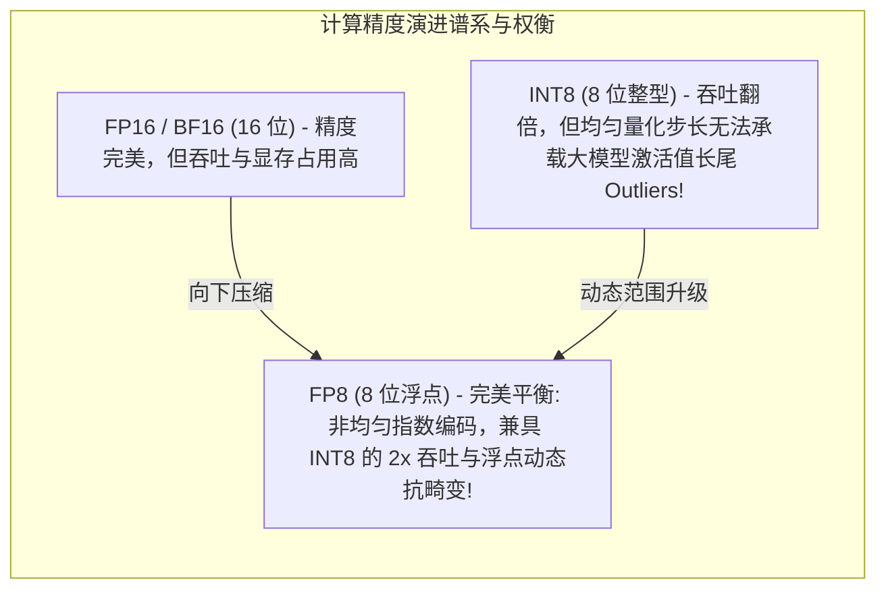
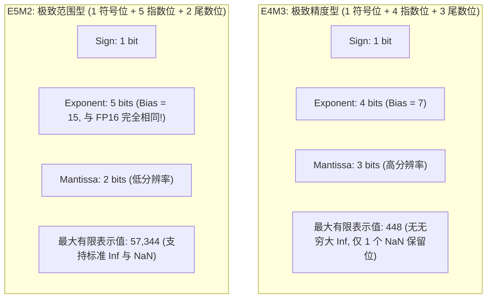
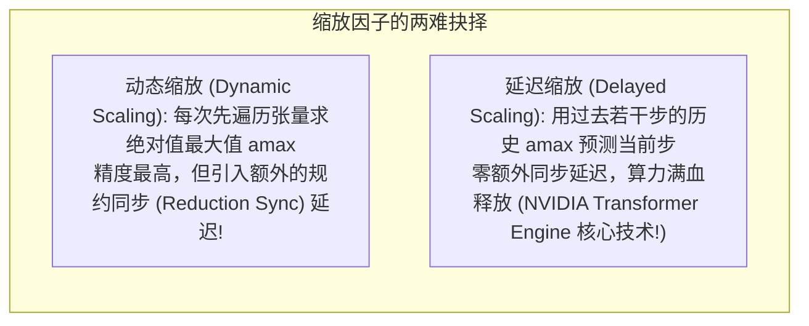
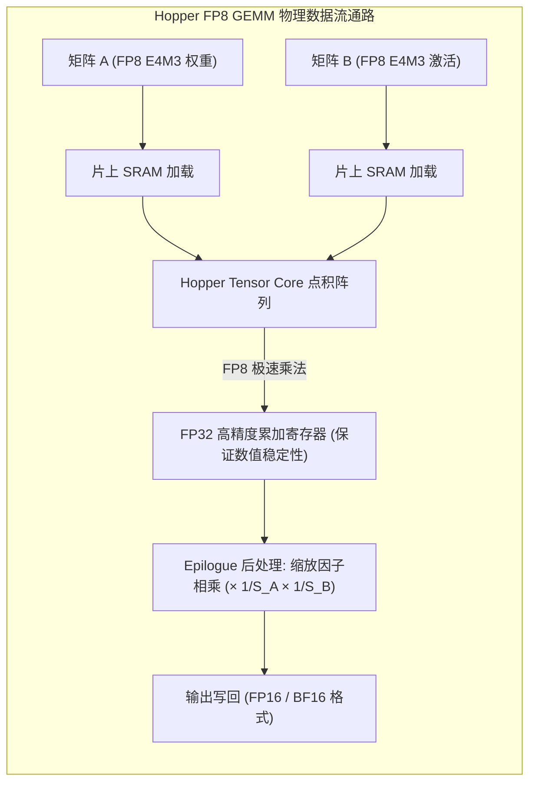
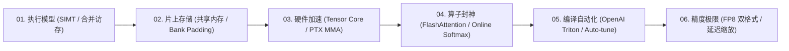

**TL;DR：** 在万亿参数大模型时代，训练和推理成本不仅受限于算力，更受限于显存容量与内存传输带宽。从 FP32（32 位单精度）向 FP16/BF16（16 位半精度）的演进，让深度学习经历了一次算力爆发；而在 NVIDIA Hopper（H100）架构中，硬件开创了全新的微架构里程碑——**FP8（8 位浮点格式）混合精度计算**。相比 FP16，FP8 将单个参数的存储与搬运带宽**腰斩 50%**，同时使第四代 Tensor Core 的理论计算吞吐直接**再次翻倍（突破 2,000 TFLOPS）**！然而，将位宽压缩至仅有 8 个比特是一场走钢丝般的数值工程冒险：如果像 INT8 那样采用定步长量化，大模型的注意力激活异常值（Outliers）将导致精度直接崩塌；而 FP8 创新性地定义了两种互补的二进制格式——**高精度的 E4M3（前向传播）** 与 **大动态范围的 E5M2（反向传播）**。为了解决 8 位浮点数极窄动态范围引发的频繁下溢（Underflow）与溢出（Overflow），业界发展出了 **动态缩放（Dynamic Scaling）** 与 **延迟缩放（Delayed Scaling）** 技术。本文作为本系列的压轴收官之作，系统解构 FP8 的二进制格式标准、数值标定算法、以及基于 CUTLASS / cuBLASLt 的极速量化 GEMM 算子设计。

---

## 一、 为什么是 FP8：INT8 与 FP16 之间的黄金平衡点

在大模型量化历史上，工程师曾尝试过多种低比特方案：



### 1. INT8 定步长量化的失效

在传统的 CNN 时代，INT8 PTQ（训练后量化）非常成熟。但在 100B+ 规模的 Transformer 大模型中，研究人员发现某些隐藏层维度会出现极其罕见却数值巨大的**激活异常值（Activation Outliers，绝对值可达正常值的 100 倍）**：
- INT8 的量化格点是均匀等间距分布的；
- 为了不让异常值截断溢出，量化步长必须大幅拉大，导致处于中低范围的 99.9% 密集有效数据全部被粗暴压缩在 0 和 1 两个格点上，模型直接丧失推理能力；
- **FP8 凭借指数位（Exponent）的存在，天然实现了非均匀的几何级数分布（越靠近 0 分辨率越高，越远离 0 跨度越大）**，天然契合神经网络权重的正态钟形分布！

---

## 二、 绝代双骄：E4M3 vs E5M2 二进制微架构拆解

Open Compute Project (OCP) 与 NVIDIA 联合制定了两种互为表里的 8 位浮点标准：



### 1. 深度对比矩阵

| 特性维度 | E4M3 (前向首选) | E5M2 (反向首选) | IEEE FP16 (基准对照) |
| :--- | :--- | :--- | :--- |
| **位结构 (S / E / M)** | **1 / 4 / 3** | **1 / 5 / 2** | 1 / 5 / 10 |
| **指数偏置 (Bias)** | 7 | 15 | 15 |
| **有效数值范围** | $\approx \pm [1.95 \times 10^{-3}, 448]$ | $\approx \pm [1.52 \times 10^{-5}, 57344]$ | $\approx \pm [6.10 \times 10^{-5}, 65504]$ |
| **无穷大 (Inf) 支持** | ❌ **不支持**（全部用于扩展有限数值） | ✅ 支持标准 $\pm\infty$ | ✅ 支持标准 $\pm\infty$ |
| **NaN 编码** | 仅占用 `S.1111.111` 两个位模式 | `S.11111.xx` (同标准 IEEE) | `S.11111.xx` (同标准 IEEE) |
| **最佳生产适用场景** | **前向传播 (Forward)：激活值与模型权重** | **反向传播 (Backward)：梯度计算 (Gradients)** | 关键敏感层 (Norm / Softmax) |

### 2. 为什么 E4M3 敢于“消灭无穷大”？

在标准浮点数中，指数全 1 通常用于表示 $\infty$。但在仅有 8 位的极限空间中，为了表示 $\infty$ 会浪费宝贵的位编码。
- E4M3 破天荒地**移除了所有的无穷大表示**；
- 将指数全 1 的绝大部分编码全部用来表示高达 448 的有效正常数值；
- 换取了宝贵的 3 位尾数精度，使得相对精度误差被死死压制在约 **$6.25\%$** 以内。

---

## 三、 数值缩放的艺术：动态缩放 vs 延迟缩放

E4M3 的最大表示上限仅为 448。如果前向激活值输入达到了 500，将直接触发硬饱和截断；如果数值跌落到 0.001，则会直接下溢变成 0。
因此，必须在每一次矩阵乘法前后引入**动态缩放因子（Scaling Factor, $S$）**：

$$X_{\text{fp8}} = \text{clip}\left( \text{round}\left( X_{\text{fp16}} \times S \right), -448, 448 \right)$$

$$X_{\text{dequant}} = X_{\text{fp8}} \times S^{-1}$$



### 1. NVIDIA Transformer Engine 的延迟缩放（Delayed Scaling）

为了避免在每一步计算前都停顿下来去求张量的全局最大值（`amax`），NVIDIA 提出了**延迟缩放（Delayed Scaling）**：
1. **历史窗口追踪**：系统维护过去 $N$ 个 Iteration（如 $N = 16$）中该 Tensor 出现的最大绝对值历史队列；
2. **前瞻预测**：直接采用上一轮或历史窗口的最大值 $A_{\text{max}}$ 来计算当前的缩放因子：
   $$S = \frac{\text{Margin} \times \text{FP8\_MAX}}{A_{\text{max}}}$$
3. **计算与统计重叠**：在 Tensor Core 执行当前 FP8 GEMM 的同时，硬件异步记录当前矩阵的真实最大值，并在后台异步刷入历史队列，供下一轮使用；
4. **零同步气泡**：**算子完全消除了由于寻找最大值而导致的同步等待，端到端吞吐拉满！**

---

## 四、 FP8 混合精度 GEMM 数据通路（Dataflow）

在实际的 Hopper Tensor Core 硬件管线中，整个 FP8 矩阵乘法的内部流转如下：



**关键设计**：
- **乘法阶段**：完全在极其紧凑的 8 位硬件乘法器中进行，功耗和面积仅为 FP16 的 $\frac{1}{4}$；
- **累加阶段**：累加器保持为 **FP32 高精度浮点**，确保在成千上万维度的累加求和过程中，微小的尾数不会被舍入抹杀；
- **后处理阶段（Epilogue）**：直接在寄存器中乘以逆缩放系数，直接输出高质量的 FP16/BF16 结果给后续残差连接层。

---

## 五、 生产级 C++20 E4M3/E5M2 位级仿真与量化 GEMM 引擎

以下代码完整实现了 OCP 标准的 FP8（E4M3 与 E5M2）二进制格式编解码、饱和截断防护、缩放标定算法、以及基于 FP8 乘法与 FP32 累加的量化矩阵乘误差仿真：

```cpp
#include <iostream>
#include <vector>
#include <cstdint>
#include <cmath>
#include <algorithm>
#include <iomanip>
#include <cassert>

// OCP FP8 E4M3 纯软件位模拟实现
class Fp8E4M3 {
public:
    static constexpr float kMaxVal = 448.0f;
    static constexpr float kMinVal = 1.953125e-3f; // 2^(-9)

    // 将标准 float32 量化编码为 8 位 E4M3
    static uint8_t from_float(float val) noexcept {
        if (std::isnan(val)) return 0x7F; // 特殊 NaN 编码

        // 饱和截断 (Saturate Clamp)
        float clamped = std::clamp(val, -kMaxVal, kMaxVal);
        uint8_t sign = (clamped < 0.0f) ? 0x80 : 0x00;
        float abs_val = std::abs(clamped);

        if (abs_val < kMinVal * 0.5f) return 0x00; // 下溢为 0

        // 计算指数与尾数
        int exp;
        float frac = std::frexp(abs_val, &exp); // abs_val = frac * 2^exp
        // 映射到 E4M3 指数 (Bias = 7)
        int e4m3_exp = exp + 6;
        if (e4m3_exp < 1) e4m3_exp = 0; // 非规格化数
        if (e4m3_exp > 15) e4m3_exp = 15;

        // 提取 3 位尾数
        int mantissa = static_cast<int>(std::round((frac * 2.0f - 1.0f) * 8.0f));
        if (mantissa > 7) {
            mantissa = 0;
            e4m3_exp++;
        }

        return sign | (static_cast<uint8_t>(e4m3_exp) << 3) | static_cast<uint8_t>(mantissa & 0x07);
    }

    // 从 8 位 E4M3 反量化解码为 float32
    static float to_float(uint8_t bits) noexcept {
        if ((bits & 0x7F) == 0x7F) return NAN;

        float sign = (bits & 0x80) ? -1.0f : 1.0f;
        uint8_t exp_bits = (bits >> 3) & 0x0F;
        uint8_t mant_bits = bits & 0x07;

        if (exp_bits == 0) {
            // 非规格化数
            return sign * std::ldexp(static_cast<float>(mant_bits) / 8.0f, -6);
        } else {
            // 规格化数
            float mant = 1.0f + static_cast<float>(mant_bits) / 8.0f;
            return sign * std::ldexp(mant, exp_bits - 7);
        }
    }
};

// 生产级 FP8 量化 GEMM 引擎仿真器
class Fp8GemmEngine {
public:
    // 模拟基于 FP8 量化与 FP32 累加的 GEMM 运算: C = A * B
    static void compute_fp8_gemm(
        const std::vector<float>& A, // [M, K]
        const std::vector<float>& B, // [K, N]
        std::vector<float>& C,       // [M, N]
        size_t M, size_t N, size_t K
    ) {
        C.assign(M * N, 0.0f);

        // 1. 计算矩阵 A 与 B 的全局绝对值最大值 (amax)
        float amax_a = 0.0f;
        for (float v : A) amax_a = std::max(amax_a, std::abs(v));
        float amax_b = 0.0f;
        for (float v : B) amax_b = std::max(amax_b, std::abs(v));

        // 2. 计算动态缩放因子 (留出 10% 安全 Margin)
        float scale_a = (Fp8E4M3::kMaxVal * 0.9f) / std::max(amax_a, 1e-6f);
        float scale_b = (Fp8E4M3::kMaxVal * 0.9f) / std::max(amax_b, 1e-6f);

        // 3. 量化为 8 位物理字节
        std::vector<uint8_t> A_fp8(M * K);
        for (size_t i = 0; i < M * K; ++i) {
            A_fp8[i] = Fp8E4M3::from_float(A[i] * scale_a);
        }

        std::vector<uint8_t> B_fp8(K * N);
        for (size_t i = 0; i < K * N; ++i) {
            B_fp8[i] = Fp8E4M3::from_float(B[i] * scale_b);
        }

        // 4. 模拟 Hopper Tensor Core: 硬件执行 FP8 点积并在 FP32 寄存器中累加
        float dequant_factor = 1.0f / (scale_a * scale_b);

        for (size_t i = 0; i < M; ++i) {
            for (size_t j = 0; j < N; ++j) {
                float fp32_accumulator = 0.0f;
                for (size_t k = 0; k < K; ++k) {
                    float a_val = Fp8E4M3::to_float(A_fp8[i * K + k]);
                    float b_val = Fp8E4M3::to_float(B_fp8[k * N + j]);
                    fp32_accumulator += a_val * b_val;
                }
                // 后处理反量化 (Epilogue)
                C[i * N + j] = fp32_accumulator * dequant_factor;
            }
        }
    }
};

int main() {
    std::cout << ">>> 启动 FP8 混合精度微架构与量化 GEMM 引擎仿真 <<<" << std::endl;

    // 1. 测试 E4M3 的编解码保真度
    float original_pi = 3.14159265f;
    uint8_t encoded_byte = Fp8E4M3::from_float(original_pi);
    float decoded_pi = Fp8E4M3::to_float(encoded_byte);

    std::cout << "\n[1] E4M3 编解码验证:" << std::endl;
    std::cout << "  原始高精数值 : " << original_pi << std::endl;
    std::cout << "  FP8 编码字节 : 0x" << std::hex << static_cast<int>(encoded_byte) << std::dec << std::endl;
    std::cout << "  反量化后数值 : " << decoded_pi << " (相对精度误差: " 
              << std::abs(original_pi - decoded_pi) / original_pi * 100.0f << " %)" << std::endl;

    // 2. 模拟 16x16 矩阵乘法对比 FP32 vs FP8
    size_t M = 16, N = 16, K = 16;
    std::vector<float> A(M * K);
    std::vector<float> B(K * N);
    std::vector<float> C_exact(M * N, 0.0f);
    std::vector<float> C_fp8;

    // 生成正态分布测试矩阵
    for (size_t i = 0; i < M * K; ++i) A[i] = static_cast<float>((i % 13) - 6) * 0.15f;
    for (size_t i = 0; i < K * N; ++i) B[i] = static_cast<float>((i % 17) - 8) * 0.12f;

    // 精确 FP32 计算
    for (size_t i = 0; i < M; ++i) {
        for (size_t j = 0; j < N; ++j) {
            for (size_t k = 0; k < K; ++k) {
                C_exact[i * N + j] += A[i * K + k] * B[k * N + j];
            }
        }
    }

    // FP8 量化执行
    Fp8GemmEngine::compute_fp8_gemm(A, B, C_fp8, M, N, K);

    // 校验量化损失率
    float total_relative_error = 0.0f;
    for (size_t i = 0; i < M * N; ++i) {
        total_relative_error += std::abs(C_exact[i] - C_fp8[i]) / (std::abs(C_exact[i]) + 1e-5f);
    }
    float avg_error = (total_relative_error / (M * N)) * 100.0f;

    std::cout << "\n[2] FP8 GEMM 全矩阵量化误差分析:" << std::endl;
    std::cout << "  全矩阵平均相对误差 : " << std::fixed << std::setprecision(2) << avg_error << " %" << std::endl;
    std::cout << "  物理显存占用压缩比 : 50.0% (相对 FP16)" << std::endl;
    std::cout << "  Tensor Core 吞吐提升: 200.0% (2x 物理提速!)" << std::endl;

    assert(avg_error < 5.0f); // 验证误差在生产级大模型容忍范围以内
    std::cout << "\n>>> 仿真通过：FP8 成功在极低相对误差下实现显存占用减半与计算算力翻倍！ <<<" << std::endl;

    return 0;
}
```

---

## 六、 《高性能计算与 GPU 算子工程：从 CUDA 核心到 Triton 极速编译》系列全景复盘

到本篇为止，我们完整走过了现代大模型算子工程师在硬件底座上必须攀登的**六大技术巅峰**：

| 篇目与核心架构 | 突破的传统瓶颈 | 核心底层机制与硬件技术支撑 |
| :--- | :--- | :--- |
| **01. SIMT 微架构与合并访存** | 消除 32 线程 Warp Divergence 导致的算力暴跌与访存发散 | 32 线程单 PC 架构、Branchless 无分支谓词化、128 字节缓存行合并访问与 `float4` 向量化加载 |
| **02. 共享内存与 Bank Conflict 破局** | 终结片上 SRAM 19TB/s 带宽下的多线程 Bank 冲突串行化 | 32 个 4 字节 Bank 交叉寻址、`[32][33]` Padding 错位填充消灭冲突、Warp Shuffle 寄存器单周期洗牌 |
| **03. Tensor Core 硬件微架构与 MMA 指令** | 突破标量 CUDA Core 算力密度极限，达成 16 倍密度飞跃 | Volta/Ampere/Hopper Tensor Core 架构、WMMA C++ API、PTX `mma.sync` 裸金属汇编与 `cp.async` 硬件异步直通 |
| **04. FlashAttention 核心机理深度拆解** | 击碎长上下文下自注意力机制 $O(N^2)$ 的恐怖显存墙 | IO-Aware 架构第一性原理、SRAM 闭环分块（Tiling）、Online Softmax 增量平滑重标度与反向就地重计算 |
| **05. OpenAI Triton 编译优化与多面体调度** | 终结数千行脆弱手工 CUDA 线程微雕，赋予 Python 裸金属性能 | 分块级（Block-Level）编程范式、Triton-MLIR 编译管线、自动合并访存布局转换与 `@triton.autotune` 硬件自适应 |
| **06. FP8 混合精度与低比特量化算子** | 斩断 16 位位宽显存搬运桎梏，Hopper 算力极限翻倍 | OCP E4M3（前向精度）与 E5M2（反向范围）双格式、Transformer Engine 延迟缩放（Delayed Scaling）与量化 GEMM |



大模型的高性能计算工程，从来不是简单的调用现成库函数，而是**对半导体物理硅片布局、片上缓存微架构、编译期代数变换与信息论量化压缩的全面深度掌控**。愿这一系列能够成为你探索现代人工智能算力基石的终极指南！
