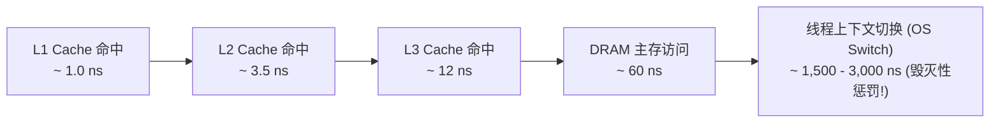
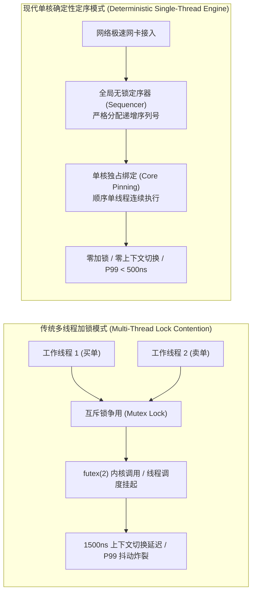
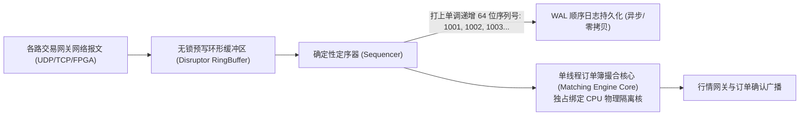
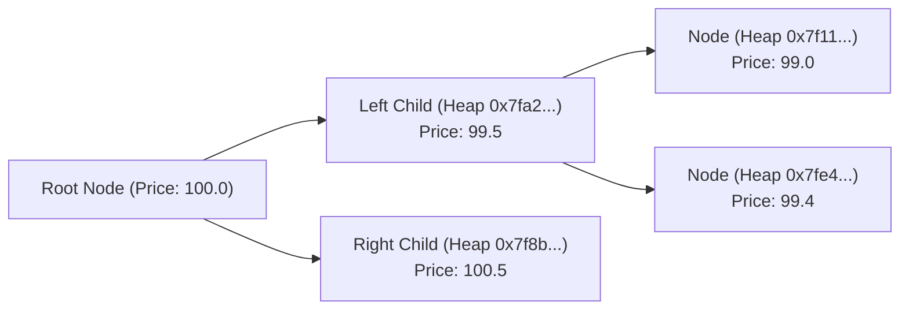
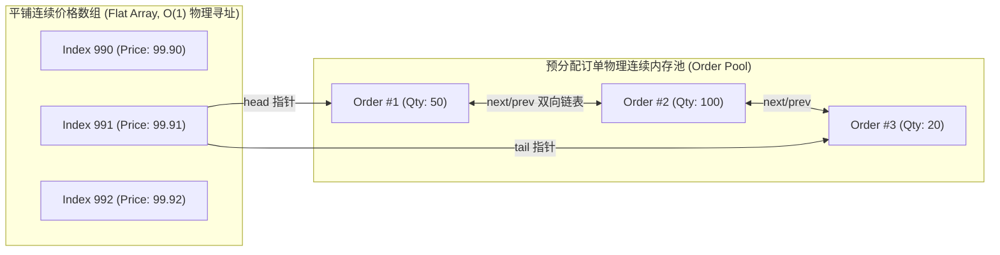
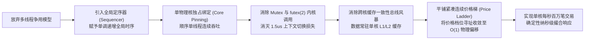

**TL;DR：** 在追求微秒乃至纳秒级极端延迟的金融交易、订单撮合与量化高频系统（HFT）中，传统的“多线程并发处理 + 互斥锁（Mutex）保护全局订单簿”架构并非性能救星，反而是引发延迟剧烈抖动与系统假死的**致命毒瘤**。一次 `pthread_mutex_lock` 在遭遇锁争用时，会触发内核 `futex(2)` 系统调用与线程上下文切换，引入高达 1~3 微秒的物理延迟——这在高频交易中相当于让光信号在光纤中往返传输了数百米！更致命的是，多核并发读写同一内存行会引发剧烈的 **MESI 缓存一致性总线风暴（Cache Invalidation Storm）** 与完全不可复现的非确定性竞态。本文以现代计算机体系结构的第一性原理为指引，深度拆解以 LMAX Exchange 和 Nasdaq INET 为代表的现代纯内存撮合引擎哲学：通过引入全局确定性定序器（Sequencer）将一切交易事件严格定序；结合单核独占绑定（CPU Core Pinning）与无锁顺序执行，消除全部锁竞争与内存屏障开销；利用平铺紧凑数组（Flat Array Price Ladder）替代传统红黑树，彻底消除指针追逐（Pointer Chasing）引发的 L1/L2 Cache Miss，实现单核每秒百万笔交易、确定性 P99.9 延迟低于 500 纳秒的极致性能天花板。

---

## 一、 纳秒世界观：多线程与互斥锁的“三宗罪”

在普通高并发 Web 业务（如电商秒杀、社交推送）中，瓶颈通常在于数据库 I/O 或分布式网络通信，业务响应时间以 50~200 毫秒为基准。多线程并发模型（Thread-per-Request 或 Worker Pool）能够有效填补 I/O 等待期间的 CPU 空闲。

然而，在交易所与做市商的内部核心环路中，**全部数据已预先常驻于纯内存中**。在这个尺度下，计算机硬件的物理延迟基准彻底发生了时空折叠：



在 1 纳秒只能完成大约 3~4 次 CPU 简单时钟周期的极端边界下，传统的多线程加锁撮合架构暴露出了三大致命死穴：

### 1. 第一宗罪：上下文切换与 `futex` 的微秒级停顿

当线程 A 持有订单簿（OrderBook）的互斥锁时，线程 B 尝试加锁失败。在 Linux 内核调度中：
1. 线程 B 自旋若干周期后宣告失败，陷入内核态调用 `futex(FUTEX_WAIT)`；
2. 内核调度器保存线程 B 的寄存器、栈指针与 CPU 上下文，将其挂入等待队列；
3. CPU 被迫进行上下文切换（Context Switch）去运行其他任务，**整个过程消耗 1,500 ~ 3,000 纳秒（1.5 ~ 3 微秒）**；
4. 当线程 A 释放锁时，内核必须重新唤醒线程 B，这又是一次昂贵的跨核调度开销。

对于单笔订单撮合仅需 200 纳秒的撮合引擎而言，**仅仅是一次由于锁争用引起的系统调用与上下文切换，就足足浪费了执行 10~15 笔交易的宝贵时间**！



### 2. 第二宗罪：多核 MESI 缓存一致性风暴（Cache Line Bouncing）

很多初级架构师试图采用“细粒度读写锁”或“无锁 CAS 队列”来替代互斥锁，但依然将多个买卖线程部署在不同的 CPU 核心上并发读写同一个订单簿。

这必然撞上现代 CPU 多核互联的硬件物理墙——**MESI（Modified, Exclusive, Shared, Invalidated）缓存一致性协议**：
- 当 Core 0 上的线程修改了订单簿中的盘口价格时，Core 0 对应的 L1/L2 缓存行被标记为 `Modified`（修改态）；
- 硬件总线立即向所有其他核心广播 `Invalidate`（无效化）信号；
- Core 1 上的线程正尝试读取该价格，发现自己的 L1/L2 缓存行被强行置为 `Invalid`，只能暂停流水线，穿透所有缓存去向 Core 0 或 L3 跨核心拉取最新数据。

这种现象在体系结构中被称为**缓存行颠簸（Cache Line Bouncing）**。多个 CPU 核心在硬件互联总线上疯狂抢占同一块内存的独占写权限，总线带宽被消耗殆尽，CPU 流水线频繁停顿（Stall），其实际性能往往比单核单线程还要慢上数倍！

### 3. 第三宗罪：非确定性与死灾难（Non-Deterministic Recovery）

在金融与合规要求下，交易系统必须具备 100% 可复现的容灾与审计能力。如果系统崩溃，运维团队必须能够通过回放日志，在备机上分毫不差地还原出崩溃前那一刻的订单簿状态。

在多线程环境下，不同线程抢到锁的先后顺序取决于纳秒级的微小物理温度、电源波动与操作系统调度抖动。**每一次并发执行的订单先后交织顺序都是完全随机、不可复现的**！当主备切换或灾难恢复时，备机几乎不可能仅凭输入日志重现主机的非确定性状态交错。

---

## 二、 破局哲学：机械同理心与单线程确定性定序器（Sequencer）

2010 年，Martin Thompson 等人在 LMAX Exchange 的架构设计中提出了著名的**“机械同理心”（Mechanical Sympathy）**哲学：**软件系统的设计必须顺应底层硬件的物理运行规律，而不是强行违背它**。

现代 CPU 拥有极高的单核时钟频率（4.0GHz ~ 5.5GHz）、深度的超标量流水线（Superscalar Pipeline）以及极快的纳秒级 L1 数据缓存（每个时钟周期可完成多次读写）。CPU 最喜欢的负载，是**在同一个核心上，按顺序、无争用、紧凑地执行连续的指令与数组操作**。

### 1. 全局定序器（Sequencer）的核心契约

现代高性能交易系统彻底摒弃了“并发修改状态”的思路，将整个系统拆分为两个完全解耦的阶段：



1. **定序阶段（Sequencing）**：
   来自全国/全球多路网关的订单报文进入系统后，唯一的定序器（Sequencer）以极高速度为其赋予一个**全局单调递增的 64 位序列号（Sequence Number）**；
2. **执行阶段（Deterministic Execution）**：
   撮合引擎由一个**单独的、独占绑定在独立物理 CPU 核心上的工作线程**驱动。该线程以严格的 FIFO 顺序消费定序后的事件；
3. **确定性成果**：
   因为整个撮合逻辑是完全单线程的：
   - 彻底不再需要任何互斥锁、自旋锁或无锁 CAS 原子操作；
   - 订单簿内存永远只常驻在当前核心的 L1/L2 缓存中，**MESI 缓存失效彻底归零**；
   - 只要输入序列相同，任何机器在任何时刻重放，必定产生 100% 绝对一致的撮合结果与成交状态！

---

## 三、 内存布局革命：从红黑树指针地狱到平铺价格梯（Flat Price Ladder）

确定了单核单线程模型后，下一个性能杀手隐藏在订单簿内部的数据结构选型中。

### 1. 学院派红黑树（`std::map`）的指针地狱（Pointer Chasing）

很多传统教科书教导学生使用红黑树（Red-Black Tree）或跳表（SkipList）来维护订单簿的价格档位，因为它们在算法复杂度上拥有优雅的 $\mathcal{O}(\log N)$：



然而在真实的硬件物理层面，这是一种极其低效的内存布局：
- 红黑树的每个节点都是在操作系统堆（Heap）上独立 `malloc` 分配的，物理内存地址完全离散随机；
- 沿着树向下查找某个价格档位时，CPU 必须每一次都解引用一个冷指针去访问未知的内存地址；
- 每次解引用几乎必定产生一次 **L1/L2 缓存不命中（Cache Miss）**，CPU 被迫停顿几十纳秒等待从慢速主存中加载数据。

在现代高频交易中，**算法常数和内存连续性远比大 $\mathcal{O}$ 复杂度更为重要**！

### 2. 平铺价格梯（Flat Array Price Ladder）的设计艺术

在金融交易中，品种的价格变动存在一个极其宝贵的物理特性——**最小价格跳动单位（Tick Size）**与**有效价格区间（Price Band）**。

例如，某期货合约的当前基准价为 100.00 元，Tick Size 为 0.01 元，允许的价格上下浮动区间（涨跌停限制）为 $\pm 10\%$（即 90.00 ~ 110.00 元）。在这个区间内，全部合法的价格档位总数只有：
$$N = \frac{110.00 - 90.00}{0.01} = 2000 \text{ 个档位}$$

我们根本不需要什么复杂的二叉平衡树，**只需要在连续的物理内存中预分配一个固定大小的平铺数组**！



- **价格索引直接映射（Direct Indexing）**：
  给定任意价格 $P$，其对应的价格档位数组下标可以直接通过简单算术公式算出：
  $$\text{Index} = \frac{P - P_{base}}{\text{TickSize}}$$
  时间复杂度是真正绝对的 **$\mathcal{O}(1)$**，只需单次内存基址加偏移量指令即可直达目标盘口！
- **时间优先双向链表（FIFO Intrusive List）**：
  在每一个价格档位内部，订单以双向侵入式链表形式排队。所有 `Order` 结构体均从全局预分配的连续内存池（Pool）中申请，严禁运行时动态分配内存。挂单插入只需接在 `tail` 之后，撤单只需将自身从链表中解开，全部操作在 **10~20 纳秒** 内纯指令完成。

---

## 四、 极速撮合流水线：无分支化与缓存行对齐

在单核执行循环中，代码细节的微小优化会直接放大数十倍的吞吐差异。

### 1. 结构体缓存行对齐（64-Byte Cache Line Alignment）

现代 x86-64 / ARM64 处理器的缓存行（Cache Line）大小为 64 字节。一个精心排布的 `Order` 结构体应当严格控制在 64 字节以内，并使用 `alignas(64)` 修饰：

```cpp
struct alignas(64) Order {
    uint64_t orderId;       // 8 bytes
    uint64_t clientOrderId; // 8 bytes
    uint32_t price;         // 4 bytes (以 Tick 整数存储)
    uint32_t remainingQty;  // 4 bytes
    uint32_t filledQty;     // 4 bytes
    Side     side;          // 1 byte (Buy/Sell)
    uint8_t  padding[3];    // 3 bytes 显式对齐
    Order*   prev;          // 8 bytes
    Order*   next;          // 8 bytes
    uint64_t timestampNs;   // 8 bytes
    // 总计精确 56 字节，填充至 64 字节整缓存行
};
```
当 CPU 从内存加载一个 `Order` 时，**单次访存指令即可将订单的全部核心字段一次性拉入 L1 缓存**，绝不会发生跨缓存行加载惩罚。

### 2. 消除分支预测失败（Branchless Min Matching）

在撮合逻辑中，需要频繁比较“吃单委托量（Take Qty）”与“被吃单剩余挂单量（Maker Qty）”以决定成交量：
```cpp
// 带有分支的传统写法 (在 CPU 分支预测失败时停顿 15~20 个周期)
uint32_t matchQty;
if (takerQty < makerQty) {
    matchQty = takerQty;
} else {
    matchQty = makerQty;
}
```
通过编写免分支（Branchless）代码，编译器能够直接生成现代 CPU 的条件传送指令（如 x86 的 `CMOVLE`）：
```cpp
// 免分支汇编生成优化
uint32_t matchQty = (takerQty < makerQty) ? takerQty : makerQty;
```
彻底消除分支预测器（Branch Predictor）因价格波动频繁失真而导致的 CPU 指令流水线清空（Pipeline Flush）。

---

## 五、 完整工业级 C++20 纯内存撮合引擎核心实现

以下给出了符合高频交易规范的单核无锁纯内存价格时间优先撮合引擎核心参考实现：

```cpp
#include <iostream>
#include <vector>
#include <cstdint>
#include <memory>
#include <algorithm>

enum class Side : uint8_t { Buy = 0, Sell = 1 };

struct alignas(64) Order {
    uint64_t orderId;
    uint32_t price;        // 紧凑价格 tick (例如 10050 代表 100.50)
    uint32_t remainingQty;
    Side     side;
    Order*   prev{nullptr};
    Order*   next{nullptr};
};

// 价格档位结构：维护该价格下的订单 FIFO 队列
struct alignas(64) PriceLevel {
    uint32_t price{0};
    uint64_t totalVolume{0};
    Order*   head{nullptr};
    Order*   tail{nullptr};

    inline bool isEmpty() const { return head == nullptr; }

    inline void addOrder(Order* order) {
        order->prev = tail;
        order->next = nullptr;
        if (tail) {
            tail->next = order;
        } else {
            head = order;
        }
        tail = order;
        totalVolume += order->remainingQty;
    }

    inline void removeOrder(Order* order) {
        if (order->prev) order->prev->next = order->next;
        if (order->next) order->next->prev = order->prev;
        if (head == order) head = order->next;
        if (tail == order) tail = order->prev;
        totalVolume -= order->remainingQty;
        order->prev = nullptr;
        order->next = nullptr;
    }
};

// 单线程极致撮合核心
class FastMatchingEngine {
private:
    static constexpr uint32_t MAX_PRICE_TICKS = 10000;
    static constexpr uint32_t BASE_PRICE_TICK = 50000; // 基准价格 500.00

    // 平铺连续价格梯：直接通过 Tick 偏置定位 (零 Cache Miss 寻址)
    std::vector<PriceLevel> buyLevels;
    std::vector<PriceLevel> sellLevels;

    uint32_t bestBidIndex{0};
    uint32_t bestAskIndex{MAX_PRICE_TICKS - 1};

public:
    FastMatchingEngine() : buyLevels(MAX_PRICE_TICKS), sellLevels(MAX_PRICE_TICKS) {
        for (uint32_t i = 0; i < MAX_PRICE_TICKS; ++i) {
            buyLevels[i].price = BASE_PRICE_TICK + i;
            sellLevels[i].price = BASE_PRICE_TICK + i;
        }
    }

    /**
     * 单核无锁处理订单进入: 撮合 -> 消耗盘口 -> 未成交部分挂单
     */
    inline void processOrder(Order* incoming) {
        if (incoming->side == Side::Buy) {
            matchBuy(incoming);
        } else {
            matchSell(incoming);
        }
    }

private:
    inline void matchBuy(Order* buyOrder) {
        // 买单从最低卖价 (bestAskIndex) 向上吃单
        while (buyOrder->remainingQty > 0 && bestAskIndex < MAX_PRICE_TICKS) {
            PriceLevel& level = sellLevels[bestAskIndex];
            if (level.isEmpty()) {
                bestAskIndex++;
                continue;
            }

            // 价格不满足限价约束 (卖方价格高于买单出价)
            if (level.price > buyOrder->price) break;

            // 在该价格档位内遵循时间优先 FIFO 撮合
            Order* maker = level.head;
            while (maker && buyOrder->remainingQty > 0) {
                // 免分支选择撮合量
                uint32_t matchQty = std::min(buyOrder->remainingQty, maker->remainingQty);
                
                // 执行成交扣减
                buyOrder->remainingQty -= matchQty;
                maker->remainingQty -= matchQty;
                level.totalVolume -= matchQty;

                Order* nextMaker = maker->next;
                if (maker->remainingQty == 0) {
                    level.removeOrder(maker);
                }
                maker = nextMaker;
            }
        }

        // 若买单有剩余委托量，按被动单插入买单价格梯
        if (buyOrder->remainingQty > 0) {
            uint32_t idx = buyOrder->price - BASE_PRICE_TICK;
            if (idx < MAX_PRICE_TICKS) {
                buyLevels[idx].addOrder(buyOrder);
                if (idx > bestBidIndex) bestBidIndex = idx;
            }
        }
    }

    inline void matchSell(Order* sellOrder) {
        // 卖单从最高买价 (bestBidIndex) 向下吃单
        while (sellOrder->remainingQty > 0 && bestBidIndex > 0) {
            PriceLevel& level = buyLevels[bestBidIndex];
            if (level.isEmpty()) {
                bestBidIndex--;
                continue;
            }

            // 价格不满足限价约束 (买方价格低于卖单出价)
            if (level.price < sellOrder->price) break;

            Order* maker = level.head;
            while (maker && sellOrder->remainingQty > 0) {
                uint32_t matchQty = std::min(sellOrder->remainingQty, maker->remainingQty);

                sellOrder->remainingQty -= matchQty;
                maker->remainingQty -= matchQty;
                level.totalVolume -= matchQty;

                Order* nextMaker = maker->next;
                if (maker->remainingQty == 0) {
                    level.removeOrder(maker);
                }
                maker = nextMaker;
            }
        }

        // 若卖单有剩余委托量，挂入卖单盘口
        if (sellOrder->remainingQty > 0) {
            uint32_t idx = sellOrder->price - BASE_PRICE_TICK;
            if (idx < MAX_PRICE_TICKS) {
                sellLevels[idx].addOrder(sellOrder);
                if (idx < bestAskIndex) bestAskIndex = idx;
            }
        }
    }
};
```

---

## 六、 生产级防御指南：单线程架构的脆弱性与规避策略

虽然单线程纯内存引擎在延迟上拥有绝对压制力，但在系统工程层面它将全部鸡蛋放在了一个篮子里，必须在控制面实施严格的安全防线：

| 故障模式 | 事故破坏力 | 生产级终极防护策略 |
| :--- | :--- | :--- |
| **单核假死导致全场瘫痪** | 撮合核心由于死循环或复杂指令异常导致整个市场停止响应 | **看门狗中断监控（Watchdog Timer）**：独立伴侣线程通过共享原子时钟戳监控心跳，单微秒无响应立即触发备机热接管 |
| **操作系统抖动（OS Jitter）** | 内核中断、时钟中断或调度窃取导致产生 20 微秒延迟毛刺 | **CPU 独占隔离**：Linux 引导参数配置 `isolcpus` 与 `nohz_full`，将特定核心完全从内核调度器中剥离 |
| **内存无限膨胀导致 OOM** | 恶意高频做市商疯狂高频挂单撤单，耗尽物理内存 | **固定容量预分配内存池（Object Slab Pool）**：系统启动时预分配 1000 万个订单对象，一旦配额越线直接在网关层丢弃新挂单 |
| **重放日志过大重启缓慢** | 运行一周后日志达数百 GB，灾备恢复需要耗时数小时 | **微秒增量快照（Incremental Snapshots）**：在行情间隙通过 CoW 或后台线程定格内存镜像，结合增量日志实现秒级冷启 |

---

## 七、 总结与因果主线全景图

在追求物理极限的计算世界中，“少即是多”的哲学再次展现了其强大的统治力：



1. **并行不等于高性能**：当工作负载处于微秒与纳秒尺度且存在强状态共享时，任何跨核心的数据同步都会演变为性能灾难；
2. **定序先于执行**：通过在网关入口处以极低开销完成全局定序，执行阶段的全部并发冲突被就地消解；
3. **拥抱硬件物理现实**：对齐缓存行、消除分支预测失败、平铺内存数组——只有与现代处理器的微体系结构共舞，才能真正突破通用软件工程的性能天花板。
