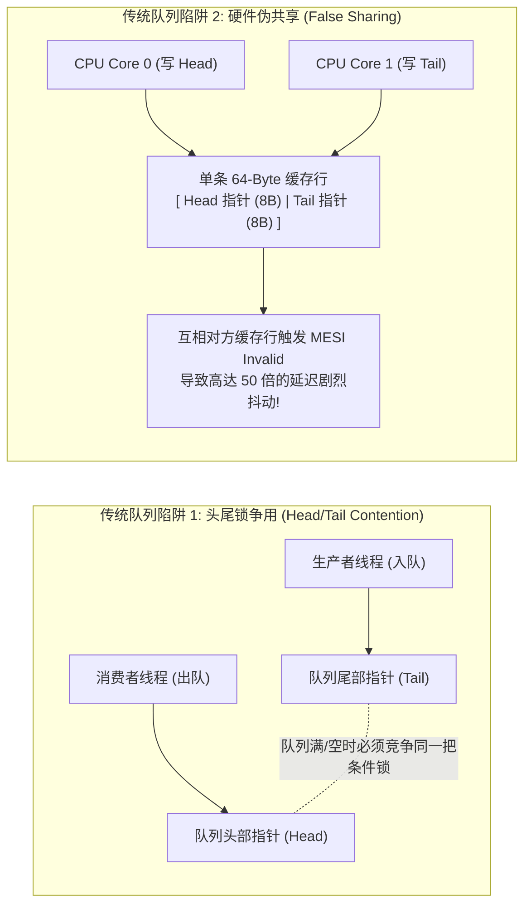
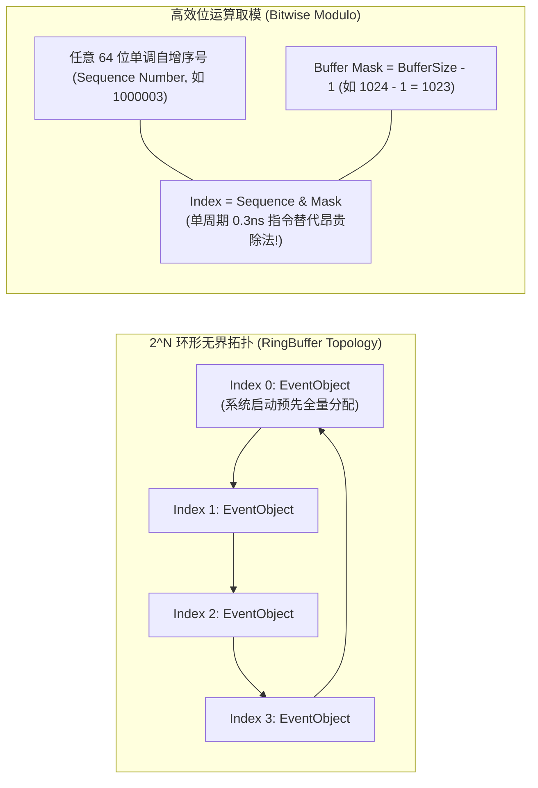
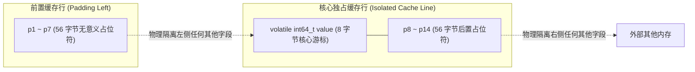
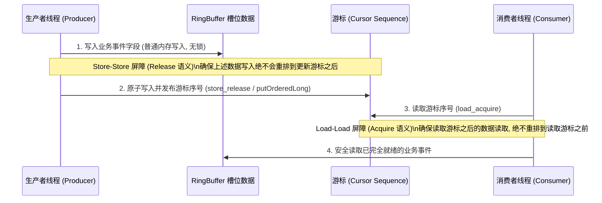
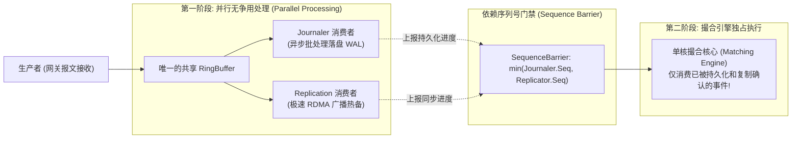
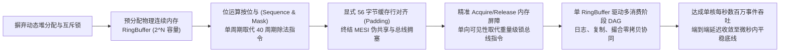

**TL;DR：** 在高吞吐、微秒级交易系统的数据总线设计中，传统的线程间通信管道（如 Java 的 `ArrayBlockingQueue`、Go 的 `channel` 或 C++ 的 `std::queue + mutex`）存在三大隐形性能杀手：头尾指针锁争用、动态节点内存分配与不可见的 **CPU 缓存行伪共享（False Sharing）**。2011 年，LMAX 交易团队开源了颠覆传统并发认知的 **Disruptor** 框架，凭借单线程每秒处理 600 万笔订单、端到端延迟仅数百纳秒的惊人表现斩获行业大奖。本文以体系结构底层为剖析基石，深度解密 Disruptor 的“机械同理心”精髓：通过预分配连续物理内存的环形缓冲区（RingBuffer）与 $2^N$ 掩码位运算消除寻址开销与 GC 停顿；利用 56 字节缓存行显式填充（Padding）彻底终结多核 MESI 缓存失效风暴；采用精确的 Acquire/Release 内存屏障取代重量级互斥锁；并基于序列号（Sequence）栅栏构建“日志持久化、异地热备复制与订单撮合”并行流水线，全景还原顶级并发利器的硬件级设计内幕。

---

## 一、 并发队列之死：为什么通用阻塞队列撑不住交易总线？

在典型的微服务或业务架构中，两个线程之间传递数据最自然的选择是并发队列（Queue）。例如在 Java 中使用 `ArrayBlockingQueue` 或 `LinkedBlockingQueue`，在 Go 中使用带缓冲的 `channel`。

但在纳秒级的交易系统中，这类通用数据结构会在底层硬件层面引发毁灭性的性能塌陷：



### 1. 头尾指针的锁争用（Head/Tail Lock Contention）

对于大多数有界队列（Bounded Queue）：
- 生产者需要修改 `tail` 指针，消费者需要修改 `head` 指针；
- 当队列接近填满或接近排空时，生产者和消费者必须同时争夺同一个内部锁（或条件变量 `notFull` / `notEmpty`）；
- 即便采用无锁的 Michael & Scott 队列算法（CAS 操作），高并发下多个核心对同一个指针自旋重试，也会引发严重的总线拥塞。

### 2. 动态堆分配引发的缓存失效（Cache Miss）与 GC 停顿

基于链表的队列（如 `LinkedBlockingQueue` 或无锁链表）：
- 每一个入队事件都必须临时 `new Node(event)`，在堆（Heap）上动态分配内存；
- 这些 Node 在物理内存中的分布完全随机离散；
- 消费者在出队遍历时，每次指针解引用几乎必定产生 **L1/L2 Cache Miss**，CPU 只能傻等 DRAM 主存漫长的 60 纳秒延迟；
- 大量短命对象的频繁创建与回收，更会诱发垃圾回收器（GC）的周期性 STW 停顿。

### 3. 隐形刺客：CPU 缓存行伪共享（False Sharing）

现代主流处理器（x86-64 / ARM64）与内存交互的最小物理单元不是单个字节，而是 **64 字节的缓存行（Cache Line）**。

假设一个队列类中定义了两个独立的 64 位长整型指针：
```cpp
uint64_t head; // 8 字节
uint64_t tail; // 8 字节
```
在物理内存排布中，这两个变量紧挨在一起，必定落在**同一条 64 字节的缓存行内部**：
1. Core 0 上的消费者读取并更新了 `head`，Core 0 的 L1 缓存行被标记为 `Modified`；
2. 此时，底层硬件总线根据 MESI 协议，**强制将所有其他核心上的这一整条 64 字节缓存行全部作废（Invalidate）**；
3. Core 1 上的生产者实际上**完全没有碰 `head`，它只是在写 `tail`**！但由于它不幸与 `head` 挤在同一个缓存行里，Core 1 的硬件流水线被迫挂起停顿，必须重新从主存拉取整条缓存行；
4. 生产者刚写完 `tail`，Core 0 的缓存行又被作废……

两个核心如同在同一块黑板的相邻区域写字，互相抢夺粉笔和板擦。这种在逻辑上毫无共享关系、却在物理硬件上因同属一个缓存行而导致的性能暴跌，被称为**伪共享（False Sharing）**。基准实测显示，伪共享能让本该在 2 纳秒完成的操作暴增至 **80~150 纳秒，性能暴跌数十倍**！

---

## 二、 空间哲学：预分配物理环形缓冲区（RingBuffer）

LMAX Disruptor 的第一项核心革新，是彻底消灭动态对象创建与堆指针追踪，引入**物理预分配的环形缓冲区（RingBuffer）**。



### 1. $2^N$ 掩码位运算消除硬件除法

在环形缓冲区中，给定一个持续单调递增的 64 位整数序号（Sequence Number），如何定位其在固定数组中的槽位索引？

传统写法采用算术取模操作：
```cpp
uint64_t index = sequence % bufferSize;
```
在底层汇编中，整数除法指令（如 x86 的 `IDIV`）是计算成本最高的硬件操作之一，**单次执行需要消耗 20~40 个时钟周期**！

Disruptor 强制要求 RingBuffer 的容量必须是 **2 的幂次方（Power-of-Two, 如 1024, 65536）**。根据二进制算术定理，当 $S = 2^N$ 时，对 $S$ 取模严格等价于与 $S - 1$ 进行**按位与运算（Bitwise AND）**：
$$\text{Index} = \text{Sequence} \ \& \ (S - 1)$$
在 CPU 中，按位与指令（`AND`）属于基础算术逻辑单元（ALU）操作，**仅耗时 1 个时钟周期（约 0.25 纳秒）**，开销暴降 95% 以上！

### 2. 零 GC 预分配常驻内存（Zero Allocation）

在系统初始化时，Disruptor 就会把整个 RingBuffer 填满空白的 `Event` 实例对象：
- 生产者在写入数据时，**绝不调用 `new` 或 `malloc`**；
- 它仅仅通过序号获取该槽位上已存在的预分配对象引用，就地修改对象内部的字段（In-place Mutation）；
- 消费者读取该槽位对象上的字段完成消费；
- 在整个运行生命周期内，内存分配计数永远为 **0**，完全消除垃圾回收（GC）与动态内存分配器的碎片整理开销。

---

## 三、 硬件级对决：缓存行填充（Padding）与伪共享根绝

为了彻底解决前文分析的 MESI 缓存失效风暴，Disruptor 将“机械同理心”推向了极致：**用显式的无意义字段填充结构体，强行将核心变量推入独立的独占缓存行**。

### 1. 56 字节防御填充的几何推导

在 64 位体系结构中，每个指针或 `long` 变量占用 8 个字节。一个 CPU 缓存行为 64 字节。

为了确保一个关键变量（例如记录当前读写位置的 `Sequence.value`）在任何对齐边界下都不会与其他任何变量共享同一条 64 字节缓存行，必须在变量的前后各垫入 **7 个无用的 64 位长整型（$7 \times 8 = 56$ 字节）**：



无论这个对象在内存中如何被分配、如何被对齐，**核心字段 `value` 必定独占一条属于自己的缓存行**：
- 当 Core 0 疯狂更新消费者的 `Sequence` 时，被修改的缓存行中只有 `value` 及其后置填充；
- Core 1 上的生产者 `Sequence` 驻留在完全不同的物理缓存行中；
- 两个核心在全速运转时，**硬件总线上的 MESI 广播彻底平息，CPU 缓存命中率达到物理理论极值的 100%**！

在 Java 8 之后，官方甚至专门引入了 `@Contended` 注解（JEP 142），由 JVM 内部自动执行这种内存填充，足见 Disruptor 这一设计对整个语言生态底层的深远影响。

---

## 四、 内存屏障与轻量化发布（Acquire/Release Semantics）

很多初级并发系统滥用全内存屏障（如 x86 的 `MFENCE` 指令或带有 `lock` 前缀的 CAS 指令），这会导致 CPU 的写缓冲区（Store Buffer）被迫排空，流水线完全挂起停滞数十个周期。

Disruptor 在保证多线程可见性时，采用了极其精准的**单向内存屏障（Acquire/Release 语义）**：



1. **发布时（Release 屏障）**：
   在更新全局游标序号前，施加 `Store-Store` 屏障。它向硬件保证：**在游标序号对外可见的那一刻，前面槽位中所有的订单数据字段必定已经真实刷入内存或缓存中**；
2. **消费时（Acquire 屏障）**：
   消费者在读取游标序号后，施加 `Load-Load` 屏障。它向硬件保证：**消费者随后读取槽位数据时，绝对读不到任何旧的、脏的陈旧数据**；
3. **极低开销**：
   在现代 x86 体系结构下，所有的普通写入天然具备 Release 语义，所有的普通读取天然具备 Acquire 语义，**完全不需要插入任何昂贵的物理锁总线指令**！

---

## 五、 多消费阶段流水线编排（Dependency Graph Pipeline）

在真实的交易后台中，一笔新订单进入系统后，并不是直接扔给撮合引擎就算完事，通常需要并发经历三大步骤：
1. **日志持久化（Journaling / WAL）**：顺序写磁盘或 NVDIMM 记录审计恢复日志；
2. **主备热复制（Replication）**：通过极速网络跨机架发送给热备节点；
3. **订单撮合核心（Business Logic / Matching）**：真正消耗盘口并产生成交。

传统方案中，这三个步骤要么串行执行（延迟累加至数毫秒），要么在各模块之间维护一堆繁重的中间队列。

Disruptor 创造性地通过**同一个 RingBuffer 驱动有向无环图（DAG）多消费阶段编排**：



- **零拷贝多路复用**：`Journaler` 和 `Replicator` 各自维护一个独立的 `Sequence` 游标，独立、并行、互不干扰地从同一个 RingBuffer 中读取相同的数据，**全程没有半点内存拷贝**；
- **序列门禁（SequenceBarrier）**：撮合引擎只需监控一个门禁：
  $$\text{SafeSequence} = \min(\text{Journaler.Sequence}, \ \text{Replicator.Sequence})$$
  只要两个前置步骤已经处理到了序号 1000，撮合引擎就可以毫秒不差、极速无锁地一口气批处理这 1000 笔事件！

---

## 六、 完整工业级 C++20 缓存行对齐无锁 RingBuffer 实现

以下给出了在现代 HFT 系统中直接运用的高性能缓存行填充、位运算取模单生产者-单消费者（SPSC）RingBuffer 核心实现：

```cpp
#include <iostream>
#include <vector>
#include <atomic>
#include <cstdint>
#include <thread>
#include <cassert>

// 64 字节缓存行填充的 Sequence 类，彻底消除伪共享
class alignas(64) PaddedSequence {
private:
    // 前置 56 字节填充 (7 个 uint64_t)
    uint64_t p1, p2, p3, p4, p5, p6, p7;
public:
    // 核心游标字段，独占整条 64 字节缓存行
    std::atomic<int64_t> value{-1};
private:
    // 后置 56 字节填充 (7 个 uint64_t)
    uint64_t p8, p9, p10, p11, p12, p13, p14;

public:
    PaddedSequence(int64_t initialValue = -1) {
        value.store(initialValue, std::memory_order_relaxed);
    }

    inline int64_t get() const {
        return value.load(std::memory_order_acquire);
    }

    inline void set(int64_t val) {
        value.store(val, std::memory_order_release);
    }
};

// 预定义交易事件对象
struct TradeEvent {
    uint64_t orderId{0};
    uint32_t price{0};
    uint32_t quantity{0};
    char     symbol[8]{0};
};

template<typename T, size_t CAPACITY>
class LockFreeDisruptorRing {
    static_assert((CAPACITY & (CAPACITY - 1)) == 0, "Capacity must be a power of two!");
private:
    static constexpr size_t MASK = CAPACITY - 1;

    // 预分配的连续内存平铺数组 (物理连续, 零运行时分配)
    std::vector<T> entries;

    // 生产者游标与消费者游标，各自独占独立的缓存行
    PaddedSequence cursor;
    PaddedSequence consumerSeq;

public:
    LockFreeDisruptorRing() : entries(CAPACITY), cursor(-1), consumerSeq(-1) {}

    /**
     * 生产者申请下一个可用槽位 (单生产者无锁推入)
     */
    inline int64_t next() {
        int64_t current = cursor.get();
        int64_t nextSeq = current + 1;

        // 环形溢出检查：生产进度不能超过最慢消费者一整圈 (CAPACITY)
        int64_t wrapPoint = nextSeq - CAPACITY;
        while (wrapPoint > consumerSeq.get()) {
            // 自旋等待消费者赶上，避免环形覆写未消费数据
            #if defined(__x86_64__) || defined(_M_X64)
            _mm_pause(); // 发出 CPU 优化自旋指令
            #endif
        }

        return nextSeq;
    }

    /**
     * 根据序列号获取该槽位上的预分配事件引用 (In-place 修改)
     */
    inline T& get(int64_t sequence) {
        return entries[sequence & MASK];
    }

    /**
     * 发布序列号：施加 Release 内存屏障，使消费者立即可见
     */
    inline void publish(int64_t sequence) {
        cursor.set(sequence);
    }

    /**
     * 消费者安全拉取数据
     */
    inline int64_t waitFor(int64_t expectedSeq) {
        int64_t availableSeq;
        // 极速自旋等待数据发布 (Busy-Spin 策略)
        while ((availableSeq = cursor.get()) < expectedSeq) {
            #if defined(__x86_64__) || defined(_M_X64)
            _mm_pause();
            #endif
        }
        return availableSeq;
    }

    inline void markConsumed(int64_t sequence) {
        consumerSeq.set(sequence);
    }
};
```

---

## 七、 生产级防御指南：等待策略与硬件陷阱矩阵

在将 Disruptor 应用于超低延迟生产环境时，必须根据不同工作负载权衡等待策略（Wait Strategy）：

| 等待策略 | 延迟表现 | CPU 消耗 | 适用生产场景 |
| :--- | :--- | :--- | :--- |
| **BusySpinWaitStrategy** | **物理极限（10~30ns）** | **单核 100% 满载** | 撮合核心主线程、物理隔离核（`isolcpus`）、对微秒抖动绝对零容忍 |
| **YieldingWaitStrategy** | **极低（50~100ns）** | 单核 100% 满载，但在多线程下主动让出时间片 | 资源受限环境下的辅助服务（如异地热备网络发送线程） |
| **SleepingWaitStrategy** | 中等（1~5us），偶有毫秒抖动 | 极低（自旋一段时间后休眠） | 异步落盘审计日志、非交易时段的冷链路归档 |
| **BlockingWaitStrategy** | 传统（1.5~3us，含内核切换） | 零 CPU 浪费（等待时完全休眠） | 普通吞吐型内部微服务，严禁用于核心交易直通链路 |

---

## 八、 总结与因果主线全景图

从传统并发队列在锁与缓存伪共享中的挣扎，到 Disruptor 与硬件体系结构的深度共舞，其背后的因果逻辑是一次精妙的工程闭环：



1. **硬件没有秘密**：当软件代码违背了 CPU 缓存行对齐和分支流水线时，任何语言层面的高级语法糖都无法挽救性能崩溃；
2. **数组是一切数据结构的王牌**：连续的物理内存排布为 CPU 硬件预取器（Hardware Prefetcher）创造了最佳发挥空间；
3. **消除竞争胜过优化竞争**：不要试图去写更精巧的锁，最好的无锁设计是让核心数据在物理上只属于某一个核心，或者只通过单调递增的单向游标进行确定性交接。

正是这套极致贯穿硬件底层的设计哲学，奠定了现代高频金融交易基础设施牢不可破的技术底盘。
