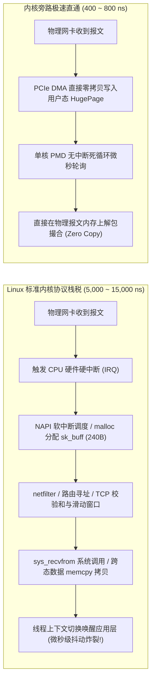
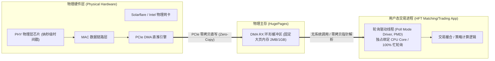
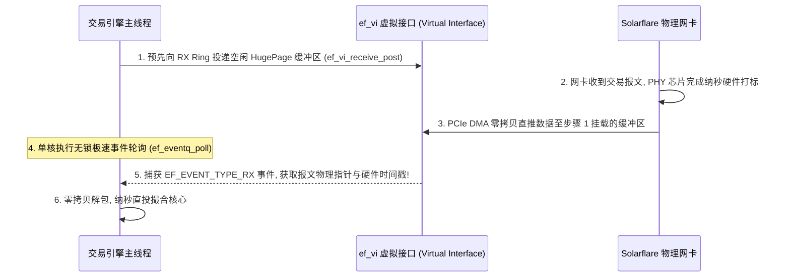

**TL;DR：** 在金融高频交易与纳秒级分布式撮合网络中，Linux 原生内核网络协议栈（Kernel Network Stack）是阻碍报文通行的**最大物理税卡**。从网卡物理层接收到一个以太网报文，到最终送达应用程序的 Socket 缓冲区，标准内核路径必须经历：硬件中断响应（Hard IRQ）、软中断调度（SoftIRQ/NAPI）、庞大笨重的 `sk_buff` 内存分配与指针链构造、Netfilter/Iptables 规则过滤、TCP 状态机校验，以及两次跨越内核态与用户态的 `memcpy` 内存拷贝和系统调用上下文切换——总物理开销高达 **5~15 微秒（5000~15000 纳秒）**，并伴随剧烈的中断合并抖动！本文以体系结构与网络硬件第一性原理为引，深度拆解现代量化金融界的终极秘密武器——**内核旁路（Kernel Bypass）与极速网络直通体系**：通过 Linux UIO/VFIO 技术将物理网卡 PCIe 寄存器与 DMA 环形缓冲区直接 `mmap` 映射至用户态内存；结合 1GB/2MB 巨页（HugePages）消除 TLB 缺页异常；利用轮询模式驱动（PMD, Poll Mode Driver）彻底消灭全部操作系统中断；并基于 Solarflare ef_vi 与 IEEE 1588 协议在物理网卡 PHY/MAC 芯片层实现纳秒级硬件时间戳（Hardware Timestamping），将端到端报文传输延迟直接压缩至 **400~800 纳秒** 的物理极限。

---

## 一、 协议栈之税：为什么标准 Linux 网络撑不住高频交易？

在通用互联网服务中，Linux 网络协议栈经过数十年的迭代，具备极强的安全性、容错性与复杂的路由过滤能力。但在 HFT 的纳秒战场上，这套通用设计演变成了沉重的“通行税”：



### 1. `sk_buff` 内存分配与指针地狱

在 Linux 内核中，每一个网络报文都被封装为 `struct sk_buff`。该结构体自身体积超过 **240 字节**，内部嵌套了数十个控制字段和指针。
- 网卡每收到一个 64 字节的小行情包，内核就必须为它分配一个庞大的 `sk_buff`；
- 在高吞吐突发流量下，内存分配器（`kmem_cache`）面临极大的分配与释放压力；
- 数据包在从 IP 层向 TCP 层传递的过程中，频繁解引用离散指针，引发严重的 **L1/L2 Cache Miss**。

### 2. 硬件中断与中断合并（Interrupt Coalescing）的延迟陷阱

为了防止每秒数百万个报文产生“中断风暴（Interrupt Storm）”拖垮系统，网卡通常默认开启**中断合并（Interrupt Mitigation / Coalescing）**：
- 网卡收到报文后并不立即发中断给 CPU，而是等待一段时间（如 50~100 微秒）或积攒满若干个报文才发一次中断；
- 这在普通 Web 吞吐场景下提高了批处理效率，但在低延迟交易中是**致命毒药**：你的报文在网卡硬件缓冲区里平白无故被扣押了 50 微秒！
- 即便关闭中断合并，单次硬件中断触发的 CPU 现场保存、中断向量表跳转与流水线清空，依然会产生 **1~2 微秒** 的确定性硬延迟。

### 3. 系统调用与内核态 `memcpy`

应用程序调用 `recv()` 或 `read()` 时：
1. 产生 `INT 0x80` 或 `SYSCALL` 指令，CPU 从 Ring 3 用户态切换至 Ring 0 内核态；
2. 内核在 Socket 接收队列中找到数据包；
3. 执行 `copy_to_user()`，通过 CPU 指令将数据从内核空间物理拷贝至用户空间缓冲区；
4. 切换回 Ring 3。

在数据量达到数万兆的交易场景下，内存总线带宽被大量的无意义 `memcpy` 侵占，直接导致 P99 尾部延迟出现不可预测的高峰毛刺。

---

## 二、 破局利器：内核旁路（Kernel Bypass）物理架构解密

彻底消灭上述开销的唯一途径，就是**完全绕过操作系统内核，让用户态应用程序直接掌控物理网卡**——这正是**内核旁路（Kernel Bypass）**的本质。

### 1. UIO 与 VFIO：用户态 PCIe 地址直通

现代物理网卡（如 Solarflare XtremeScale、Intel E810/X520）通过高速 PCIe 总线与 CPU 相连。

在 Linux 内核中，通过 **VFIO（Virtual Function I/O）** 或 **UIO（Userspace I/O）** 驱动子系统：
1. 内核将物理网卡的寄存器配置空间与 DMA 控制器，通过虚拟内存映射（`mmap`）**直接映射到交易进程的虚拟地址空间**；
2. 应用程序可以直接向网卡硬件寄存器下发指针命令，网卡控制权完全移交用户态；
3. **内核网络栈（TCP/IP、iptables、Socket）被彻底旁路，对报文流通毫无感知**。



### 2. 轮询模式驱动（PMD, Poll Mode Driver）

在内核旁路模式下，**中断机制被物理剥离**。取而代之的是纯粹的**轮询模式驱动（PMD）**：
- 交易进程的一个物理核心被单独隔离，专门用于死循环检查网卡 DMA 接收环（RX Ring Descriptor）；
- 循环仅包含一条极其轻量的内存检查指令：
  ```c
  // 纳秒级检查当前网卡描述符是否标记为已写就绪
  while ((rx_desc[index].flags & RX_DESC_DONE) == 0) {
      _mm_pause(); // 发出自旋提示
  }
  ```
- 报文一经被网卡硬件通过 PCIe DMA 写入内存，轮询线程在 **数十纳秒** 内立即可见，完全消灭操作系统调度排队与中断挂起。

---

## 三、 内存基石：大页内存（HugePages）与 TLB 穿透防御

在追求亚微秒延迟时，CPU 的另一个微体系结构短板经常被忽视——**地址转换旁路缓存（TLB, Translation Lookaside Buffer）**。

### 1. 4KB 标准页引发的 TLB 颠簸（TLB Thrashing）

在 x86 体系结构下，默认的虚拟内存页面大小为 **4KB**。
- 如果交易系统分配了 4GB 的订单缓存与网络缓冲区，需要维护：
  $$\frac{4\text{GB}}{4\text{KB}} = 1,000,000 \text{ 个页表项 (PTE)}$$
- CPU 内部的 L1 TLB 硬件缓存容量极小，通常只能容纳 64~128 个页表项；
- 当网络报文高频覆盖不同内存区域时，TLB 缓存命中率暴跌；
- 每次 **TLB Miss**，CPU 必须启动昂贵的四级页表遍历（Page Table Walk），穿透 CR3 寄存器在主存中经过 4 次串行访存，耗时 **30~50 纳秒**！

### 2. 2MB 与 1GB 大页内存的降维打击

通过在 Linux 内核中启用 **HugePages（2MB 或 1GB 巨页）**：
- 同样是 4GB 内存，如果采用 1GB 巨页，**仅需 4 个页表项即可完全覆盖**；
- 4 个页表项可以永久固化在 CPU 的 L1 TLB 中，**TLB 命中率达到理论极值的 100%**；
- 彻底消除了页表遍历带来的延迟毛刺，并保证物理内存在启动时一次性预留连续分配，绝不发生物理缺页中断（Page Fault）。

---

## 四、 硬件之眼：纳秒级物理时间戳（Hardware Timestamping）

在金融监管（如欧盟 MiFID II 规范）与高频做市策略中，精确度量一笔订单“到底在何时到达网卡”具有决定性意义。如果时间戳有误差，策略模型就会对市场微观结构做出错误归因。

### 1. 软件时间戳的局限性

传统通过 `clock_gettime(CLOCK_REALTIME)` 记录时间戳：
- 记录的是“应用程序代码开始执行系统调用时的 CPU 时钟”；
- 包含了网络线缆传输延迟、网卡物理缓存排队、中断排队与内核调度的全部随机抖动；
- 误差往往高达 **数微秒至数十微秒**，根本无法体现真实的物理先后顺序。

### 2. MAC/PHY 硬件时间戳工作原理

顶尖金融网卡（如 Solarflare 包含 PTP 硬件模块）直接在网卡的**物理层（PHY）或媒体访问控制层（MAC）芯片**上集成高精度硬件时钟：


1. **瞬时打标**：
   当光纤中的光脉冲信号刚刚到达网卡物理层，PHY 芯片检测到以太网报文的前导码（Preamble）与帧起始定界符（SFD）的瞬间，硬件时钟在 **`< 1 纳秒`** 内完成时间采样；
2. **零抖动注入**：
   这个精确的绝对物理时间戳被直接写入该报文的 DMA 接收描述符（RX Descriptor）尾部，随报文一同上送主机；
3. **PTP 亚微秒时钟对齐**：
   配合机房天线连接的 GPS 授时卡与 **PTP（Precision Time Protocol, IEEE 1588）** 局域网广播协议，整个机房内数百台服务器的网卡硬件时钟误差可以被稳定控制在 **`< 20 纳秒`** 之内，实现全市场事件的绝对确定性因果定序。

---

## 五、 真实战场：Solarflare ef_vi 底层接口实战

在量化交易界，AMD/Solarflare 的 **ef_vi（Electronic Frontier Virtual Interface）** 是公认的“速度王者”。它是一个极度底层的轻量级 C 语言 API，比通用的 DPDK 更加精简，专为在单个 PCI 虚拟函数上实现数百纳秒的极限收发而设计。



### 核心 C 语言驱动代码示例

以下展示了基于 Solarflare ef_vi 实现零拷贝收包与硬件时间戳解析的标准模式：

```c
#include <etherfabric/vi.h>
#include <etherfabric/pd.h>
#include <etherfabric/memreg.h>
#include <stdio.h>
#include <stdlib.h>

#define PKT_BUF_SIZE 2048
#define NUM_BUFS     1024

// 大页内存中对齐的接收缓冲区
struct pkt_buf {
    char data[PKT_BUF_SIZE];
};

void run_ultra_fast_loop(ef_vi* vi, struct pkt_buf* bufs, ef_memreg* mr) {
    ef_event evs[16];
    ef_request_id ids[16];

    // 1. 预先挂载所有的接收描述符
    for (int i = 0; i < NUM_BUFS; ++i) {
        ef_addr dma_addr = ef_memreg_dma_addr(mr, i * PKT_BUF_SIZE);
        ef_vi_receive_post(vi, dma_addr, i);
    }

    // 2. 单核死循环轮询 (零系统调用, 零中断)
    while (1) {
        // 极速轮询事件队列 (耗时仅 10~20 个时钟周期)
        int n_events = ef_eventq_poll(vi, evs, 16);
        if (n_events == 0) continue;

        for (int i = 0; i < n_events; ++i) {
            if (EF_EVENT_TYPE(evs[i]) == EF_EVENT_TYPE_RX) {
                int buf_id = EF_EVENT_RX_RQ_ID(evs[i]);
                int pkt_len = EF_EVENT_RX_BYTES(evs[i]);

                // 物理报文数据指针 (零内存拷贝!)
                char* pkt_data = bufs[buf_id].data + EF_VI_RX_PREFIX_LEN;

                // 提取网卡硬件纳秒时间戳 (由 PHY 芯片注入)
                struct timespec hw_time;
                ef_vi_receive_get_timestamp(vi, pkt_data, &hw_time);

                // --- 直接执行撮合逻辑 ---
                // process_order_message(pkt_data, pkt_len, hw_time);

                // 重新将用完的缓冲区投递回网卡 RX Ring
                ef_addr dma_addr = ef_memreg_dma_addr(mr, buf_id * PKT_BUF_SIZE);
                ef_vi_receive_post(vi, dma_addr, buf_id);
            }
        }
    }
}
```

---

## 六、 生产级防御指南：内核旁路的陷阱与运维代价

内核旁路在换来无上极速的同时，也剥除了操作系统的一切温床保护：

| 故障模式 | 现象与代价 | 生产级终极防护策略 |
| :--- | :--- | :--- |
| **标准网络诊断工具完全失灵** | `tcpdump`、`netstat`、`iptables` 看不到任何流量 | 必须利用网卡硬件自带的**镜像端口（Hardware Sniffer / Port Mirroring）**或通过专用分流芯片旁路抓包 |
| **单核 CPU 100% 满载高温** | 轮询线程死循环导致单个 CPU 核心永远拉满 100% | 物理服务器施加**水冷散热与主频锁定（Disable C-States / P-States）**，防止 CPU 自动降频引发延迟抖动 |
| **缓冲区溢出静默丢包** | 业务逻辑处理稍有停顿，网卡 RX 环瞬间填满并悄无声息丢包 | 严格施加**拥塞反压与环形溢出硬件计数监控**；撮合核心禁止执行任何超过 100 纳秒的复杂操作 |
| **缺少 TCP 可靠传输协议** | 裸收发以太网报文可能面临丢包和乱序 | 采用 **Solarflare Onload（用户态完整 TCP 栈）** 或自行实现精简高效的 FPGA/UDP 确认重传协议 |

---

## 七、 总结与因果主线全景图

从传统 Linux 协议栈在中断与内存拷贝中的泥潭挣扎，到内核旁路在物理层与用户态直通上的破茧成蝶，其背后的物理法则严苛而优美：


1. **操作系统是通用的朋友，但却是极速的敌人**：当你的系统延迟以纳秒计，内核中的每一行判断和统计代码都是多余的累赘；
2. **物理直通才是真正的零拷贝**：只有让数据由网卡 DMA 直接写入最终处理它的 CPU 核心所属的大页内存，才能消灭一切总线带宽浪费；
3. **真实世界以物理时间定序**：依靠 PHY 芯片级打标，让每一笔交易拥有不可篡改的纳秒物理因果基准。

在内核旁路构建的超高速物理轨道上，现代高频交易系统真正突破了软件的束缚，以近乎光速的节奏奔涌向前。
