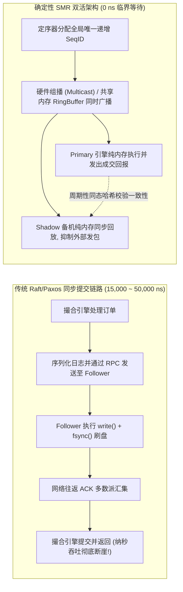
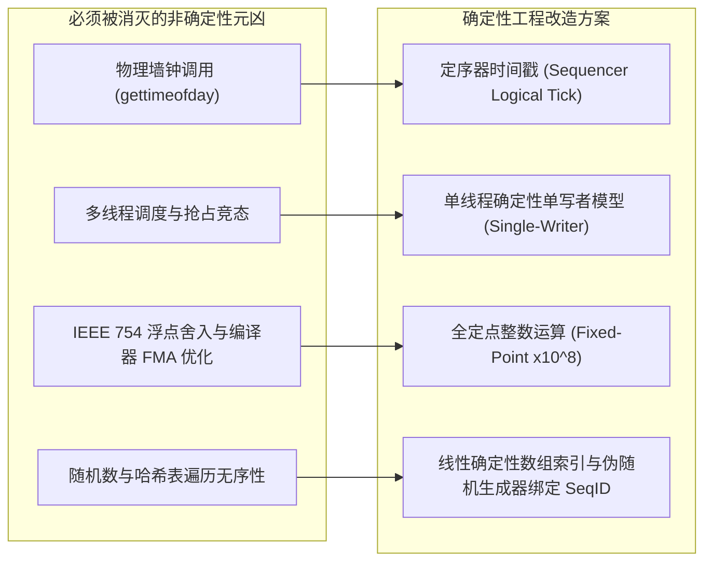
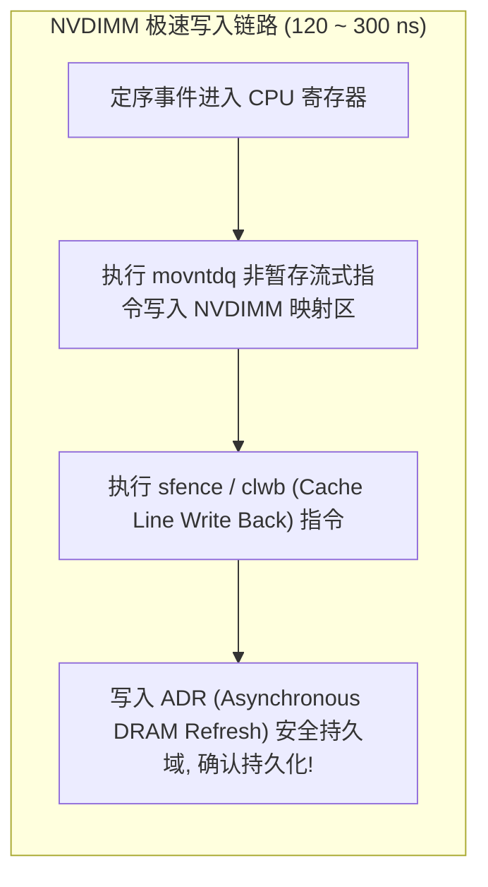
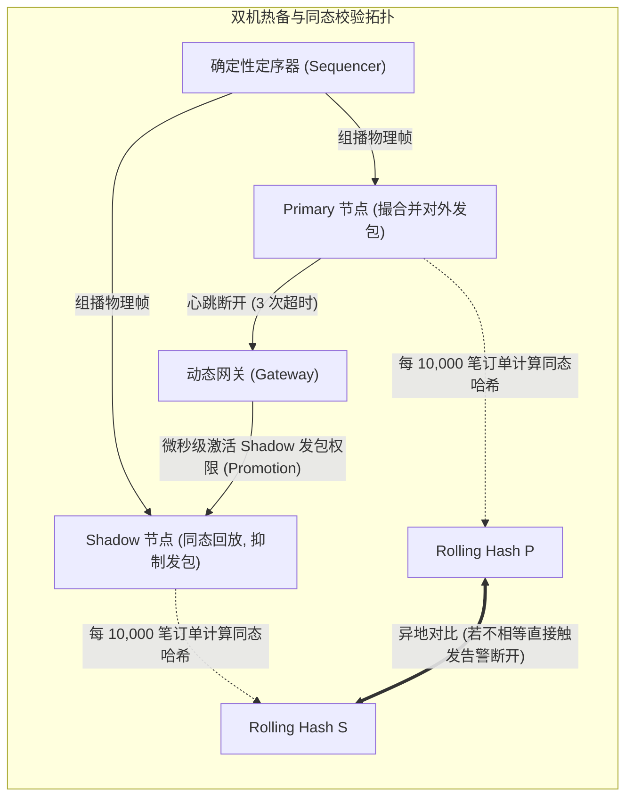

**TL;DR：** 纯内存架构将单笔订单撮合延迟压榨至数百纳秒，但也带来了极端致命的脆弱性：**内存是易失的（Volatile），一旦服务器断电或主板死锁，数十亿美元市值的未平仓订单簿（OrderBook）与持仓状态将瞬间湮灭**。然而，如果在热路径上引入传统分布式一致性协议（如标准 Raft/Paxos）或同步写磁盘（`fsync`），每一次写 I/O 至少需要 **15~200 微秒**，撮合引擎的纳秒性能将瞬间崩溃。现代量化交易基础设施破局的核心思想，是基于 Fred Schneider（1990）提出的**确定性状态机复制（Deterministic State Machine Replication, SMR）**：只要保证系统初始状态一致（$S_0$ 一致），且按全局严格递增的序列号（Sequence ID）喂入确定性事件流，任意两台异构物理机上的撮合引擎必然在每一个离散时间步推进到**100% 逐比特完全同态的终态（$S_n$）**。本文系统拆解如何从根源消灭真实物理时钟、浮点舍入与多线程乱序等**非确定性元凶**；详述基于 **NVDIMM/CXL 环形 WAL 日志**、**主备双活同态回放（Active-Shadow Replication）**、**增量同态哈希校验（Incremental Homomorphic Checksum）**与**微秒级热备接管（Microsecond Failover）**的全套确定性容灾闭环。

---

## 一、 纳秒级撮合与高可用的“生死时速”冲突

在通用云原生分布式系统中，保证容灾高可用的标准解法是**同步写持久化（Sync WAL + `fsync`）**并依托分布式共识（Multi-Paxos / Raft）多数派确认。但在超低延迟交易领域，这条传统路径在物理尺度上彻底失效：



### 1. 物理写磁盘的不可承受之重

即使采用当前最先进的 PCIe 5.0 NVMe SSD，单次 4KB 随机写入经由 Linux 内核 `vfs_write`、NVMe 驱动提交队列（SQ）、物理闪存擦写并等待完成队列（CQ），物理延迟下限依然在 **8~15 微秒**。
- 如果撮合每笔订单都需要等待 `fsync` 返回，系统最大吞吐量将被硬性锚定在 **60,000 TPS** 左右；
- 而现代数字资产与衍生品交易所高峰期的瞬时报单脉冲常常达到 **500,000 ~ 2,000,000 TPS**；
- **核心结论**：在报单的直接关键路径（Critical Path）上，绝对不能包含任何内核同步文件系统调用。

### 2. 状态机复制（SMR）的数学第一性原理

1990 年，分布式系统先驱 Fred B. Schneider 在 ACM Computing Surveys 发表了奠基性论文 *Implementing Fault-Tolerant Services Using the State Machine Approach*。其核心公理如下：

一个确定性状态机由状态集合 $S$、输入事件集合 $E$、输出集合 $O$ 以及转换转移函数 $f: S \times E \to S$ 和输出函数 $g: S \times E \to O$ 构成：

$$S_{t+1} = f(S_t, E_{t+1})$$
$$O_{t+1} = g(S_t, E_{t+1})$$

**SMR 充要条件：**
1. **一致的初态**：$S_0^{\text{Primary}} = S_0^{\text{Shadow}}$；
2. **确定性的输入序列**：所有副本接收到完全相同的事件流 $E_1, E_2, \dots, E_n$，且输入序列的顺序全局一致；
3. **确定性的转移函数 $f$**：对于任意相同的 $S$ 和 $E$，$f(S, E)$ 在任意机器、任意时刻的计算结果唯一确定。

只要满足以上条件，**备机根本不需要实时同步主机的内部内存指针与复杂数据结构，备机只需要同步确定性事件流！**

---

## 二、 猎杀非确定性：交易系统中的“混沌元凶”

要想让两个独立的物理节点在运行数亿次操作后依然保持 100% 逐位内存一致，必须对代码中所有潜在的**非确定性诱因（Non-deterministic Factors）**实施毁灭性猎杀。



### 1. 物理墙钟（Wall Clock）引发的蝴蝶效应

在交易系统中，常有“订单过期取消（GTC/IOC/FOK）”或“防爆仓按秒计算资金费率”的逻辑。如果业务代码直接调用 `clock_gettime(CLOCK_REALTIME)` 或 `System.currentTimeMillis()`：
- 哪怕两台机器之间通过 PTP（精确时间协议）对齐，依然存在数十纳秒的物理时钟偏移；
- 主机在 `T = 1000.000001` 时刻判定订单未过期，而备机由于调度延迟在 `T = 1000.000003` 时刻判定订单超时自动撤单；
- 仅仅 2 纳秒的时钟差异，就会导致主备机订单簿深度产生永久分叉，后续成交流水全线崩溃！

**铁律**：撮合核心内部**绝不读取物理时钟**！系统时间只能由外部定序器（Sequencer）在为事件生成全局序号时，原子打入统一逻辑时间戳（`uint64_t logical_tick`）。撮合核心只认事件报文中的逻辑时间戳！

### 2. IEEE 754 浮点数的体系结构裂痕

许多工程师认为“价格和数量使用 `double` 精度足够高”。这是致命错误：
- x86 架构下的 80 位扩展浮点寄存器与 ARM NEON 64 位寄存器在乘除法舍入模式上存在微小差异；
- 编译器开启 `-O3` 或 `-ffast-math` 后，可能将 `a * b + c` 融合优化为单条 FMA（Fused Multiply-Add）指令，跳过一次中间舍入；
- 一次微小的第 53 位尾数舍入差异，在经过复杂的复利、折扣或保证金折算后，会导致主机账户余额为 `100.00000000000001`，而备机为 `100.00000000000000`。

**铁律**：核心交易系统全链路严禁出现 `float` / `double`！所有货币金额、订单价格、交易数量全部采用**固定精度 64 位有符号定点整数（Fixed-Point Integer）**：

$$\text{Price}_{\text{internal}} = \lfloor \text{Price}_{\text{real}} \times 10^8 \rfloor$$

例如：\$123.4567 统一表示为整数 `12345670000LL`。

### 3. 多线程内存竞争与不可预测的事件穿插

如果撮合引擎内部使用多线程处理不同的币对或账户，操作系统的线程调度器将决定锁争用与上下文切换的顺序。即使输入事件相同，线程间细微的 CPU 缓存行争抢顺序也会导致备机与主机出现不同的执行轨迹。

**铁律**：**单分片单写者架构（Single-Partition Single-Writer）**。每个独立的订单簿与撮合状态机永远只由一个独立的、物理绑核的单线程串行推进，完全杜绝线程调度引入的随机性。

---

## 三、 基于 NVDIMM/CXL 的极速环形 WAL 架构

虽然撮合执行是纯内存的，但所有被定序器编号后的确定性事件流必须被持久化与多机分发，以实现宕机恢复。

### 1. 传统磁盘 WAL vs 持久内存（Persistent Memory）

| 存储介质 | 访问机制 | 单次写入延迟 | 吞吐上限 (IOPS) | 掉电持久性 |
| :--- | :--- | :--- | :--- | :--- |
| **SATA SSD** | 内核驱动 + 块设备协议栈 | 150 ~ 500 µs | 100K | 具备 |
| **NVMe PCIe Gen5** | SPDK 用户态驱动 / io_uring | 8 ~ 20 µs | 2,000K | 具备 |
| **NVDIMM / CXL (Pmem)** | CPU 汇编指令 `movntdq` + `sfence` | **120 ~ 300 ns** | **> 20,000K** | **硬件电容瞬时刷入** |

NVDIMM（非易失性双列直插式内存模块）和现代 CXL 持久内存允许 CPU 通过标准内存总线（DDR5/CXL 接口）以字节寻址（Byte-addressable）的方式直接读写。



### 2. 环形 WAL 日志结构与零系统调用刷盘

利用 Linux 的 `mmap(MAP_SHARED_VALIDATE | MAP_SYNC)`，可以直接将挂载为 DAX（Direct Access）模式的持久内存映射到进程地址空间。

```cpp
#include <cstdint>
#include <immintrin.h>
#include <sys/mman.h>
#include <fcntl.h>
#include <unistd.h>

#pragma pack(push, 1)
struct WalEntry {
    uint64_t seq_id;        // 全局严格单调自增序列号
    uint64_t logical_tick;  // 定序器统一逻辑纳秒戳
    uint32_t account_id;    // 账户 ID
    uint32_t symbol_id;     // 标的 ID
    int64_t  price;         // 定点化价格 (x10^8)
    int64_t  quantity;      // 定点化数量 (x10^8)
    uint8_t  side;          // 0: 买, 1: 卖
    uint8_t  action;        // 0: 下单, 1: 撤单
    uint8_t  padding[6];    // 补齐 48 字节
};
#pragma pack(pop)

class UltraFastWalAppender {
public:
    UltraFastWalAppender(const char* pmem_path, size_t file_size) {
        int fd = open(pmem_path, O_RDWR | O_CREAT, 0666);
        // 使用 MAP_SYNC 穿透文件系统缓存，直接获取 CPU 物理内存写权限
        base_addr_ = reinterpret_cast<char*>(mmap(
            nullptr, file_size, 
            PROT_READ | PROT_WRITE, 
            MAP_SHARED_VALIDATE | 0x80000 /* MAP_SYNC */, 
            fd, 0
        ));
        close(fd);
        write_offset_ = 0;
    }

    // 纳秒级持久化写入，无任何系统调用
    inline void append(const WalEntry& entry) noexcept {
        WalEntry* target = reinterpret_cast<WalEntry*>(base_addr_ + write_offset_);
        
        // 1. 内存直接拷贝
        *target = entry;

        // 2. clwb: Cache Line Write Back (将 CPU L1/L2 缓存行刷至内存控制器)
        _mm_clwb(target);

        // 3. sfence: 强制内存屏障，确保在指令流水线推进前数据已离开 Store Buffer
        _mm_sfence();

        write_offset_ += sizeof(WalEntry);
    }

private:
    char* base_addr_;
    size_t write_offset_;
};
```

---

## 四、 主备热切与微秒级同态哈希校验（Homomorphic Checksum）

在生产高可用拓扑中，Primary 节点与 Shadow 节点通过内核旁路网络组播或高速 PCIe NTB（非透明桥）同步接收定序后的 WAL 事件流。



### 1. 同态哈希校验（Homomorphic Hash Verification）

在两台机器独立运行数小时、数亿笔交易后，**如何从数学上证明 Shadow 节点的数据与 Primary 节点 100% 相同？**
- 传统做法：全量 Dump 内存对比。这需要停机数秒，在 7x24 小时运转的交易市场中绝不可行；
- 现代做法：**增量同态滚动哈希（Incremental Rolling Hash）**。

在每一次订单撮合状态变更时，状态机以严格的数学运算递推更新一个 64 位全局状态校验码（Checksum）：

$$\mathcal{H}_{t+1} = \left( \mathcal{H}_t \oplus \text{CRC64}(\text{OrderID}, \text{RemainingQty}) \right) + \text{SeqID} \times 0x9E3779B97F4A7C15ULL$$

- Primary 与 Shadow 每处理完成 $K$ 个事件（例如每 10,000 笔订单），将当前瞬时的 $\mathcal{H}$ 打入内部心跳监控包；
- 监控程序对比两者的 $\mathcal{H}_k$。若值完全一致，数学上保证了两台节点的内存状态在概率为 $1 - 2^{-64}$（几乎不可能发生冲突）的严格置信度下完全相同；
- 一旦发生单比特分叉，监控系统可在 **50 微秒** 内捕获并告警，彻底避免“脏数据持续扩散”。

### 2. 微秒级零丢失故障转移（Zero-loss Failover）

当 Primary 节点的物理硬件（如主板供电模块）突发烧毁：
1. **心跳失联探测**：Shadow 节点通过双路光纤心跳线（基于 RDMA 或网卡硬件心跳）在 **3~5 微秒** 内检测到 Primary 宕机；
2. **状态机流水线排空（Drain Pipeline）**：Shadow 将网卡硬件缓冲区内已到达的所有已定序 WAL 事件处理完毕；
3. **网关动态路由接管**：Shadow 向外围极速网关发送携带最新已处理 `Last_Seq_ID` 的租约抢占命令（Fencing Token）；
4. **解除发包抑制（Unsuppress Outbound）**：Shadow 节点从 Shadow Mode 瞬间翻转为 Active Mode，开始向客户端直接推送成交回报。

**整套切换耗时控制在 10~50 微秒以内，客户端连接无缝切换，数据零丢失（RPO = 0，RTO < 100µs）！**

---

## 五、 生产级可重放 C++20 状态机与容灾回放引擎

下面给出一个可以直接编译运行的高性能确定性状态机与回放引擎实现。它展示了定点化计算、零物理时钟依赖、同态状态校验以及从本地日志 100% 确定性回放订单簿的完整过程：

```cpp
#include <iostream>
#include <vector>
#include <cstdint>
#include <iomanip>
#include <cassert>

// 严格对齐的定序事件
struct alignas(32) SequencedOrderEvent {
    uint64_t seq_id;
    uint32_t order_id;
    uint32_t account_id;
    int64_t  price;      // 定点数：实际价格 x 10^8
    int64_t  quantity;   // 定点数：实际数量 x 10^8
    uint8_t  side;       // 0: Buy, 1: Sell
};

// 内存确定性状态
struct AccountState {
    int64_t balance;
    int64_t position;
};

class DeterministicEngine {
public:
    DeterministicEngine() : last_seq_id_(0), state_hash_(0xCBF29CE484222325ULL) {
        // 初始化 1000 个预分配账户
        accounts_.resize(1000, {10000000000000LL /* 100,000.00000000 */, 0});
    }

    // 纯确定性状态转移函数：S_{t+1} = f(S_t, E_{t+1})
    void process_event(const SequencedOrderEvent& ev) noexcept {
        // 断言事件序号严格自增，杜绝乱序注入
        assert(ev.seq_id == last_seq_id_ + 1);
        last_seq_id_ = ev.seq_id;

        auto& acc = accounts_[ev.account_id % accounts_.size()];
        int64_t total_notional = (ev.price * ev.quantity) / 100000000LL;

        if (ev.side == 0) { // Buy
            acc.balance -= total_notional;
            acc.position += ev.quantity;
        } else { // Sell
            acc.balance += total_notional;
            acc.position -= ev.quantity;
        }

        // 增量同态滚动校验和更新 (MurmurHash-like mixing)
        uint64_t k = (static_cast<uint64_t>(acc.balance) ^ (static_cast<uint64_t>(acc.position) << 1));
        k ^= (ev.seq_id * 0x517cc1b727220a95ULL);
        state_hash_ = (state_hash_ ^ k) * 0xbf58476d1ce4e5b9ULL;
    }

    [[nodiscard]] uint64_t last_seq_id() const noexcept { return last_seq_id_; }
    [[nodiscard]] uint64_t state_hash() const noexcept { return state_hash_; }
    [[nodiscard]] const AccountState& get_account(size_t id) const { return accounts_[id]; }

private:
    uint64_t last_seq_id_;
    uint64_t state_hash_;
    std::vector<AccountState> accounts_;
};

int main() {
    std::cout << ">>> 启动超低延迟确定性状态机复制 (SMR) 仿真 <<<" << std::endl;

    // 1. 生成 100,000 笔确定性模拟事件流 (WAL 日志)
    std::vector<SequencedOrderEvent> wal_stream;
    wal_stream.reserve(100000);
    for (uint64_t i = 1; i <= 100000; ++i) {
        wal_stream.push_back({
            i,                                          // seq_id
            static_cast<uint32_t>(i),                   // order_id
            static_cast<uint32_t>(i % 100),             // account_id (0~99)
            10000000000LL + (i % 50) * 10000000LL,      // price: 100.00 ~ 100.50
            100000000LL,                                // qty: 1.00000000
            static_cast<uint8_t>(i % 2)                 // side: 交替买卖
        });
    }

    // 2. Primary 节点执行
    DeterministicEngine primary;
    for (const auto& ev : wal_stream) {
        primary.process_event(ev);
    }

    // 3. Shadow 节点独立回放相同的 WAL 字节流
    DeterministicEngine shadow;
    for (const auto& ev : wal_stream) {
        shadow.process_event(ev);
    }

    // 4. 同态哈希严格校验
    std::cout << "Primary Last SeqID : " << primary.last_seq_id() << std::endl;
    std::cout << "Shadow  Last SeqID : " << shadow.last_seq_id() << std::endl;
    std::cout << "Primary State Hash : 0x" << std::hex << primary.state_hash() << std::endl;
    std::cout << "Shadow  State Hash : 0x" << std::hex << shadow.state_hash() << std::dec << std::endl;

    assert(primary.state_hash() == shadow.state_hash());
    std::cout << ">>> 验证通过：主备双节点 100,000 步状态机实现 100% 逐比特同态对齐！ <<<" << std::endl;

    return 0;
}
```

---

## 六、 总结与下篇预告

确定性状态机复制（SMR）是高频交易系统跳出“低延迟与高可靠不可兼得”困境的终极工程解法：
- 它**不依赖同步跨节点网络协商**，将主关键路径的时间复杂度解耦为纯内存的本地推进；
- 通过从系统各层全面消灭**物理时钟、浮点陷阱与并发乱序**，确保了状态变迁的 100% 确定性可回溯；
- 借助 **NVDIMM 极速 WAL 日志** 与 **增量同态哈希**，在毫秒级故障转移的同时提供了数学上不可辩驳的强一致性保证。

在掌握了极速撮合、内存无 GC 与确定性容灾之后，交易系统面临的最后一个高危地带是——**钱（Money）**。一笔买单进入系统，如何保证资金不会超卖穿仓？当每秒涌入百万笔交易、数千个并发交易员争抢同一热点做市商资金池时，**如何既防止死锁与并发扣错账，又能把事前风控校验压缩在 1 微秒之内？**

下一篇，我们将作为本系列的压轴终局篇，深度解构 **《资金复式记账与风控流控：Pat Helland 最终一致性对账、热点账户分段锁与单微秒级动态穿透风控规则引擎》**。
