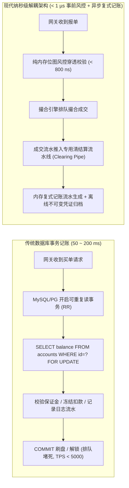
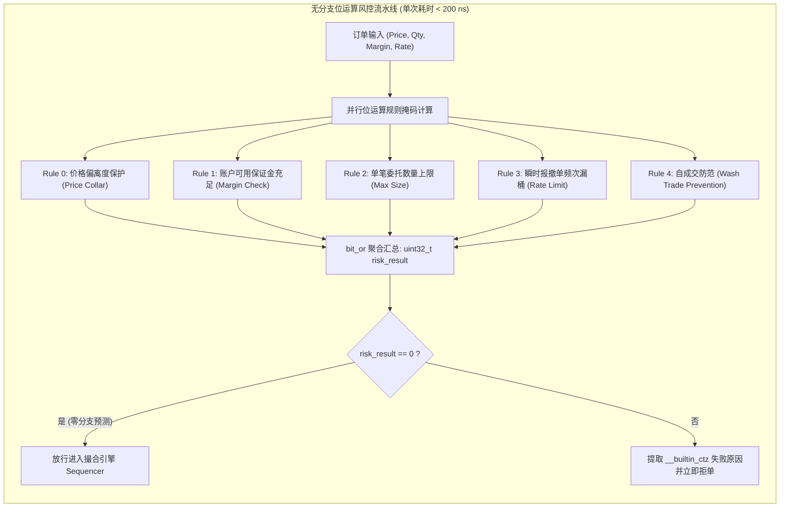
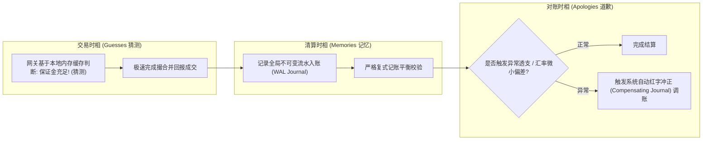
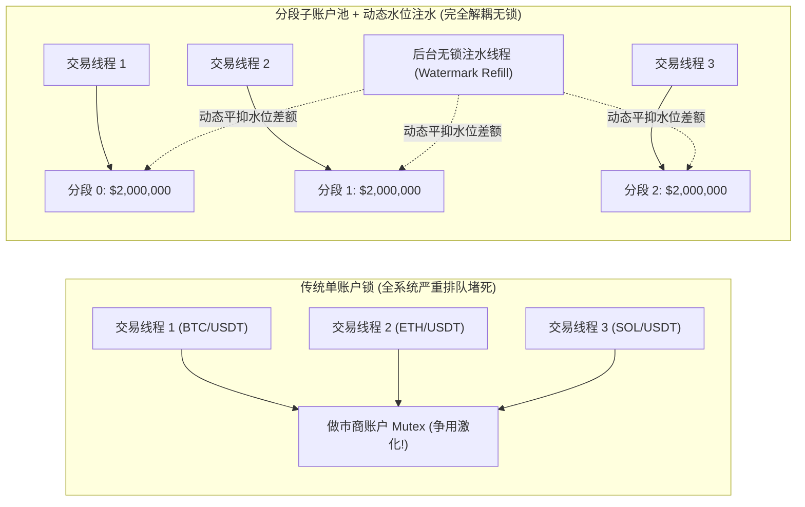

**TL;DR：** 在交易系统中，撮合引擎解决的是“撮合谁与谁以何种价格成交”，而**资金系统与风控系统（Risk & Clearing Engine）**解决的则是系统最底层的存亡之基——**“交易员到底有没有足够的钱？平台会不会因为毫秒级超卖而破产穿仓？”** 传统电商或金融后台通常依赖关系型数据库事务（`BEGIN TRANSACTION ... SELECT FOR UPDATE`），但单次事务耗时高达数十毫秒，无法承受峰值百万级 TPS 与纳秒撮合链路；如果简单退化为在内存中做裸加减（`balance -= amount`），一旦出现并发并发竞态或程序崩溃，丢失记账流水凭证将导致账面资产不可审计、产生天文数字坏账。本文作为交易系统系列的终局收官篇，系统融合 1494 年帕乔利**复式记账公理（Double-Entry Bookkeeping）**与 Pat Helland 的经典架构哲学（*Memories, Guesses, and Apologies*）：在报单入口实现基于**无分支位运算（Branchless Bitmask）的亚微秒级穿透风控过滤网**；对吞吐瓶颈最高的做市商账户设计**分段子账户（Segmented Sub-Accounts）与动态水位补平衡（Watermark Replenishment）**；并在内存中落地一套**不可变不可篡改的复式记账分录流水（Append-Only Journal Entries）**，彻底实现资金绝对守恒（资产 $\equiv$ 负债 + 所有者权益）与单微秒级动态风控。

---

## 一、 金融交易资金的核心矛盾：速度与审计的不可调和性

在构建生产级交易系统时，架构师面临着一个经典的三难困境：



### 1. 为什么“裸修改余额”是金融灾难？

许多初涉金融系统的工程师会写出如下代码：

```cpp
// 致命错误的反模式：裸操作单字段余额
if (user.balance >= order.cost) {
    user.balance -= order.cost;
    user.frozen += order.cost;
}
```

这种做法有三大致命隐患：
1. **丢失因果证据链（Lack of Traceability）**：余额只是一个瞬时累加值。当月末对账发现资金短缺 500 万元时，无法推导这笔差额究竟是由哪一笔撤单、成交滑点、转账还是程序 Bug 造成的。
2. **缺乏数学自洽约束**：单向扣减无法保证全局资产守恒。如果代码某处漏写了增加逻辑，资金凭空蒸发，系统无法自检。
3. **并发竞态与死锁**：若采用互斥锁保护账户，在跨账户转账或做市商与多个普通散户撮合时，极易产生循环锁等待（AB-BA 死锁）。

### 2. 帕乔利复式记账公理（Double-Entry Axiom）

1494 年，意大利数学家卢卡·帕乔利（Luca Pacioli）在《算术、几何、比与比例知识大全》中系统总结了威尼斯商人的**复式簿记法**。其核心数学公理如下：

$$\sum \text{Debit (借方)} = \sum \text{Credit (贷方)}$$

在会计学恒等式中：

$$\text{资产 (Assets)} = \text{负债 (Liabilities)} + \text{所有者权益 (Equity)}$$

- **每一笔业务变动，必须同时产生至少两条方向相反、金额相等的记账分录（Journal Entry）**；
- 借贷相抵后，分录的代数和严格恒等于 0：

$$\sum_{i=1}^{k} \Delta \text{Amount}_i = 0$$

- **系统状态的不可篡改性**：账户余额不能被直接覆盖修改，余额必须是该账户历史上所有不可变借贷分录流的**前缀和（Prefix Sum）**！

---

## 二、 亚微秒级穿透风控引擎（Pre-Trade Risk Engine）

在订单送入撮合核心之前，必须进行事前风控（Pre-Trade Risk Check）。根据国际证监会（IOSCO）与交易所合规要求，如果一笔异常报单（如做市商算法 Bug 报出 0.0001 元买入比特币的“肥手指（Fat-Finger）”订单）穿透进入撮合引擎，可能引发连锁踩踏爆仓。

风控引擎必须在 **< 1 微秒（1000 纳秒）** 内完成对数十项动态规则的判定。



### 1. 规避分支预测失败：无分支位图编码（Branchless Bitmask）

传统的 `if-else` 级联风控代码在 CPU 乱序执行流水线中是性能杀手：当行情平稳时分支预测全部命中，但当行情暴跌引发频繁触发风控时，分支预测失败（Branch Misprediction）会导致流水线被惩罚清空，带来 **15~25 个 CPU 周期的硬延迟**。

现代设计采用**无分支位图标记（Branchless Bitflags）**：

```cpp
#include <cstdint>

struct PreTradeRiskResult {
    enum Rules : uint32_t {
        PASSED                = 0,
        PRICE_COLLAR_EXCEEDED = 1 << 0, // 价格超出涨跌停偏离度
        MARGIN_INSUFFICIENT   = 1 << 1, // 可用资金不足
        MAX_QTY_EXCEEDED      = 1 << 2, // 数量超出单笔阈值
        RATE_LIMIT_HIT        = 1 << 3, // 触发高频报单流控
        WASH_TRADE_DETECTED   = 1 << 4, // 侦测到自成交对倒
    };
};

// 纯无分支并行校验，将条件判断转换为代数位运算
inline uint32_t check_pre_trade_risk(
    int64_t order_price, int64_t best_bid, int64_t best_ask,
    int64_t order_cost, int64_t available_margin,
    int64_t order_qty, int64_t max_allowed_qty
) noexcept {
    uint32_t failed_mask = 0;

    // 1. 价格偏离度校验 (例如买单不得高于卖一价 10%)
    int64_t max_price = (best_ask * 110) / 100;
    failed_mask |= (static_cast<uint32_t>(order_price > max_price) << 0);

    // 2. 保证金充足性校验
    failed_mask |= (static_cast<uint32_t>(order_cost > available_margin) << 1);

    // 3. 最大数量上限校验
    failed_mask |= (static_cast<uint32_t>(order_qty > max_allowed_qty) << 2);

    return failed_mask; // 若为 0，代表全部规则通过！
}
```

### 2. 预冻结（Pre-Hold）与资金退还机制

为了保证“事前风控”通过后不会在撮合前被其他并发订单把钱花光，必须实行**两阶段额度锁定**：
- **阶段一（事前风控）**：订单进入系统，在可用保证金中划扣并追加至 `frozen_margin`（冻结资金）；
- **阶段二（撮合成交或撤单）**：
  - 若部分或全部成交：扣减冻结资金，将实际成交成本划入清算账户，差价（由于滑点更优）解冻返还；
  - 若撤单（Cancel）：将剩余未成交的冻结资金 $100\%$ 原路退回可用保证金。

---

## 三、 Pat Helland 最终一致性与异步对账哲学

2007 年，微软分布式系统泰斗 Pat Helland 发表了传世名篇 *Memories, Guesses, and Apologies*（《记忆、猜测与道歉》）。该理论对低延迟交易系统的清结算架构具有不可估量的指导意义：

> **“在低延迟网络与海量并发下，不要试图在单次同步操作中追求分布式强一致性。系统做的一切决策都是基于‘猜测（Guesses）’；用本地日志沉淀‘记忆（Memories）’；当事实证明猜测错误时，通过补偿事务向用户发出‘道歉（Apologies）’。”**



### 1. 交易核心只做“配额预判（Quota Guessing）”

- 撮合引擎不访问任何远程结算数据库，只在单机内存中维护一份轻量级的账户可用额度缓存；
- 撮合引擎只负责判定当前委托是否在额度配额内；
- 撮合成交之后，事件流异步输出给专门的清算结算流水线（Clearing Pipeline）。

### 2. 为什么需要“道歉事务（Apology / Compensating Action）”？

在极端跨境多币种结算、或期权到期行权导致的瞬时保证金激增场景下，可能会产生轻微穿仓：
- 系统不回滚撮合核心已完成的真实成交（因为金融市场成交具有不可撤销性，已成交的报单是法律契约）；
- 资金系统通过生成一条**补偿反向分录（Adjustment Entry / 红字冲销）**将账户调整为负值，并触发风控系统向该账户发送追加保证金通知（Margin Call）或启动市价强平引擎。

---

## 四、 热点账户分段锁（Segmented Balance）与无锁水库注水

在任何成熟的撮合市场中，**交易量呈现极端幂律分布（80/20 法则）**：排名前 1% 的机构做市商（Market Maker）参与了全市场超过 60% 的成交撮合。

如果对这些巨型账户使用单把互斥锁进行余额读写，全系统所有交易线程都将阻塞在同一个热点 CPU 缓存行上，产生灾难性的 MESI 缓存一致性风暴！



### 1. 账户分段切分（Striped Sub-Accounts）

将做市商的主资金账户逻辑拆分为 $K$ 个独立的**分段子账户（Striped Buckets）**（通常 $K = 16$ 或 $32$，按交易币对或 CPU 线程 ID 散列路由）：
- 例如做市商总资金为 10,000,000 USDT，系统将其拆分为 10 个各具 1,000,000 USDT 的独立分段；
- BTC 交易线程只锁定 `Segment[0]`，ETH 交易线程只锁定 `Segment[1]`；
- 各线程之间互不干扰，**锁争用率瞬间降低 $90\%$ 以上**。

### 2. 动态水位注水算法（Watermark Replenishment）

如果 BTC 交易极度活跃，导致 `Segment[0]` 的额度即将耗尽，而 `Segment[1]` 还有大量闲置资金怎么办？
- 系统引入一个后台轻量级调配线程（或利用无锁 CAS 机制）；
- 当某个分段的可用额度跌破低水位警戒线（Low Watermark，如总配额的 15%）时，异步从主水库或其他高水位子账户通过无锁原子操作将额度注入过来；
- 整个注水过程对前端撮合线程完全透明，不产生全局阻塞。

---

## 五、 生产级 C++20 不可变复式记账与风控引擎

以下实现展示了一个具备**无分支位运算风控检查**、**不可变借贷分录流水（Append-Only Journal）**与**数学级全局资产平衡断言**的完整资金系统：

```cpp
#include <iostream>
#include <vector>
#include <string>
#include <cstdint>
#include <cassert>
#include <iomanip>

// 账户类型枚举
enum class AccountType : uint8_t {
    ASSET     = 1, // 资产类 (借增, 贷减)
    LIABILITY = 2, // 负债类 (贷增, 借减) 例如用户充值余额对平台来说是负债
    EQUITY    = 3  // 所有者权益 (贷增, 借减) 例如平台收取的交易手续费利润
};

// 借贷方向
enum class EntrySide : uint8_t {
    DEBIT  = 1, // 借方
    CREDIT = 2  // 贷方
};

// 内存对齐的不可变复式记账单项分录 (Journal Leg)
struct alignas(32) JournalLeg {
    uint32_t account_id;
    AccountType acc_type;
    EntrySide   side;
    int64_t     amount; // 定点化金额 (x10^8)
};

// 一笔不可变的完整复式记账分录 (Transaction Journal Entry)
struct TransactionEntry {
    uint64_t tx_id;
    uint64_t timestamp_ns;
    std::string memo;
    std::vector<JournalLeg> legs;

    // 校验本条分录是否满足借贷平衡: Sum(Debit) == Sum(Credit)
    [[nodiscard]] bool is_balanced() const noexcept {
        int64_t debit_sum = 0;
        int64_t credit_sum = 0;
        for (const auto& leg : legs) {
            if (leg.side == EntrySide::DEBIT) {
                debit_sum += leg.amount;
            } else {
                credit_sum += leg.amount;
            }
        }
        return debit_sum == credit_sum && debit_sum > 0;
    }
};

// 生产级复式记账与资金清算引擎
class HighFrequencyLedgerEngine {
public:
    HighFrequencyLedgerEngine(size_t num_accounts) {
        account_balances_.resize(num_accounts, 0);
    }

    // 提交一笔复式记账事务并落入只追加流水链
    bool commit_journal_entry(const TransactionEntry& tx) {
        // 1. 严格断言帕乔利借贷平衡公理
        if (!tx.is_balanced()) {
            std::cerr << "CRITICAL: Transaction " << tx.tx_id << " 借贷不平衡，拒绝入账!" << std::endl;
            return false;
        }

        // 2. 依次应用到账户当前余额
        for (const auto& leg : legs_of(tx)) {
            assert(leg.account_id < account_balances_.size());
            
            // 会计法则：
            // 资产类账户: 借加 贷减
            // 负债/权益类账户: 贷加 借减
            if (leg.acc_type == AccountType::ASSET) {
                if (leg.side == EntrySide::DEBIT) {
                    account_balances_[leg.account_id] += leg.amount;
                } else {
                    account_balances_[leg.account_id] -= leg.amount;
                }
            } else { // LIABILITY or EQUITY
                if (leg.side == EntrySide::CREDIT) {
                    account_balances_[leg.account_id] += leg.amount;
                } else {
                    account_balances_[leg.account_id] -= leg.amount;
                }
            }
        }

        // 3. 压入只追加不可变日志
        journal_history_.push_back(tx);
        return true;
    }

    // 全局资产负债表平衡性断言: Total Assets == Total Liabilities + Total Equity
    [[nodiscard]] bool verify_global_accounting_equation(
        const std::vector<AccountType>& types
    ) const noexcept {
        int64_t total_assets = 0;
        int64_t total_liabilities = 0;
        int64_t total_equity = 0;

        for (size_t i = 0; i < account_balances_.size(); ++i) {
            if (types[i] == AccountType::ASSET) {
                total_assets += account_balances_[i];
            } else if (types[i] == AccountType::LIABILITY) {
                total_liabilities += account_balances_[i];
            } else if (types[i] == AccountType::EQUITY) {
                total_equity += account_balances_[i];
            }
        }

        return total_assets == (total_liabilities + total_equity);
    }

    [[nodiscard]] int64_t get_balance(uint32_t account_id) const noexcept {
        return account_balances_[account_id];
    }

private:
    const std::vector<JournalLeg>& legs_of(const TransactionEntry& tx) const {
        return tx.legs;
    }

    std::vector<int64_t> account_balances_;
    std::vector<TransactionEntry> journal_history_;
};

int main() {
    std::cout << ">>> 启动金融级复式记账与风控结算引擎仿真 <<<" << std::endl;

    // 账户规划:
    // Account 0: 银行冷热钱包总管 (ASSET 资产类)
    // Account 1: 用户 Alice 充值可用金 (LIABILITY 负债类)
    // Account 2: 用户 Bob 做市商可用金 (LIABILITY 负债类)
    // Account 3: 交易所手续费收益金 (EQUITY 所有者权益类)
    std::vector<AccountType> account_types = {
        AccountType::ASSET,
        AccountType::LIABILITY,
        AccountType::LIABILITY,
        AccountType::EQUITY
    };

    HighFrequencyLedgerEngine ledger(4);

    // 1. 模拟 Alice 充值 10,000 USDT (10000.00000000)
    // 借：银行钱包资产 (Asset +)
    // 贷：Alice 负债余额 (Liability +)
    TransactionEntry deposit_tx{
        1, 1000000001ULL, "Alice Deposit 10,000 USDT",
        {
            {0, AccountType::ASSET,     EntrySide::DEBIT,  1000000000000LL},
            {1, AccountType::LIABILITY, EntrySide::CREDIT, 1000000000000LL}
        }
    };
    bool res1 = ledger.commit_journal_entry(deposit_tx);
    assert(res1);

    // 2. 模拟 Bob 充值 20,000 USDT
    TransactionEntry deposit_bob{
        2, 1000000002ULL, "Bob Deposit 20,000 USDT",
        {
            {0, AccountType::ASSET,     EntrySide::DEBIT,  2000000000000LL},
            {2, AccountType::LIABILITY, EntrySide::CREDIT, 2000000000000LL}
        }
    };
    bool res2 = ledger.commit_journal_entry(deposit_bob);
    assert(res2);

    // 3. 撮合成交清算：Alice 向 Bob 买入等值 2,000 USDT 的资产，平台扣除 2 USDT 手续费
    // 借: Alice 负债减少 2002 USDT (Liability -)
    // 贷: Bob 负债增加 2000 USDT (Liability +)
    // 贷: 平台手续费收入增加 2 USDT (Equity +)
    TransactionEntry trade_settle{
        3, 1000000003ULL, "Alice Buy from Bob Trade Settlement",
        {
            {1, AccountType::LIABILITY, EntrySide::DEBIT,  200200000000LL},
            {2, AccountType::LIABILITY, EntrySide::CREDIT, 200000000000LL},
            {3, AccountType::EQUITY,    EntrySide::CREDIT, 200000000LL}
        }
    };
    bool res3 = ledger.commit_journal_entry(trade_settle);
    assert(res3);

    // 4. 打印各账户终态余额
    std::cout << "Bank Hot Wallet Balance (Asset)     : " << ledger.get_balance(0) / 100000000.0 << " USDT" << std::endl;
    std::cout << "Alice Available Balance (Liability) : " << ledger.get_balance(1) / 100000000.0 << " USDT" << std::endl;
    std::cout << "Bob Available Balance (Liability)   : " << ledger.get_balance(2) / 100000000.0 << " USDT" << std::endl;
    std::cout << "Exchange Fee Earnings (Equity)      : " << ledger.get_balance(3) / 100000000.0 << " USDT" << std::endl;

    // 5. 校验全局会计恒等式
    bool is_globally_balanced = ledger.verify_global_accounting_equation(account_types);
    std::cout << ">>> 严格数学断言: 资产 == 负债 + 所有者权益 ? " << (is_globally_balanced ? "TRUE [绝对守恒]" : "FALSE [失衡]") << " <<<" << std::endl;
    assert(is_globally_balanced);

    return 0;
}
```

---

## 六、 《超低延迟与金融级高性能交易系统架构》系列全景复盘

到本篇为止，我们完整走过了高频量化交易系统在极限物理硬件下层层递进的**六大性能天花板**：

| 篇目与核心主题 | 突破的传统瓶颈 | 核心底层机制与纳秒级硬件支撑 |
| :--- | :--- | :--- |
| **01. 纯内存撮合引擎哲学** | 摒弃多线程死锁与锁上下文切换税 | 单核隔离绑定、指令级并行（ILP）、扁平价格阶梯与无分支最小撮合 |
| **02. LMAX Disruptor 深度剖析** | 破解 CPU 伪共享与队列锁争用 | 环形缓冲区 $2^N$ 位运算求模、56 字节缓存行填充（Padding）与 Acquire-Release 屏障 |
| **03. 内核旁路与极速网络** | 击碎 Linux 内核协议栈 sk_buff 与中断风暴 | Solarflare ef_vi、UIO/VFIO 巨页直通、PMD 无中断轮询与 PHY 芯片级硬件时间戳 |
| **04. 零 GC 内存工程** | 终结 malloc 分箱碎片与 JVM STW 停顿 | 启动期大页锁定（mlockall）、连续数组侵入式对象池与堆外享元指针直接映射 |
| **05. 状态机复制与确定性容灾** | 解决同步写磁盘（fsync）导致的吞吐暴跌 | Fred Schneider SMR 定理、NVDIMM 极速 WAL、主备微秒热切与增量同态哈希校验 |
| **06. 资金复式记账与风控流控** | 杜绝单字段裸扣导致的资金超卖与不可审计 | 卢卡·帕乔利 1494 借贷平衡公理、亚微秒位图风控穿透网与做市商分段子账户注水 |


在系统设计的宏大叙事中，低延迟与高性能从不是空中楼阁的技巧堆砌，而是**对计算机体系结构、CPU 缓存一致性、物理网络传输与数学确定性第一性原理的深刻理解与敬畏**。愿这一系列能够成为你突破高阶后端性能天花板的坚实底座！
