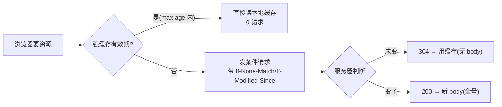

**TL;DR：** HTTP 缓存有两层，且它们的优化方向相反：**强缓存**（`Cache-Control: max-age`）在资源仍新鲜时可以让客户端不发请求——省掉的是一次网络往返；**协商缓存**（`ETag` + `If-None-Match`、`Last-Modified` + `If-Modified-Since`）是在过期后发条件请求，服务器若判断未变就回 `304 Not Modified`，响应体为 0。**强缓存省请求，协商缓存省 body**，但是否组合、是否允许共享，要看资源是否个性化、是否可版本化以及 CDN 的缓存合同。仓库内 probe 只验证 origin 的 200/304 协议，不冒充浏览器缓存或生产网络延迟。

## 一、两条路，三种状态

浏览器拿一个 URL，先查自己缓存，可能命中三种：



- **强缓存命中**：浏览器不再发请求，直接用本地资源（对应磁盘缓存与有效期）。
- **协商缓存命中**：发一个只带校验头的请求，服务器回 `304 Not Modified`——**服务器不发 body**，浏览器继续用本地缓存。
- **协商错失**：服务器回 200 + 新 body。

## 二、两个响应头的账本

| 头 | 触发方式 | 换来什么 | 成本 |
| :--- | :--- | :--- | :--- |
| `Cache-Control: max-age=3600` | 浏览器自行判定有效期 | 完全不发请求（省一个 RTT） | 过期即失效（哪怕内容没变也失效） |
| `ETag` + `If-None-Match` | 客户端带 ETag 问 | 只付 header 的 RTT，省掉 body | 每次总要发一次请求 |
| `Last-Modified` + `If-Modified-Since` | 客户端带时间问 | 同上 | 时间粒度秒，做不到"变了就 304" |

**同一个可公开资源**，两者的常见配合是：`max-age` 定"这段时间不用问"，`ETag` 定"过期后怎么问"。前者赢在没有请求，后者赢在内容没变时不用重传 body。但个性化响应不能直接交给共享缓存；不可变 hash 资源也可能只需要长 `max-age`，不必依赖每次 revalidation。配置不是“两个头永远同时给”，而是先确定缓存主体和失效策略，再选择头。

好问题：为什么有了 `ETag` 还要 `Last-Modified`？**因为并非所有服务器都能廉价地算 ETag**（要 hash 内容），`Last-Modified` 是更便宜的对证——代价是精度差：一秒钟内改两次，`Last-Modified` 就漏报。实践中多数服务器两者都出，客户端会优先 `If-None-Match`。

## 三、304 省的是响应体，不是这次请求的往返

用一个教学 fixture 看字节账：`200 OK` 返回 19 字节 body；同一个 ETag 的 `304` 返回 **0 字节 body**。生产图片、JSON 或 HTML 的 body 大小当然不同，但“验证命中不重传表示内容”这一语义不变。304 仍然需要一次请求、服务端判断和响应头处理，所以它不等于零延迟。

```
200:  body + 响应头                    →  一次完整下载
304:  0 字节 body + 缓存相关响应头       →  保留客户端已有表示
```

对开发者，判断一张图是否走对了账就这样：

```bash
# 用 GET 观察真实响应头；-I 发的是 HEAD，不一定复现 GET 路径
curl -sD - -o /dev/null https://example.com/app.js | grep -i "cache-control\|etag\|last-modified"

# 拿到的 ETag 再去验证协商缓存：
curl -s -H 'If-None-Match: "abc123"' -o /dev/null -w "%{http_code}\n" https://example.com/app.js
# 输出 304 = 协商缓存命中
```

## 四、坑：为什么你的"缓存有时候不起作用"

写错了头才是真正的坑，三个高频错：

1. **`Cache-Control: no-cache` 被当成"不缓存"**。`no-cache` 其实意思是"**可以缓存，但每次要用之前先向源站验证**"→ 它走的是协商缓存那条链，不是禁用缓存。

   真正禁止的是 `no-store`。
2. **`max-age` 写进 cache-control 却不给 `ETag`**。强缓存过期后没有协商能力 → 每次一到点就全量下载，等价于没缓存。
3. **把 HTML 和 hash 资源用同一套 max-age**。HTML 通常需要更快看到新入口，可以使用短 TTL 或 `no-cache` 并配 validator；带内容 hash 的 CSS/JS 文件名变化即代表内容变化，适合 `public, max-age=31536000, immutable`。这不是“HTML 默认 no-store”，而是资源更新策略不同。

还要补一层共享缓存语义：`public`/`private` 约束响应能否被共享缓存使用，`s-maxage` 可以单独给 CDN TTL，`must-revalidate` 约束 stale 响应的使用。带用户身份、Cookie 或权限结果的响应，不能只因为返回了 ETag 就交给公共 CDN。

| 资源形状 | 常见策略 | 为什么 | 失败时先查什么 |
| --- | --- | --- | --- |
| 内容 hash 写入文件名的 CSS/JS/图片 | `public, max-age=31536000, immutable` | 文件名变化就是失效信号，减少 revalidation | 部署是否真的生成新 hash、HTML 是否引用新文件 |
| HTML 入口 | 短 `max-age` 或 `no-cache` + ETag | 新入口需要较快可见，过期后仍可避免重传 | HTML 是否带旧引用、CDN 是否缓存了错误版本 |
| 用户私有 JSON | `private`，按需使用 ETag | 浏览器可复用，公共缓存不能混用用户响应 | Cookie/Vary、授权边界和缓存 key |
| 多租户公共 API | 明确 `public`/`Vary`/`s-maxage` | 共享缓存必须知道哪些请求头会改变表示 | `Vary` 是否覆盖语言、编码和租户维度 |

这张表比“所有响应都加 max-age + ETag”更可靠：缓存策略首先是数据可见性和失效策略，其次才是字节优化。

## 五、一个对照实验说明为什么 304 值得写

仓库内的最小 origin probe 是：

```bash
node experiments/http-cache-contract/probe.mjs
```

本机一次输出：

```text
case=initial status=200 body_bytes=19 etag="v1" cache_control=public, max-age=60
case=matching-etag status=304 body_bytes=0 etag="v1" cache_control=public, max-age=60
```

这只证明服务端对匹配 `If-None-Match` 返回 304；Node `fetch` 没有替你模拟浏览器缓存，所以不能据此证明“强缓存命中时请求根本不会发出”。原始输出和环境在 `evidence/http-cache-control-etag/2026-08-17-local/`。

## 六、结论：先决定谁能缓存，再决定如何验证

HTTP 缓存两张账：**强缓存省请求次数，协商缓存省响应 body**。但这两张账必须服从第三张账：响应能否被浏览器、CDN 或其他用户共享。发现条件请求没有得到 304 时，先查 ETag 是否稳定、`If-None-Match` 是否真的到达源站、响应是否被 `Vary`/授权逻辑改变；不要只看浏览器 Network 面板里的一个 status。

下一步：对一条真实资源分别验证三件事：新 URL 的首次 200、过期后的匹配 304、发布新 hash 后的新 200；再用一个带用户身份的响应确认它不会被公共缓存复用。只有这四个边界都明确，缓存配置才算完成，而不是“响应头看起来很全”。

## 七、参考资料
1. RFC 9111：HTTP Caching—— https://www.rfc-editor.org/rfc/rfc9111
2. MDN：HTTP 缓存—— https://developer.mozilla.org/en-US/docs/Web/HTTP/Caching
3. MDN：HTTP 验证（ETag / If-None-Match）—— https://developer.mozilla.org/en-US/docs/Web/HTTP/Headers/ETag
4. curl 手册（-I / -H / -w）—— https://curl.se/docs/manpage.html

> 延伸阅读：304 之后真实往返延迟的账本，见[TLS 握手全流程：HTTPS 那几毫秒](/writing/tls-handshake-deep-dive)；缓存三层的服务器侧账本，见[缓存一致为什么比缓存命中难](/writing/cache-consistency)。
