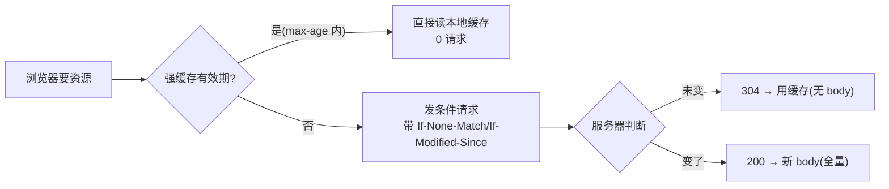

**TL;DR：** HTTP 缓存有两层，且它们的优化方向相反：**强缓存**（`Cache-Control: max-age`）在有效期内浏览器根本不发请求——省掉的是一次完整的网络往返；**协商缓存**（`ETag` + `If-None-Match`、`Last-Modified` + `If-Modified-Since`）是"我先来问一次"，服务器回你的如果是 `304 Not Modified`，只带一行头，Response Body 为 0 字节。**强缓存省「请求」，协商缓存省「body」**。正确姿势是组合使用，而测试 `curl -I` + `curl -H 'If-None-Match: ...'` 就能把两张账同时看清。

## 一、两条路，三种状态

浏览器拿一个 URL，先查自己缓存，可能命中三种：



- **强缓存命中**：浏览器不再发请求，直接用本地资源（对应磁盘缓存与有效期）。
- **协商缓存命中**：发一个只带校验头的请求，服务器回 `304 Not Modified`——**服务器不发 body**，浏览器继续用本地缓存。
- **协商错失**：服务器回 200 + 新 body。

## 二、两个响应头的账本

| 头 | 触发方式 | 换来什么 | 成本 |
| :--- | :--- | :--- | :--- |
| `Cache-Control: max-age=3600` | 浏览器自行判定有效期 | 完全不发请求（省一个 RTT） | 过期即失效（哪怕内容没变也失效） |
| `ETag` + `If-None-Match` | 客户端带 ETag 问 | 只付 header 的 RTT，省掉 body | 每次总要发一次请求 |
| `Last-Modified` + `If-Modified-Since` | 客户端带时间问 | 同上 | 时间粒度秒，做不到"变了就 304" |

**同一个资源**，两者的配合是：`max-age` 定 "这段随性不用问"，`ETag` 定 "过期后怎么问"。前者赢在没有请求，后者赢在哪怕过期了、内容没变，也要 304 一句轻话。也正因为"收货时机"不一样，正确配置永远是两者同时给。

好问题：为什么有了 `ETag` 还要 `Last-Modified`？**因为并非所有服务器都能廉价地算 ETag**（要 hash 内容），`Last-Modified` 是更便宜的对证——代价是精度差：一秒钟内改两次，`Last-Modified` 就漏报。实践中多数服务器两者都出，客户端会优先 `If-None-Match`。

## 三、304 为什么省出来的是"最近的延迟"

关键数据：一次典型的 `200 OK` + 5MB JPEG 需要传输 5MB 的 body；一次 `304` 响应只有约 200 字节的头，**body 为 0**。从带宽视角看：缓存命中省掉的是 body 的全部传输量。

```
200:  ~ 5.0 MB body  +  各种头   →  一次完整下载
304:    0 字节 body  +  几十字节 →  只差你头一次校验
```

对开发者，判断一张图是否走对了账就这样：

```bash
# 看强缓存是否生效（有 max-age）
curl -sI https://example.com/app.js | grep -i "cache-control\|etag\|last-modified"

# 拿到的 ETag 再去验证协商缓存：
curl -s -H 'If-None-Match: "abc123"' -o /dev/null -w "%{http_code}\n" https://example.com/app.js
# 输出 304 = 协商缓存命中
```

## 四、坑：为什么你的"缓存有时候不起作用"

写错了头才是真正的坑，三个高频错：

1. **`Cache-Control: no-cache` 被当成"不缓存"**。`no-cache` 其实意思是"**可以缓存，但每次要用之前先向源站验证**"→ 它走的是协商缓存那条链，不是禁用缓存。

   真正禁止的是 `no-store`。
2. **`max-age` 写进 cache-control 却不给 `ETag`**。强缓存过期后没有协商能力 → 每次一到点就全量下载，等价于没缓存。
3. **动态页面（HTML）默认被 no-store**。但如果它内部静态资源（CSS/JS）带 hash 文件名（`app.abc123.css`），前端就省心了：**hash 文件几乎永久强缓存**——文件名变了再更新，没有缓存失效问题。

## 五、一个对照实验说明为什么 304 值得写

```bash
# 同一个版本的两个条件
T1=$(curl -s -o /dev/null -w '%{size_download} %{time_total}' http://localhost:9000/big.json)      # 200
T2=$(curl -s -H 'If-None-Match: "v1"' -o /dev/null -w '%{size_download} %{time_total}' \
     http://localhost:9000/big.json)                                                                 # 304
echo "200: $T1  304: $T2"
```

本机快（`127.0.0.1`）时体感差无几，但你把它搬到移动网络/跨洲链路重跑一次，`time_total` 差一个数量级是常态。

## 结论

HTTP 缓存两张账：**强缓存省"请求次数"，协商缓存省"响应 Body"**。最优化组合是从 `max-age`（让你的静态资源在客户端续约） + `ETag`（过期后总先验一次，匹配就给 304）。304 响应只有头没有包，是"不能再小"的支付。实测里如果发现 `curl` 没给 304，先检查 `ETag` 是否存在——许多框架默认关着它。

下一步：用上面 `curl` 两条命令对着你生产资源的 hash 版 URL 跑一次；依次看到 200 → 304 →（改文件名后）新 200 完整一轮，你就把 HTTP 缓存的整张账本刻进脑子里了。

## 参考资料
1. RFC 7234：HTTP Caching—— https://www.rfc-editor.org/rfc/rfc7234
2. MDN：HTTP 缓存—— https://developer.mozilla.org/en-US/docs/Web/HTTP/Caching
3. MDN：HTTP 验证（ETag / If-None-Match）—— https://developer.mozilla.org/en-US/docs/Web/HTTP/Headers/ETag
4. curl 手册（-I / -H / -w）—— https://curl.se/docs/manpage.html

> 延伸阅读：304 之后真实往返延迟的账本，见[TLS 握手全流程：HTTPS 那几毫秒](/writing/tls-handshake-deep-dive)；缓存三层的服务器侧账本，见[缓存一致为什么比缓存命中难](/writing/cache-consistency)。