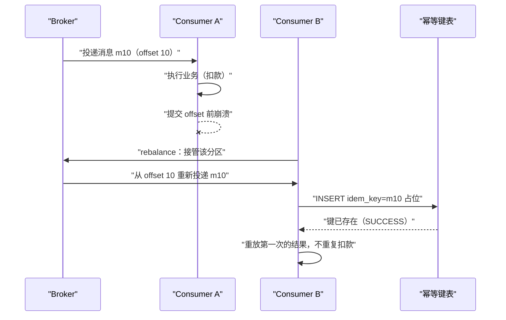
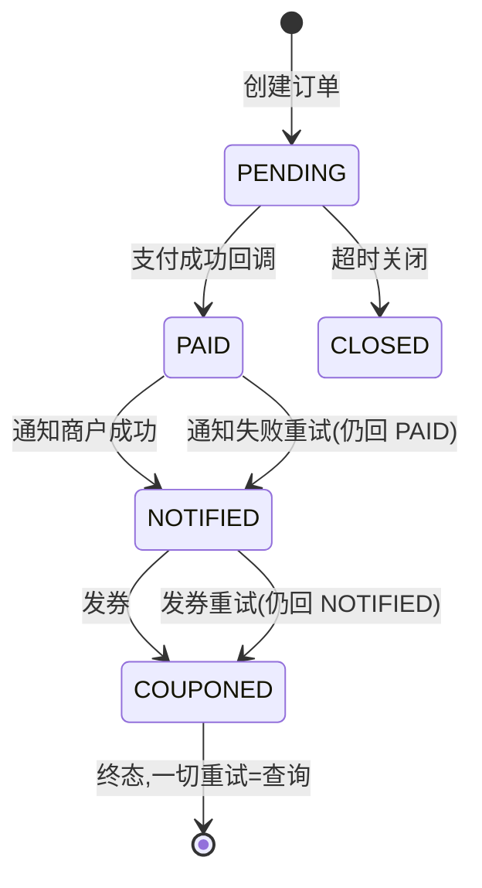
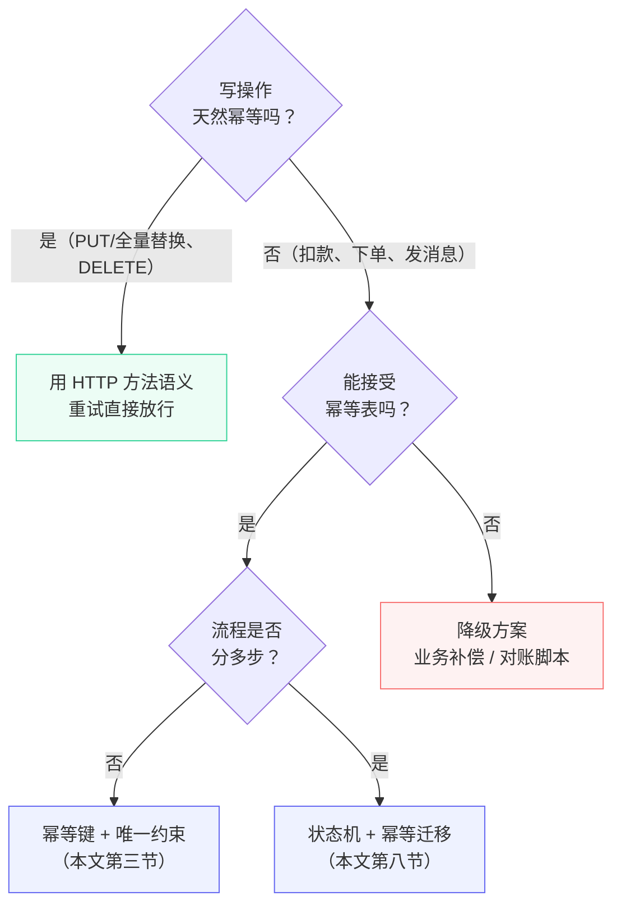

**TL;DR：**网络超时是常态，所以重试必然存在；但重试会放大一切错误——客户端超时重试、网关再重试、服务内部又重试，一次请求最多能被放大成 27 次，非幂等的写路径就变成"27 次扣款"。幂等性工程就是给"重试"装上限流阀：**幂等键（唯一约束）保证同一请求只执行一次，状态机保证重复请求返回第一次的结果**。实现上有三层：存储层唯一约束兜底、业务层幂等键占位、终态响应缓存（重放）。选型看一个参数：**写操作天然幂等吗？** 是——直接用 HTTP 方法语义（PUT/DELETE）；否——必须引入幂等键或状态机。

## 一、重试的必要与代价

先承认一个前提：**网络不可靠，超时必然发生**——丢包、对端 GC 停顿、负载均衡摘除、机器崩溃重启，都会让请求"发出去了但没收到响应"。客户端只能靠重试自救。但重试要付出三重代价：

1. **放大**：每一层重试都是乘法。请求 → 网关（×3）→ 服务 A（×3）→ 服务 B（×3）= 27 次，见下图；
2. **超时叠加**：每层各等 3 秒才重试，整条链路的最坏等待 = 各层超时之和，用户等 9 秒+，前端又触发自己的重试；
3. **语义破坏**：读操作重试无害，写操作重试会产生重复效果——扣款两次、下单两条、消息发两遍。


*图注：非幂等写路径上，重试次数逐层相乘；引入幂等键后，重复请求只执行一次，其余重试返回第一次的结果。*

三个教训级别的工程事实：**超时并不代表请求没执行**（响应丢失 ≠ 未处理）；**"重试就能解决"的假设在写路径上从不成立**；**分布式场景下，"执行一次且仅一次"（exactly-once）是物理上做不到的**——能做的是"至少一次 + 幂等化"，把重复执行变得无害。目标不是消灭重试，而是让重试无副作用。

## 二、HTTP 方法语义：RFC 9110 怎么说

动手建幂等表之前，先白捡一个零成本方案：**有些操作根本不需要幂等键，HTTP 方法语义已经保证了重试安全。** RFC 9110 §9.2.2 给了权威定义：

> "A request method is considered 'idempotent' if the intended effect on the server of multiple identical requests with that method is the same as the effect for a single such request. Of the request methods defined by this specification, PUT, DELETE, and safe request methods are idempotent."
>
> —— RFC 9110：https://www.rfc-editor.org/rfc/rfc9110.html#section-9.2.2

也就是说：PUT、DELETE，以及全部安全方法（GET/HEAD/OPTIONS/TRACE）是幂等的；**POST 不在其列**。这段定义的三个细节比定义本身更重要：

**第一，"幂等"承诺的是资源的终态，不是响应。** 原文紧接着补了一句 "though the response might differ"——DELETE 一个不存在的资源，第一次可能 200、第二次 404，但资源终态都是"不存在"，这就是幂等。所以别拿"响应一样不一样"去判断幂等，看的是"效果"。

**第二，幂等方法 ≠ 无副作用。** 同一段原文明确说：服务端可以"log each request separately, retain a revision control history, or implement other non-idempotent side effects"。扣款这种操作做成 PUT 也是幂等的——重复 PUT 不会重复扣，但每次请求都会被记账、进审计、触发回调。副作用允许存在，只要它们不改变资源终态。

**第三，RFC 把"自动重试"的资格交给幂等性。** 原文说幂等方法之所以被单独区分，是因为"the request can be repeated automatically if a communication failure occurs before the client is able to read the server's response"——这正是第一节"放大"的对冲：幂等请求的重试是零成本、零风险的。反过来，RFC 对非幂等请求的重试给了两条硬约束：客户端 "SHOULD NOT automatically retry a request with a non-idempotent method"（除非它确定语义幂等），代理 "MUST NOT automatically retry non-idempotent requests"。**网关层自动重试 POST，直接违反 RFC。**

这一节的结论与第九节决策树的第一问呼应：写操作若是全量替换、删除这类"天然幂等"的语义，HTTP 方法语义就是零成本方案，一张幂等表都不用建。

## 三、幂等键：唯一约束是最朴素也最可靠的闸门

幂等键（idempotency key）的思路：客户端为每次"业务上只该发生一次"的操作生成一个全局唯一键，服务端**以这个键为主键落一笔记录**——数据库唯一约束保证并发重试只能有一个成功。Stripe 的 API 设计是行业范本：客户端传 `Idempotency-Key` 头，服务端把"键 → 处理结果"存下来，重复键直接返回已存结果。

```sql
CREATE TABLE idempotency_keys (
  id           BIGINT PRIMARY KEY AUTO_INCREMENT,
  idem_key     VARCHAR(64)  NOT NULL,
  request_hash CHAR(64)     NOT NULL DEFAULT '',  -- 请求体指纹,防止同键不同请求体;示例 INSERT 省略该列时使用默认空串
  status       VARCHAR(16)  NOT NULL,  -- IN_PROGRESS / SUCCESS / FAILED
  response     JSON,                   -- 第一次执行的结果,用于重放
  created_at   DATETIME(3) NOT NULL DEFAULT CURRENT_TIMESTAMP(3),
  UNIQUE KEY uk_idem_key (idem_key)
) ENGINE=InnoDB;
```

Go 侧的完整流程（扣款为例）：

```go
func HandleDebit(ctx context.Context, key, accountID string, amount int64) (*Receipt, error) {
    // 1. 开启事务:占位与执行业务必须落在同一事务(见正文规则),
    //    否则"占位成功但业务没执行"的间隙会被重试发现,导致重复扣款
    tx, err := db.BeginTx(ctx, nil)
    if err != nil {
        return nil, err
    }
    defer tx.Rollback() // 未走到 Commit 时兜底回滚(重复 Rollback 是安全的)

    // 2. 占位:唯一约束在 INSERT 执行瞬间生效(即时约束),
    //    所以并发重试仍然只有一个 INSERT 成功,事务内检测不受影响
    _, err = tx.ExecContext(ctx,
        `INSERT INTO idempotency_keys (idem_key, status)
         VALUES (?, 'IN_PROGRESS')`, key)
    if err != nil {
        // 区分错误类型:只有唯一键冲突才算"键已存在"——
        // MySQL 错误码 1062(DUPLICATE ENTRY)。生产代码建议用驱动类型精确判断,
        // 例如 go-sql-driver/mysql 的 mysqlErr.Number == 1062 或 errors.Is;
        // 这里用错误文本匹配做示意,不额外引入依赖
        if !strings.Contains(err.Error(), "1062") {
            return nil, err // 其它错误:直接返回,不当作"键已存在"处理
        }

        // 3. 键已存在:事务里没有需要提交的写入,回滚后查已有记录,不重新执行
        tx.Rollback()
        rec, err := findByIdemKey(ctx, key)
        if err != nil {
            return nil, err
        }
        if rec.Status == "SUCCESS" {
            return rec.Receipt, nil // 重放第一次的结果
        }
        return nil, ErrDuplicateInProgress // 并发占位中,让客户端退避
    }

    // 4. 第一次执行真正业务(扣款):debitTx 使用 tx 上的同一连接,与占位同事务
    receipt, err := debitTx(ctx, tx, accountID, amount)
    status := "SUCCESS"
    var resp any = receipt
    if err != nil {
        status, resp = "FAILED", err // FAILED 允许客户端换键重试
    }

    // 5. 回填结果(用相同键 UPDATE 自己占的那行,仍在同一事务)
    if _, err := tx.ExecContext(ctx,
        `UPDATE idempotency_keys SET status=?, response=?
         WHERE idem_key=?`, status, resp, key); err != nil {
        return nil, err
    }

    // 6. 提交:占位、业务、回填要么全部生效,要么全部回滚
    if err := tx.Commit(); err != nil {
        return nil, err
    }
    return receipt, err
}
```

四个细节决定这套代码的成败：

- **占位与执行业务必须落在同一事务/同一存储**——若幂等表在 MySQL 而业务在另一个库，两者之间就不是原子的，"占位成功但业务没执行"的间隙会被重试发现，重复执行；
- **IN_PROGRESS 卡死怎么办**：进程崩溃留下 IN_PROGRESS 行，需要超时回收（如 60s 未完成视为死行，允许新请求接管）——否则一次崩溃永久卡死该键；回收与接管的完整实现见第五节；
- **FAILED 语义**：业务失败允许客户端**换新键**重试（失败本身不幂等）；只有 SUCCESS 才用旧键重放；
- **请求体指纹**（request_hash）：同一键配不同请求体必须拒绝，防止客户端 bug 复用键；指纹怎么算才稳定，见第四节。

### 一个常见的误解：INSERT 幂等键表失败不代表请求重复

把"INSERT 报错"直接当成"键已存在"，是幂等键实现里最常见的错误——这正是上面 `HandleDebit` 里区分 1062 与其它错误的原因。INSERT 失败至少有两种完全不同的来源：

- **唯一键冲突（MySQL 错误码 1062）**——才是重复请求，可以安全地走"查表重放"；
- **网络中断 / 主库宕机**——服务端可能根本没执行（重试后 INSERT 会成功），也可能执行了但响应在路上丢了（重试后撞 1062）。此时结果**未知**，不是"重复"。

判定只有几行（生产代码建议用驱动类型精确判断，例如 go-sql-driver/mysql 的 `*mysql.MySQLError`）：

```go
var mysqlErr *mysql.MySQLError
if errors.As(err, &mysqlErr) && mysqlErr.Number == 1062 { // 唯一键冲突:键已存在 → 查表重放
    return replayResult(ctx, key)
}
return nil, err // 其它错误:结果未知 → 按重试语义处理,不是重放语义
```

把非 1062 错误误判成"键已存在"，重试会走上"查表重放"路径，而表中根本没有这行——该执行的操作永远没执行完；反过来把 1062 误判成其它错误，客户端换新键重试，同一笔业务会真的执行两遍。**1062 → 重放；其余 → 结果未知（重试，不重放）。**

可运行演示：go run ./idempotency，20 个并发重试中只有 1 次首次执行，其余重放。

## 四、请求指纹的工程细节：同键不同请求体，怎么才算"不同"

request_hash 的用途是拒绝"同一个幂等键、不同的请求体"——但"请求体"怎么定义，决定指纹是可靠的还是纸糊的。最容易犯的错是直接对客户端传来的原始字节做哈希：客户端序列化的字段顺序不同（`{"amount":1}` vs `{"amount":1,"currency":"cny"}` 缺字段）、数字格式不同（`1` vs `1.0`）、易变字段抖动，都会让同一笔业务算出两个指纹，然后被误判为"同键不同请求体"而拒绝。

正确做法是**服务端规范化后再哈希**：把请求体解析成固定结构体，只对"业务语义字段"重新序列化，易变字段全部排除：

```go
// 请求指纹：只对"业务语义"字段做哈希。
// 时间戳、trace_id、随机数、客户端版本这类易变字段一律不进指纹，
// 否则同键同业务会因为字段抖动被误拒
type debitRequest struct {
    AccountID string `json:"account_id"`
    Amount    int64  `json:"amount"`
    Currency  string `json:"currency"`
}

func fingerprint(req *debitRequest) string {
    canonical, err := json.Marshal(req) // 结构体字段顺序固定，序列化字节稳定
    if err != nil {
        panic(err)
    }
    sum := sha256.Sum256(canonical)
    return hex.EncodeToString(sum[:])
}
```

规范化有两条边界值得单独说明。**数字精度**：金额用 int64 分而不是 float，`100.0` 与 `100` 在 float 序列化下可能不一样，整数分则稳定。**数组顺序**：取决于业务语义——购物车 SKU 列表的顺序本身是语义（用户排的序），保留；标签集合的顺序不是，先排序再哈希。拿不准就按"服务端解析后的结构是否相同"来判定，而不是"字节是否相同"。

还有一条纪律：**幂等键本身不进指纹**——它本来就是区分请求的维度，算进去只会让"同键"这个概念自相矛盾。

## 五、幂等键的卫生：TTL、清理与回收

幂等表不是建完就不管的表。每笔业务一行，日单量百万时一年就是三亿行，所以它必须回答三个问题：过期行怎么清、死行怎么接管、保留期怎么定。

**保留期与重放窗口的关系**是设计基准：客户端最晚什么时候还会重试，幂等行就要活到什么时候。客户端超时 3 秒、退避重试最多 5 次，最晚一次重试发生在 15 秒内——但客户端进程可能崩溃重启、运维可能手动重放，所以保留期要按"最大重试窗口 + 缓冲区"来定，常见是 7 天。**保留期短于重放窗口，超期后的重试就会真的再执行一次**——"重放"和"重执行"的分界线就是这一行数据活着没有。

**过期清理**：按 `created_at` 分批 DELETE，配合按月分区后直接 DROP 整月分区，避免长事务：

```sql
-- 按月分区（建表节选）：过期整月直接 DROP PARTITION，比 DELETE 干净
ALTER TABLE idempotency_keys
  PARTITION BY RANGE (TO_DAYS(created_at)) (
    PARTITION p2026_06 VALUES LESS THAN (TO_DAYS('2026-07-01')),
    PARTITION p2026_07 VALUES LESS THAN (TO_DAYS('2026-08-01')),
    PARTITION p2026_08 VALUES LESS THAN (TO_DAYS('2026-09-01'))
  );

-- 保留期之外的行分批删除（每批 1000 行，避免长事务锁）
DELETE FROM idempotency_keys
 WHERE created_at < NOW(3) - INTERVAL 7 DAY
 LIMIT 1000;
```

**IN_PROGRESS 死行的回收**有两种实现，职责不同：回收进程负责"清扫"，新请求负责"接管"。清扫是兜底（防止表里堆积垃圾行），真正让业务自愈的是接管——进程崩溃后，60s 内没有完成的那笔操作，允许后来的请求用**条件 UPDATE** 把执行权抢过来：

```sql
-- 死行接管：60s 前还停在 IN_PROGRESS 的视为已死。
-- 影响行数 = 1 → 接管成功，继续执行业务；
-- 影响行数 = 0 → 别人已接管，或已有终态，回到"查表重放"分支
UPDATE idempotency_keys
   SET status     = 'IN_PROGRESS',
       request_hash = ?,
       created_at = NOW(3)
 WHERE idem_key = ?
   AND status = 'IN_PROGRESS'
   AND created_at < NOW(3) - INTERVAL 60 SECOND;
```

这个 UPDATE 的妙处在于它把"判断死行"和"抢占执行权"合并成一条原子语句：两个并发的新请求同时抢同一行，行锁串行化后只有一个能影响 1 行，另一个拿到 0 行就乖乖回去查表——和第三节的 INSERT 占位是同一个思想，只是把判定条件从"键不存在"换成了"键是死行"。

## 六、没有单库可依赖时：Redis 版幂等键

第三节的整套方案默认"有一张可以放幂等表的单点数据库"。分库分表之后这个前提没了：幂等表跟着业务键分片，重试可能落在不同分片；性能敏感的场景下，每次操作多两次 SQL 事务也不划算。这时候 Redis 版幂等键是常见替代——占位和结果都放 Redis：

```bash
# 占位：键不存在才写入，SET 的 NX+EX 组合是原子的
redis-cli SET "idem:req_123" "IN_PROGRESS" NX EX 3600
# -> OK      ：拿到执行权，继续执行业务
# -> (nil)   ：键已存在，读结果键重放

# 第一次执行完成后，把结果写进结果键（TTL 与占位键一致）
redis-cli SET "idem:req_123:result" '{"status":"SUCCESS","receipt":"rc-42"}' EX 3600

# 重复请求：结果键存在就直接重放
redis-cli GET "idem:req_123:result"
```

与数据库版对比，差异全在一致性保证的形态上：

| 维度 | MySQL 幂等表 | Redis 版 |
| :--- | :--- | :--- |
| 原子占位 | 唯一约束，事务内 | SET NX EX，单命令原子 |
| 结果持久化 | 与业务同库同事务提交 | 结果键另写，业务与占位不原子 |
| 过期机制 | 自建清理任务 | 键自带 TTL |
| 崩溃语义 | IN_PROGRESS 死行靠条件 UPDATE 接管 | 占位键过期即自动释放，天然自愈 |
| 一致性前提 | 单库 | Redis 主从/集群，切换窗口有丢键风险 |
| 适用场景 | 业务库在手，强一致优先 | 无单点库、性能敏感、可容忍小窗口 |

两个必须写进代码的注意点。第一，**业务失败时占位键不会自动变 FAILED**：占位与业务不在同一事务里，业务失败必须主动 DEL 占位键（或等 TTL 兜底），否则客户端同一键重试会一直撞上"IN_PROGRESS"。第二，**Redis 的可用性窗口直接等于幂等性窗口**：主从切换瞬间丢失未同步的键，重试就可能真的重执行——这和 MySQL 版"单库事务"的保证不是一个量级，选它之前先确认业务能接受。

## 七、消息队列的重复消费：同一个幂等键问题的另一种形态

写路径的重复不只来自 HTTP 重试。消息队列把"重复"变成了默认行为：**at-least-once 投递下，消息可能被投递不止一次**，重复的来源有三个，全都在消费端可见：

1. **发送超时重投**：发送方超时后无法区分"没发出去"与"发出去了但 ack 丢了"，只能重投——这是所有 MQ 共通的重复来源；
2. **消费端崩溃**：处理完消息、还没提交 offset 就崩溃，重启后从最后提交的 offset 重放，已处理的消息再处理一遍；
3. **rebalance 转手**：consumer 加入/退出导致分区重新分配，新消费者从最后提交的 offset 继续消费，未提交的部分重复。

Kafka 的幂等生产者解决了其中一条的一半：`enable.idempotence` 从 Kafka 3.0 起默认开启（KIP-679），broker 给每个生产者分配 producer ID，消息带单调递增的序号，broker 按 producer ID + 分区序号去重——**producer 自身重试不会再产生重复**。但官方 javadoc 明说了边界："the producer can only guarantee idempotence for messages sent within a single session"——进程重启拿到新 producer ID，或者应用层自己重发（"application level re-sends"），都不在去重范围内。至于真正的 exactly-once，需要事务 API（`transactional.id`）+ 消费端 `read_committed`，而且严格说只是"对 Kafka 自己"的 exactly-once——消费端把消息写进外部系统的那一步，事务管不到。

所以消费端的账还是要自己算：



消费端去重和第三节的幂等键是**同构的**：消息里带上业务键（订单号、交易号），消费端把它当 `idem_key` 落幂等表或状态机，重复消息走"查当前状态"而不是"再执行一次"。区别只在入口：HTTP 重试靠客户端传键，MQ 重投靠消息自带键。把"每个环节各自去重"换成"消费端一处去重"，是消息链路最省事的幂等化方式。

## 八、状态机：让"结果"本身幂等

幂等键解决"同一请求只执行一次"，但业务里还有一类问题它管不到：**步骤间的重试**——比如支付回调流程：收到回调 → 更新订单 → 通知商户 → 发券，其中任何一步重试，前面的步骤会重复。解法是把业务流程建成**状态机**，每个状态是终态，重试从"重放步骤"变成"查当前状态"：



规则只有一条：**每个状态是终态，迁移是幂等的**——`PAID` 收到重复支付回调不会"再付一次"，只是确认自己是 `PAID`。实现上状态迁移必须加条件（`WHERE status = 'PENDING'`），防止乱序迁移覆盖终态：

```sql
-- 条件迁移:只有 PENDING 允许变为 PAID,重放/乱序不会覆盖终态
UPDATE orders SET status='PAID' WHERE id=? AND status='PENDING';
```

这套思路与[缓存一致性](/writing/cache-consistency)里的版本校验同构：**用"版本/状态"代替"时间/幂等"，把不可判定的重试变成可判定的查询**。

### 深化：状态迁移的并发安全

`WHERE status='PENDING'` 的条件迁移防得住"乱序覆盖终态"，防不住"读旧状态 → 判断 → 写"的三步非原子：多副本下两个节点同时读到 PENDING、同时迁移到 PAID，后写者覆盖先写者，而 WHERE 条件察觉不到"我读的是旧副本"。

两个最小方案：

1. **迁移事件也走唯一约束**：每次迁移落一条事件记录（表或队列），同一迁移只有一次能占位成功，谁先占位谁赢；
2. **乐观锁版本列**：`UPDATE orders SET status='PAID', version=version+1 WHERE id=? AND version=?`，影响行数为 0 即冲突，回到"重读状态 → 重放迁移"。

共同原则：**迁移的胜负由唯一约束或版本判定，不交给"读到旧状态"的信任**——重试从"可能重复执行"变成"只能赢一次"，与第三节幂等键的占位思想同构。

## 九、选型：幂等键、状态机还是 HTTP 语义？



| 方案 | 核心机制 | 覆盖场景 | 成本 |
| :--- | :--- | :--- | :--- |
| HTTP 语义幂等 | PUT/DELETE 天然可重放 | 全量更新、删除 | 零 |
| 幂等键 | 唯一约束 + 结果重放 | 单步写操作 | 中（表 + 流程） |
| 状态机 | 终态 + 条件迁移 | 多步流程 | 高（建模 + 迁移） |
| 补偿/对账 | 事后检测抵消 | 无法前置幂等时兜底 | 高（对账延迟） |

## 十、演练：故障注入清单

幂等性靠上线前排练验证，而不是等"重复扣款"上用户账单。把第二节到第七节讲过的每一条机制，都对应一个可以注入的故障：

| 注入动作 | 预期行为 | 靠哪条机制 |
| :--- | :--- | :--- |
| kill -9 正在处理的实例 | IN_PROGRESS 行 60s 后能被新请求接管，重试最终成功且不重复扣款 | 第五节死行接管 |
| 同键同请求体重放 100 次 | 恰好执行 1 次，其余返回第一次的结果 | 唯一约束 + 重放 |
| 同键不同请求体 | 拒绝，不执行 | 第四节请求指纹 |
| 20 个并发同键请求 | 恰好 1 次首次执行，19 个走重放路径 | INSERT 占位 |
| 清空幂等表后重放旧键 | 重新执行一次——验证保留期边界 | 第五节保留期 |

最后一条最有信息量：它把"保留期 ≥ 重放窗口"变成可验证的规则。生产里出现"同一笔操作执行了两遍"时，第一件事不是翻业务代码，而是查幂等行还在不在——**如果行没了，问题不在幂等逻辑，在保留期**。

## 十一、重试预算与 SLA

给"重试"本身装上限流阀：**重试必须有预算**（次数 × 退避上限），并且**超时与重试预算要写进 SLA**。

用户最坏体验有一个简单公式：**P99 延迟 × 最大重试次数**。服务方承诺 P99 200ms、调用方最多重试 5 次，用户最坏等待就是 200ms × 5 = 1s。SLA 上写"P99 200ms"并不等于用户体验 200ms——体验的最坏值取决于两个预算的乘积，所以预算数字必须写进合同；否则一次故障里每一层都在超预算重试，放大效应从这里开始。

退避策略一行建议：固定退避（如每次 500ms）简单可控，适合低并发、延迟不敏感的场景；指数退避 + jitter（`min(2^n, 上限)` 加随机化）避免重试风暴，适合高并发链路。要点不是选哪种算法，而是让"次数 × 上限"有明确的数字。

这条纪律和[优雅停机的预算分配](/writing/graceful-shutdown-in-go)是同一种思维方式：**凡是有上限的资源，都先分预算，再谈实现**。

## 参考资料

1. Stripe API 文档：Idempotent Requests（幂等键的官方工程定义与语义）—— https://docs.stripe.com/api/idempotent_requests
2. PayPal Engineering Blog：Idempotency in Payment Processing（支付场景的状态机与幂等键实践）—— https://medium.com/paypal-tech/improving-our-idempotency-systems-57d0bc4f9bb4
3. AWS 官方文档：Making retries safe with idempotent APIs（幂等与重试预算）—— https://docs.aws.amazon.com/whitepapers/latest/build-secure-and-reliable-applications-aws/making-retries-safe-with-idempotent-apis.html
4. Distributed Systems Course（M. Kleppmann）：Exactly-once semantics 的不可实现性与 at-least-once + idempotency—— https://www.cl.cam.ac.uk/teaching/2122/ConcDisSys/dist-sys-notes.pdf
5. MySQL 官方文档：服务器错误参考（1062：ER_DUP_ENTRY 唯一键冲突）—— https://dev.mysql.com/doc/refman/8.0/en/error-messages-server.html
6. RFC 9110：HTTP Semantics §9.2.2（幂等方法定义与自动重试规则）—— https://www.rfc-editor.org/rfc/rfc9110.html#section-9.2.2
7. Apache Kafka 官方文档：Message Delivery Semantics（幂等生产者、exactly-once 边界与 at-least-once）—— https://kafka.apache.org/documentation/#semantics
8. Redis 官方文档：SET 命令（NX/EX 原子占位）—— https://redis.io/docs/latest/commands/set/

> 延伸阅读：重试放大的超时视角来自停机排空,见[SIGTERM 之后发生了什么:把优雅停机做成一件确定的事](/writing/graceful-shutdown-in-go)；主从延迟导致读旧数据时,幂等校验正是"读从 + 版本校验"的兜底,见[主从复制延迟 300ms 的账单:读路径设计的三种姿势](/writing/replication-lag-read-paths)；时钟回拨造成的重复与逆序,最终也靠幂等兜底,见[时间戳会骗人:时钟回拨与分布式系统的顺序幻觉](/writing/clock-skew-distributed-systems)。

