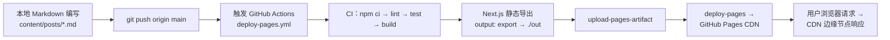
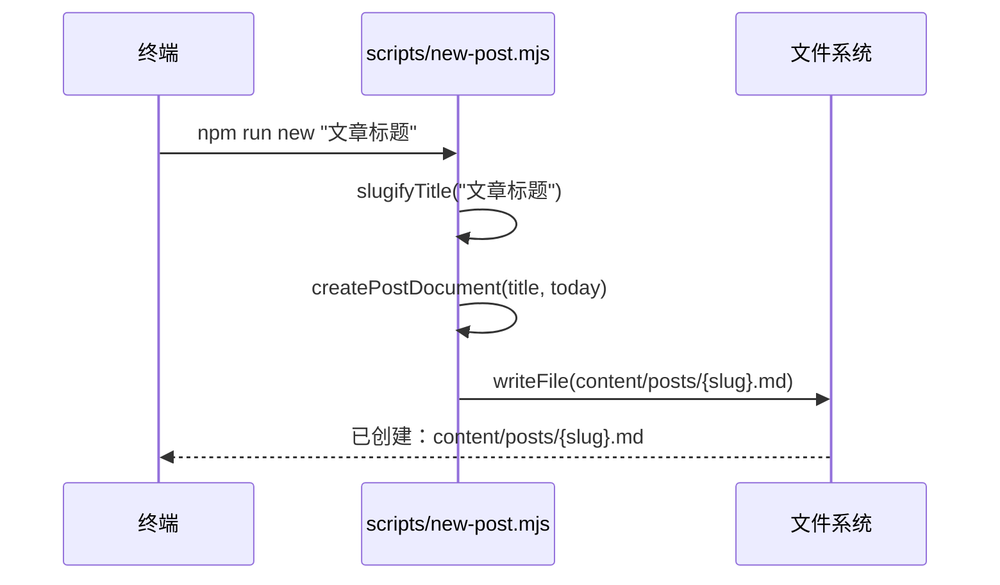
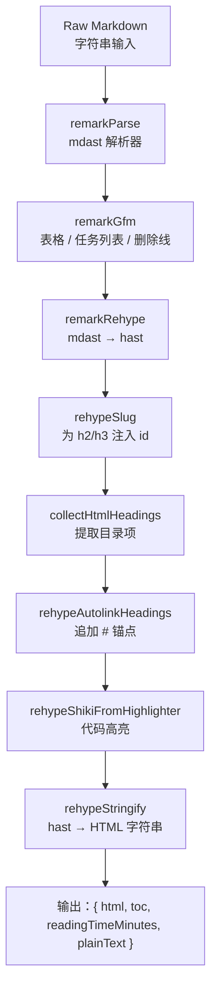
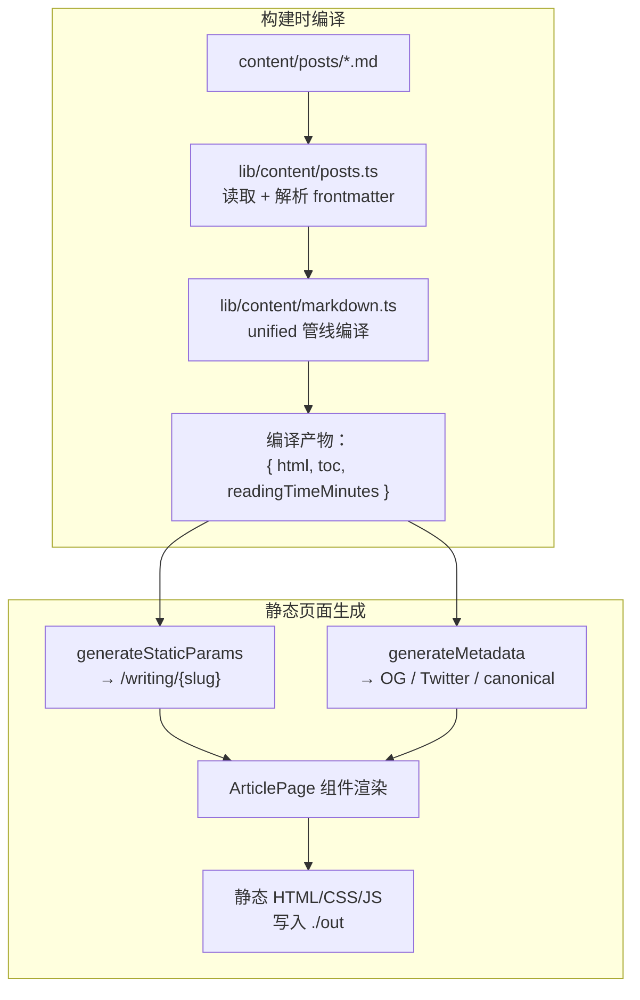
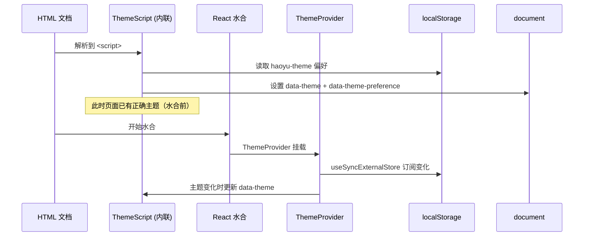
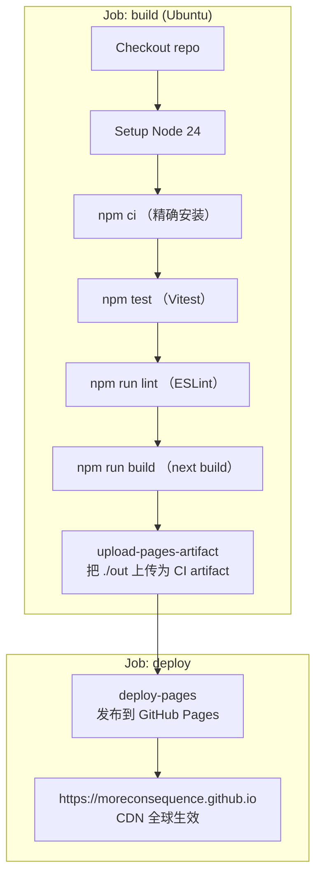
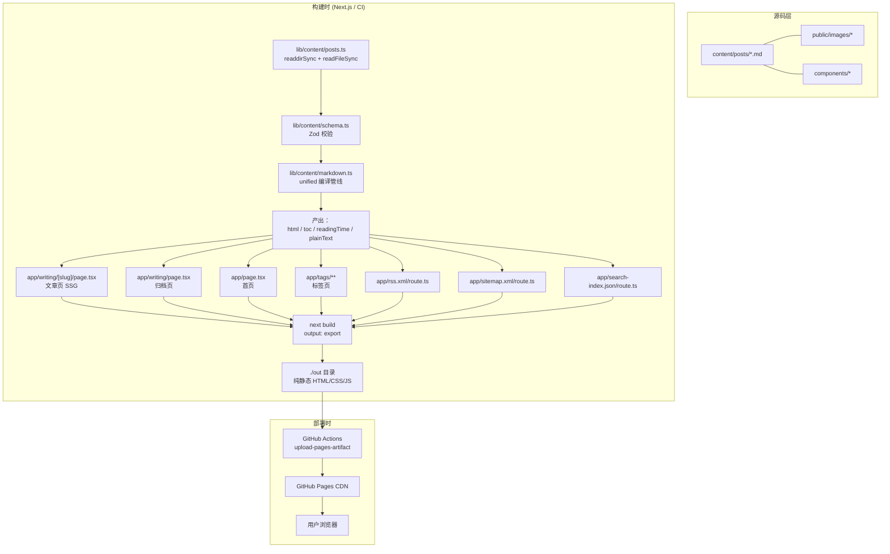

TL;DR：这套博客系统由 `content/posts/` 目录下的 Markdown 文件驱动，经过 unified 编译管线转化为 HTML，由 Next.js 静态生成页面，最终通过 GitHub Actions 自动构建并部署到 GitHub Pages。全程无数据库、无 CMS、无运行时服务端。

---

## 一、 全链路总览

从敲下键盘到读者在浏览器中看到页面，一篇博客经历以下阶段：



整个过程没有运行时服务器。`next build` 在 CI 环境生成纯静态的 HTML/CSS/JS，上传到 GitHub Pages 后，通过它的全球 CDN 分发。

---

## 二、 触发：如何开始一篇新文章

### 2.1 脚手架：`npm run new`

运行 `npm run new "文章标题"`，调用 `scripts/new-post.mjs`：



生成的 Markdown 包含 YAML frontmatter 骨架：

```yaml
---
title: "文章标题"
description: "请在这里填写一句话摘要"
publishedAt: "2026-07-26"
tags: ["待整理"]
draft: true
featured: false
---
```

`slugifyTitle` 使用 Unicode 属性正则 `\p{Letter}` 和 `\p{Number}`，支持中文标题自动转成 kebab-case 文件名。

### 2.2 Frontmatter 的守门员：Zod 校验

在编译管线的起点，`lib/content/schema.ts` 用 Zod 定义了严格的 frontmatter 合约：

```typescript
const calendarDate = z.string().refine(isCalendarDate, "必须使用真实的 YYYY-MM-DD 日历日期");

export const postMetaSchema = z.object({
  title: z.string().trim().min(1),
  description: z.string().trim().min(1),
  publishedAt: calendarDate,
  updatedAt: calendarDate.optional(),
  tags: z.array(z.string().trim().min(1)).min(1),
  draft: z.boolean().default(false),
  featured: z.boolean().default(false),
  series: z.string().trim().min(1).optional(),
});
```

注意 `isCalendarDate` 不只是校验格式——它会用 `Date.UTC` 构造日期并逐字段比对，拒绝 2 月 30 日这类不存在日期。

---

## 三、 编译管线：从 Markdown 到 HTML

这是整个系统最核心的部分。位于 `lib/content/markdown.ts`，使用 unified 的 remark → rehype 管线：



### 3.1 代码高亮：Shiki 双主题方案

用 Shiki 4 配合 JavaScript 正则引擎（无 WASM 依赖），一次编译产出两个主题的 CSS 类名：

```typescript
.use(rehypeShikiFromHighlighter, highlighter, {
  themes: { light: "github-light", dark: "github-dark" },
  defaultColor: false,  // 关键：不内联颜色，交给 CSS 变量
})
```

`defaultColor: false` 意味着 Shiki 不在 `<span>` 上写死颜色值，而是生成 `style="--shiki-light: #..."` 这样的 CSS 变量。页面通过 `[data-theme]` 属性切换哪组变量生效：

```css
[data-theme="paper"] .article-prose pre code span {
  color: var(--shiki-light);
}
[data-theme="midnight"] .article-prose pre code span {
  color: var(--shiki-dark);
}
```

Highlighter 实例是单例模式，只初始化一次：

```typescript
let highlighter: ReturnType<typeof createHighlighter> | undefined;

export function createBlogHighlighter() {
  highlighter ??= createHighlighter({ ... });
  return highlighter;
}
```

### 3.2 目录提取与锚点

`collectHtmlHeadings` 是一个 rehype 插件函数，遍历 hast 树，收集所有 h2/h3 的 id、标题文字和层级深度，排除脚注标签。最终生成的 `toc` 数组传给 `TableOfContents` 组件，由 IntersectionObserver 驱动滚动高亮。

### 3.3 阅读时间与纯文本

`reading-time` 包计算分钟数（最少 1 分钟）。`plainText` 是粗暴但有效的去语法文本（去掉代码块、Markdown 符号），用于 Fuse.js 全文搜索。

---

## 四、 静态生成：Next.js App Router 如何产出页面

### 4.1 文章页 `writing/[slug]/page.tsx`

这是一个全静态页面。`generateStaticParams` 在构建时遍历所有 Markdown 文件，生成静态路径：

```typescript
export async function generateStaticParams() {
  return getPostSources("production").map((post) => ({ slug: post.slug }));
}
```

页面渲染时，`ArticleBody` 接收预编译的 HTML，通过 `dangerouslySetInnerHTML` 注入。客户端组件 `CodeCopy` 和 `MermaidRenderer` 作为 side-effect 组件，增强已渲染的静态 HTML。



### 4.2 首页、归档页、标签页

| 路由 | 文件 | 功能 |
|------|------|------|
| `/` | `app/page.tsx` | 精选、最新、主题标签 |
| `/writing` | `app/writing/page.tsx` | 按年份归档 |
| `/tags` | `app/tags/page.tsx` | 所有标签索引 |
| `/tags/[tag]` | `app/tags/[tag]/page.tsx` | 某标签下的文章列表 |

首页通过 `featured` 标记筛选精选文章，取前 2 篇展示，最新 3 篇在下方列表，去重后取前 8 个标签做主题导航。

### 4.3 数据端点（同样是静态的）

三个端点都声明 `dynamic = "force-static"`，在构建时产出：

| 端点 | 功能 | 库模块 |
|------|------|--------|
| `/rss.xml` | RSS 2.0 Feed + CDATA 全文 | `lib/feeds.ts:createRssXml` |
| `/sitemap.xml` | XML Sitemap | `lib/feeds.ts:createSitemapXml` |
| `/search-index.json` | Fuse.js 搜索索引 | `lib/search.ts:buildSearchIndex` |
| `/robots.txt` | 搜索引擎指引 | `lib/feeds.ts:createRobotsTxt` |

搜索运行时在客户端进行。`SearchDialog` 组件挂载后异步 fetch `search-index.json`，用 Fuse.js 在浏览器端做模糊匹配，支持键盘导航：

```typescript
new Fuse(documents, {
  threshold: 0.36,
  ignoreLocation: true,
  keys: [
    { name: "title", weight: 0.42 },
    { name: "tags", weight: 0.25 },
    { name: "description", weight: 0.2 },
    { name: "text", weight: 0.13 },
  ],
})
```

---

## 五、 客户端运行时：增强静态页面

由于是纯静态站点，所有动态行为都发生在客户端。关键组件：

### 5.1 Mermaid 图表渲染

代码块中标注 `\`\`\`mermaid` 的片段在页面加载后被 `MermaidRenderer` 组件识别，调用 `mermaid.render()` 实时生成 SVG，替换 `<pre>` 元素为带边框、标题头和点击放大功能的包装器。

```typescript
// 核心：检测 mermaid 代码块
const isMermaid =
  preEl.classList.contains("language-mermaid") ||
  /^(graph|sequenceDiagram|flowchart|...)/.test(trimmed);
```

点击图表打开全屏 Portal 模态框，展示原始未缩放 SVG。

### 5.2 主题切换：零闪烁方案

主题系统由三部分协作：

1. **`ThemeScript`**：作为内联 `<script>` 放在 `<head>` 最前面。在 React 水合之前从 `localStorage` 读取偏好，设置 `data-theme` 属性，彻底消除 FOUC。
2. **`ThemeProvider`**：客户端 Context Provider，管理偏好状态，监听系统颜色方案变化。
3. **CSS 变量**：两个主题 `paper` 和 `midnight` 定义在 `:root` 和 `[data-theme="midnight"]` 下，所有组件引用 `var(--accent)` 等变量。



### 5.3 阅读控制

`ReadingControls` 允许用户调整字号（3 档，通过 CSS 变量 `--article-font-scale`）和正文宽度（720px / 820px，通过 CSS 变量 `--reading-width`）。偏好持久化到 `localStorage`。

`ReadingProgress` 监听 `scroll` 事件，在页面顶部显示渐变进度条。

---

## 六、 构建与部署：GitHub Actions 全自动

### 6.1 next.config.ts

```typescript
const nextConfig: NextConfig = {
  output: "export",
  trailingSlash: true,
  images: { unoptimized: true },
};
```

`output: "export"` 意味着 `next build` 输出纯静态文件到 `./out` 目录，不产生任何 Node.js 服务端代码。

### 6.2 CI/CD 工作流

`.github/workflows/deploy-pages.yml` 定义了两阶段任务：



关键细节：

- **Test gate**：`npm test` 在 `npm run build` 之前运行，测试失败则构建被阻断，不会部署。
- **PR 保护**：Pull Request 触发 build job（跑测试和构建验证），但跳过 `configure-pages` 和 `deploy`，不会意外覆盖线上环境。
- **并发控制**：`concurrency: group: pages` + `cancel-in-progress: true`，新的推送自动取消正在运行的前一次部署。

### 6.3 推送即发布

开发者唯一需要做的操作：

```bash
git add -A && git commit -m "新文章" && git push
```

之后可以在 GitHub 仓库的 Actions 标签页查看实时日志：

1. `build` 任务（~1 分钟）：安装依赖 → 测试 → 构建
2. `deploy` 任务（~30 秒）：发布到 GitHub Pages

---

## 七、 架构全景图



---

## 八、 关键设计决策

### 8.1 为什么不用数据库 / CMS / ISR？

静态导出意味着零运行时依赖、零安全补丁、零服务器费用。对于个人技术博客（每周 1-2 篇更新），ISR 的按需重验证没有意义——所有页面在构建时就已经确定了。

### 8.2 为什么不用 MDX？

纯 Markdown + 统一编译管线更可控。MDX 引入 JSX 运行时复杂度，而本博客需要的扩展（Mermaid、代码高亮、图片点击放大）都可以通过客户端 side-effect 组件实现，不需要侵入内容格式。

### 8.3 为什么缓存编译结果？

`getAllPosts` 在单个构建中可能被多次调用（文章页、归档页、RSS、Sitemap、搜索索引）。`compiledPostCache` 是一个简单的 `Map<string, Promise<CompiledPost[]>>`，确保每篇 Markdown 只编译一次：

```typescript
const compiledPostCache = new Map<string, Promise<CompiledPost[]>>();
```

---

## 九、 写在本地，活在线上

这个系统的核心哲学是：**内容即文件，构建即部署**。

- 你不需要登录任何后台
- 你不需要担心数据库迁移
- 你不需要配置服务器
- 你只需要 `git push`

每次推送，GitHub Actions 自动跑测试、构建、部署。如果构建失败，线上版本不受影响。如果测试不通过，根本进不了构建阶段。

整套系统的技术栈：

| 层 | 技术 |
|----|------|
| 内容格式 | Markdown + YAML frontmatter |
| 内容校验 | Zod |
| Markdown 编译 | unified + remark + rehype |
| 代码高亮 | Shiki 4（双主题 CSS 变量） |
| 前端框架 | Next.js 16 (App Router) + React 19 |
| 图表渲染 | Mermaid（客户端运行时） |
| 全文搜索 | Fuse.js（浏览器端 fuzzy match） |
| CI/CD | GitHub Actions |
| 托管 | GitHub Pages (CDN) |

---

## 常见问题

**问：新增一篇文章后需要重新部署吗？**

不需要手动操作。`git push origin main` 自动触发 GitHub Actions 工作流，完成构建和部署。整个过程大约 1-2 分钟。

**问：草稿文章会被部署到线上吗？**

不会。`lib/content/posts.ts` 中的 `filterPublished` 函数在 `NODE_ENV=production` 时过滤掉所有 `draft: true` 的文章。CI 环境自动使用 production 模式。

**问：可以本地预览吗？**

可以。`npm run dev` 启动 Next.js 开发服务器（热更新），`npm run build && npx serve out` 模拟生产环境的静态导出结果。

**问：搜索功能需要后端服务吗？**

不需要。所有文章的标题、描述、标签和正文在构建时被提取为 `search-index.json`，部署在 `/search-index.json` 端点。浏览器端加载后用 Fuse.js 做模糊匹配。

**问：文章很多之后构建会变慢吗？**

编译是 O(n) 的，每篇文章独立编译。当前约 5 篇文章构建耗时不到 7 秒。对于个人博客量级（几十到几百篇），瓶颈在 Shiki 的语法高亮，而非文件 I/O。
