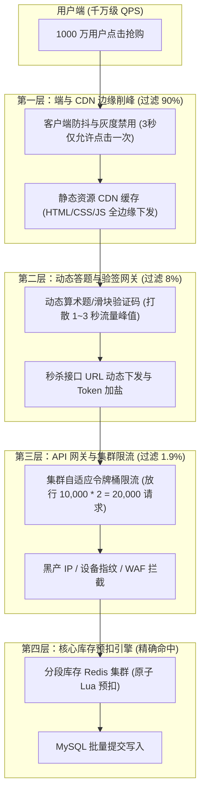
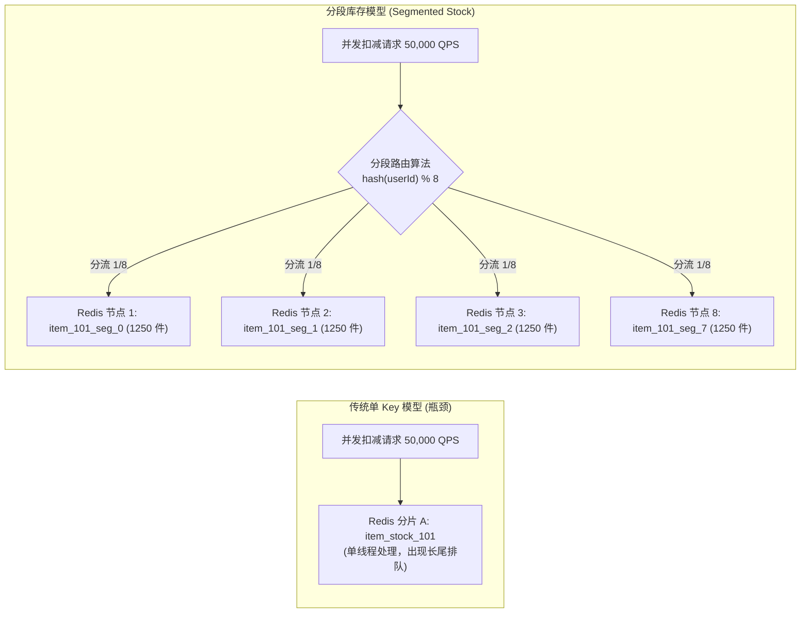
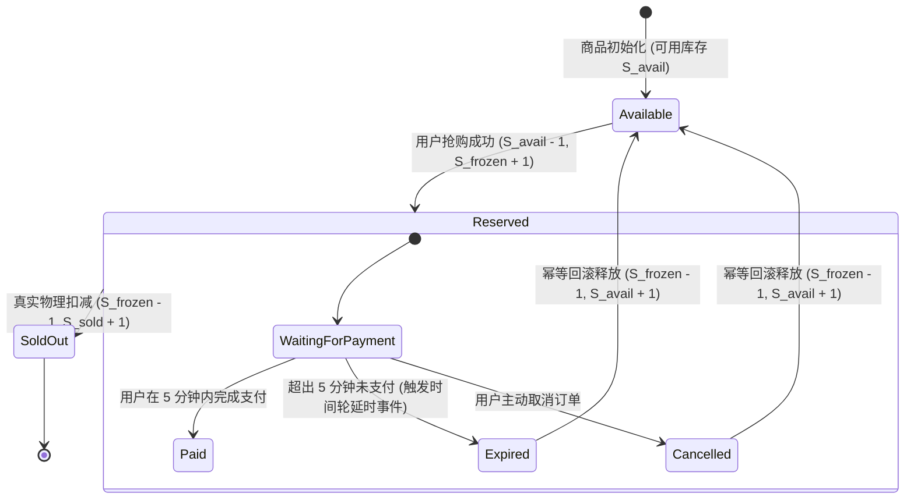
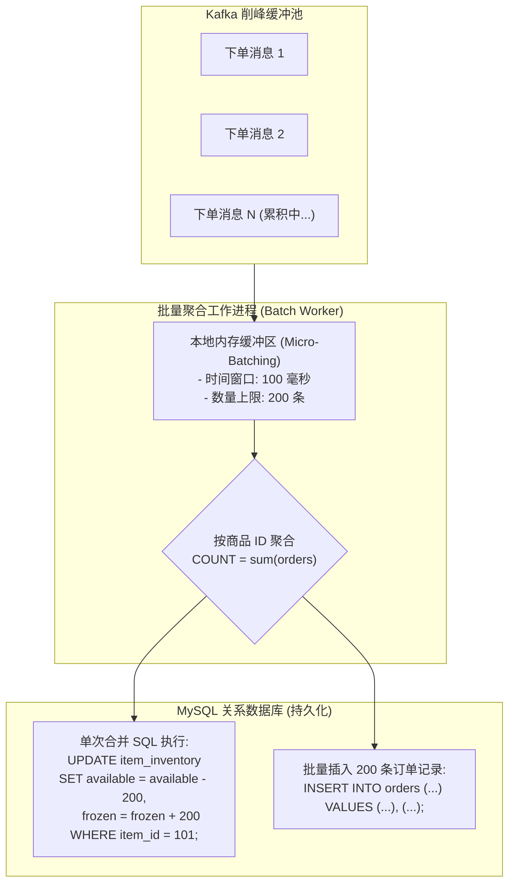

**TL;DR：** 在系统设计面试中，“秒杀系统（Flash Sale / Seckill）”是考察频率最高、但候选人翻车率也最惨烈的经典试金石。初中级工程师往往脱口而出：**“在网关层加限流，用 Redis `DECR` 或 Lua 脚本预扣库存，扣成功后发 Kafka 异步落库，简单可靠。”** 面试官听到这个回答，后续的连环致命追问会瞬间将候选人打入深渊：**如果 1000 万人瞬时涌入，单件爆款商品对应 Redis 单 Key，单分片 10 万 QPS 吞吐天花板如何承受百万写入？如果用户抢到了库存但迟迟不付款，库存被恶意锁死怎么办？未支付关单回滚时并发涌入导致库存被重复释放超卖怎么办？数据库更新同一行记录（Row Lock）引发行锁排队等待与数据库连接池耗尽雪崩怎么办？** 资深架构师的破局之道在于**全链路立体化漏斗防御**：通过**动态答题验证码与 URL 动态加盐（URL Salting）**将 99% 的黑产刷单拦截在源头；利用 **哈希分段库存（Segmented Stock）** 将单 Key 热点打散到多个独立的 Redis 分片，并发能力线性扩展 10~50 倍；设计 **两阶段预留（Two-Phase Reservation）与时间轮延时关单状态机**，确保库存最终强一致零超卖；并在数据库层采用 **行更新批量合并（Commit Batching）** 彻底化解行锁争用。

---

## 一、 面试现场：从简单粗暴的“Redis + MQ”到连环死亡追问

```text
面试官提问：
  "双十一大促有一款限量 10,000 件的旗舰手机，秒杀开始瞬间有 1000 万活跃用户在 1 秒内同时点击抢购。
   请设计一个高可用、防超卖、防少卖、且数据库不被压垮的秒杀与库存扣减系统。"
```

### 1.1 初级候选人的典型翻车链路

初级候选人设计的架构通常非常直接：
1. 用户请求直达 API 网关；
2. 网关直接调用 Redis 执行 Lua 脚本：`redis.call('decrby', key, count)`；
3. 如果返回值 $\ge 0$，将订单信息投递到 Kafka 消息队列；
4. 订单服务消费 Kafka，向 MySQL 的 `stock_inventory` 表和 `orders` 表写入数据并扣减数据库库存。

### 1.2 考官的五层连环死亡追问

1. **Redis 单 Key 物理上限追问**：
   “单件秒杀商品的库存存储在 Redis 的一个 Key 中，根据一致性哈希，这个 Key 必然落在一个确定的 Redis 物理分片单节点上。Redis 单线程内存执行 Lua 脚本的极限吞吐在 8 万~10 万 QPS 之间。面对 1000 万 QPS 的并发冲击，其余 990 万请求直接在 Redis 连接池堆积超时崩溃，你的系统第一秒就挂了，怎么破？”
2. **黑产与黄牛外挂刷单追问**：
   “攻击者通过抓包分析接口，提前 1 小时写好脚本，在 $T_0$ 时刻利用机房服务器集群发起毫秒级并发。普通真实用户连页面都没刷新出来，一万台手机已被百个机器人 IP 卷走，你怎么防？”
3. **恶意锁库存与少卖追问**：
   “如果竞争对手雇佣 10000 个账号，在 0.1 秒内把所有库存全部抢先锁死，然后全部进入‘待支付’状态，但故意拖满 15 分钟不付款，导致真实消费者买不到货，大促结束后库存全部回滚流拍。你怎么从架构上识别并防御这种‘恶意占坑’？”
4. **数据库行锁热点与死锁追问**：
   “即便有 Kafka 削峰，如果多台消费机并发执行 `UPDATE stock SET remaining = remaining - 1 WHERE item_id = 101 AND remaining >= 1`，MySQL InnoDB 对单行记录施加排他排他锁（X Lock）。由于行锁竞争激烈，事务等待队列暴增，线程上下文切换（Context Switch）拉满，数据库连接池瞬间被吃光，主库其他业务全部被拖死，你怎么解？”
5. **对账与数据最终一致性追问**：
   “Redis 宕机主从切换异步复制丢数据、Kafka 消费失败重试、MySQL 扣减成功但网络超时返回错误，各种极端异常交织下，如何从数学上百分之百保证‘售出订单总量 + 剩余物理库存 = 初始总库存’？”

---

## 二、 流量四级削峰漏斗：从边缘 CDN、动态验证码到分布式限流

面对千万级瞬时流量，没有任何单点存储系统能够直接硬抗。**秒杀系统的核心哲学是“把 99.9% 的无效流量在距离数据越远的地方过滤掉”**。



### 2.1 边缘分流与静态化隔绝
1. **秒杀详情页 100% 静态化**：
   商品标题、图片、详情、价格等静态数据全部提前打包部署至全球 CDN 节点。用户在刷新秒杀页面时，99.9% 的流量直接命中 CDN 边缘缓存，源站后端只承载轻量级的接口调用；
2. **读写分离与独立静态域名**：
   秒杀接口使用独立的二级域名（如 `seckill.api.example.com`），部署独立的集群和专有负载均衡器，物理隔离核心交易主站，确保即使秒杀被彻底打崩，主站普通的浏览与下单链路绝不受影响。

### 2.2 动态 URL 下发（URL Salting）与动态答题防刷
1. **秒杀链接在 $T_0$ 秒前处于黑洞状态**：
   前端在倒计时结束前，接口地址为假链接；在 $T_0$ 到达瞬间，前端向网关获取当前批次的动态秘钥：
   $$\text{SecureToken} = \text{HMAC-SHA256}(\text{userId} + \text{itemId} + \text{salt} + \text{timestamp})$$
   秒杀下单接口必须携带此动态 Token，否则直接在网关层返回 `403 Forbidden`。这样可以彻底废掉提前录制好请求的原始自动化爬虫；
2. **算术题验证码削峰打散时间轴**：
   对于极度高危的爆款秒杀，在点击抢购时弹出微型随机算术题（如 $18 + 7 = ?$）或旋转验证码。由于不同人类用户的输入计算耗时分布在 0.5 秒到 3 秒之间，原本集中在 10 毫秒内的万级绝对脉冲峰值，被自然平滑拉长为数秒的缓坡，瞬间将系统承载的瞬时并发降低了 10~20 倍！

---

## 三、 库存扣减的核心矛盾：单 Key 写入热点与分段库存（Segmented Stock）架构

当削峰漏斗放行了与库存比例相当的有效请求（如 10,000 件库存放行 20,000~50,000 个请求）进入存储层时，核心挑战落在了 **Redis 单分片写入瓶颈** 上。



### 3.1 为什么标准 Redis 集群扛不住单 Key 抢购？
在 Redis Cluster 中，数据分片依据槽位（Hash Slot，共 16,384 个）：
$$\text{Slot} = \text{CRC16}(\text{Key}) \pmod{16384}$$
无论你的集群有多少个物理 Master 节点（即便 100 台机），同一个 Key（例如 `seckill:stock:item_101`）由于哈希值固定，**必然只能落在唯一的一台物理 Master 节点上**。其他 99 台机器在这一秒全部处于“围观”状态，单机网卡中断与单线程 CPU 成为无法逾越的物理死穴。

### 3.2 分段库存（Segmented Stock）核心设计
分段库存借鉴了 Java 7 中 `ConcurrentHashMap` 的分段锁（Segment）哲学：
1. **库存切片初始化**：
   将总量 10,000 件商品均分为 $K$ 个段（如 $K = 8$ 或 $K = 16$），分别命名为：
   - `seckill:stock:item_101:seg_0` $\to 1250$ 件
   - `seckill:stock:item_101:seg_1` $\to 1250$ 件
   - ……
   - `seckill:stock:item_101:seg_7` $\to 1250$ 件
   确保这 8 个 Key 均匀散列到不同的 Redis Master 物理分片上；
2. **用户路由哈希**：
   每个用户进入系统后，根据 `hash(userId) % K` 固定路由到一个特定的分段 Key。原本单节点 50,000 QPS 的扣减压力，被瞬间摊平为 8 个节点每个仅 6,250 QPS，彻底解除单节点瓶颈；
3. **尾部库存碎片自适应合并（Segment Merging）**：
   分段库存面临的最大挑战是**“不均衡木桶效应”**：某些段可能先被抢光（剩余 0），而其他段还有几十件库存。
   - **自适应重试（Fallback Retry）**：当用户请求路由到 `seg_i` 发现库存为 0 时，客户端不直接返回“已售罄”，而是按固定轮转探测下一个段 `seg_{(i+1) \pmod K}`，最多探测 2~3 次；
   - **后台库存再平衡（Rebalancing Worker）**：当大部分段库存归零、仅剩碎片库存时，由分布式定时任务将剩余零散库存归集回单一的主段进行最终尾单抢购。

---

## 四、 防超卖与防少卖：两阶段库存状态机与未支付超时回滚

库存扣减的三种模式对比与选择：

| 扣减模式 | 执行时机 | 优点 | 缺点 / 致命漏洞 |
| --- | --- | --- | --- |
| **下单即扣减（Pre-deduct）** | 用户点击抢购瞬间直接扣减物理库存 | 绝不超卖，链路直观 | **恶意锁库存**：黄牛下单后不支付，库存归零，正常用户买不到，商家大亏。 |
| **支付才扣减（Post-deduct）** | 用户抢到资格后去付款，银联/微信回调成功才扣减 | 绝不恶意锁库存 | **严重超卖**：1000 个人同时完成付款，但实际库存只有 100 件，体验崩塌。 |
| **两阶段预留 + 超时释放（2-Phase Reservation）** | **下单预扣（冻结态），规定时限（如 5 分钟）未付自动回滚** | **兼顾防超卖与防少卖**，用户体验与资金安全最佳结合 | **系统状态机复杂度高**，需处理高并发网络延时与回滚竞态。 |

### 4.1 生产级两阶段预留状态机



### 4.2 高性能原子预扣 Lua 脚本
为了保证分段库存中可用库存与冻结库存转移的原子性，必须借助 Redis Lua 脚本规避并发竞态：

```lua
-- seckill_reserve_stock.lua
-- KEYS[1]: 可用库存 Key (如 seckill:stock:item_101:seg_0)
-- KEYS[2]: 冻结库存 Key (如 seckill:frozen:item_101:seg_0)
-- ARGV[1]: 拟扣减数量 (如 1)

local stock_key = KEYS[1]
local frozen_key = KEYS[2]
local buy_count = tonumber(ARGV[1])

local current_stock = tonumber(redis.call('get', stock_key) or '0')

if current_stock >= buy_count then
    -- 1. 原子扣减可用库存
    redis.call('decrby', stock_key, buy_count)
    -- 2. 原子增加冻结库存 (用于对账与超时跟踪)
    redis.call('incrby', frozen_key, buy_count)
    return 1 -- 预扣成功
else
    return 0 -- 库存不足
end
```

---

## 五、 数据库写屏障：行锁热点与批量合并提交（Commit Batching）

虽然 Redis 预扣了库存，但最终订单与库存变更必须持久化写入关系型数据库（MySQL）。在 MySQL InnoDB 中：
```sql
UPDATE item_inventory 
SET available = available - 1, frozen = frozen + 1 
WHERE item_id = 101 AND available >= 1;
```
这条 SQL 会在聚簇索引记录上加 **排他行锁（X Record Lock）**。如果有 10,000 个事务在 1 秒内同时更新这一行，MySQL 的事务等待队列会发生严重锁阻塞（Lock Contention）。

### 5.1 数据库热点行更新崩溃机理
- **TPS 骤降**：MySQL 单行更新的硬件理论极限通常在 **2000~4000 QPS**（受限于 WAL 日志刷盘 `fsync` 与死锁检测链表遍历开销）；
- **锁检测风暴（Deadlock Check CPU Spike）**：当数百个事务同时等待同一行锁时，InnoDB 的死锁检测算法会对等待图（Wait-For Graph）进行深度优先搜索，CPU 核心会被死锁检测完全占满至 100%，导致没有 CPU 周期去执行真正的 SQL。

### 5.2 解决方案：内存微批聚合与 Commit Batching



1. **工作机制**：
   - 订单消费服务不采取“来一条消息就执行一次数据库 Update”的单条处理方式；
   - 消费线程从 Kafka 批量拉取数据，在应用层内存维持一个 **微批聚合时间窗口（如 50ms 或累积满 100 条）**；
   - 将这 100 条针对 `item_id = 101` 的单次扣减合并为一次聚合扣减：
     $$\text{Delta} = \sum_{i=1}^{100} \text{count}_i = 100$$
2. **执行效果**：
   - 原本 10,000 次数据库行锁争用，被锐减为 **100 次批量事务**；
   - 数据库行锁持有时间降低了 99%，单行库存持久化 TPS 轻松达到数万量级，数据库毫无压力。

---

## 六、 总结与资深系统设计考点对比矩阵

在系统设计面试中展示 Senior / Staff 架构师视野，必须能够系统化输出端到端决策对比：

### 6.1 秒杀系统全链路核心设计考点矩阵

| 架构层级 | 面临的物理瓶颈 | 资深破局架构 | 核心关键指标 |
| --- | --- | --- | --- |
| **接入层（CDN/WAF）** | 万级恶意爬虫并发，带崩后端带宽 | 静态化边缘下发 + 动态验证码打散 + URL 加盐 | 99% 无效与黑产流量阻断率 |
| **网关层（Gateway）** | 超出承载能力的有效并发冲击 | 自适应集群令牌桶（Token Bucket）+ 熔断限流 | 限制入站 QPS 在存储极限容量内 |
| **缓存层（Redis）** | 单 Key 落在单一节点，无法横向扩容 | **分段库存（Segmented Stock）** + 原子 Lua 状态机 | 单商品秒杀 TPS 扩展至 100,000+ |
| **异步削峰（Kafka）** | 读写吞吐速率不对称 | 两阶段预留（Reserved）+ 延时时间轮超时回滚 | 5 分钟超时未支付 100% 自动平账 |
| **存储层（MySQL）** | 单行记账并发排他锁冲突与死锁检测风暴 | **微批合并提交（Commit Batching）** | 数据库行锁争用开销下降 95% 以上 |

### 6.2 答题加分金句
- **“库存没有绝对的实时，但有确定性的守恒”**：无论系统经历多少次网络抖动、分段重平衡与超时回滚，物理公式永远成立：
  $$\text{总库存} = \text{各段可用库存之和} + \text{冻结待支付库存之和} + \text{已完结支付订单库存之和}$$
- **“善用空间换时间，善用分段破热点”**：单 Key 永远有物理天花板，架构师的核心价值是通过逻辑哈希将物理单点裂解为并行分片。

---

## 七、 参考资料与权威规范

1. **Pat Helland (2007)**. *Life beyond Distributed Transactions: an Apostate's Opinion.*
   - 探讨异步自治系统、最终一致性对账与基于补偿的事务模型。
2. **Karger, D., et al. (1997)**. *Consistent Hashing and Random Trees: Distributed Caching Protocols for Relieving Hot Spots on the World Wide Web.*
   - ACM STOC '97，探讨基于一致性哈希与虚拟节点的负载均衡与热点打散。
3. **Alibaba Engineering (2018)**. *《淘宝双十一高并发秒杀系统架构演进之路》*.
   - 官方技术白皮书，涵盖分段库存、行更新批量优化与静态化架构。
4. **Martin Kleppmann (2017)**. *Designing Data-Intensive Applications (DDIA)*.
   - Chapter 7: Transactions & Weak Isolation Levels（深入剖析脏读、不可重复读与读写冲突行锁机制）。
