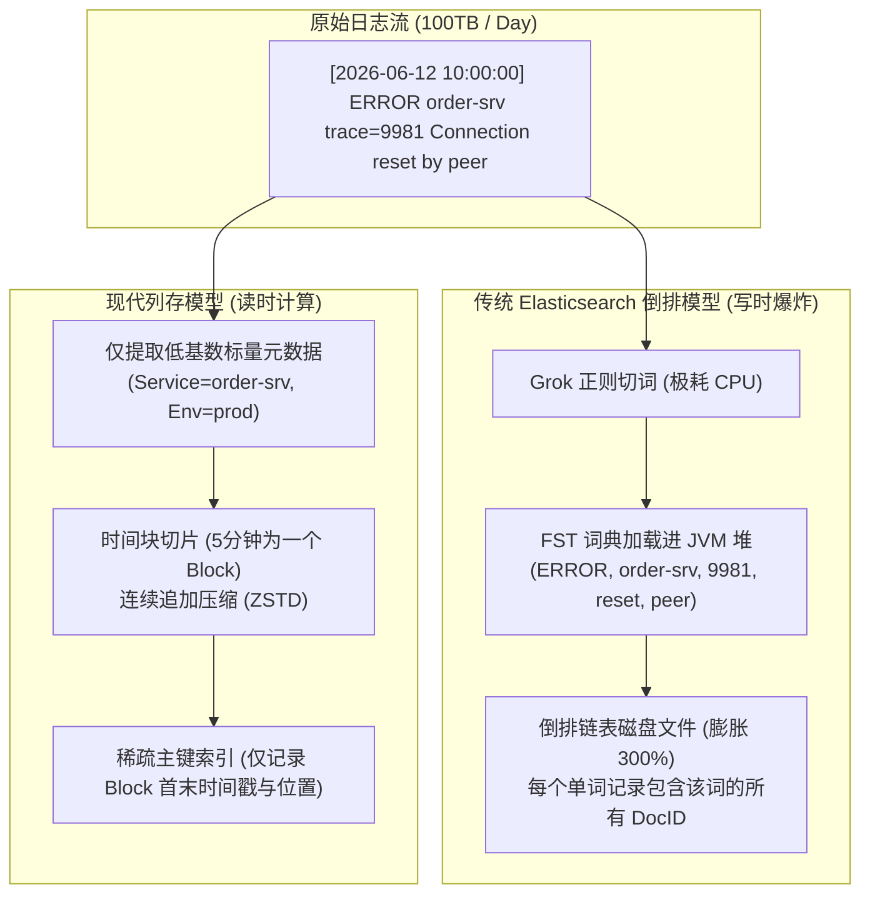
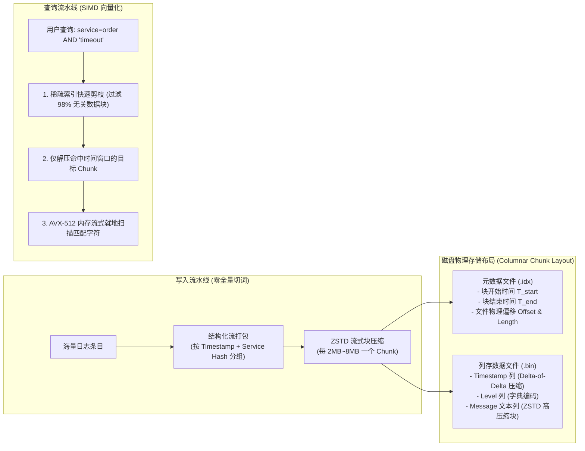
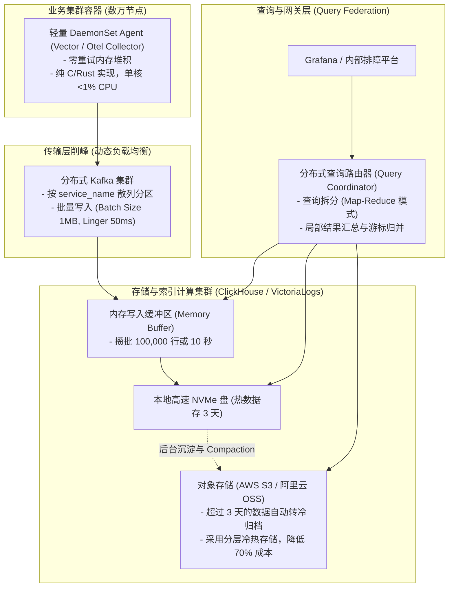

**TL;DR：** 在系统设计面试中，“设计一个百亿/千亿级分布式日志检索系统”是考察候选人对底层存储模型、I/O 放大与系统成本控制的硬核试金石。初中级工程师往往习惯性套用经典模板：**“Filebeat 收集日志，打入 Kafka 削峰，Logstash 解析切词，最后写入 Elasticsearch（ES）建立倒排索引，用 Kibana 可视化。”** 面试官听到这个回答，后续的死亡追问会立刻接踵而至：**当业务规模扩大到日产 100TB 原始日志时，Elasticsearch 为每个单词建立全局倒排索引（Inverted Index）会导致磁盘占用膨胀至原始体积的 200%~300%，海量 Term Dictionary 挤占 JVM 内存引发频繁数十秒的 Full GC 停顿与节点 OOM 宕机；同时 99% 的日志写入后 7 天内从未被检索过，造成数百万美元的硬件算力与存储巨额浪费。** 资深架构师的破局之道在于**彻底打破全量倒排索引迷信**，借鉴 **ClickHouse、VictoriaLogs 与 Grafana Loki 的现代列存哲学**：将日志按时间范围与结构化元数据（Service, Env, Host）切片分区，弃用全词倒排，改用 **稀疏主键索引（Sparse Index） + 高压缩比分块列存（Chunked ZSTD/Snappy 压降 80% 体积）**；在真实查询发生时，利用 **CPU SIMD 向量化指令集（AVX-512）对特定时间块进行流式内存解压与暴力硬件级搜索**，以传统 ELK 方案 **1/5 的机器成本** 实现千亿级日志的毫秒级精确检索。

---

## 一、 面试现场：从标准“搭建 ELK”到 PB 级成本灾难追问

```text
面试官提问：
  "我们公司在全球拥有上万台微服务 Pod 与物理节点，每天产生 100TB 原始日志（约 1000 亿条日志记录）。
   研发人员需要支持在 3 秒内按时间区间、服务名、TraceID 或关键字检索任意历史日志，并支持保存 30 天。
   请设计这个海量日志收集、传输、索引与交互式检索系统。"
```

### 1.1 初级工程师的方案局限

初级工程师通常直接画出传统的 ELK 架构图：
- 机器部署 Filebeat / Fluentd 收集日志；
- 发送给 Kafka 做分布式消息队列缓冲；
- Logstash 负责消费并根据 Grok 正则表达式切词解析成 JSON 字段；
- 批量写入 Elasticsearch，建立分布式分片与倒排索引；
- 提供 Restful 接口供 Web UI 查询。

### 1.2 考官的五层连环死亡追问

1. **倒排索引存储成本膨胀爆炸**：
   “每天 100TB 原始日志，保存 30 天就是 3PB 原始数据。Elasticsearch 默认对所有文本字段做分词并构建 Lucene 倒排索引（Term Dictionary + Postings List），加上段文件元数据与 1 个副本容灾，总存储需求直接飙升至 **6PB ~ 9PB**！你知道 9PB 高性能 SSD 阵列每年在公有云上要花上千万美金吗？如何从存储架构上将成本降低 80%？”
2. **JVM 堆内存与 Full GC 锁死雪崩**：
   “每天千亿条日志写入，Lucene 的 FST（Finite State Transducer）词典缓存与内存缓冲区（Memory Buffer）会消耗几十 GB 堆内存。当海量日志并发写入触发段合并（Segment Compaction / Merge）时，JVM 堆内存被老年代对象打爆，频繁触发 30 秒以上的 Stop-the-World（STW）Full GC，Master 节点心跳超时脑裂，集群彻底雪崩瘫痪，怎么解？”
3. **低频查询下的写读严重不对称**：
   “在大规模生产环境中，**99% 的日志写入后永远不会被人类阅读**，只有不到 1% 的错误日志在排障时才会被定向检索。你为了这 1% 的查询，在写入时为 100% 的字符构建代价极其昂贵的倒排索引，这种架构的投资回报率（ROI）合理吗？”
4. **高基数字段（High-Cardinality）基数爆炸**：
   “日志中包含大量的全局唯一 ID（如 TraceId, RequestId, UserId, IPv6）。如果给这些高基数字段建立索引，倒排索引的词典大小与唯一词项（Unique Terms）数量呈几何级数暴涨，直接撑爆内存，怎么应对？”
5. **跨国跨地域链路延迟与带宽瓶颈**：
   “欧洲、美洲、亚洲三个大区各自产生海量日志，如果全部实时公网回源传输到一个集中式数据中心，跨洋网络抖动与 TB 级跨可用区公网流量费极高，如何设计全球多可用区的协同收集与联邦查询？”

---

## 二、 倒排索引在日志场景下的物理破产（The Inverted Index Collapse）

要设计出更高效的日志系统，必须从第一性原理上拆解 Lucene 倒排索引为什么在日志工作负载（Log Workload）下走向破产。



### 2.1 倒排索引的物理开销公式
在 Lucene / Elasticsearch 中，一个文本字段的倒排索引由三部分组成：
1. **Term Index（词项前缀树）**：保存在内存中的 FST 结构，用于快速定位词项；
2. **Term Dictionary（词典）**：所有出现过的单词的有序列表；
3. **Postings List（倒排链表）**：包含该词项的所有文档 ID 集合、词频（Term Frequency）及词位置（Position/Offset）。

对于日志这种高度动态的数据流（包含海量堆栈、随机 UUID、动态参数）：
- 词典（Term Dictionary）的大小**永远无法收敛**，且词条极其分散；
- 倒排链表极其碎片化，在执行多条件交集查询（如 `Service="order" AND "error" AND TraceId="abc"`）时，需要加载多个链表到内存并进行位图 `AND` 运算；
- **写放大极高**：写入一条 200 字节的日志，需要同时在内存中分裂并追加维护十几个倒排词条，随后刷盘生成小段（Segment），再后台触发密集 I/O 的段合并。

---

## 三、 新一代日志存储范式：列式存储、稀疏索引与 Chunk 分块压缩

现代工业界（如 VictoriaLogs、ClickHouse、Grafana Loki）之所以能够颠覆 ELK，核心思想是：**“将计算延迟推迟到查询时（Lazy Computation），在写入时只做极简的流式压缩追加”**。



### 3.1 稀疏主键索引（Sparse Index）的微妙设计
与 Elasticsearch 的稠密索引（每个文档一条记录）不同，现代列存系统采用**稀疏索引（Sparse Index）**：
- 整个存储由一个个连续的物理块（Chunk / Part）构成，每个块包含数万行（如 8,192 行）日志；
- **稀疏索引只在每个块的第一行记录索引项**：
  $$\text{Index Entry} = \{ \text{MinTimestamp}, \text{MaxTimestamp}, \text{MinService}, \text{MaxService}, \text{ByteOffset}, \text{Length} \}$$
- **内存开销仅为稠密索引的 0.1% 以下**：数十亿条日志的稀疏索引表仅需几十兆内存即可全部装入 CPU L3 缓存，彻底告别 JVM OOM。

### 3.2 列式存储与极致压缩比
日志数据天然具备极高的重复性（相同的日志模板、相同的服务名、相近的时间戳）：
1. **时间戳（Timestamp）**：采用 **双重差分编码（Delta-of-Delta）**，从 8 字节压缩至不到 2 位（Bits）；
2. **日志级别（Level: INFO/WARN/ERROR）**：采用 **字典编码（Dictionary Encoding）**，单行仅占 2 位；
3. **日志正文（Message）**：采用先进的 **Zstandard（ZSTD）分块压缩**。在相同服务模板的日志聚集在一个 Chunk 中时，ZSTD 的上下文模式匹配字典能够达到 **8:1 到 12:1 的惊人压缩比**（100TB 原始数据压缩后仅剩 8TB~12TB 磁盘占用）！

---

## 四、 暴力美学：SIMD 向量化指令集与无索引流式扫描（Brute-force Stream Scan）

许多习惯了传统搜索引擎的工程师会感到疑惑：“没有全量倒排索引，怎么能在 3 秒内从数十 TB 文本中搜出含有某个关键字（如 `TimeoutException`）的日志？”

答案在于**现代硬件架构的算力反转：CPU 计算能力与内存带宽，远远超越了物理磁盘 I/O**。

### 4.1 现代硬件吞吐精算
在 2026 年的现代多核服务器上：
- 单颗 AMD EPYC / Intel Xeon 处理器拥有 64~128 个核心，搭配 PCIe 5.0 NVMe SSD，单机磁盘顺序读取吞吐高达 **14 GB/s**；
- 内存带宽（DDR5 8 通道）高达 **300 GB/s**；
- 借助 CPU **AVX-512 / AVX2 SIMD 指令集**，单核心可以在 1 秒内完成超过 **4 GB 文本的并行子串查找（`memmem` / Boyer-Moore 向量化）**！

### 4.2 向量化检索与剪枝两阶段流水线
当用户发起查询：`time in [10:00, 10:15] AND service="payment" AND "NullPointerException"`：
1. **阶段 1：通过稀疏索引秒级剪枝（Pruning）**：
   - 过滤掉 99% 不属于 `10:00~10:15` 或 `service != "payment"` 的数据块；
   - 原本 100TB 的搜索空间，瞬间被缩小到仅有 **200MB 的物理压缩分块**；
2. **阶段 2：SIMD 并行解压与就地流式暴力扫描**：
   - 多线程并发将这 200MB 压缩块读入内存并解压为 1.5GB 原始字符串；
   - 利用 AVX-512 的 `_mm512_cmpeq_epi8_mask` 指令，每次同时比对 64 个字符，直接在几百毫秒内完成 1.5GB 内存数据的暴力扫描；
   - **端到端查询耗时仅 200~500 毫秒**，不仅速度媲美 Elasticsearch，而且省去了整个庞大的写时倒排索引系统！

---

## 五、 端到端全链路高吞吐数据流拓扑与多级缓存



### 5.1 数据收集端最佳实践
- **弃用臃肿的 Logstash**：采用 Rust 开发的 **Vector** 或 Go 开发的 **OpenTelemetry Collector** 作为 DaemonSet 收集端，单机内存消耗从 JVM 的 500MB 骤降至 15MB；
- **结构化预处理**：在 Agent 端直接提取已知的低基数标量元数据（`service`、`namespace`、`level`、`node_ip`），避免下游中心化集群承担高昂的集中式 Grok 正则解析开销。

### 5.2 冷热分层存储（Tiered Storage）
- **热数据层（Hot Tier - 1~3 天）**：存储在本地高速 NVMe SSD 盘，支撑 95% 的线上实时排障高频查询；
- **冷数据层（Cold Tier - 4~30 天）**：后台异步合并压缩后，直接挂载写入便宜的高可靠对象存储（Amazon S3 / 阿里云 OSS）。查询冷数据时，按需流式拉取 Range 字节范围，无需解压全量大文件。

---

## 六、 总结与资深系统设计架构决策矩阵

在资深系统设计面试中，给出架构决策矩阵展示对不同数据模型物理边界的透彻洞察：

### 6.1 传统倒排体系 vs 现代列存流式检索体系深度对比

| 评测维度 | 传统全量倒排方案（Elasticsearch） | 现代列存稀疏索引方案（ClickHouse/VictoriaLogs） | 架构选型建议 |
| --- | --- | --- | --- |
| **存储空间与膨胀率** | 原始体积的 **200% ~ 300%**（倒排索引巨大） | 原始体积的 **10% ~ 15%**（ZSTD 压缩高达 8~10 倍） | 海量日志场景下列存每年节约数百万硬件成本。 |
| **写入吞吐能力** | 单节点 **3 万~5 万 EPS**（易被段合并和 FST 拖垮） | 单节点 **30 万~50 万 EPS**（纯顺序追加与内存攒批） | 列存写入吞吐提升整整 **10 倍**。 |
| **内存与 GC 压力** | 极高（需将 FST 和倒排词表常驻 JVM 堆，易 OOM） | 极低（稀疏索引仅占几十 MB 内存，完全脱离 JVM 垃圾回收） | 彻底消灭 STW 停顿与节点假死。 |
| **全文检索延迟** | **亚秒级**（直接在倒排链表中求交集） | **亚秒至秒级**（稀疏索引粗筛后利用 SIMD 暴力流式扫描） | 针对 99% 低频查询场景，流式扫描足以满足业务诉求。 |
| **适用工作负载** | 电商商品检索、维基百科文章全文搜索（读多写少） | **服务日志、可观测性链路、时序监控（写多读极少）** | **日志系统应毫不犹豫全面拥抱列存**。 |

---

## 七、 参考资料与权威规范

1. **ClickHouse Architecture & Sparse Index Design (2024)**.
   - ClickHouse Official Documentation: *MergeTree Engine Family & Primary Keys*.
   - [https://clickhouse.com/docs/en/engines/table-engines/mergetree-family/mergetree](https://clickhouse.com/docs/en/engines/table-engines/mergetree-family/mergetree)
2. **VictoriaLogs: Scalable Log Database with Low Memory Usage (2024)**.
   - VictoriaMetrics Whitepaper: *Why Inverted Index is Broken for Logs*.
   - [https://docs.victoriametrics.com/victorialogs/](https://docs.victoriametrics.com/victorialogs/)
3. **Grafana Loki: Like Prometheus, but for logs (2023)**.
   - Grafana Loki Design Document: *Index only metadata, not the full text*.
   - [https://grafana.com/oss/loki/](https://grafana.com/oss/loki/)
4. **Lemire, D., & Boytsov, L. (2015)**. *Decoding billions of integers per second through vectorization.*
   - Software: Practice and Experience, 45(1): 1–29.（探讨 SIMD 向量化指令在海量数据扫描与解压中的极致性能）。
