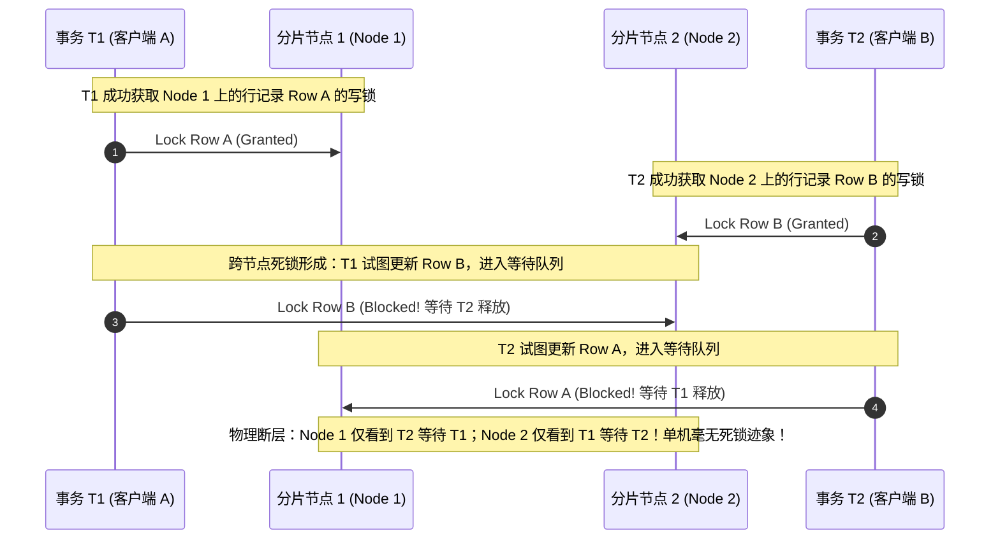
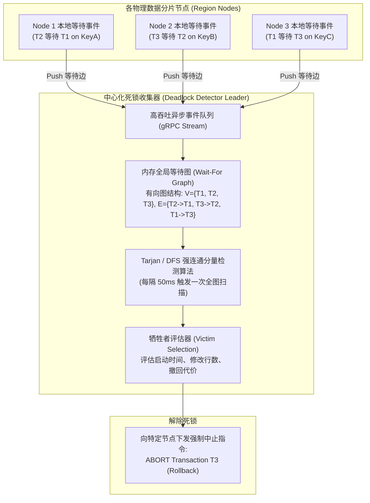
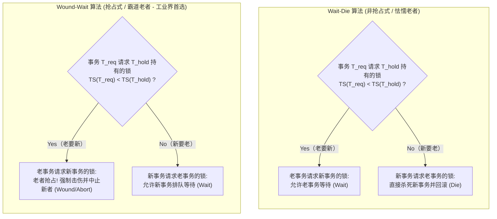
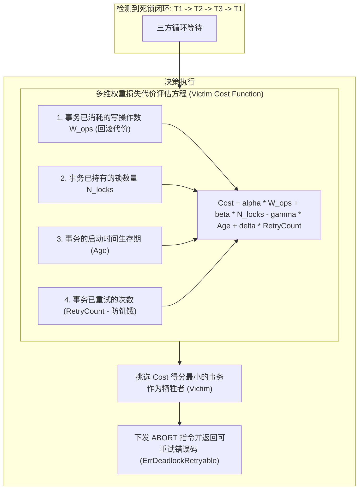

**TL;DR：** 在分布式数据库与高并发事务系统的资深架构面试中，“分布式死锁（Distributed Deadlock）”是检验候选人对事务 ACID、并发控制理论与图论算法掌握深度的终极大题。初级工程师面对死锁问题往往只能给出极其粗糙的回答：**“给每个锁加一个超时时间（Lock Timeout），如果超过 1 秒拿不到锁就主动报错回滚，或者全部使用乐观锁（OCC）重试。”** 这种回答在复杂的金融交易与超高争用场景下直接破产：**锁超时时间设太长会导致大量工作线程挂起排队、吞吐断崖式暴跌；设太短则会导致大量原本正常的长事务被无辜误杀回滚，系统进入疯狂重试的活锁雪崩（Livelock Storm）；而乐观锁在高冲突下冲突率飙升至 90% 以上。** 资深架构师的破局之道在于系统性掌握两大流派：**事后检测流派（Deadlock Detection）**，通过分布式等待状态收集构建全局 **动态有向等待图（Wait-For Graph, WFG）**，利用 **Tarjan 强连通分量或死锁窥探协议（Snooping/Edge Chasing）** 在数十毫秒内精确识别最小成环回路并以最小代价挑选牺牲者（Victim）；以及 **事前预防流派（Deadlock Prevention）**，利用基于单调逻辑/物理时钟的 **Wound-Wait（伤-等）与 Wait-Die（等-死）算法**，在数学上彻底斩断死锁形成的必要条件（循环等待），实现零成环死锁的高并发悲观事务执行。

---

## 一、 面试现场：从单机死锁到分布式跨节点死锁死局

```text
面试官提问：
  "在一个大规模分布式数据库（如 TiDB / CockroachDB / Spanner）中，采用悲观两阶段锁（2PL）保证事务严格串行化。
   多个并发事务涉及跨网络分片、跨数据中心的复杂多行更新操作。
   请设计一套高吞吐、低开销的分布式死锁治理引擎，说明死锁是如何跨节点形成的，并比较检测法与预防法的取舍。"
```

### 1.1 跨节点分布式死锁的形成过程

与单机数据库（所有锁链表位于同一进程共享内存中）不同，分布式数据库的数据分片存储在不同物理节点上。



### 1.2 为什么“锁超时（Lock Timeout）”不是合格的工业解法？
在面试中将“锁超时”作为核心方案是极其危险的扣分项：
1. **死锁等待时间过长**：如果设置超时时间为 3 秒，死锁发生时，持有锁的两个事务都必须白白卡死 3 秒。在千万级交易系统中，3 秒足以导致后续上万个关联请求全部堆积在连接池中，引发雪崩；
2. **正常长事务被无辜误杀**：复杂分析型事务、批量结算事务执行耗时原本就需要数秒，粗暴的超时机制会将其直接杀死；
3. **活锁风暴（Livelock）**：当并发两个事务相互冲突被超时中止后，两者如果同时立即发起重试，极有可能以相同的执行路径再次相撞，陷入无休止的“冲突 $\to$ 超时 $\to$ 重试 $\to$ 冲突”无限循环，系统吞吐跌零。

---

## 二、 悲观并发控制（2PL）与分布式死锁的数学成因

根据经典的霍华德（Coffman 1971）死锁四公理，死锁形成的充要条件是同时满足：
1. **互斥条件（Mutual Exclusion）**：资源一次只能被一个事务排他占用（X Lock）；
2. **占有且等待（Hold and Wait）**：事务持有已分配的锁资源，同时等待获取新的锁资源；
3. **不可抢占（No Preemption）**：已获得的锁不能被其他事务强行剥夺，只能由持有者主动释放；
4. **循环等待（Circular Wait）**：存在一个由两个或多个事务构成的环路：
   $$T_1 \to T_2 \to T_3 \to \dots \to T_k \to T_1$$
   其中每个事务都在等待链条中下一个事务持有的资源。

悲观两阶段锁（2PL）为了保证可串行化隔离级别（Serializable），强制要求：**在事务未提交前，持有的所有排他锁都不能释放（Strict 2PL）**。这直接锁死了“占有且等待”与“不可抢占”两个条件，因此在高并发写冲突下，**循环等待环路的出现是数学上的必然现象**。

---

## 三、 事后死锁检测：全局有向等待图（Wait-For Graph）与 Tarjan 算法

事后检测流派（Deadlock Detection）的核心理念是：**允许死锁在运行时发生，但通过独立的检测引擎，在数十毫秒内快速发现环路并精准杀掉代价最小的事务**。



### 3.1 集中式等待图（Centralized WFG）构建
以 TiDB / CockroachDB 的现代实现为例：
1. **分布式推模式（Push-based Detection）**：
   - 当某个事务在本地节点尝试获取锁失败并进入等待队列时，本地 Lock Manager 会生成一条有向边：
     $$\text{Edge}(T_{\text{waiter}} \to T_{\text{holder}}, \text{LockKey}, \text{Timestamp})$$
   - 节点通过 gRPC 长连接流式将这条边上报给当前由 Raft 选举出来的 **死锁检测 Leader 节点**；
2. **图的生命周期自清理**：
   - 当锁被成功释放，或者事务主动退出时，上报删除边事件；
   - 内存等待图规模通常在数千条边以内，空间占用不到几兆字节。

### 3.2 基于 Tarjan 算法的环路快速识别
传统的深度优先搜索（DFS）在复杂有向图上如果处理不当，时间复杂度可能退化至 $O(V \times (V + E))$。而现代死锁检测器采用 **Tarjan 强连通分量算法（Tarjan's Strongly Connected Components Algorithm）**：
- **时间复杂度为严格的 $O(V + E)$**，线性扫描图中的每一个节点与边；
- 在单次遍历中，通过维护节点访问序号 `dfn` 与追溯值 `low`，并在栈中追踪路径；
- **只要发现一个强连通分量的大小 $\ge 2$（或者存在自环），即证明图上存在严格的死锁环路**！

---

## 四、 事前死锁预防：Wait-Die vs Wound-Wait 算法的数学决战

死锁预防流派（Deadlock Prevention）采取更极端的哲学：**“在加锁请求发生的第一微秒，如果可能产生死锁风险，就通过严格的数学偏序规则强行打断，彻底消除环路出现的可能性”**。

两大开山算法由 Rosenkrantz、Stearns 和 Lewis 于 1978 年在 ACM TODS 奠基论文中提出，核心依托是：**每个事务在启动时被授予一个单调递增的全局唯一时间戳 $TS(T)$。时间戳越小，代表事务启动越早，优先级（Priority）越高（Older is Higher）**。



### 4.1 Wait-Die（等-死）算法：非抢占式
- **规则定义**：
  - 如果 $TS(T_{\text{requester}}) < TS(T_{\text{holder}})$（老请求新）：允许 $T_{\text{requester}}$ 进入队列**等待（Wait）**；
  - 如果 $TS(T_{\text{requester}}) > TS(T_{\text{holder}})$（新请求老）：拒绝新事务，强制 $T_{\text{requester}}$ **自杀（Die）** 并回滚。
- **数学证明（为什么不可能成环？）**：
  在等待图中，所有的有向边必然严格指向更年轻的事务（即 $TS(\text{From}) < TS(\text{To})$）。由于时间戳是单调严格偏序的，有向图的拓扑排序严格单调递增，**绝对不可能存在指向更老事务的边，因此数学上绝无成环可能**！

### 4.2 Wound-Wait（伤-等）算法：抢占式（Google Spanner / CockroachDB 真实选择）
- **规则定义**：
  - 如果 $TS(T_{\text{requester}}) < TS(T_{\text{holder}})$（老请求新）：老事务绝不等待！直接**击伤（Wound）**持有锁的年轻事务，年轻事务 $T_{\text{holder}}$ 被强制中止回滚并释放锁，老事务立即抢占获取锁；
  - 如果 $TS(T_{\text{requester}}) > TS(T_{\text{holder}})$（新请求老）：允许年轻事务 $T_{\text{requester}}$ 进入队列**排队等待（Wait）**老事务执行完。
- **为什么工业界普遍选择 Wound-Wait 而非 Wait-Die？**
  1. **级联回滚成本极低**：在 Wait-Die 中，一个已经运行了很长时间、做了很多工作的年轻事务，在尝试加锁时可能因为碰到了更老的事务而被无情杀死，之前的所有计算全部白费；而在 Wound-Wait 中，老事务一旦启动，执行越久优先级越高，**几乎不会被杀死，保障长事务顺利完结**；
  2. **中止次数更少**：在 Wound-Wait 中，老事务只需直接剥夺新事务的锁即可前进；只有当老事务与新事务发生竞争时才会触发 Wound，冲突率远远低于 Wait-Die。

---

## 五、 牺牲者选择（Victim Selection）与自适应锁超时动态退避

当在事后检测（WFG）中发现死锁环路时，选择“杀掉哪个事务”至关重要。一个糟糕的牺牲者选择器会导致系统性能暴跌。



### 5.1 智能回滚惩罚函数
牺牲者评估模型遵循以下核心原则：
1. **优先杀死“刚启动、只执行了轻量读操作”的年轻事务**：回滚成本几乎为零，只需撤回几条锁记录；
2. **绝对保护“已完成 90% 复杂计算与写入”的长事务**：回滚一个修改了 10 万行数据的重事务需要消耗庞大的写回滚段（Undo Log）I/O 开销，应当极力避免；
3. **引入退避防饥饿（Starvation Defense）**：如果一个事务由于连续冲突已经被杀死了 3 次，其优先级应当被动态提升（或者在重试时保留最初的原始时间戳），防止某个“倒霉事务”陷入无限循环饿死。

---

## 六、 总结与分布式事务死锁考点全景对比

在资深架构师面试中，面对死锁问题应主动横向对比三大主流路线的物理取舍：

### 6.1 死锁解决方案选型对比矩阵

| 方案类别 | 代表系统实现 | 吞吐开销 | 延迟抖动 | 核心优缺点 | 生产适用场景 |
| --- | --- | --- | --- | --- | --- |
| **纯锁超时（Lock Timeout）** | 早期分布式原型系统 | 极低（零额外服务） | **极高**（死锁时全链路挂起等待） | 实现简单，但超时时间无法调优；太长导致系统雪崩，太短导致误杀活锁。 | 仅适合并发极低、几乎无写冲突的轻量内部业务。 |
| **全局等待图检测（WFG + Tarjan）** | **TiDB（Deadlock Detector）** / MySQL InnoDB | 中等（需上报等待边，占极少带宽） | **极低**（平均 50ms 内精准斩断死锁） | 只有真正成环才中止事务，**无任何无辜误杀**；需要部署中心化/高可用检测节点。 | **绝大多数通用分布式 OLTP 数据库的首选方案**。 |
| **死锁预防（Wound-Wait）** | **Google Spanner** / CockroachDB | 极低（纯本地时间戳原子比较，零跨节点图计算） | **极低**（老事务零延迟抢占推进） | **数学上绝对杜绝死锁成环**；在极高争用时年轻事务被 Wound 频繁重试。 | **跨全球多数据中心、无法承受集中式图检测网络 RTT 的超大规模集群**。 |

---

## 七、 参考资料与权威规范

1. **Rosenkrantz, D. J., Stearns, R. E., & Lewis, P. M. (1978)**. *System level concurrency control for distributed database systems.*
   - ACM Transactions on Database Systems (TODS), 3(2), 178-198.（提出奠基性的 Wait-Die 与 Wound-Wait 死锁预防算法）。
2. **Corbett, J. C., et al. (2013)**. *Spanner: Google’s Globally Distributed Database.*
   - ACM TOCS / OSDI '12.（详解 Spanner 基于 TrueTime 与 Wound-Wait 悲观锁的并发控制设计）。
3. **Tarjan, R. (1972)**. *Depth-first search and linear graph algorithms.*
   - SIAM Journal on Computing, 1(2), 146-160.（Tarjan 强连通分量与环路检测算法数学原著）。
4. **TiDB Technical Architecture (2024)**. *Distributed Transactions & Deadlock Detection.*
   - PingCAP Documentation: *Pessimistic Transaction Mode & Centralized Deadlock Detector*.
   - [https://docs.pingcap.com/tidb/stable/pessimistic-transaction](https://docs.pingcap.com/tidb/stable/pessimistic-transaction)
