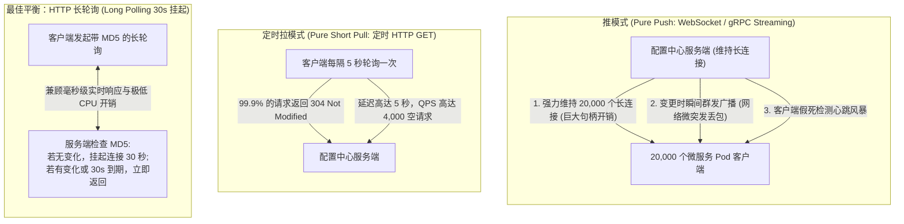
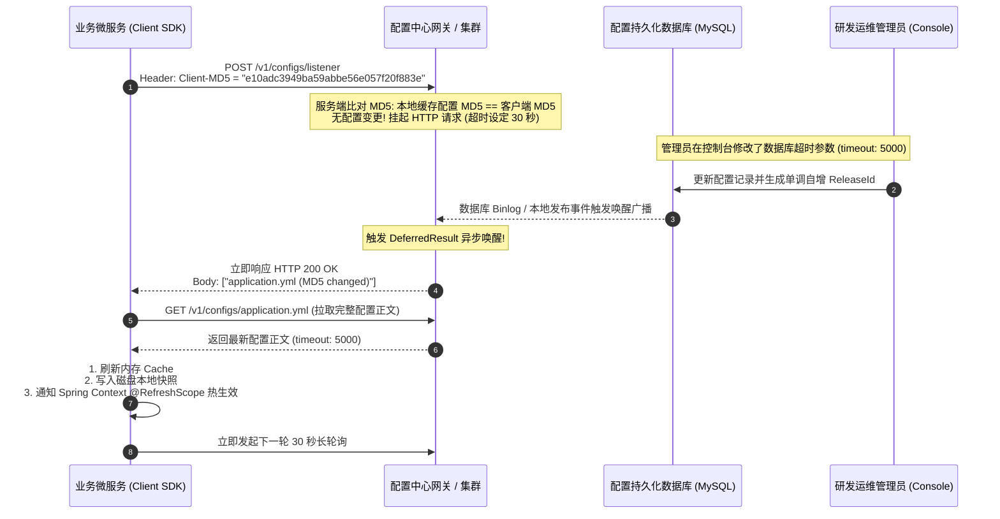
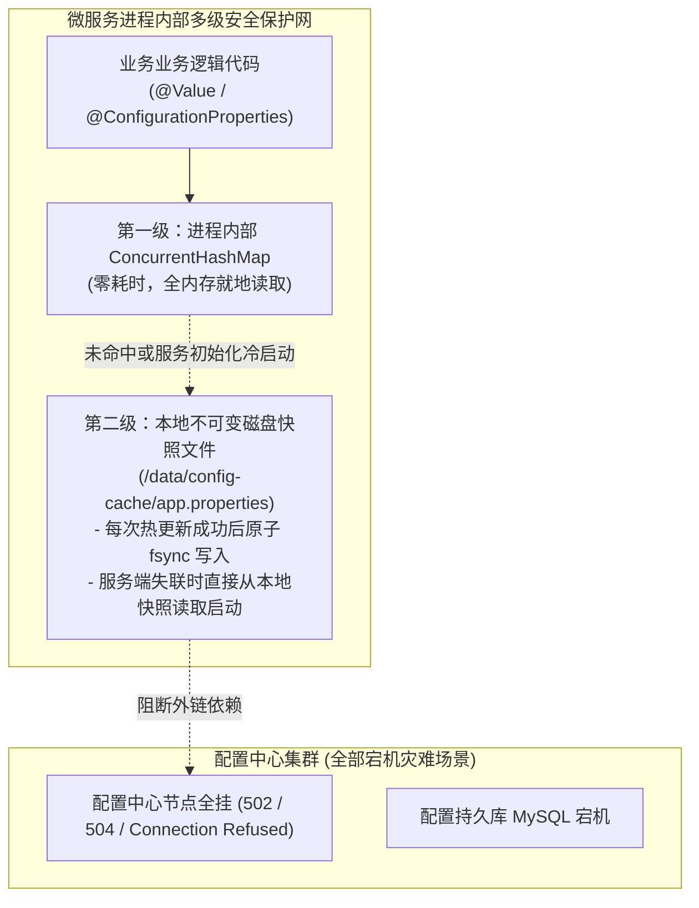
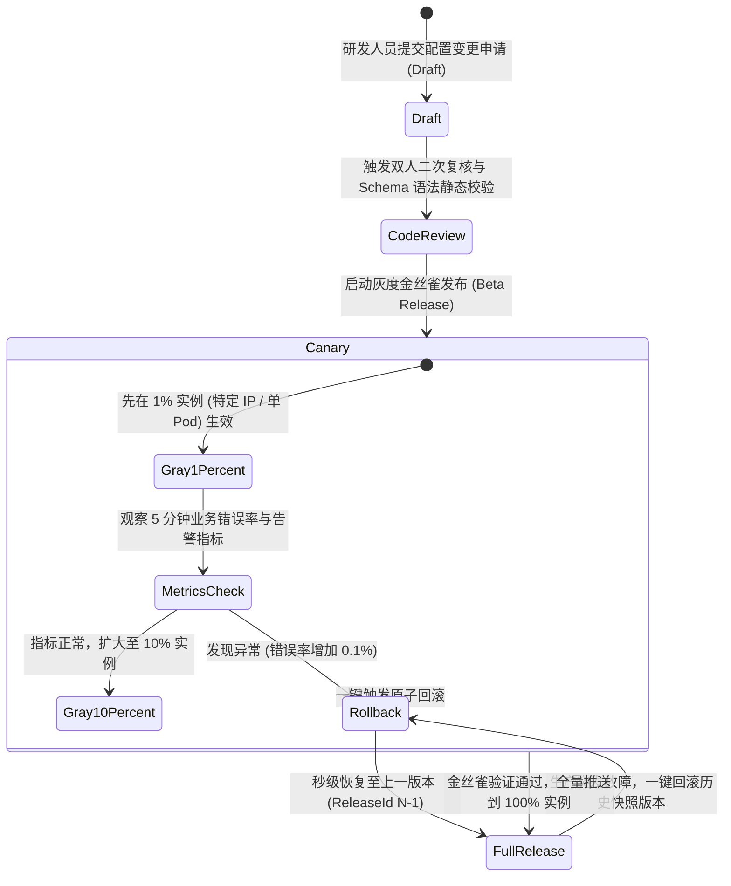

**TL;DR：** 分布式配置中心（如携程 Apollo、阿里 Nacos）是微服务架构中最不起眼、但一旦瘫痪足以引发全网瘫痪的最高危基础设施之一。初中级工程师在面试中往往只停留在“把配置文件放到 Git 或数据库中，应用启动时读取”的静态认知，面对资深考官的连环追问会彻底手足无措：**当集群拥有数万台服务 Pod 时，采用纯推送（Push）会导致数十万长连接常驻、服务端心跳与广播风暴（Broadcast Storm）压垮网络；采用客户端定时拉取（Pull）则会造成 99% 的空轮询浪费 CPU 与带宽，且配置生效延迟高达几十秒；如果配置中心所有服务端与数据库同时宕机，业务微服务能否照常弹性扩容启动？如果不小心改错了一个数据库密码配置，如何做到一键毫秒级全网瞬时原子回滚防变砖？** 资深架构师的破局之道在于**推拉结合的高性能异步事件模型**：采用 **HTTP 30 秒长轮询（Long Polling）+ MD5 脏配置哈希比对**，兼顾毫秒级实时下发与极低的空闲网络开销；在客户端构建 **内存 Cache + 本地不可变磁盘灾备快照（Snapshot）**，达成服务端全灭时 100% 独立冷启动的终极容灾；并结合 **灰度金丝雀发布（1% $\to$ 10% $\to$ 100%）与单调版本号租约**，确保每一次配置变更可审计、可追踪、秒级安全回滚。

---

## 一、 面试现场：从本地配置文件到千万微服务动态配置痛点

```text
面试官提问：
  "我们公司拥有 500 个微服务应用，部署在跨多机房的 20,000 个容器实例中。
   业务要求支持配置热更新（如动态切换数据库连接池、开关降级标志、调整日志级别）。
   请设计一个支撑千万级调用、毫秒级下发生效、具备多租户权限控制且极端情况下自愈容灾的分布式配置中心。"
```

### 1.1 传统本地配置文件的四代致命痛点
1. **重新打包部署代价极高**：修改一个超时时间，需要重新打 Docker 镜像、走完整 CI/CD 流程、全量滚动发布，耗时数十分钟；
2. **缺乏多环境与租户隔离**：Dev、Test、Staging、Prod 各套环境配置混杂，极易出现把测试库地址误部署到生产环境的灾难事故；
3. **版本失控与缺乏审计溯源**：无法追溯“谁在什么时间、把什么参数从 A 改成了 B”，故障排查时陷入罗生门；
4. **无法实现灰度金丝雀下发**：新配置一发布就是全量生效，一旦参数配置错误，全网瞬间瘫痪。

---

## 二、 通信范式博弈：推模式（Push）长连接 vs 拉模式（Pull）长轮询

在客户端与配置中心的通信设计上，存在推（Push）与拉（Pull）两大流派的物理权衡。



### 2.1 为什么现代配置中心（Apollo / Nacos）普遍拥抱长轮询（Long Polling）？

1. **纯推模式（Pure Push）的致命缺陷**：
   - 传统长连接（如 WebSocket / 裸 TCP）对网络中间件极其不友好：公网或跨 VPC 的 L4/L7 负载均衡器（如 AWS NLB、F5、Nginx）通常有空闲超时（Idle Timeout 60s），超过无数据传输会被静默 RST 断开；
   - 服务端必须维持与客户端一一对应的会话路由表，一旦配置中心集群缩容或重启，数万客户端同时发起重连，瞬间引爆**惊群重连风暴（Thundering Herd Storm）**；
2. **纯短轮询（Short Polling）的带宽灾难**：
   - 如果 20,000 个客户端每隔 1 秒拉取一次配置，配置中心每秒要承受 **20,000 QPS 的无意义空查询**，数据库与 CPU 资源被严重浪费；
3. **HTTP 30 秒长轮询（Long Polling）的精妙妥协**：
   - **连接无状态**：底层就是标准的 HTTP/1.1 或 HTTP/2 请求，能够完美穿透任何反向代理、网关与企业防火墙；
   - **近乎实时的推送延迟**：配置一旦在后台变更，服务端立即唤醒被挂起的长轮询连接并返回最新数据，下发延迟在 **10~50 毫秒** 内；
   - **极致的低资源开销**：在无变更的绝大多数时间里，连接被放入异步 Servlet / Netty 事件循环中挂起，不占用任何执行线程与 CPU 周期。

---

## 三、 HTTP 长轮询与 MD5 脏配置检测（Dirty Check）的底层实现



### 3.1 基于 Spring DeferredResult / Netty 的无锁挂起状态机
在服务端，如何做到数万连接挂起而不耗尽线程池？
- 服务端绝不能使用 `Thread.sleep()` 阻塞 Worker 线程；
- 采用基于事件驱动的 **异步 Servlet（AsyncContext）** 或 **Netty EventLoop**：
```java
// 配置中心长轮询挂起伪代码
public void handleLongPolling(HttpServletRequest req, HttpServletResponse resp) {
    String clientMd5 = req.getHeader("Client-MD5");
    String currentMd5 = configCache.getMd5(key);

    if (!clientMd5.equals(currentMd5)) {
        // 发现脏配置，立刻返回变动的配置项 Key 列表
        resp.getWriter().write(getChangedKeysJson());
        return;
    }

    // 开启异步上下文，交出底层 Tomcat/Netty 容器的工作线程
    AsyncContext asyncContext = req.startAsync();
    asyncContext.setTimeout(30000); // 30 秒超时

    // 将请求句柄注册到全局观察者队列中 (按 DataId 分组)
    ClientWatchHolder holder = new ClientWatchHolder(asyncContext, clientMd5);
    watchQueue.add(key, holder);
}
```

---

## 四、 高可用容灾护城河：客户端多级内存缓存与本地磁盘快照

配置中心挂了，整个公司的微服务就要跟着陪葬吗？资深架构师的设计底线是：**“配置中心宕机，必须对在线运行的业务服务造成零影响，且必须允许新服务实例无障碍冷启动！”**



### 4.1 客户端冷启动的容灾三步梯
1. **第一梯队：内存原子缓存（In-Memory Hot Cache）**：
   业务线程在运行期间读取配置（如 `@Value("${timeout}")`），永远从进程内部的 `ConcurrentHashMap` 中纳秒级读取，严禁每次请求远程配置中心；
2. **第二梯队：远程中心读取与更新**：
   在正常网络通畅时，优先从配置中心拉取最新配置；成功获取后，必须**同步触发本地文件原子刷盘（Atomic File Flush）**；
3. **第三梯队：本地不可变磁盘灾备快照（Immutable Disk Snapshot）**：
   - 每次成功加载配置，SDK 会在本地机器的磁盘固定目录（如 `/opt/data/config-cache/{appId}/{env}/`）写入一个快照文件；
   - **极端灾难恢复场景**：当大促期间配置中心集群发生网络分区或全量挂掉时，新扩容的 Pod 启动时尝试连接配置中心失败，SDK 会自动降级，**无缝直接加载本地磁盘快照完成初始化启动**！业务正常运行，没有任何依赖死锁。

---

## 五、 变更防变砖：灰度金丝雀发布、权限审计与一键毫秒级原子回滚

在大型企业中，“配错一个字母导致几十个服务雪崩”是真实发生的 P0 级灾难。



### 5.1 灰度分发的三大匹配维度
1. **基于客户端 IP / 主机名（Host IP/Name）**：精确圈定某几台指定的测试机或预发机生效；
2. **基于 Kubernetes Label / 环境变量**：如仅在 `canary=true` 的 Pod 上生效；
3. **分比例动态哈希**：通过 `hash(clientIp + salt) % 100 < 5`，精确控制 5% 的在线流量命中新配置。

### 5.2 单调自增版本号与一键秒级原子回滚
- **配置即不可变对象（Configuration as Code / Immutable Releases）**：
  配置在数据库中严禁直接 `UPDATE` 覆盖原行记录！必须采用类似 Git 的 **不可变版本快照表（Release Table）**；
- 每次发布生成一个全局唯一的单调递增版本号：`ReleaseId = 10086`；
- 当触发一键回滚时，管理员只需选择 `ReleaseId = 10085`，服务端直接生成一条新的下发事件，将客户端内存与状态原子拉回前一版本，整个回滚过程在 **200 毫秒** 内即可全网完成！

---

## 六、 总结与资深系统设计架构决策矩阵

在系统设计面试中展示 Senior / Staff 架构师视野，必须能够系统化总结配置中心的核心权衡考点：

### 6.1 分布式配置中心全景考点矩阵

| 评测维度 | 纯推模式（WebSocket/TCP） | 定时短轮询（Short Polling） | **HTTP 长轮询（Long Polling）** |
| --- | --- | --- | --- |
| **实时性（延迟）** | **极高（< 5 ms）** | 极差（取决于轮询周期，如 5~10 秒） | **极高（10~50 ms，被唤醒即返回）** |
| **连接与网络开销** | 极高（需长驻数万连接，穿透代理困难） | 极差（海量无效空请求，打爆网卡） | **极低（30s 仅一次无害 HTTP，零网络穿透障碍）** |
| **重连风暴防御** | 差（服务端重启瞬间数万连接打崩系统） | 优（客户端分散无状态） | **极优（客户端天然带指数抖动 Jitter 与无状态重连）** |
| **单点容灾能力** | 差（依赖活跃会话表状态） | 差 | **极优（配合本地磁盘快照，服务端全死仍能独立启动）** |
| **生产代表系统** | 早期自研专有系统 | Spring Cloud Config 基础版 | **Apollo、Alibaba Nacos 核心实现** |

---

## 七、 参考资料与权威规范

1. **Ctrip Apollo Configuration Center Architecture (2024)**.
   - Apollo Official GitHub & Design Wiki: *Long Polling, Local Cache & Disaster Recovery*.
   - [https://github.com/apolloconfig/apollo/wiki](https://github.com/apolloconfig/apollo/wiki)
2. **Alibaba Nacos: Dynamic Naming and Configuration Service (2024)**.
   - Nacos Architecture Whitepaper: *Config Transport Protocols & Asynchronous DeferredResult*.
   - [https://nacos.io/docs/v2/architecture/core-architecture/](https://nacos.io/docs/v2/architecture/core-architecture/)
3. **Fielding, R. (2000)**. *Architectural Styles and the Design of Network-based Software Architectures.*
   - Chapter 5: Representational State Transfer (REST) & HTTP Stateless Caching Semantics.
4. **RFC 9110: HTTP Semantics (2022)**.
   - Section 13: Conditional Requests & Cache-Control (ETag / If-None-Match 脏检查规范).
