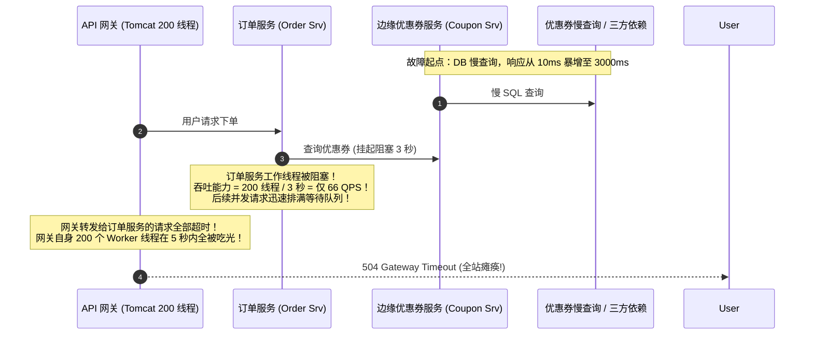
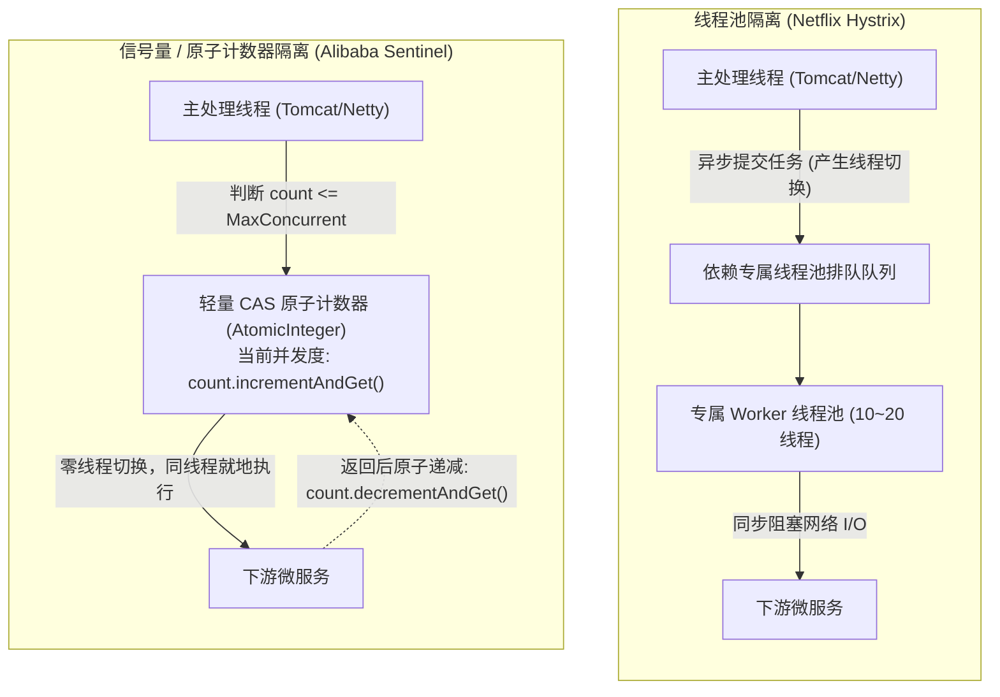
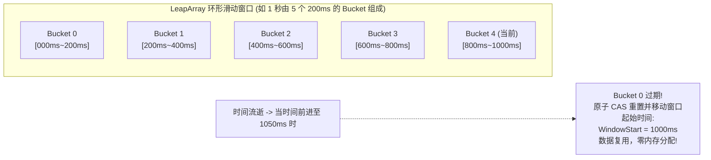
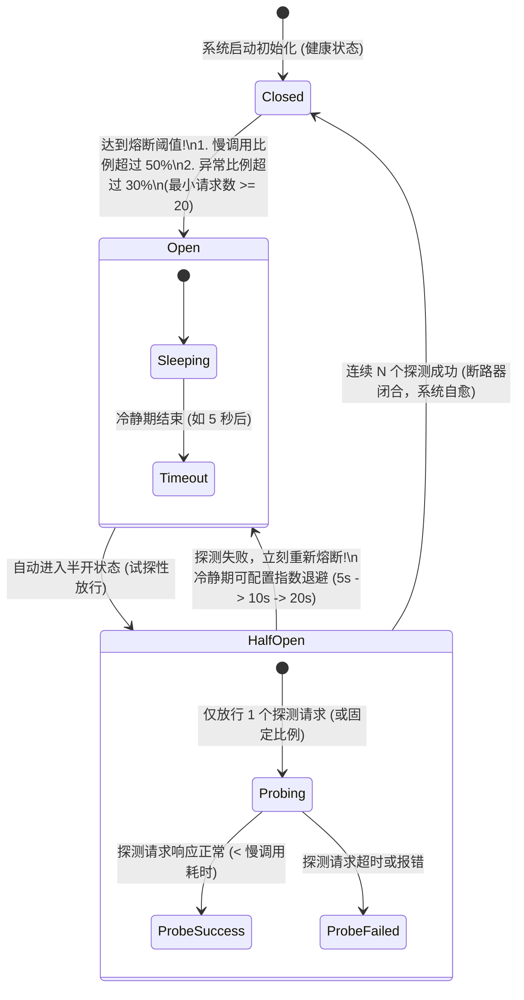
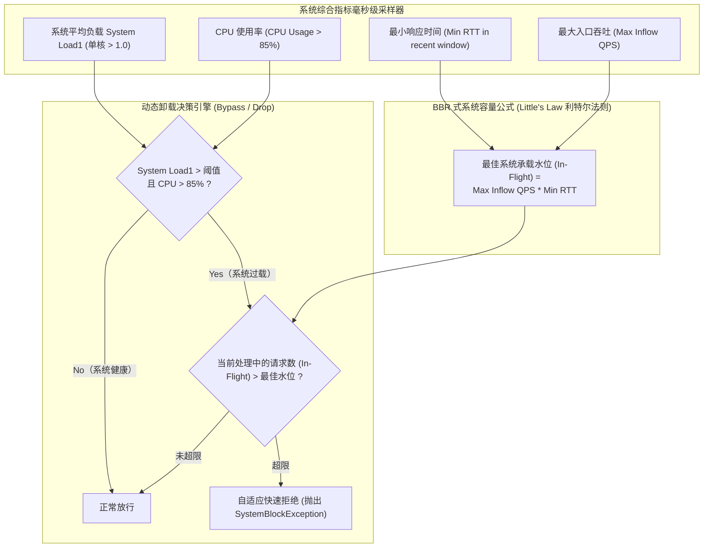

**TL;DR：** 在微服务全链路架构中，“服务雪崩（Cascading Failure）”是悬在每一个分布式系统头顶的达摩克利斯之剑：一个底层边缘服务的几十毫秒网络毛刺或超时卡顿，会像病毒一样沿调用链逆流传导，迅速耗尽上游所有网关与核心服务的线程池和连接池，导致数千个节点同时瘫痪。初中级工程师在面试中回答熔断限流，通常只知道背诵名词：**“用 Hystrix 或 Sentinel，配置一个错误率阈值 50%，超了就熔断返回降级托底数据。”** 这种回答在资深面试官面前会被层层剥皮：**在每秒数十万高吞吐场景下，Netflix Hystrix 提倡的每个命令独立线程池隔离（Thread Pool Isolation），会引发数千个 OS 线程的剧烈上下文切换（Context Switch）与高达 10%~20% 的纯 CPU 性能损耗，在 Go / Node / Netty 反应式非阻塞体系下更是彻底水土不服；如果错误率单纯采用过去 1 秒的统计，在窗口翻转临界点如何消除突发流量毛刺？当全机房 CPU 飙升至 95% 时，单纯基于静态规则的阈值如何自适应平滑卸载？** 资深架构师的破局之道在于**更贴近底层硬件的高性能容错拓扑**：采用 **Sentinel 的无锁环形滑动窗口数组（LeapArray + 原子引用更新）**，将单次流量统计代价压缩至纳秒级；设计严格的 **断路器标准三态机（Closed $\to$ Open $\to$ Half-Open）** 与慢调用比例（Slow Call Rate）智能熔断；并借鉴 **TCP BBR 拥塞控制思维**，引入 **基于系统负荷（System Load1）、入口 QPS 与往返时延（RTT）三维联动** 的 **自适应系统过载保护（Adaptive System Overload Protection）**，实现微服务在极限过载下的优雅自愈。

---

## 一、 面试现场：从一个微服务超时拖垮整个数据中心谈起

```text
面试官提问：
  "我们拥有由 200 个微服务组成的深度调用拓扑，入口网关日均处理 5 亿次 API 请求。
   某天下午，一个最边缘的‘优惠券推荐服务’因为下游三方网络抖动，响应时间从 10ms 骤增至 3000ms。
   结果 20 秒内，商品详情、下单、支付、用户中心所有核心服务全部报错 504 Gateway Timeout，全网瘫痪。
   请深入分析级联雪崩的底层物理传导机理，并设计一套千万级高吞吐、低开销的立体化熔断降级与过载保护系统。"
```

### 1.1 级联雪崩（Cascading Failure）的物理传导链

为什么一个不重要的叶子节点变慢，会瞬间毁灭根节点？



### 1.2 考官的五层连环死亡追问

1. **隔离机制的物理性能税追问**：
   “Netflix Hystrix 著名的‘线程池隔离（Thread Pool Isolation）’为每个依赖服务分配独立的线程池。如果你的服务依赖了 30 个下游，开 30 个线程池（共计数百个工作线程），在高吞吐下操作系统发生剧烈的线程调度和上下文切换（Context Switching），CPU 核心直接被内核调度器吃满，单请求延迟增加 3~5 毫秒，这种方案在现代高并发系统下该如何权衡？”
2. **滑动窗口统计的临界突变与内存开销追问**：
   “如果要统计‘过去 10 秒内错误率超过 50% 触发熔断’，如果采用固定窗口（Fixed Window），在窗口跳跃瞬间遭遇流量突刺会发生漏网；如果采用滑动日志（Sliding Log），每条请求记录一个时间戳，内存占用直接爆炸。生产级系统如何做到空间复杂度恒定、时间复杂度 $O(1)$ 的高精度滑动窗口统计？”
3. **熔断恢复期的惊群二次打崩追问**：
   “当熔断器处于 Open 状态经过冷静期进入 Half-Open（半开）状态时，如何放行流量？如果瞬间放行 1000 个请求去试探下游，下游刚刚恢复的微弱生命力会被瞬间再次打死，你怎么设计平滑的渐进式探测？”
4. **慢调用比例 vs 纯异常比例追问**：
   “下游服务并没有抛出 HTTP 500 异常，而是所有的请求都在‘正常且缓慢’地返回（比如耗时都是 2.9 秒，没超 3 秒超时限制）。此时异常率为 0%，纯异常熔断器完全不会触发，但上游线程池已经被彻底吸干了，这种‘慢调用导致的隐蔽雪崩’怎么熔断？”
5. **动态自适应系统过载保护追问**：
   “如果运维同学没有为每个接口手动配置阈值，或者大促突发洪峰超出了容量评估，单机 CPU 已经飙到了 98%，如何让应用无需预先配置规则，像 TCP BBR 一样自适应评估系统水位并动态丢弃低优先级流量？”

---

## 二、 隔离策略的物理分水岭：线程池隔离 vs 信号量/计数器隔离

容错系统首先要做的是**舱壁隔离（Bulkhead）**，防止局部故障蔓延。工业界主要存在两大隔离模型：



### 2.1 两大隔离机制深度对比表

| 维度 | 线程池隔离（Thread Pool Isolation） | 信号量 / 并发数隔离（Semaphore / Thread Count） |
| --- | --- | --- |
| **隔离级别** | **最高**（下游阻塞超时由专属线程承担，主线程不受影响） | **极高**（限制最大并发请求数，超限直接快速失败） |
| **CPU 上下文切换** | **极重**（每次调用涉及主线程 $\to$ 队列 $\to$ Worker 线程 $\to$ 主线程的两次 Context Switch） | **零开销**（同一线程直接就地同步或异步执行） |
| **内存开销** | 极高（每个线程默认占用 1MB 栈内存，数百个线程消耗数百 MB 内存） | **极低**（仅一个 4 字节的原子计数器与 CAS 操作） |
| **反应式/异步生态支持** | **极差**（与 Node.js、Go Goroutine、Netty 反应式非阻塞模型天然冲突） | **完美支持**（完美嵌入 WebFlux、gRPC、异步调用链） |
| **超时强制中断** | 支持（可由父线程直接 `Thread.interrupt()` 或由 Future 强制退出） | 依赖底层网络 Client（如 HttpClient / OkHttp 的 SocketTimeout 设置） |
| **现代架构选型建议** | 仅适合极少量的极高危、极不受信的第三方纯阻塞调用 | **绝大多数高性能网关与核心微服务的绝对首选（Sentinel 路线）** |

---

## 三、 高精度滑动窗口统计引擎：Sentinel LeapArray 环形数组实现

要实时判断系统是否应该熔断，核心在于**毫秒级精准统计过去一个时间周期内的指标（QPS、Success、Fail、Slow Call、RTT）**。

传统滑动日志（Sliding Log）空间开销太大，固定窗口（Fixed Window）在临界点有 2 倍突刺；Alibaba Sentinel 创新性地提出了 **LeapArray 无锁环形滑动窗口数组**。



### 3.1 环形滑动窗口数学映射算法
设整个统计周期为 $T_{\text{interval}}$（例如 1000 毫秒），切分为 $N$ 个时间桶（Bucket，例如 5 个桶，每个桶窗口长度 $\text{windowLength} = 200$ 毫秒）：
1. **当前时间到桶索引的计算**：
   $$\text{idx} = \left(\frac{\text{currentTime}}{\text{windowLength}}\right) \pmod N$$
2. **当前桶期望的绝对开始时间**：
   $$\text{expectedStart} = \text{currentTime} - (\text{currentTime} \pmod{\text{windowLength}})$$
3. **环形复用与原子 CAS 替换**：
   - 如果当前桶的实际开始时间等于 `expectedStart`：直接在该桶的原子计数器（Pass / Block / Error）上 `incrementAndGet()`；
   - 如果实际开始时间小于 `expectedStart`：说明时间已经跨越了完整的环形周期，通过 **无锁 CAS（Compare-And-Swap）** 将旧桶重置为当前桶，并清空历史指标；
   - **零 GC 垃圾回收**：环形数组在初始化后大小固定（仅由几个对象组成），整个统计过程**不产生任何临时对象与内存分配**，单次统计耗时在 **5~10 纳秒** 内！

---

## 四、 断路器三态机（Closed / Open / Half-Open）的平滑演进与试探

断路器借鉴了物理电路中的空气开关，状态转移机理必须兼顾快速阻断与安全自愈。



### 4.1 核心状态转移契约
1. **闭合态（Closed）**：
   - 流量正常放行；
   - 只有当滑动窗口内**总请求数达到最小门槛（如 $\ge 20$）**，且**慢调用比例（Slow Call Rate）或异常比例（Error Rate）达到阈值**时，才触发熔断。避免在并发极低时（如 2 个请求失败 1 个就被误触发）；
2. **开启态（Open）**：
   - 熔断阻断！所有后续请求**在进入网络调用前立刻抛出熔断异常（Fast-Fail）**，耗时在微秒级；
   - 启动冷静期计时器（Time Window，如 5 秒），期间绝不骚扰下游；
3. **半开态（Half-Open）**：
   - 冷静期满后，状态自动变为 Half-Open；
   - **关键防惊群设计**：**只允许单 1 个请求（或每秒严格限流 1 个）** 去真实调用下游：
     - 如果该请求返回正常（延迟低于阈值且无异常）：断路器彻底关闭，恢复正常；
     - 如果该请求依然失败或超时：证明下游尚未完全恢复，**断路器立即重新切回 Open 状态**，并将下一次冷静期时间加倍（指数退避算法），彻底杜绝下游刚喘过气来又被一波峰值打爆。

---

## 五、 自适应系统过载保护：基于 TCP BBR 思维的系统级水库自愈

很多时候，系统雪崩并不是某个特定外部服务出故障，而是**机器本身资源耗尽**（如 GC 暂停、突发流量打满 CPU、死循环）。此时静态的接口限流规则完全无法应对全局雪崩。

Alibaba Sentinel 引入了基于系统负载的 **自适应过载保护（Adaptive System Overload Protection）**，其算法哲学深度借鉴了 Google TCP BBR 拥塞控制协议。



### 5.1 利特尔法则（Little's Law）在过载保护中的数学推导
利特尔法则在排队论中证明：**一个稳定系统中同时处于活动状态的平均请求数（In-Flight），等于请求到达速率（Arrival Rate / QPS）乘以每个请求的平均处理时间（Latency / RTT）**：
$$\text{InFlight} = QPS \times RTT$$

- 当机器 CPU 发生过载（如使用率达到 85% 甚至 90%）时，系统不能简单地一刀切拒绝所有流量，这会导致机器空转；
- Sentinel 自动追踪近期滑动窗口中达到的 **历史最大吞吐量 $QPS_{\text{max}}$** 和 **历史最小延迟 $RTT_{\text{min}}$**；
- 计算出当前机器在健康状态下的最佳并发容纳水位：
  $$\text{Capacity} = QPS_{\text{max}} \times RTT_{\text{min}}$$
- 如果当前时刻的实时处理中请求数（In-Flight）超过了 $\text{Capacity}$，超出部分直接在网关层秒级丢弃；**始终将系统压制在吞吐最高、延迟最低的黄金工作区间**。

---

## 六、 总结与资深系统设计架构决策矩阵

在资深架构师面试中，对熔断限流体系的总结应当覆盖“端到端全链路立体防御”：

### 6.1 熔断限流系统演进与选型全景矩阵

| 评测维度 | 第一代：Netflix Hystrix | 第二代：Resilience4j | 第三代：Alibaba Sentinel |
| --- | --- | --- | --- |
| **核心隔离模型** | **线程池隔离为主**（开销大，资源占用重） | 信号量 / 并发数计数器 | **高性能并发数（CAS）+ 线程池混合** |
| **实时指标统计** | 基于 RxJava 事件流滑动窗口 | 内存环形数组 | **无锁环形数组 LeapArray（纳秒级统计）** |
| **熔断判定维度** | 仅异常比例（Error Rate） | 异常比例 + 慢调用耗时 | **慢调用比例 + 异常比例 + 异常数 + 最小请求数** |
| **自适应过载保护** | **无**（完全依赖人工静态阈值） | 无 | **具备（基于 Load1 / CPU / RTT / BBR 机制）** |
| **动态规则热更新** | 依赖 Archaius（较笨重） | 依赖配置中心 | **原生支持 Nacos / Apollo / ZooKeeper / K8s CRD** |
| **生态成熟度** | **已停止维护（Maintenance Mode）** | 适用于轻量 Spring 体系 | **现代化微服务、服务网格与高并发网关的主流首选** |

### 6.2 答题核心金句
- **“防雪崩的最高境界，不是把故障节点修好，而是把故障的影响圈（Blast Radius）限制在单个节点内部”**；
- **“慢比错更致命”**：一个立即返回 500 的接口只会影响单次调用，但一个卡顿 3 秒的接口会像黑洞一样吸干整个集群的所有计算资源；
- **“用确定性的系统承载力，驯服非确定性的业务流量”**：基于利特尔法则的自适应水位控制，是让单机在极限洪峰下保持稳定吞吐的终极物理武器。

---

## 七、 参考资料与权威规范

1. **Netflix Hystrix Wiki (2018)**.
   - Netflix OSS Documentation: *How it Works: Isolation, Circuit Breaker & Fallback*.
   - [https://github.com/Netflix/Hystrix/wiki](https://github.com/Netflix/Hystrix/wiki)
2. **Alibaba Sentinel Technical Architecture (2024)**.
   - Sentinel Official Documentation: *LeapArray Implementation & System Adaptive Protection*.
   - [https://sentinelguard.io/zh-cn/docs/circuit-breaking.html](https://sentinelguard.io/zh-cn/docs/circuit-breaking.html)
3. **Cardwell, K., et al. (2016)**. *BBR: Congestion-Based Congestion Control.*
   - ACM Queue, 14(5): 20–53.（基于瓶颈带宽与往返时延的拥塞控制开山之作）。
4. **Little, J. D. (1961)**. *A proof for the queuing formula: $L = \lambda W$.*
   - Operations Research, 9(3): 383–387.（排队论利特尔法则数学形式化证明）。
