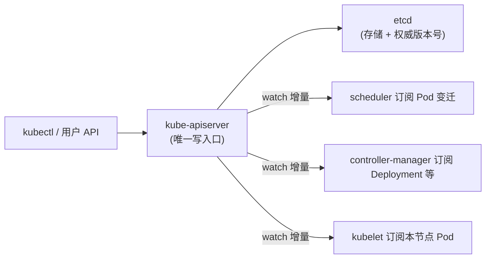
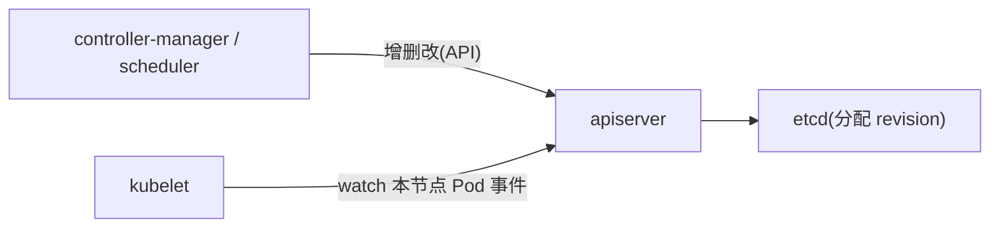
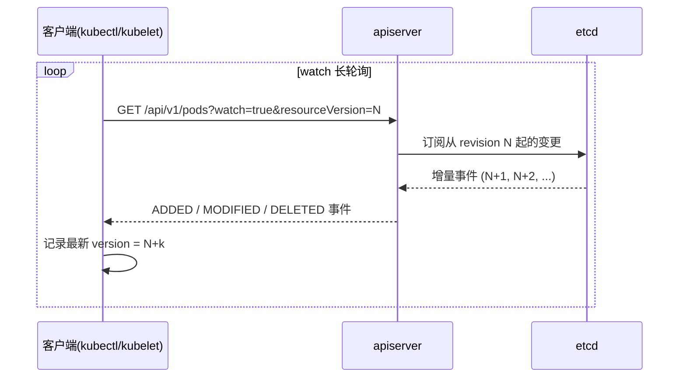

**TL;DR：** Kubernetes 控制面是一台"**单一写入者 + 无限订阅者**"的广播系统。`kube-apiserver` 是唯一的写入口，`etcd` 是唯一的权威状态，而 scheduler、controller-manager、每个 kubelet 都是 **watch 消费者**——它们只收增量，不主动去猜全局状态。这套设计的拐点是 **`resourceVersion`**：etcd 每次提交都给 key 一个递增的版本号，apiserver 把它当游标推给所有 watcher。谁落后到底，就收到 `410`，从头快照再接增量。本文用两次 `kubectl` 实验拆开这条"增量管线"，并标出三处最容易被误用的边界。

## 一、控制面不是三剑客，是广播总线

初学者最常见的印象是"apiserver + scheduler + etcd 三个二进制"。但真正的结构是**中心化的广播总线**：



- 用户、控制器、调度器、节点**四路彼此不直接通信**，全部通过 apiserver 中转。
- 写必须穿过 apiserver 的准入（admission）、默认值、校验，再落到 etcd。
- 读：希望所有人都增量跟随，而不是反复拿全量。



## 二、resourceVersion：把事件做成可断点续传的编号

etcd 每次对 key 提交成功，都会分配一个全局递增的 `revision`。apiserver 把它改写成大家都认得的 **`resourceVersion`**，放在每个对象的 metadata 里。三条逻辑：

1. **单调递增，不回溯**：一次完整的写，总会让对象的 version 变大。
2. **watch 由它驱动**：`kubectl get -w` 的实质是——客户端带一个 `resourceVersion` 发起 watch，收完一批事件后更新自己的版本号，带新版本号再发起。版本号就是"我看到哪一笔"的游标。
3. **落后即回首**：如果客户端落后到 apiserver 缓存之外，服务端回 `410 Gone`（版本太旧，无法重播）——客户端必须从头 `list` 全量再接增量。



**容易误用的边界**：如果断线时间超过了 apiserver 缓存窗口，客户端只能走"全量快照 + 增量"重建。所以这条链路**不是**强一致的"每次读都是最新"，而是"**我给过你的，不会再给你旧的**"——因果序。

## 三、读一致性最终靠 etcd 的线性一致

客户端各看各的增量，那"读的时候谁保证最新"？答案集中在 apiserver 这层：

1. **写必须线性化**：etcd 的读有多种模式，apiserver 走 `list` 这类权威读时用**线性一致读**（要过一轮 quorum 确认），读完就是全鲜的。
2. **顺序共享**：跨对象的顺序唯一来源是 etcd 的 `revision`——全局共一条时间线。
3. **Lease 兜底**：etcd 的 TTL（lease）机制管关键清理——节点心跳、对象租约挂在上面，过期即清。Pod 落到一个节点上的身份信息就靠 lease 续期。

**这是核心代价账**：订阅者再多，各自只付增量带宽；但任何"读最新"的瞬间，都要向 etcd 要走一次 quorum 的横向成本。这就是广播总线"量越大越贵，点越少越新"的真相。

## 四、把它变成可见的东西

```bash
# 实验 1：看 watch 事件流
kubectl get pods -o wide -w &
# 另开终端删几个 pod，观察每个事件都带更新后的 metadata.resourceVersion

# 实验 2：直接打 apiserver 的 watch 端点，从 revision 0 拉全量
kubectl --raw "/api/v1/pods?watch=true&resourceVersion=0"
# 你会看到：先发出现有 pods 的 ADDED 事件流,然后安静挂起,直到有新的变更
```

实验 2 的 `resourceVersion=0` 等价于"从头开始"——把"快照 + 增量"两段直接放给你看，是理解 list+watch 最便宜的一课。

## 五、三处警号

1. **不要把大量 watchers 当查询**：每次 `kubectl get` 都要建 watch + 全量 list，几千个节点、几百个 controller 同时高频 watch，会压住 apiserver 的 HTTP 连接池。长轮询复用长连接，量大了要设 `--watch-cache` 与会话复用。
2. **断线 ≠ 状态可猜**：watch 断了该重新 `list` 全量再续增量，绝不能自己拼一个"看起来对"的状态继续——漏更新比拉全量更危险。
3. **别把 etcd 当业务库**：往里塞高频变化的业务数据，会产生海量 revision 垃圾与频繁 compaction，让所有 watcher 不断 410 重建，控制面反而先崩。

## 结论：控制面以 resourceVersion 把写入变成增量广播

K8s 的控制面是"apiserver 写、etcd 存、watch 拉、resourceVersion 当游标"的**增量广播系统**。这笔交易的清晰之处：**只有一个权威，一次只能改一笔，其他全走增量跟随**。读对齐的代价是断线→快照重建；写对齐的代价是全部写必须穿过 apiserver 这个单点针眼，不能旁路。所有组件都靠 watch 增量才"看见"变化，所以你的控制器对变化的响应速度，不可能快过 apiserver 推拉增量这一跳。

下一步：跑实验 2，连续看 10 分钟事件里的 `resourceVersion` 怎么涨——你会亲眼目睹"一切广播背后是一根只增不减的编号"。

## 参考资料
1. Kubernetes 官方：API concepts（List / Watch / resourceVersion）—— https://kubernetes.io/docs/reference/using-api/api-concepts/
2. Kubernetes 源码：apiserver 的 etcd3 watch 实现—— https://github.com/kubernetes/kubernetes/tree/master/staging/src/k8s.io/apiserver
3. etcd 文档：存储模型与 revision—— https://etcd.io/docs/v3.5/learning/
4. etcd 文档：op-guide 并发与一致性—— https://etcd.io/docs/v3.5/op-guide/

> 延伸阅读：watch 背后的版本号就是 [Raft 的任期与日志复制](/writing/raft-consensus-term-log-replication) 在 etcd 里的化身；节点消失、状态流失时的优雅下线见 [Kubernetes 里优雅下线为什么特别难](/writing/kubernetes-graceful-termination)；全量快照与增量之间的对账，和 [主从复制延迟的三种读路径](/writing/replication-lag-read-paths)是同一份账。
