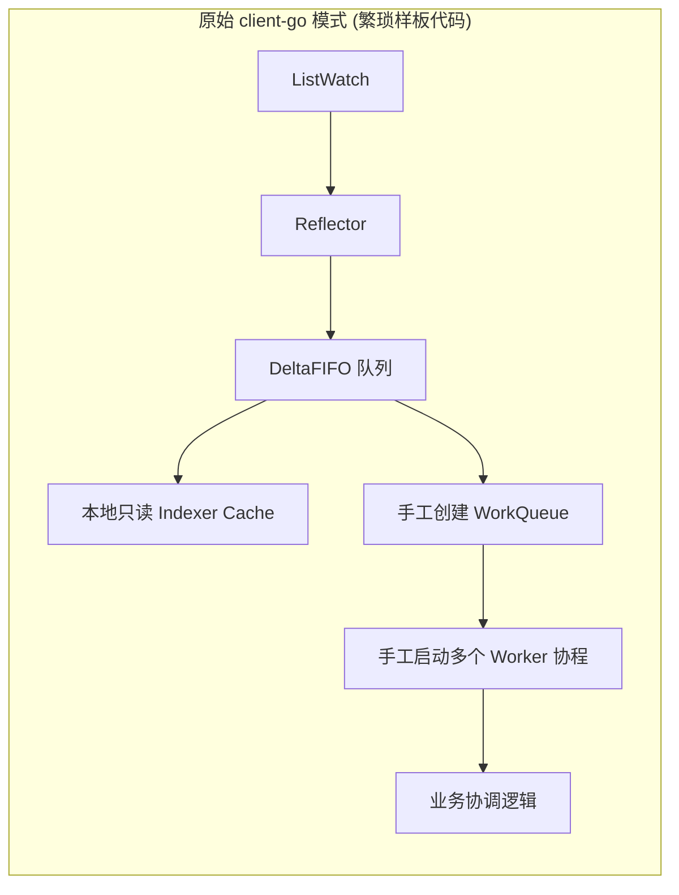
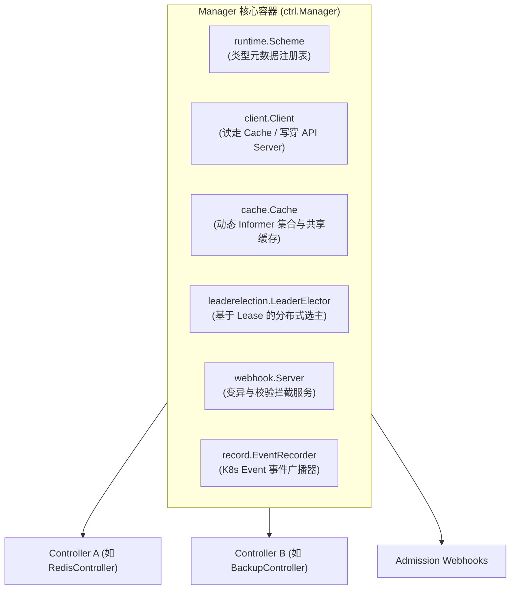
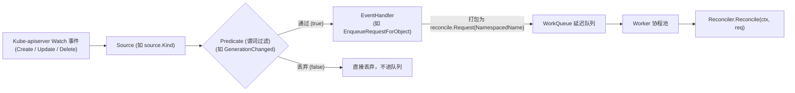
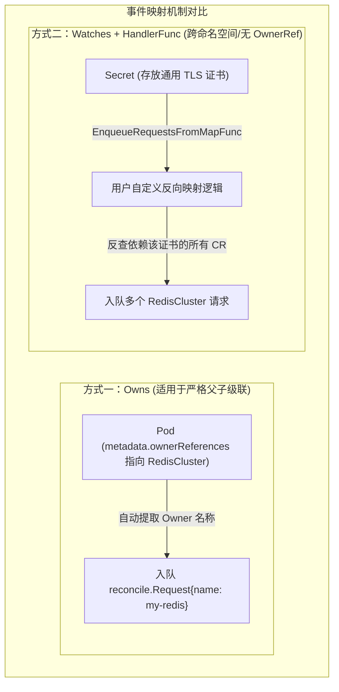

**TL;DR：** 编写工业级 Kubernetes Operator 早已不再是手工拼装 `client-go` 的 Reflector、DeltaFIFO 与 Indexer。由 Kubernetes 官方维护的 `sigs.k8s.io/controller-runtime` 构成了 Kubebuilder 和 Operator SDK 的通用内核骨架。然而，许多工程师对该框架的认知仅停留在“在 `Reconcile()` 方法里写业务逻辑”，一旦遭遇多资源级联更新、事件死循环风暴或内存膨胀便束手无策。本文深度穿透 Controller-Runtime 的底层源码，全景解构 **Manager 依赖注入容器**、**Controller 控制循环**、**Source 数据源**、**EventHandler 映射器**与 **Predicate 谓词过滤器**五大核心组件的协同机制，彻底厘清主从资源反向检索与无锁事件分发的底层实现。

---

## 一、 为什么 Client-Go 原生模式无法满足现代化 Operator 诉求？

在早期的 Kubernetes 二次开发中，开发者必须基于 `client-go` 手工搭建控制循环：



这种底层原始模式在构建复杂的企业级 Operator 时面临三大结构性缺陷：
1. **多资源关联维护极度繁重**：如果一个自定义资源（如 `RedisCluster`）级联管理着数十个 `StatefulSet`、`Service`、`ConfigMap` 和 `Secret`，开发者必须为每一种资源单独编写 Informer、ResourceEventHandler，并在事件回调中手工实现防抖与反向寻址；
2. **生命周期与依赖倒置混乱**：多 Controller 之间的 Leader Election 选主竞争、Webhook 服务器的证书轮转、Metrics 暴露端口以及优雅停机（Graceful Shutdown）信号难以统一编排；
3. **缺乏防抖与短路机制**：默认的 Informer 对任何微小的 Update 事件（如 Status 刷新、ResourceVersion 递增）都会触发排队，极易在集群内引发**自激振荡（Self-triggering Loops）**。

`controller-runtime` 正是为了将开发者从底层的机械管道代码中解放出来，将核心聚焦于**声明式状态机的协调（Reconciliation）**。

---

## 二、 Manager：控制面的中枢依赖注入容器

在 Controller-Runtime 中，`Manager` 扮演了整个进程的心脏与依赖注入容器角色。



### 2.1 读写分离客户端（Delegating Client）

`Manager` 向各个 Controller 注入的 `client.Client` 是一个经过精心设计的**委托客户端（Delegating Client）**：
- **读取操作（`Get` / `List`）**：默认走本地内存中的 `Cache`（基于各资源的 Informer Lister）。这保证了在大规模集群中，无论 Operator 循环读取多少次资源，**对 kube-apiserver 的实际网络请求数为零**，有效保护了控制面的 etcd；
- **写入操作（`Create` / `Update` / `Patch` / `Delete`）**：直接穿透本地缓存，通过 HTTP REST 调用实时写入 `kube-apiserver`。写成功后由 API Server 广播 Watch 事件，最终异步更新本地 Cache。

### 2.2 Runnable 接口与生命周期编排

所有受 `Manager` 管理的组件（包括 Controller、Webhook Server、Metrics Server 等）都必须实现统一的 `Runnable` 接口：

```go
type Runnable interface {
    Start(context.Context) error
}
```

当调用 `mgr.Start(ctx)` 时，Manager 会执行严谨的依赖拓扑启动流程：
1. **启动 Cache**：等待所有注册的 Informer 完成初始 `List` 并同步（`WaitForCacheSync`）；
2. **选主决策（Leader Election）**：如果配置了选主，所有实现了 `LeaderElectionRunnable` 的 Controller 会处于阻塞状态，直到当前 Pod 抢占到分布式 `Lease` 锁；
3. **并发派生 Worker**：选主成功后，Manager 统一派生所有 Controller 的后台拉取协程池，并在接收到系统 `SIGTERM` 信号时，通过根 `Context` 级联通知所有 Worker 执行毫秒级优雅退出。

---

## 三、 Controller 的核心流水线：Source、EventHandler 与 Predicate

一个标准的 Controller 并非直接对接 Workqueue，而是通过一条高度模块化的过滤与转换管道（Pipeline）处理事件：



### 3.1 Source：事件的输入端

`Source` 负责提供待监听的底层事件流，最常见的实现包括：
- `source.Kind`：基于特定 GVK（Group-Version-Kind）的 Informer 提供事件；
- `source.Channel`：允许开发者将集群外部的事件（如外部 Webhook 回调、MQ 消息、硬件告警）塞入 channel 并无缝注入 Controller 流水线。

### 3.2 Predicate：抵御自激风暴的防线

在大规模生产环境中，**90% 的 CPU 浪费和 Controller 死循环源于缺乏合理的 Predicate**。

每当控制器执行 `r.Status().Update()` 时，底层对象的 `ResourceVersion` 都会递增并触发一条 `Update` 事件。如果没有 Predicate 拦截，这条事件会重新入队，触发新一轮无休止的 `Reconcile`。

Controller-Runtime 内置了强大的 `predicate.GenerationChangedPredicate`：

```go
type GenerationChangedPredicate struct {
    predicate.Funcs
}

func (p GenerationChangedPredicate) Update(e event.UpdateEvent) bool {
    if e.ObjectOld == nil || e.ObjectNew == nil {
        return false
    }
    // 关键判据：仅当 Spec 变更引发 metadata.generation 递增时才放行
    // 单纯修改 Status 或 Annotation 引起的更新直接短路拦截
    return e.ObjectOld.GetGeneration() != e.ObjectNew.GetGeneration()
}
```

---

## 四、 二次资源的反向检索与映射（Secondary Resources Mapping）

在真正的生产 Operator 中，我们不仅需要监听**主资源（Primary Resource）**，还必须监听它所派生的**次要资源（Secondary Resources）**。

例如：当某个属于 `RedisCluster` 的 `Pod` 发生崩溃或被驱逐时，Controller 必须立即介入并执行故障转移。



### 4.1 方案一：`Owns` 与垃圾回收（OwnerReferences）

如果次要资源是由主资源在同一个 Namespace 下直接创建的，推荐使用 `Owns`：

```go
func (r *RedisClusterReconciler) SetupWithManager(mgr ctrl.Manager) error {
    return ctrl.NewControllerManagedBy(mgr).
        For(&cachev1alpha1.RedisCluster{}).
        // 自动识别 Pod 的 metadata.ownerReferences
        Owns(&corev1.Pod{}).
        Complete(r)
}
```
其底层原理是 `handler.EnqueueRequestForOwner`：当 Pod 发生变动时，EventHandler 解析其 `ownerReferences` 字段，找到对应的父级 `RedisCluster` 的名称并入队。

### 4.2 方案二：`Watches` 与自定义反向映射函数（`EnqueueRequestsFromMapFunc`）

当监听的资源没有 `OwnerReference`（例如跨 Namespace 的通用配置、全局 CRD、或者由独立系统维护的 Secret）时，必须采用 **反向映射函数**：

```go
func (r *RedisClusterReconciler) SetupWithManager(mgr ctrl.Manager) error {
    return ctrl.NewControllerManagedBy(mgr).
        For(&cachev1alpha1.RedisCluster{}).
        Watches(
            &corev1.Secret{},
            handler.EnqueueRequestsFromMapFunc(r.findClustersForSecret),
        ).
        Complete(r)
}

// 根据变动的 Secret，反查出所有引用了该 Secret 的 RedisCluster 实例并入队
func (r *RedisClusterReconciler) findClustersForSecret(ctx context.Context, secret client.Object) []reconcile.Request {
    var clusters cachev1alpha1.RedisClusterList
    if err := r.List(ctx, &clusters, client.MatchingFields{"spec.tlsSecret": secret.GetName()}); err != nil {
        return nil
    }

    requests := make([]reconcile.Request, len(clusters.Items))
    for i, item := range clusters.Items {
        requests[i] = reconcile.Request{
            NamespacedName: types.NamespacedName{
                Name:      item.GetName(),
                Namespace: item.GetNamespace(),
            },
        }
    }
    return requests
}
```

---

## 五、 生产级 Controller 注册完整全貌

结合 Predicate 过滤、次级资源监听与并发控制，构建一个高吞吐、抗抖动的生产级 Controller 初始化代码：

```go
package controller

import (
    "context"
    "time"

    corev1 "k8s.io/api/core/v1"
    ctrl "sigs.k8s.io/controller-runtime"
    "sigs.k8s.io/controller-runtime/pkg/controller"
    "sigs.k8s.io/controller-runtime/pkg/predicate"
    
    cachev1alpha1 "github.com/example/redis-operator/api/v1alpha1"
)

type RedisClusterReconciler struct {
    client.Client
    Scheme *runtime.Scheme
}

func (r *RedisClusterReconciler) Reconcile(ctx context.Context, req ctrl.Request) (ctrl.Result, error) {
    // 核心协调状态机逻辑
    return ctrl.Result{}, nil
}

func (r *RedisClusterReconciler) SetupWithManager(mgr ctrl.Manager) error {
    return ctrl.NewControllerManagedBy(mgr).
        For(&cachev1alpha1.RedisCluster{}).
        // 过滤无关的 Update 事件，防止自激死循环
        WithEventFilter(predicate.Or(
            predicate.GenerationChangedPredicate{},
            predicate.LabelChangedPredicate{},
        )).
        // 监听下属 Pod
        Owns(&corev1.Pod{}).
        // 调整控制器内部 Worker 并发度
        WithOptions(controller.Options{
            MaxConcurrentReconciles: 8,
        }).
        Complete(r)
}
```

---

## 结论与演进思考

Controller-Runtime 的核心美感在于**严格的职责解耦与单向事件流动**：
- **Manager** 兜住了进程生命周期、连接池与选主底线；
- **Source 与 Predicate** 在事件流的第一线筑起防线，过滤掉 90% 的无效噪音；
- **EventHandler** 将千奇百怪的底层 Kube-apiserver 事件规整为纯粹的 `NamespacedName` 标量标识符。

然而，在事件进入工作队列之后，一个新的核心挑战摆在眼前：**如果底层环境瞬时发生严重抖动（如 API Server 响应超时、云盘挂载失败），成千上万个请求如果在队列中盲目高频重试，将直接导致控制面发生雪崩**。

在下一篇文章中，我们将直面工作队列的底层物理实现，深度剖析 **Client-Go WorkQueue 的去重机制与三重速率限制算法（令牌桶、指数退避与交织限流）**。
