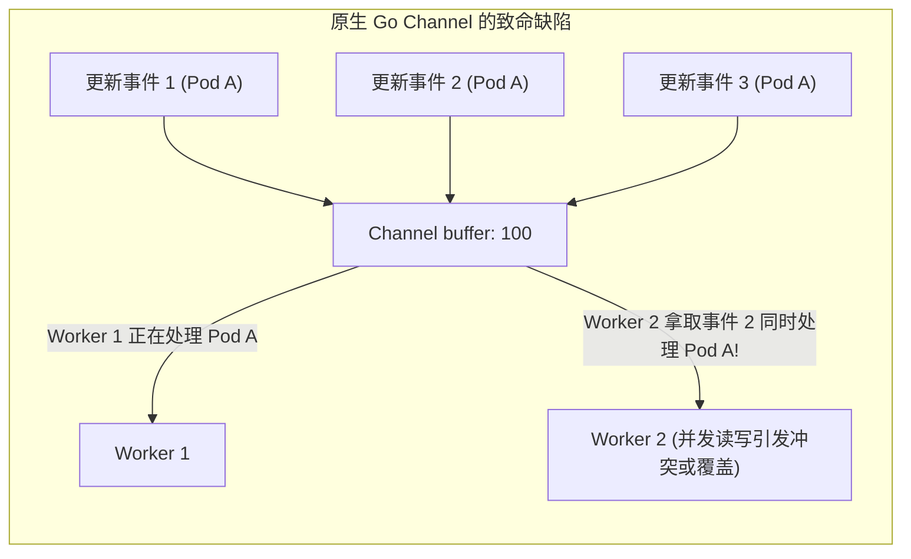
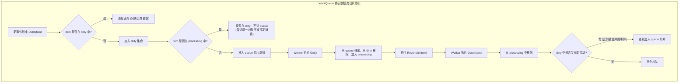
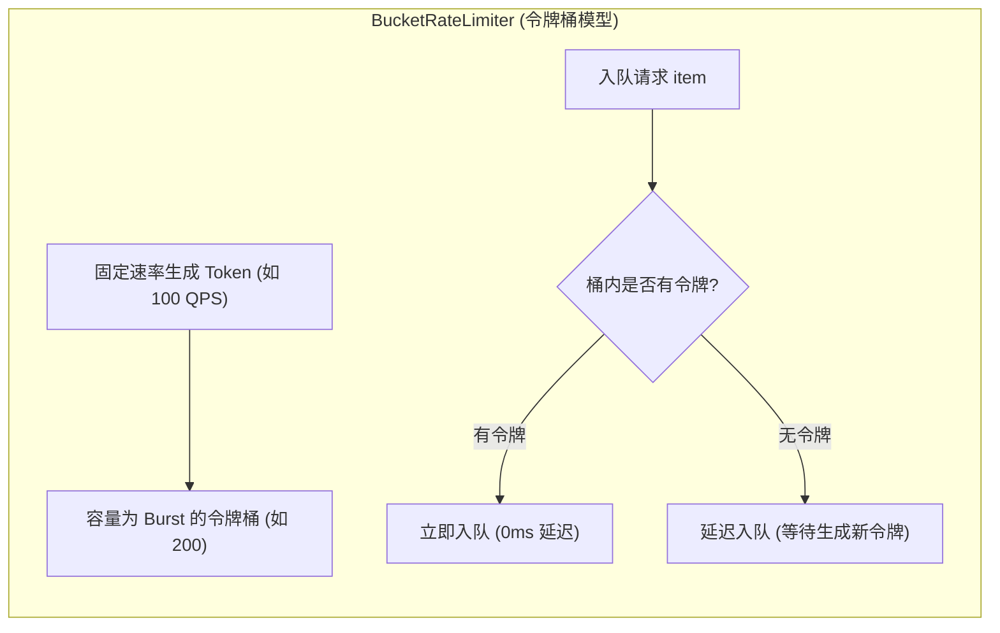
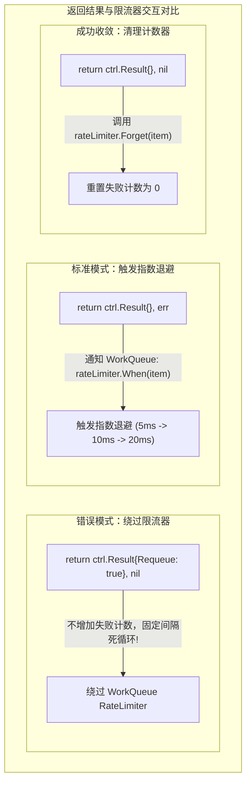

**TL;DR：** 在 Go 语言中，提到异步事件缓冲，很多工程师的第一反应是使用带缓冲的 `chan interface{}`。然而在 Kubernetes 的分布式状态收敛体系下，原生 Channel 存在三大致命缺陷：**无法自动去重**（针对同一对象的连续 100 次更新会塞满 Channel）、**无法避免并发处理冲突**（同一对象的两次更新可能被两个 Worker 同时处理导致并发写冲突）、以及**缺乏自适应退避限流**。Kubernetes 在 `client-go/util/workqueue` 中实现了一套极其精妙的 `RateLimitingInterface`。本文深度拆解其内部的“一队列两集合”数据结构，详解其如何在纳秒级实现对象去重与并行安全，并深入分析工业级令牌桶、指数退避与复合限流算法的数学内核。

---

## 一、 为什么 Go 原生 Channel 无法胜任 Kubernetes 控制循环？

Kubernetes 的状态协调是**基于状态（Level-Triggered）**而非**基于边缘（Edge-Triggered）**的。当一个对象发生变动时，控制器关心的不是“中间变了多少次”，而是“它当前的最新状态是什么”。



如果使用普通的 FIFO Channel：
1. **内存堆积与假性工作**：如果一个 Pod 的 Spec 被连续快速修改了 10 次，Channel 必须串行排队 10 次事件，Worker 会重复拉取最新状态并执行 10 次昂贵的协调，浪费 90% 的算力；
2. **并发数据竞争（Data Race）**：如果多协程并发消费 Channel，Worker 1 和 Worker 2 可能同时处理同一个对象的不同事件，极易产生非预期的并发覆盖与乐观锁冲突（`409 Conflict`）；
3. **故障雪崩（Cascading Failures）**：当底层发生网络抖动导致协调失败时，如果没有精细的退避机制，失败任务被无脑立即重推入队，会形成持续打爆 API Server 的“惊群风暴”。

---

## 二、 WorkQueue 的底层几何：“一队列与两集合”无锁模型

为了在保证高吞吐的同时实现**单对象严格串行、多对象高度并发**，`workqueue.Type` 在内存中维护了三个互锁的数据结构：

```go
type Type struct {
    // 存放待处理元素的有序切片 (FIFO 队列)
    queue []t

    // 脏集合：记录所有需要被处理、但尚未被 Worker 取走的元素
    dirty set

    // 正在处理集合：记录当前正在被某个 Worker 协程消费的元素
    processing set

    cond *sync.Cond
    shuttingDown bool
}
```



### 2.1 状态转移的绝妙之处：处理中的事件合并

仔细观察上述流程中的关键细节：**当某个 Worker 正在协调 `Pod-X` 时，如果此时 `Pod-X` 又发生了一次更新调用 `Add("Pod-X")`**：
1. `Pod-X` 被加入 `dirty` 集合；
2. 但由于 `Pod-X` 此时已经存在于 `processing` 集合中，WorkQueue **绝不将其放入 `queue` 切片**；
3. 这意味着：**其他空闲的 Worker 绝对拿不到 `Pod-X`，彻底杜绝了多 Worker 并发协调同一个对象的竞态！**
4. 当 Worker 1 终于完成处理并调用 `Done("Pod-X")` 时，WorkQueue 检查发现 `dirty` 集合中仍然有它，此时才将它重新排入 `queue` 切片尾部，触发下一轮消费。

这一设计在极简的内存结构下，用纳秒级的集合查找完美兑现了：**事件去重（Deduplication）**、**处理互斥（Processing Mutual Exclusion）** 与 **最新状态保底（At-least-once Fresh Processing）**。

---

## 三、 三重限流算法：从局部退避到全局防雪崩

普通的 `DelayingInterface` 仅支持按固定延时入队，而现代 Operator 必须依赖 `RateLimitingInterface`。Controller-Runtime 在底层将限流策略抽象为 `RateLimiter` 接口：

```go
type RateLimiter interface {
    // 获取当前元素需要延迟入队的时间
    When(item interface{}) time.Duration
    // 释放/忘记该元素的失败计数 (协调成功后调用)
    Forget(item interface{})
    // 获取该元素的累计失败次数
    NumRequeues(item interface{}) int
}
```

### 3.1 算法一：指数退避限流器（ItemExponentialFailureRateLimiter）

专为**单个特定资源的偶发性错误**设计。当某个 CR 因为依赖的外部数据库不可用导致 `Reconcile` 报错时，重试间隔呈指数级拉长：

$$T_{\text{delay}} = \min \left( T_{\text{max}}, T_{\text{base}} \times 2^{\text{failures} - 1} \right)$$


```go
type ItemExponentialFailureRateLimiter struct {
    failuresLock sync.Mutex
    failures     map[interface{}]int

    baseDelay time.Duration // 基础延迟，默认通常为 5ms
    maxDelay  time.Duration // 最大延迟封顶，默认通常为 1000s
}
```
- **核心价值**：防止底层服务发生持续几分钟的宕机时，Controller 陷入一秒重试几百次的死循环，使单对象重试频率自动降频到分钟级。

### 3.2 算法二：令牌桶限流器（BucketRateLimiter）

专为**整个 Controller 的全局流量突发**设计。底层直接封装了 Go 官方的 `golang.org/x/time/rate.Limiter`。



- **核心价值**：它不关心某个具体对象的重试次数，而是限制**整个控制器每秒向延迟队列塞入任务的总速率**。在集群节点大面积重启、数千个事件瞬间涌入时，令牌桶会瞬间削峰填谷，保护本地 Worker 协程池不被爆破。

### 3.3 算法三：工业级复合限流器（`MaxOfRateLimiter`）

在真正的生产环境中，单一限流器无法兼顾局部错误与全局突发。Controller-Runtime 默认提供了复合限流器——**`MaxOfRateLimiter`**：

```go
func DefaultControllerRateLimiter() workqueue.RateLimiter {
    return workqueue.NewMaxOfRateLimiter(
        // 局部限流：单对象指数退避 (5ms -> 1000s)
        workqueue.NewItemExponentialFailureRateLimiter(5*time.Millisecond, 1000*time.Second),
        // 全局限流：整体每秒最多 100 QPS，突发允许 200
        &workqueue.BucketRateLimiter{Limiter: rate.NewLimiter(100, 200)},
    )
}
```

其决策逻辑极其直观却极其坚固：
$$T_{\text{final}} = \max \left( T_{\text{exponential}}(item), T_{\text{bucket}}(item) \right)$$
1. 当某个特定对象频繁报错时，指数退避算出需要等待 60 秒，最终取 60 秒；
2. 当突发发生大规模流量时，即使所有对象都是第一次失败，令牌桶耗尽后计算出需要平摊延迟，最终也会强制排队；
3. **两者取最大值，以最高安全标准的护栏保护控制面。**

---

## 四、 协调循环（Reconciler）中的限流最佳实践

很多开发者在编写 `Reconcile` 时，容易犯一个隐蔽的错误：**在遇到业务错误时错误地使用 `ctrl.Result{RequeueAfter: ...}`**。



### 4.1 生产级 Reconcile 模式规范代码

```go
func (r *ClusterReconciler) Reconcile(ctx context.Context, req ctrl.Request) (ctrl.Result, error) {
    var cluster myv1.Cluster
    if err := r.Get(ctx, req.NamespacedName, &cluster); err != nil {
        // 如果对象被彻底删除了，忽略并不再重试
        return ctrl.Result{}, client.IgnoreNotFound(err)
    }

    // 执行业务收敛逻辑
    if err := r.reconcileResources(ctx, &cluster); err != nil {
        log.Error(err, "协调业务资源失败，将触发 WorkQueue 指数退避重试", "cluster", req.NamespacedName)
        // 关键点：直接返回 err！
        // controller-runtime 底层会捕获该 err，并调用 queue.AddRateLimited(req)
        return ctrl.Result{}, err
    }

    // 协调成功，Controller 底层会自动调用 queue.Forget(req)，重置重试计数器
    // 如果业务需要周期性巡检（如定期同步外部状态），显式指定 RequeueAfter
    return ctrl.Result{RequeueAfter: 10 * time.Minute}, nil
}
```

---

## 结论与演进思考

`client-go` 的 WorkQueue 是分布式并发编程的教科书级经典实现：
- **`dirty` 与 `processing` 集合的设计**：用最小的锁开销消除了单对象并发竞态与无效重复计算；
- **`MaxOfRateLimiter` 的复合机制**：完美化解了分布式系统不可避免的短暂网络抖动与级联雪崩风险。

至此，我们的 Operator 已经具备了处理高并发、自适应退避的事件核心。

然而，在真实生产场景中，很多错误实际上可以在**资源尚未写入 etcd 之前**就被彻底阻断；或者需要给资源**动态注入默认配置与安全上下文**。

在下一篇文章中，我们将视角延伸到 API 接入的最前线，深度拆解 **生产级准入控制（Admission Webhooks）——变异与校验拦截器、cert-manager 证书闭环与极端宕机场景下的安全降级策略**。
