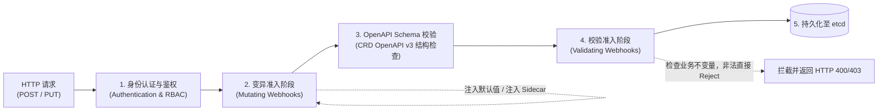
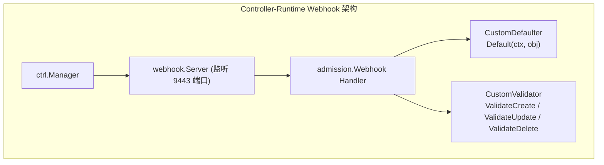
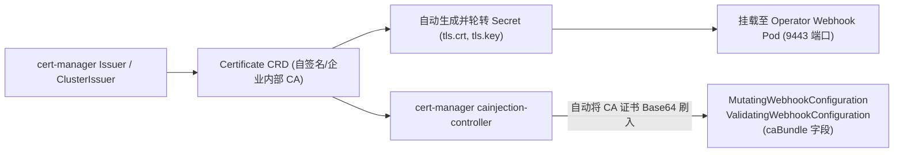
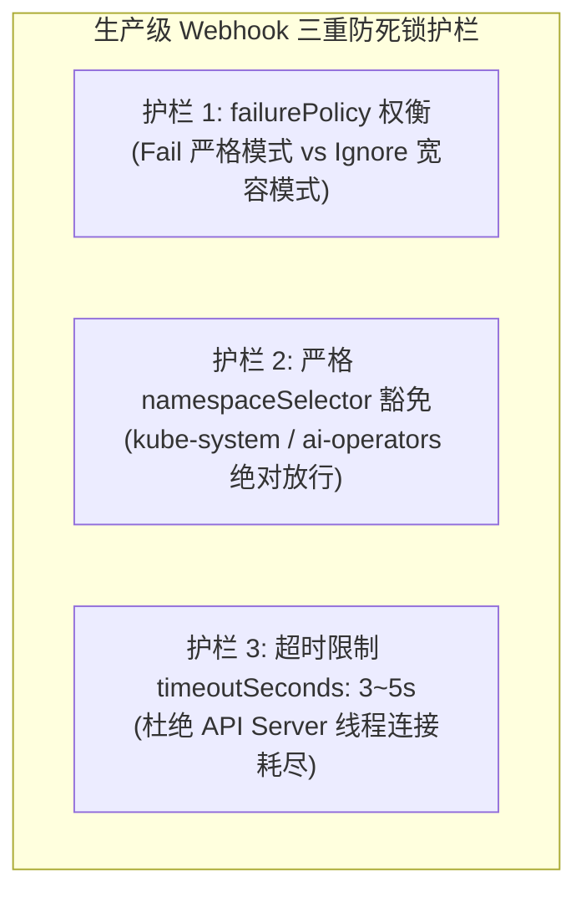

**TL;DR：** 仅仅依靠 `Reconcile()` 协调循环是无法守护集群健康的——因为当非法配置或恶意 Spec 被成功持久化进 etcd 时，Controller 往往只能在后台频繁报错退避，处于“亡羊补牢”的被动局面。**准入控制（Admission Webhook）** 是 Kubernetes API 接入阶段的唯一“主动防御守门人”。本文系统拆解 `kube-apiserver` 的准入拦截调用链路，深入分析 **变异（Mutating）** 与 **校验（Validating）** 的前后依赖语义；基于 `controller-runtime` 详解 `CustomDefaulter` 与 `CustomValidator` 接口的最佳工程落地，并针对生产中最危险的“Webhook 宕机导致整个集群无法创建 Pod”事故，给出基于 `failurePolicy`、`namespaceSelector` 豁免与 **cert-manager** 自动证书轮转的防御体系。

---

## 一、 API 请求在进入 etcd 前的旅程：准入控制链全景

当任何客户端通过 `kubectl` 或 SDK 向 `kube-apiserver` 发起资源创建或更新请求时，请求必须串行穿越三道关卡：



### 1.1 变异（Mutating）与校验（Validating）的严格顺序性

- **第一阶段：Mutating Webhook**
  - **职责**：修改资源对象（如：若用户未指定副本数则默认补全 `replicas: 3`，或为 Pod 动态注入 Istio Sidecar / 日志收集 Agent）；
  - **多轮次触发（Re-invocation）**：如果有多个 Mutating Webhook，后一个 Webhook 对对象的修改可能会重新触发前一个 Webhook 的规则评估，直到对象状态趋于稳定。
- **第二阶段：OpenAPI Schema 静态校验**
  - 由 API Server 根据 CRD 声明的 OpenAPI v3 spec 检查字段类型、必填项与正则约束。
- **第三阶段：Validating Webhook**
  - **职责**：只读检查复杂的业务不变量（Invariants）（例如：检查该 `RedisCluster` 指定的节点数是否为奇数、集群配额是否已耗尽）；
  - **绝对只读**：Validating 阶段**严禁修改对象**，一旦判定不合规，直接拒绝请求并附带用户友好的错误信息，请求终止，**数据绝不落入 etcd**。

---

## 二、 Controller-Runtime 中的 Webhook 现代化架构

在旧版本中，开发者需要自行编写 HTTP Server、解析 JSON、处理 JSONPatch（RFC 6902）。而在 `controller-runtime` 中，官方提供了高级抽象接口：`CustomDefaulter` 与 `CustomValidator`。



### 2.1 变异实现：`CustomDefaulter` 注入默认值

```go
type RedisClusterCustomDefaulter struct{}

func (d *RedisClusterCustomDefaulter) Default(ctx context.Context, obj runtime.Object) error {
    cluster, ok := obj.(*cachev1alpha1.RedisCluster)
    if !ok {
        return fmt.Errorf("预期 RedisCluster 对象，但收到 %T", obj)
    }

    // 如果未设置副本数，默认为 3
    if cluster.Spec.Replicas == 0 {
        cluster.Spec.Replicas = 3
    }
    // 如果未设置资源规格，注入默认保底配置
    if cluster.Spec.Resources.Requests == nil {
        cluster.Spec.Resources = corev1.ResourceRequirements{
            Requests: corev1.ResourceList{
                corev1.ResourceCPU:    resource.MustParse("500m"),
                corev1.ResourceMemory: resource.MustParse("1Gi"),
            },
        }
    }
    return nil
}
```

### 2.2 校验实现：`CustomValidator` 守住业务不变量

```go
type RedisClusterCustomValidator struct{}

func (v *RedisClusterCustomValidator) ValidateCreate(ctx context.Context, obj runtime.Object) (admission.Warnings, error) {
    cluster := obj.(*cachev1alpha1.RedisCluster)
    return nil, v.validateCluster(cluster)
}

func (v *RedisClusterCustomValidator) ValidateUpdate(ctx context.Context, oldObj, newObj runtime.Object) (admission.Warnings, error) {
    oldCluster := oldObj.(*cachev1alpha1.RedisCluster)
    newCluster := newObj.(*cachev1alpha1.RedisCluster)

    // 禁止在不停机状态下跨大版本降级
    if oldCluster.Spec.Version > newCluster.Spec.Version {
        return nil, field.Forbidden(
            field.NewPath("spec", "version"),
            "不支持从高版本向低版本降级",
        )
    }
    return nil, v.validateCluster(newCluster)
}

func (v *RedisClusterCustomValidator) validateCluster(c *cachev1alpha1.RedisCluster) error {
    // 强制集群节点数必须为奇数（保证 Raft/Gossip 选主法定人数）
    if c.Spec.Replicas%2 == 0 {
        return field.Invalid(
            field.NewPath("spec", "replicas"),
            c.Spec.Replicas,
            "Redis 集群主节点数量必须为奇数，防止脑裂",
        )
    }
    return nil
}
```

---

## 三、 生产级证书闭环：基于 cert-manager 的 mTLS 自动化

`kube-apiserver` 与 Webhook Server 之间的通信**必须基于双向 TLS（mTLS）**。API Server 绝不向未经过可信 CA 签名的 HTTP Webhook 发送明文载荷。

在生产环境中，手工生成 OpenSSL 自签名证书并配置有效期的做法极易因**证书过期**引发全集群生产事故。最佳实践是利用 **cert-manager 的 cainjection 机制**实现自动闭环：



### 3.1 声明式配置：无需人工干预的 `caBundle` 注入

在部署 Webhook 配置时，只需打上 `cert-manager.io/inject-ca-from` 注解，并将 `caBundle` 留空，cert-manager 会自动监听证书变动并实时覆写：

```yaml
apiVersion: admissionregistration.k8s.io/v1
kind: ValidatingWebhookConfiguration
metadata:
  name: redis-cluster-validating-webhook
  annotations:
    # 核心注解：通知 cert-manager 动态注入该 Secret 的根 CA
    cert-manager.io/inject-ca-from: ai-operators/webhook-server-cert
webhooks:
  - name: vrediscluster.kb.io
    clientConfig:
      service:
        name: redis-operator-webhook-service
        namespace: ai-operators
        path: /validate-cache-example-com-v1alpha1-rediscluster
      # caBundle 会被自动填充，开发者无需手工填写
      caBundle: ""
    rules:
      - apiGroups: ["cache.example.com"]
        apiVersions: ["v1alpha1"]
        operations: ["CREATE", "UPDATE"]
        resources: ["redisclusters"]
        scope: "Namespaced"
    admissionReviewVersions: ["v1"]
    sideEffects: None
    timeoutSeconds: 5
```

---

## 四、 生产血泪防线：防止 Webhook 宕机“变砖”集群

在企业生产落地中，最恐怖的故障莫过于：**Operator 出现 Bug 导致 Webhook Pod 崩溃重启，而此时整个集群所有的 Pod 或特定资源全部无法创建，甚至连用于修复故障的运维 Pod 也被拦截在外**。

必须在架构设计层面设立三重“防自杀”护栏：



### 4.1 护栏一：`failurePolicy` 的生死抉择
- `Fail`（默认）：如果 Webhook 超时或未响应，`kube-apiserver` **直接拒绝本次操作**。
  - **适用场景**：涉及金融级安全校验、严格账单计费的业务核心资源；
- `Ignore`：如果 Webhook 宕机，API Server 打印告警日志并**跳过拦截、允许变更通行**。
  - **适用场景**：注入非关键 Sidecar（如监控、日志采集）的 Mutating Webhook。

### 4.2 护栏二：命名空间与系统级豁免（Namespace Exclusion）
**永远不要让 Webhook 监听集群自身的系统命名空间！** 否则，一旦 Webhook 挂了，修复它的 Helm 或重启 Pod 也无法被调度起来，形成死锁闭环：

```yaml
    namespaceSelector:
      matchExpressions:
        # 严格排除 kube-system 与控制面自身的命名空间
        - key: kubernetes.io/metadata.name
          operator: NotIn
          values: ["kube-system", "kube-public", "kube-node-lease", "ai-operators"]
```

---

## 结论与演进思考

准入控制将 Kubernetes 的治理能力向前推移到了“请求发生时”：
- **`CustomDefaulter`** 消除冗余样板参数，赋予系统默认最佳实践；
- **`CustomValidator`** 在门禁前拦截错误配置，杜绝垃圾数据污染 etcd；
- **`cert-manager` 联动与命名空间隔离** 则为生产级部署提供了坚不可摧的高可用安全护栏。

至此，我们的 CRD 已经拥有了坚实的准入防护与协调内核。

但在企业软件的真实生命周期中，业务需求永远在变化：**今天设计的 `v1alpha1`，半年后必定演进出 `v1beta1` 甚至 `v1`。如何在不停止在线业务的前提下，平滑升级数以万计的 CRD 对象结构，并保证新旧版本客户端双向兼容？**

在下一篇文章中，我们将直面这个资深架构师必考难题，深度剖析 **CRD 多版本无损演进与 Conversion Webhook——Hub-and-Spoke 拓扑模型与 etcd 存储迁移实战**。
