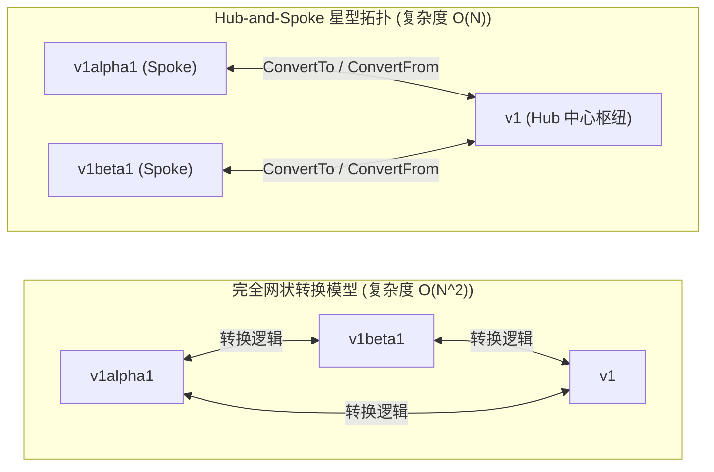
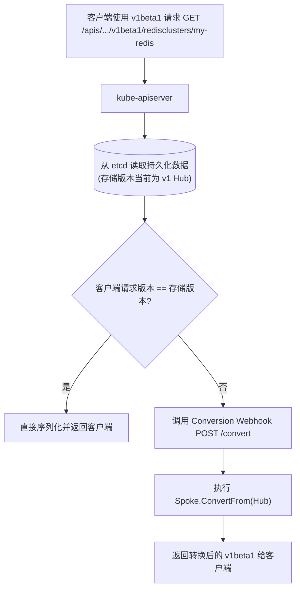
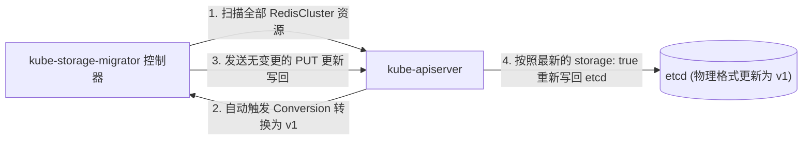

**TL;DR：** 生产级 Kubernetes 平台最忌讳的是“破坏性升级”。当业务平台演进迭代时，我们不可能要求成百上千个业务方同步修改 YAML 并停机发布。Kubernetes 的声明式 API 哲学要求：**同一个资源可以同时以多种版本（如 `v1alpha1`、`v1beta1`、`v1`）被不同客户端并发读取和写入，而底层 etcd 中只持久化单一标准存储版本（Storage Version）**。实现这一魔法的工业级方案是 **Conversion Webhook** 与 **Hub-and-Spoke（中心星型）拓扑模型**。本文深度剖析 `conversion.Hub` 与 `conversion.Convertible` 的接口契约，详解如何在结构演进中通过 Annotation 机制实现无损数据往返（Lossless Round-tripping），并给出利用 `kube-storage-migrator` 完成 etcd 底层数据无缝升级的落地全景。

---

## 一、 CRD 版本演进的两难困境：全网状转换 vs 星型拓扑

如果一个自定义资源定义（CRD）拥有 3 个版本（$v_1, v_2, v_3$），如果要让任意版本的客户端都能读取由其他版本写入的数据，最朴素的做法是为每两个版本之间编写双向转换逻辑：



- **全网状转换（Mesh）**：随着版本数量 $N$ 的增长，需要维护 $N(N-1)$ 条转换通道，代码复杂度呈 $O(N^2)$ 爆炸，且极易引发环形转换死锁或字段丢失；
- **Hub-and-Spoke（星型拓扑）**：Controller-Runtime 强制推行星型拓扑模型。开发者选定一个稳定版本（通常是最新的 `v1`）作为 **Hub（中心枢纽）**，其余所有历史版本（`v1alpha1`、`v1beta1`）仅需与 Hub 实现**一对一的双向转换**，系统维护复杂度骤降为 $O(N)$。

---

## 二、 核心接口契约：`conversion.Hub` 与 `conversion.Convertible`

在 `sigs.k8s.io/controller-runtime/pkg/conversion` 包中，仅有两个纯粹的核心接口：

```go
// Hub 标记该类型是所有版本转换的中心枢纽
type Hub interface {
    Hub() // 空方法，作为编译期类型标记
}

// Convertible 表示该 Spoke 版本能够与 Hub 版本进行双向映射
type Convertible interface {
    Hub

    // ConvertTo 将自身 (Spoke) 转换为 Hub 版本
    ConvertTo(dst Hub) error

    // ConvertFrom 从 Hub 版本还原为自身 (Spoke)
    ConvertFrom(src Hub) error
}
```

### 2.1 转换时机：API Server 的内部协调状态机

当客户端向 `kube-apiserver` 发起请求时，Conversion Webhook 的触发流程如下：



无论是 `GET`、`LIST`、`CREATE` 还是 `UPDATE`，`kube-apiserver` 都会在内存中协调这一转换，对上层调用方完全透明。

---

## 三、 无损数据往返（Lossless Round-tripping）的工程艺术

在版本演进过程中，最棘手的问题是**字段的生命周期不对称**：
- 场景：`v1alpha1` 中有一个临时字段 `spec.legacyTimeout`，在 `v1` 中被废弃并移除；
- 危机：当 `v1alpha1` 的客户端更新了 `legacyTimeout`，经过 `ConvertTo(v1)` 存入 etcd 后，由于 `v1` 没有该字段，如果不做特殊处理，这个数据就**永久丢失**了！后续如果其他工具使用 `v1alpha1` 再次读取，`legacyTimeout` 将凭空消失。

### 3.1 解决方案：基于 Annotation 的不可见字段暂存机制

Controller-Runtime 提供了官方的字段暂存包（`controller-runtime/pkg/conversion`），利用内部 Annotation 将当前 Hub 无法表达的历史字段序列化保存：

```go
// v1beta1 版本的实现
package v1beta1

import (
    ctrlconversion "sigs.k8s.io/controller-runtime/pkg/conversion"
    "github.com/example/api/v1"
)

// ConvertTo 将 v1beta1 转换为 v1 (Hub)
func (src *RedisCluster) ConvertTo(dstRaw ctrlconversion.Hub) error {
    dst := dstRaw.(*v1.RedisCluster)

    // 1. 常规共有字段直接拷贝
    dst.ObjectMeta = src.ObjectMeta
    dst.Spec.Replicas = src.Spec.Replicas

    // 2. 字段语义演进映射
    // 在 v1beta1 中是 string 类型的 Mode ("Cluster" / "Standalone")
    // 在 v1 中演进为强类型的枚举 ArchitectureType
    dst.Spec.Architecture = v1.ArchitectureType(src.Spec.Mode)

    // 3. 处理 v1 中不存在的 v1beta1 独有字段
    // 将整个 src 打包暂存入 Hub 的 metadata.annotations 中
    return ctrlconversion.EnforceLocalObject(src, dst)
}

// ConvertFrom 从 v1 (Hub) 还原为 v1beta1
func (dst *RedisCluster) ConvertFrom(srcRaw ctrlconversion.Hub) error {
    src := srcRaw.(*v1.RedisCluster)

    // 1. 共有字段反向还原
    dst.ObjectMeta = src.ObjectMeta
    dst.Spec.Replicas = src.Spec.Replicas
    dst.Spec.Mode = string(src.Spec.Architecture)

    // 2. 从 Hub 的 annotations 中提取此前暂存的 v1beta1 独有字段
    return ctrlconversion.ExtractLocalObject(src, dst)
}
```

通过这一精巧的机制，Kubernetes 确保了：**无论一个对象在多少个版本之间反复横跳读取修改，所有历史版本的特有属性绝不丢失**。

---

## 四、 生产实战：零停机 etcd 存储迁移（Storage Migration）

在 CRD 声明中，我们可以配置多个版本，但**必须且只能指定一个版本作为 `storage: true`**：

```yaml
apiVersion: apiextensions.k8s.io/v1
kind: CustomResourceDefinition
metadata:
  name: redisclusters.cache.example.com
spec:
  conversion:
    strategy: Webhook
    webhook:
      clientConfig:
        service:
          name: redis-operator-webhook
          namespace: ai-operators
          path: /convert
      conversionReviewVersions: ["v1"]
  versions:
    - name: v1alpha1
      served: true
      storage: false # 废弃存储
    - name: v1beta1
      served: true
      storage: false
    - name: v1
      served: true
      storage: true  # 当前官方唯一持久化版本
```

### 4.1 存量数据的“存储版本漂移”危机

修改 CRD 的 `storage: true` 只是决定了**以后新写入的数据**以 `v1` 保存。在此之前已经写入 etcd 的成千上万条存量数据，**在底层物理上依然是老旧的 `v1alpha1` JSON 文本**！

如果有一天集群要彻底废弃并移除 `v1alpha1` 代码：
1. 一旦移除了 `v1alpha1` 的转换支持；
2. API Server 从 etcd 读出旧格式数据时会因为找不到解码反序列化器而**全部瘫痪报反序列化错误**。

### 4.2 使用 `kube-storage-migrator` 进行全量无损刷库

必须在下线老版本前，执行存量数据的后台平滑重写：



通过执行一次平滑的读取并原地更新（Dry-run No-op Update），所有老旧数据在 etcd 中被静默重写为最新的 `v1` 物理存储格式，此时才具备了在下个版本中彻底移除 `v1alpha1` 的安全前提。

---

## 结论与演进思考

CRD 的多版本演进是衡量一个平台型 Operator 是否具备企业级工程素养的分水岭：
- **Hub-and-Spoke 模型** 将原本指数爆炸的转换关系收敛为线性可控的星型通道；
- **Lossless Round-tripping** 通过注解暂存捍卫了数据一致性与向前兼容承诺；
- **Storage Migration 机制** 彻底闭环了从逻辑 API 演进到底层物理 etcd 数据落地的无风险升迁。

至此，我们的 Operator 在外部 API 维度已经具备了无懈可击的接入与演进韧性。

然而，在回到 Controller 的核心运行时后，我们必须面对分布式系统的终极挑战：**高可用主备容灾与数据清理安全**。如果有两台 Operator Pod 同时启动，如何确保只有一个在真正工作？当用户敲下 `kubectl delete` 时，如何确保云端挂载的负载均衡器与云盘被彻底回收，而不是直接把底层资源泄漏在机房？

在下一篇文章中，我们将深度剖析 **高可用选主（Leader Election）、协调循环幂等性与 Finalizer 级联安全清理**。
