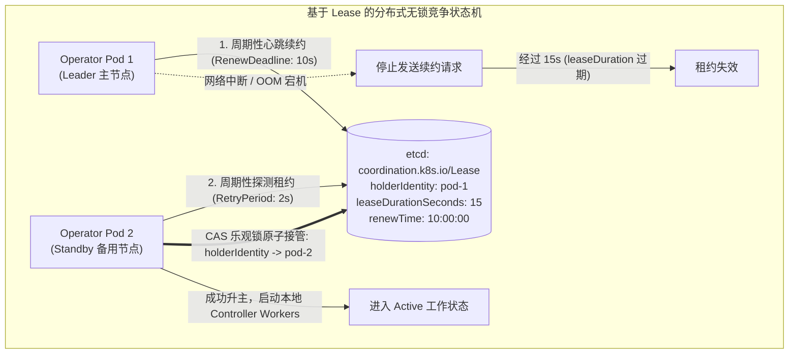
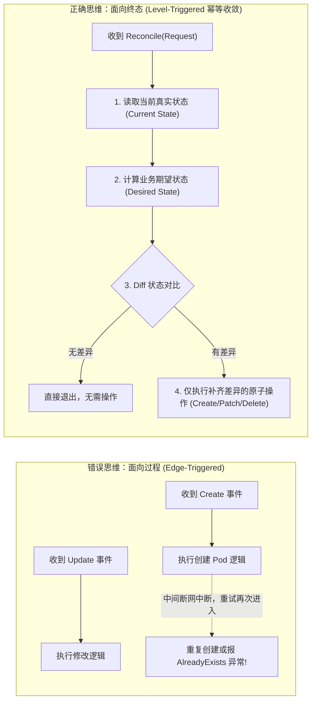
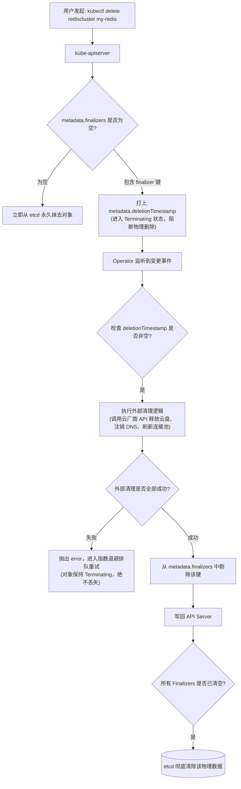

**TL;DR：** 编写能够“跑起来”的控制器只需要掌握 CRUD，但要编写能够在恶劣生产网络、节点突发宕机与频繁发布下“不坏数据、不漏资源、不脑裂”的工业级 Operator，必须攻克三座大山：**高可用多副本选主**、**协调循环的严格数学幂等性**、以及**利用 Finalizer 保证外部资源级联安全清理**。本文从底层源码切入，深度拆解 Kubernetes 现代 `coordination.k8s.io/v1 Lease` 的心跳租约竞争机制，阐释“基于状态（Level-Triggered）”设计哲学的幂等收敛心法，并剖析 Finalizer 在面对云厂商外部 API 故障时的自愈与死锁预防策略。

---

## 一、 分布式双机热备：基于 Lease 的无锁选主内核

在生产高可用集群中，Operator 绝不能以单副本（`replicas: 1`）裸奔，通常必须部署 2 到 3 个副本以应对节点滚动升级。然而，如果两个 Operator 副本同时对同一个 `Reconcile` 事件进行消费和写入，会产生致命的脑裂与状态冲突。

现代 Kubernetes 全面废弃了早期基于 ConfigMap / Endpoint 的粗放选主，转而采用专门的 **`coordination.k8s.io/v1 Lease` 资源**。



### 1.1 三大核心时间参数的数学约束

在 Controller-Runtime 中配置选主时，必须深刻理解这三个时间窗口的制约关系：

```go
mgr, err := ctrl.NewManager(cfg, ctrl.Options{
    LeaderElection:          true,
    LeaderElectionID:        "redis-operator-leader-lock",
    LeaseDuration:           ptr.To(15 * time.Second), // 租约绝对有效期
    RenewDeadline:           ptr.To(10 * time.Second), // Leader 刷新租约的超时上限
    RetryPeriod:             ptr.To(2 * time.Second),  // 候选者重试轮询间隔
})
```

- **`LeaseDuration`（默认 15s）**：Leader 宕机后，备用节点等待接管的最大盲区时间；
- **`RenewDeadline`（默认 10s）**：主节点在一次续约中，如果连续网络阻塞超过 10 秒，必须**主动放弃 Leader 资格并自我终止（Step Down）**，防止其在脑裂边缘继续下发危险写指令；
- **数学不等式铁律**：必须满足：
  $$\text{RetryPeriod} < \text{RenewDeadline} < \text{LeaseDuration}$$
  如果 `RenewDeadline` 过于接近 `LeaseDuration`，轻微的网络时延抖动就会引发主备节点频繁反复选主（Flapping）。

---

## 二、 协调循环（Reconciler）的黄金法则：面向终态的幂等性

分布式系统中最昂贵的教训，莫过于试图把 `Reconcile` 写成过程式的“状态机迁移脚本”。



### 2.1 幂等性设计的四大守则

1. **绝对不要假设前序操作已成功**：协调循环随时可能在任意一行代码后被 `OOMKilled` 或驱逐。当它再次苏醒并进入 `Reconcile` 时，必须能从半完成的残存状态中无缝自愈；
2. **读写分离与乐观并发控制（ResourceVersion）**：写操作永远伴随着可能发生的 `409 Conflict`。遇到冲突时，不应在本地循环自旋，而应直接将 `err` 抛给 WorkQueue，利用退避队列重新拉取最新全局快照；
3. **拥抱 Server-Side Apply（SSA）**：逐步替代全量 `client.Update()`。通过声明对象的字段管理权（Field Manager），实现只对特定字段进行原子 Patch，从协议层面杜绝不同控制器之间的字段覆盖打架；
4. **禁止在 Reconcile 内部维持无保护的内存状态**：所有的业务权威状态必须持久化在 K8s API 或外部数据库中。控制器内部的内存结构只能用作缓存，随时可以被清空重建。

---

## 三、 优雅下线防泄漏：Finalizer 的全生命周期机制

在 Kubernetes 中，当用户执行 `kubectl delete rediscluster my-redis` 时，默认情况下 API Server 会直接从 etcd 中抹去该记录，其下属的子资源可能随之被垃圾回收（GC）。

然而，**如果该自定义资源在云厂商申请了昂贵的云硬盘（EBS/云盘）、在 F5/云负载均衡器创建了公网 VIP、或者在 DNS 服务商注册了解析记录**，直接删除元数据会导致外部物理资源沦为永久游离的“孤儿资源”，持续产生账单扣费。

**Finalizer（终结器）** 是 Kubernetes 提供的资源删除阻断拦截器。



### 3.1 生产级 Finalizer 注册与清理代码范式

```go
const redisFinalizerName = "cache.example.com/finalizer"

func (r *RedisClusterReconciler) Reconcile(ctx context.Context, req ctrl.Request) (ctrl.Result, error) {
    var cluster cachev1alpha1.RedisCluster
    if err := r.Get(ctx, req.NamespacedName, &cluster); err != nil {
        return ctrl.Result{}, client.IgnoreNotFound(err)
    }

    // 第一阶段：检查对象是否正在被删除
    if cluster.ObjectMeta.DeletionTimestamp.IsZero() {
        // 对象尚未被删除，确保注册了专属 Finalizer
        if !controllerutil.ContainsFinalizer(&cluster, redisFinalizerName) {
            controllerutil.AddFinalizer(&cluster, redisFinalizerName)
            if err := r.Update(ctx, &cluster); err != nil {
                return ctrl.Result{}, err
            }
        }
    } else {
        // 第二阶段：对象已被标记删除 (进入 Terminating 流程)
        if controllerutil.ContainsFinalizer(&cluster, redisFinalizerName) {
            // 执行外部资源的异步幂等清理
            if err := r.cleanExternalResources(ctx, &cluster); err != nil {
                // 如果清理外部依赖失败，直接返回 error
                // 此时 Finalizer 依然存在，阻止对象被从 etcd 中抹去，保证有重试机会
                return ctrl.Result{}, fmt.Errorf("清理外部云资源失败: %w", err)
            }

            // 外部资源清理完毕，安全移除 Finalizer
            controllerutil.RemoveFinalizer(&cluster, redisFinalizerName)
            if err := r.Update(ctx, &cluster); err != nil {
                return ctrl.Result{}, err
            }
        }
        // 移除后直接返回，等待 API Server 完成物理清理
        return ctrl.Result{}, nil
    }

    // 第三阶段：常规的业务状态协调收敛
    return r.reconcileActiveCluster(ctx, &cluster)
}

func (r *RedisClusterReconciler) cleanExternalResources(ctx context.Context, c *cachev1alpha1.RedisCluster) error {
    // 幂等调用外部云 API：解绑弹性公网 IP、释放云原生存储块卷、下线监控报警规则
    return nil
}
```

### 3.2 极端场景防死锁策略：Finalizer 悬挂处理

在不可抗力的极端情况下（例如云厂商对应 API 永久下线、认证凭据已被注销），`cleanExternalResources` 可能会永久返回失败，导致该资源永远卡在 `Terminating` 状态无法删除，进而阻断 Namespace 的销毁。

生产级 Operator 应当提供**强制兜底注解（Force Delete Annotation）**机制：
- 当识别到对象被打上 `cache.example.com/force-delete: "true"` 注解时；
- 记录致命审计日志，跳过外部外部清理步骤，强行剥离 Finalizer，给予运维人员在极端灾难场景下的“最后一把钥匙”。

---

## 结论与演进思考

构建企业级高可靠 Operator 是一场对分布式容错细节的极限考验：
- **基于 Lease 的选主机制** 为系统锁定了唯一写权限，彻底规避脑裂风险；
- **面向终态的幂等协调设计** 赋予了系统面对任意软硬件中断时的自我愈合能力；
- **严谨的 Finalizer 状态机** 则彻底消除了外部物理资源的泄漏隐患。

至此，我们的 Operator 在单进程生命周期与逻辑健壮性上已经无可挑剔。

然而，当我们的集群从管理 10 个实例扩展到管理 **10 万个复杂自定义资源（CR）**时，底层的物理瓶颈将再次席卷而来：**默认 Client-Go 的内存占用会瞬间突破数十 GB，默认的 QPS 限制会导致 API 响应被严重限流，而未经调优的 Worker 协程池将成为系统吞吐的阿喀琉斯之踵**。

在下一篇（完结篇）中，我们将全力攻坚大规模性能优化，深度拆解 **高吞吐 Operator 性能调优与测试工程——Client-Go 限流规避、Filtered Cache 与 Fake Client 单元测试**。
