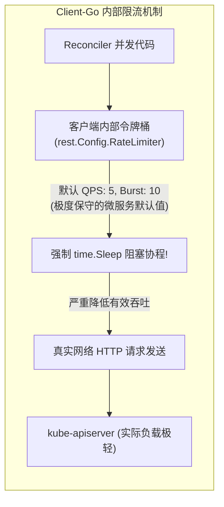
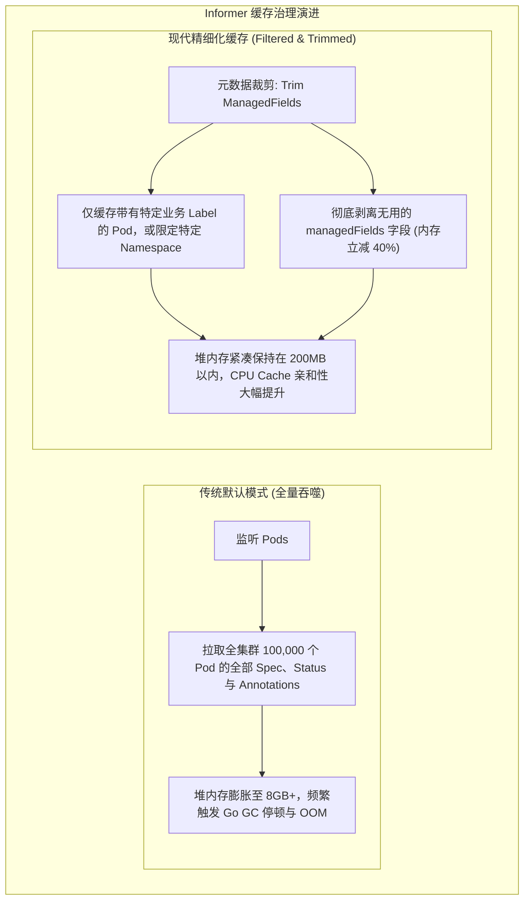
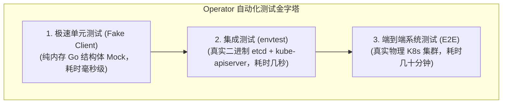
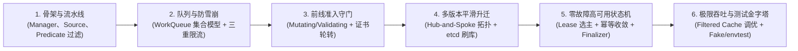

**TL;DR：** 绝大多数 Operator 在实验室或小规模集群中表现良好，但一旦推向生产纳管上万个节点或数十万个自定义资源（CR）时，往往会遭遇惨烈的性能滑铁卢：**日志中疯狂刷屏 `Waited X seconds due to client-side throttling` 导致事件处理严重滞后**；**默认的 Informer 缓存把集群全量 Pod 甚至 managedFields 全部塞入内存，导致 Operator 进程瞬间消耗数十 GB 内存并频繁 OOM**；**默认单 Worker 串行消费使队列积压数万个未处理任务**。本文直面超大规模场景下的性能极限，系统拆解 Client-Go 限流参数调优、Filtered Cache 内存裁剪与并发度压榨策略，并给出基于 `client/fake` 与 `envtest` 构建秒级确定性自动化测试金字塔的完整工程实践。

---

## 一、 隐形吞吐杀手：Client-Go 客户端限流陷阱

在大规模 Operator 排障中，最常见的诡异现象是：明明 `kube-apiserver` 的 CPU 只有 10%，网络带宽充足，但 Operator 的变更生效却要延迟数分钟甚至数十分钟。

翻开 Operator 的标准输出日志，通常会看到成千上万条警告：
```text
Waited 1.842784523s due to client-side throttling, not priority and fairness, request: GET:https://10.96.0.1:443/api/v1/namespaces/default/pods...
```



### 1.1 破除枷锁：调整 `rest.Config` 的吞吐底线

`client-go` 的设计极其保守，默认配置为 `QPS = 5, Burst = 10`。在复杂场景下一个 `Reconcile` 可能需要执行数次 `Get` 和 `Update`，这意味着默认情况下**该 Operator 每秒最多只能处理 1~2 个对象的协调！**

在大规模高吞吐 Operator 的入口处，必须主动覆写该限流配置：

```go
func main() {
    cfg := ctrl.GetConfigOrDie()

    // 核心调优：放宽客户端限流阈值
    // 将持续 QPS 提高至 100，突发上限拉高至 200 (根据集群规模与 APIServer 规格调整)
    cfg.QPS = 100.0
    cfg.Burst = 200

    mgr, err := ctrl.NewManager(cfg, ctrl.Options{...})
    // ...
}
```

---

## 二、 内存优化：Filtered Cache 与元数据裁剪

Controller-Runtime 的核心优势之一是读取全部走本地 Informer 缓存。但这种“便利”是一把双刃剑：**默认情况下，一旦你在 Controller 中写了 `Owns(&corev1.Pod{})`，Informer 会将全集群所有命名空间下的每一个 Pod 的完整 JSON 结构（包括庞大的环境变量、容器状态、以及臃肿的 `managedFields`）全部持久化常驻在 Operator 的堆内存中！**

在一个拥有 10,000 个 Pod 的中型集群中，单这一个 Pod Cache 就会吞噬超过 **2GB~4GB 的物理内存**。



### 2.1 生产级配置：`cache.Options.ByObject` 精确裁剪

通过在创建 `Manager` 时配置 `cache.Options`，实现只缓存该 Operator 真正关心的资源子集：

```go
mgr, err := ctrl.NewManager(cfg, ctrl.Options{
    Cache: cache.Options{
        // 方案 1：按命名空间隔离 (适用于单租户或多实例部署)
        DefaultNamespaces: map[string]cache.Config{
            "ai-workloads": {},
            "ai-operators": {},
        },
        // 方案 2：按资源类型与 Label 过滤缓存 (极度推荐)
        ByObject: map[client.Object]cache.ByObject{
            &corev1.Pod{}: {
                // 仅缓存带有 app.kubernetes.io/managed-by=redis-operator 标签的 Pod
                Label: labels.SelectorFromSet(labels.Set{
                    "app.kubernetes.io/managed-by": "redis-operator",
                }),
                // 方案 3：字段变换器（从本地内存彻底剥离臃肿无用的 managedFields）
                Transform: func(obj interface{}) (interface{}, error) {
                    if accessor, ok := obj.(metav1.ObjectMetaAccessor); ok {
                        accessor.GetObjectMeta().SetManagedFields(nil)
                    }
                    return obj, nil
                },
            },
        },
    },
})
```

这一行配置通常能让大规模生产集群中的 Operator 内存占用**断崖式骤降 80% 以上**。

---

## 三、 并发压榨：MaxConcurrentReconciles 协程池调优

默认情况下，`ctrl.NewControllerManagedBy(mgr).Complete(r)` 启动的 Controller 内部**仅有 1 个 Worker 协程！** 所有的协调任务是单线程排队执行的。

一旦某个 CR 的协调涉及较慢的外部 API 调用（如耗时 1 秒），队列积压便不可避免。

```go
func (r *RedisClusterReconciler) SetupWithManager(mgr ctrl.Manager) error {
    return ctrl.NewControllerManagedBy(mgr).
        For(&cachev1alpha1.RedisCluster{}).
        WithOptions(controller.Options{
            // 提升 Worker 协程池并发度至 16
            // 依靠 WorkQueue 的 dirty/processing 集合保证单对象绝对串行，多对象高度并发
            MaxConcurrentReconciles: 16,
        }).
        Complete(r)
}
```

- **调优基准**：`MaxConcurrentReconciles` 通常设置为 **CPU 核心数的 2~4 倍**（对于偏 I/O 密集型的 Operator），配合 `MaxOfRateLimiter`，使系统在吞吐量与 CPU 负载之间达到最佳平衡。

---

## 四、 工业级测试金字塔：从 Fake Client 到 envtest

在企业工程规范中，缺乏自动化测试的 Operator 代码是不被允许上线的。Kubernetes 社区形成了分层明确的测试金字塔：



### 4.1 第一层：基于 Fake Client 的毫秒级单元测试

`sigs.k8s.io/controller-runtime/pkg/client/fake` 提供了一个完全运行在内存中的 `client.Client` 实现，无需启动任何外部进程：

```go
func TestRedisReconciler_CreateMissingPod(t *testing.T) {
    // 1. 初始化包含自定义 API 与核心 Kubernetes 资源的 Scheme
    scheme := runtime.NewScheme()
    _ = corev1.AddToScheme(scheme)
    _ = cachev1alpha1.AddToScheme(scheme)

    // 2. 准备初始化假数据
    cluster := &cachev1alpha1.RedisCluster{
        ObjectMeta: metav1.ObjectMeta{
            Name:      "test-redis",
            Namespace: "default",
        },
        Spec: cachev1alpha1.RedisClusterSpec{
            Replicas: 3,
        },
    }

    // 3. 构建 Fake Client
    fakeClient := fake.NewClientBuilder().
        WithScheme(scheme).
        WithObjects(cluster).
        WithStatusSubresource(cluster). // 开启 Status 子资源模拟
        Build()

    reconciler := &RedisClusterReconciler{
        Client: fakeClient,
        Scheme: scheme,
    }

    // 4. 执行 Reconcile 并断言
    req := reconcile.Request{
        NamespacedName: types.NamespacedName{Name: "test-redis", Namespace: "default"},
    }
    res, err := reconciler.Reconcile(context.Background(), req)
    
    assert.NoError(t, err)
    assert.Equal(t, false, res.Requeue)

    // 5. 验证业务副效应：是否成功创建了关联的 Pod
    var podList corev1.PodList
    err = fakeClient.List(context.Background(), &podList, client.InNamespace("default"))
    assert.NoError(t, err)
    assert.Equal(t, 3, len(podList.Items), "应该成功补齐创建 3 个 Redis Pod")
}
```

### 4.2 第二层：基于 `envtest` 的控制面集成测试

Fake Client 虽然极速，但它不具备真实的 API Server 校验机制（如 OpenAPI 格式检查、字段默认值填充、真实乐观锁冲突与 UID 自动生成）。

`sigs.k8s.io/controller-runtime/pkg/envtest` 带来了革命性的测试体验：**它会在本地机器静默启动一个轻量级的原生 `etcd` 和 `kube-apiserver` 二进制进程，无需 Docker，无需 Kubelet**：

```go
var testEnv *envtest.Environment
var k8sClient client.Client

func TestMain(m *testing.M) {
    // 启动本地原生 API Server 进程
    testEnv = &envtest.Environment{
        CRDDirectoryPaths: []string{filepath.Join("..", "config", "crd", "bases")},
    }

    cfg, err := testEnv.Start()
    if err != nil {
        log.Fatal(err)
    }

    k8sClient, err = client.New(cfg, client.Options{Scheme: scheme})
    
    // 执行全套集成测试用例
    code := m.Run()

    // 测试完毕，干净销毁 API Server
    _ = testEnv.Stop()
    os.Exit(code)
}
```
通过 `envtest`，开发者可以在几秒钟内完成对 Webhook 拦截、CRD 模式校验与并发写入的真实行为验证，在本地 CI/CD 流水线中筑起 100% 确定性的质量防线。

---

## 五、 全系列总结与工程全景图谱

通过本系列的六篇深度剖析，我们完成了从微观队列算法到宏观高并发平台架构的系统性知识收敛：



| 模块分层 | 核心技术方案 | 攻克的生产核心痛点 |
| :--- | :--- | :--- |
| **事件接入层** | **Predicate + Filtered Informer** | 过滤 90% 无效更新事件，内存占用断崖式下降 80% |
| **队列限流层** | **WorkQueue + MaxOfRateLimiter** | 消除单对象并发写冲突，动态自适应退避防雪崩 |
| **准入防御层** | **Admission Webhook + cert-manager** | 阻断错误配置持久化入库，全自动 mTLS 证书闭环 |
| **数据演进层** | **Conversion Webhooks + Hub-Spoke** | 多版本向后兼容无损往返，零停机 etcd 存储无缝迁移 |
| **容灾协调层** | **Lease 选主 + Finalizer 优雅下线** | 彻底规避双主脑裂，杜绝外部云盘/VIP/DNS 泄漏 |
| **质量防护层** | **Fake Client + envtest 测试矩阵** | 秒级完成 100% 代码逻辑与真实 API Server 行为验证 |

---

## 结论与全系列终篇寄语

构建 Kubernetes Operator 是每一位资深云原生与系统架构工程师的必修内功。它不仅是一种代码编写技术，更是**将人类架构师复杂的运维经验、故障自愈逻辑与业务不变量，凝结为永不疲倦、秒级响应的软件控制论实体**。

唯有彻底洞悉 `controller-runtime` 的底层设计精髓，敬畏高并发下的每一把锁与每一个时间窗口，我们才能在万级节点、海量有状态服务的云原生星辰大海中，驾驭起稳定、高效、自愈的企业级云原生控制中枢。
