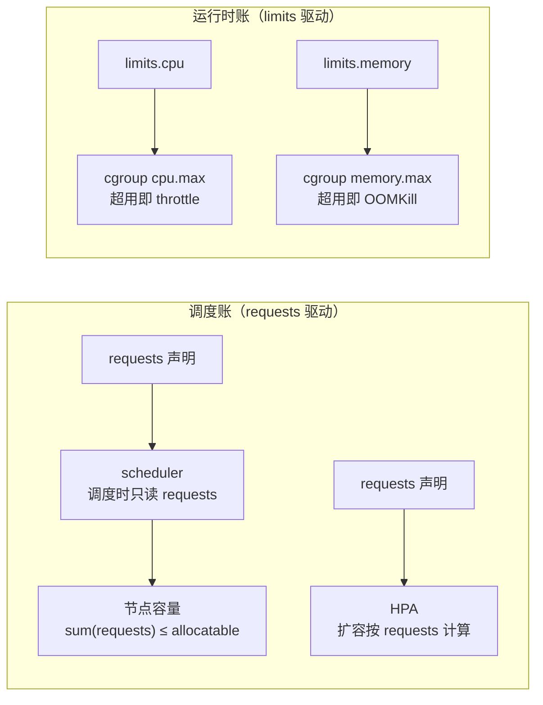

**TL;DR：** Kubernetes 的资源管理不是一份天真的预算，而是**两本账**：`requests` 是**调度账**（决定 Pod 往哪台机器放、HPA 按它扩容），`limits` 是**运行时账**（决定内核 cgroup 的配额）。调度器读 requests，内核读 limits，两者由不同组件在完全不同的时间点生效。**CPU 超限不可怕——被限速（throttle）；内存超限不可逆——被杀死（OOMKill）**：cgroup v2 里 `memory.max` 超了即杀，`memory.high` 是软压顶，差别就在"是否立刻丢进程"。所以：延迟敏感的服务**不要设 CPU limit**（宁可让它跑满也不要 throttle 抖 p99），内存一定要设 limit 防拖爆节点，同时用 QoS 三档搞清楚"OOM 时谁先死"。

## 一、事故现场：两张互相矛盾的监控截图

值班屏幕上同时挂着两张图：

- 图一：某服务的 CPU 实际用量长时间是"声称需要量"的 2 倍以上，Pod 却频繁出现 `CPU Throttling`，P99 延迟带规律的尖峰；
- 图二：另一个服务实际内存离 limit 还差 30%，却在半夜被 `OOMKilled`，重启循环。

运维凭直觉给图一加了 `limits.cpu`，给图二调大了 `limits.memory`，结果：图一的抖动更频繁了（limits 越小 throttle 越狠），图二照杀不误（limit 调大只是推迟了被杀的时刻，没改变它为什么死）。两种修法的方向全错。

这两张图问的是同一个问题：**requests 与 limits 到底各管哪一段？**一句话答案：**requests 管"能不能塞进集群"，limits 管"运行时能多狠"**——一个跟调度器打交道，一个跟内核打交道，两本账各记各的。

## 二、Requests 与 Limits：调度账 vs 运行时账

拿一段 YAML 说事：

```yaml
resources:
  requests:
    cpu: "500m"
    memory: "512Mi"
  limits:
    cpu: "1"
    memory: "1Gi"
```

- `requests.cpu: 500m` = 0.5 核。调度器把 Pod 放到一台**剩余可调度量 ≥ 0.5 核**的节点上。关键在措辞：是"剩余可调度量"，不是"实际空闲"。Kubernetes 的调度器只认"你承诺了要这么多"的数字，不跑去看这台节点此刻 CPU 用了多少——资源账是按声明的承诺总量（requests）结算的，不是按实测用量。
- `limits.cpu: 1` 走的是另一条路径：kubelet 把它换算成 cgroup v2 的 `cpu.max`（旧内核是 v1 的 `cpu.cfs_quota_us`），从此内核按这段配额强制执行 CPU 时间。



两本账没有一个是"实际用量"：调度器不懂现场，内核不知道"申请"这个词。于是 requests 设得大、limits 设得小全节点"看起来"还剩很多容量、但别人的 Pod 排不进来、自己的 Pod 一直 throttle 的怪事，就同时成立了。

## 三、CPU：超限是被限速，不是被杀死

内核给每个 cgroup 规定一个**结算周期内的额度（quota）**。CFS 默认周期 100ms，cgroup v2 里 `cpu.max` 写作 `quota period`（单位微秒）：`limits.cpu: 1` 就是 `100000 100000`（每 100ms 最多 100ms CPU），`500m` 是 `50000 100000`。一个周期里 CPU 时间用完，内核就把这个 cgroup 里所有任务**暂停到周期结束（CPU throttling）**，暂停期间 CPU 占有率为零；cgroup v2 的 `cpu.max.burst` 可以借上一周期的余额，默认是 0。

```text
# 一个容器的 cgroup v2 状态，limits.cpu=500m
$ cat /sys/fs/cgroup/<path>/cpu.max
50000 100000

# 限速统计就长这样
$ cat /sys/fs/cgroup/<path>/cpu.stat
usage_usec    33941210
nr_periods    425
nr_throttled   17          # 有多少个周期被限速
throttled_usec 30241      # 累计被限速的总时长
```

被 throttle 不是被杀，是**挂起 100ms 内的剩余时间再继续**。对 CPU 密集批任务，这是"限速"，无害；对**延迟敏感服务**（网关、API、数据库连接池的代理层），一次周期内的挂起就是一次 p99 尖峰，完全可感知。这就是图一的真相：limit=1 而服务要跑 2 核时，它每秒钟都在被"判死刑再缓刑"，尾部延迟被稳定地抬高。

**结论先行：延迟敏感服务不要设 CPU limit。** 不设时，内核按容器权重（share）在节点压力下竞争 CPU，有闲就放开跑；设了之后，哪怕节点空闲、你的容器也只能翻译 a 按时定量，宁可配额空余也要按时掐断。CFS 的世界里，`requests` 决定"竞争权重"，`limits` 决定"硬封顶"——对更重要是稳定延迟的服务，软性权重比硬封顶更正确。

## 四、内存：只有二进制——超限即杀死

CPU 和内存的本质区别：**CPU 是可压缩资源**（超限暂停即可），**内存不可压缩**（超了没地方放，只能杀进程回收）。cgroup v2 给内存两个字段：

```text
memory.max    # 硬上限：超了就 OOM Kill
memory.high   # 软阈值：超了启动回收压力，先不杀
memory.swap.max
```

`memory.max` **一超即杀**：内核按 cgroup 记的内存用量（RSS + 页缓存）超过这个值，先尝试回收，回收不动就走 OOM 流程。`memory.high` 是"软压"：超过后内核开始加速回收（刺激 kswapd 类回收），但不立刻杀；如果"高压"一直持续、回收上不来，还是会跌落到 `.max` 那格被杀。

**"用量"比你想的大**：容器内存 = RSS + page cache。`kubectl top` 显示的是测度（RSS），不含 file cache。最常见的坑就是这场 OOM：limit 里明明还有 30% 余量，但文件读的 page cache 占了所有闲余，`memory.max` 判它超限。**解法是提高 `memory.high` 让它定期把 cache 回收**，而不是把 `.max` 调到接近节点总内存去害别人。cgroup v2 的 `memory.events` 里 `throttle` 计数就是"被软压回收过"的证据。

OOM 顺序由 **QoS 档位**决定，不是随机抽签：

| QoS 档位 | 判定（按 Pod 中所有容器） | 内核 oom_score_adj | OOM 时 |
| :--- | :--- | :--- | :--- |
| Guaranteed | 每个容器的 requests == limits | -997 | 最不容易被杀，内核优先杀其它档 |
| Burstable | 至少一个容器 requests < limits | 0 .. 997 | 被 Guaranteed 让路，排在其后 |
| BestEffort | 一个资源也没声明 | 1000 | 第一个被杀候选 |

这就是"同一节点放一个 MySQL 的 Guaranteed 和一个打满内存的 BestEffort，先死的一定是后者"的原因。**被杀的顺序是内核按这张表排的，不是随机的。**

## 五、账本与决策表：什么场景该用哪个

| 场景 | 建议 | 为什么 |
| :--- | :--- | :--- |
| 延迟敏感的网关 / API / DB 代理 | **不设 CPU limits**，内存照设 | throttle 牺牲尾部延迟，比不过让 CFS 竞争；内存必须封顶防拖爆节点 |
| 批处理 / 计算任务 | 设 CPU limits | 算得清上一步总耗时，小抖动无感 |
| 任意服务的内存 | **必须设 limits**，按 RSS+page cache 合计 | 不设会把节点吃爆，拖累同节点所有 Pod |
| Java / JIT 型应用 | 注意 cgroup 感知（Linux 上 JVM 会读 cgroup 限） | 内存实际占用 > limit 即 OOM 重启，成本高 |
| 按 HPA 扩容 | 默认按 requests | HPA 只看 requests 不看实际用量 |

**反向直觉最值钱的一句**：HPA 按 **requests** 扩容、不按实际用量——所以 `requests` 设得虚高时（应用其实只用 1 核，你报 2 核），HPA 会过度激进扩容，副本数虚增，越扩越"不够"。**低 request + 高用量 → 扩容激进**；**高 request + 低用量 → 资源净闲置**。request 是声明不是预留，不看现场。这正两本账的最后一笔。

## 结论：requests 决定调度，limits 决定运行时代价

requests 与 limits 是两本账：requests 管调度、limits 管运行时，调度器不认实际用量，内核不认"申请"承诺。**CPU 超限 = 限速（可推理），内存超限 = 杀死（不可修复）**。要算清自己的账，先答三问：业务的尾延迟受不受 throttle 影响？内存在 RSS 之外有没有游离的缓存？我的 QoS 档位是牺牲者还是被保的？把这三个答案写进资源配置，就能把"设了却还被打爆""没超却被 OOM"两种事故一起挡在门外。

**下一步可动手（30 分钟，k3s / kind 即可验证）：** 给一个容器设 `requests=200m/limits=200m`，用 `stress-ng` 压 CPU，观察 cgroup 的 `nr_throttled` 上升、Pod 存活但 CPU 被限；再开另一个容器只留小 `memory.high`，往它肚子里灌内存，盯 `memory.events` 里的 `oom_kill` 技术 + Pod 重启循环。把 `kubectl top pod`、cgroup 与节点 free 三个口径并排，两本账的样子就自己浮出来了。

## 参考资料

1. Kubernetes 官方文档 *Resource Management for Pods and Containers*（requests/limits 语义与 QoS 分档）—— https://kubernetes.io/docs/concepts/configuration/manage-resources-containers/
2. Kubernetes 官方文档 *Task: Assign Memory Resources* / *Assign CPU Resources*（示例）—— https://kubernetes.io/docs/tasks/configure-pod-container/
3. 内核文档 *cgroup v2*（cpu.max、memory.max/high、memory.events）—— https://docs.kernel.org/admin-guide/cgroup-v2.html
4. 内核文档 *CFS Bandwidth Control*（quota/period、throttle 语义）—— https://docs.kernel.org/scheduler/sched-bwc.html

> 延伸阅读：redis 的"写放大"与 CPU throttle 是同一家族的账，见[把 Redis 当消息队列的三笔账](/writing/redis-as-mq-consume-groups)；同一批 cgroup 约束也管着"下线"那段流程，见[Kubernetes 里优雅下线为什么特别难](/writing/kubernetes-graceful-termination)；在计算资源账单旁边，还有一笔[两阶段提交与 Saga/Outbox 的选择](/writing/distributed-transactions-2pc-saga)。
