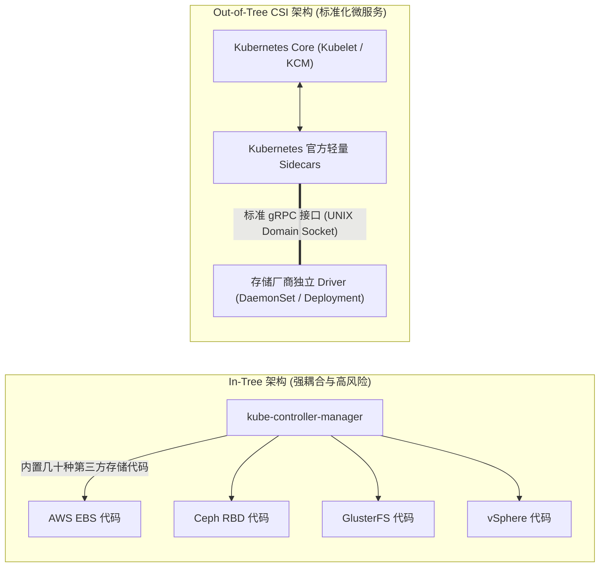
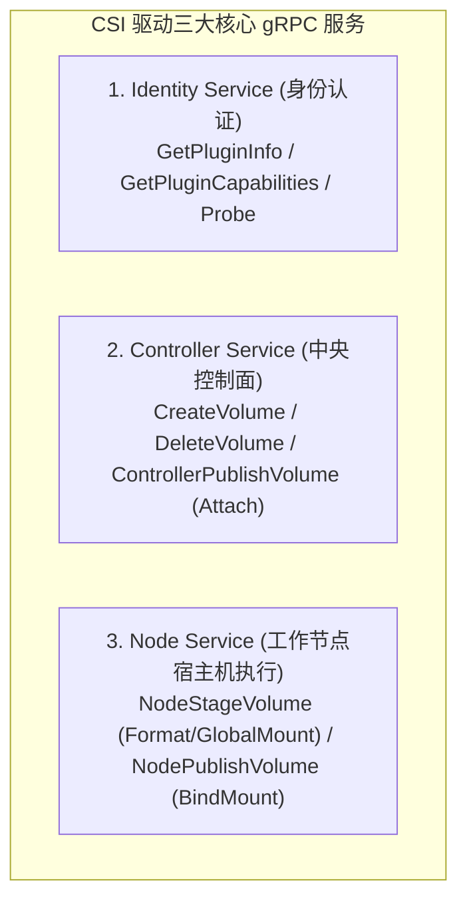
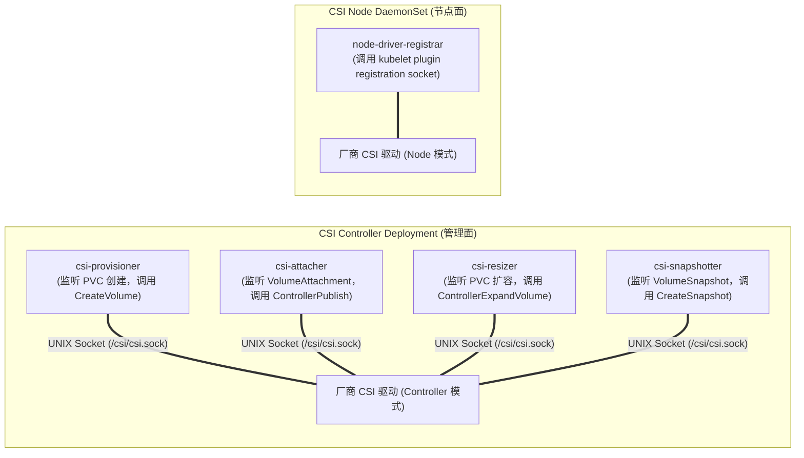
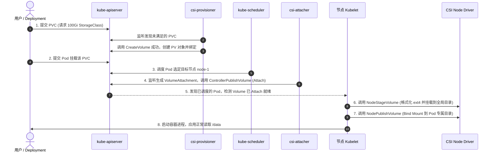

**TL;DR：** 在早期的 Kubernetes 版本中，所有存储卷代码（如 AWS EBS、Ceph RBD、GlusterFS、NFS）全部硬编码在 `kube-controller-manager` 与 `kubelet` 的核心二进制中。任何第三方存储厂商的一个 Bug 或代码更新，都必须等待 Kubernetes 发版合并，且极易引发核心控制面崩溃。**CSI（Container Storage Interface，容器存储接口）** 的诞生彻底将存储厂商与 Kubernetes 核心解耦。本文深入剖析 CSI 规范的底层通信架构，拆解由 **Identity**、**Controller** 与 **Node** 三大服务构成的 gRPC 契约矩阵，全景解构由 `csi-provisioner`、`csi-attacher` 等官方 Sidecar 与 Kubelet 协同驱动的**存储卷七步状态机流转**。

---

## 一、 存储解耦的必由之路：In-Tree 的黄昏与 Out-of-Tree CSI

在 Kubernetes 1.13 CSI 正式 GA 之前，存储插件被称为 **In-Tree 插件**：

In-Tree 模式的四大历史缺陷：
1. **安全与权限膨胀**：存储插件运行在 `kube-controller-manager` 内部，享有全集群的最高权限，第三方代码的内存越界或死循环直接导致核心控制面挂起；
2. **发布周期被绑死**：厂商想要修复一个存储小版本 Bug，必须等待 Kubernetes 季度大版本发布（从 PR 提交到企业实际升级往往耗时半年以上）；
3. **特权容器隔离断裂**：存储操作（如 `mkfs.ext4`、`mount`）必须在宿主机执行，In-Tree 插件使得构建轻量化容器操作系统几乎不可能；
4. **跨容器编排割裂**：Mesos、Nomad、Docker Swarm 无法复用存储驱动。

CSI 规范的出现，确立了**基于 UNIX Domain Socket 的标准化 gRPC 协议**，使存储驱动完全变成了可独立发布、独立更新的普通 Kubernetes 应用。

---

## 二、 CSI 核心契约：三大 gRPC 服务矩阵

一个符合 CSI 规范的存储驱动（CSI Plugin），必须在其 UNIX Domain Socket 上根据角色实现以下三组 gRPC 接口定义：

### 2.1 Identity Service（身份与探活）
- `GetPluginInfo`：上报存储插件的唯一标识（如 `ebs.csi.aws.com`）与语义化版本号；
- `GetPluginCapabilities`：上报本驱动支持的高级能力矩阵（是否支持在线扩容、是否支持快照、是否支持多节点并发挂载等）；
- `Probe`：Kubelet 与 Sidecar 用于检测驱动健康状态的探针接口。

### 2.2 Controller Service（集群级宏观资源调度）
通常运行在多副本 Deployment 中（参与选主）：
- `CreateVolume`：调用底层物理存储控制面（如 AWS API 或 Ceph 存储池），在底层创建指定大小（如 100Gi）的裸物理逻辑卷；
- `DeleteVolume`：物理销毁存储卷；
- `ControllerPublishVolume`（对应 Kubernetes 术语 **Attach**）：将底层物理卷“连接/挂载”到特定的虚拟机/物理机节点（例如调用云厂商 API 将一块云盘挂到指定 EC2 实例的 PCIe 插槽上）；
- `ControllerUnpublishVolume`（对应 **Detach**）：断开卷与宿主机实例的物理附着。

### 2.3 Node Service（节点级微观文件系统操作）
作为 DaemonSet 部署在每个工作节点上，必须具备特权（`privileged: true`）直接操作宿主机挂载点：
- `NodeStageVolume`：对已物理附着到本机的裸设备（如 `/dev/nvme1n1`）执行格式化（`mkfs.ext4`），并挂载到节点的**全局中间目录**（Global Directory）；
- `NodePublishVolume`：将全局中间目录通过 `mount --bind`，二次挂载到特定 Pod 的私有沙箱目录中（`/var/lib/kubelet/pods/<pod-uid>/volumes/...`）；
- `NodeUnpublishVolume` / `NodeUnstageVolume`：逆向解绑与卸载。

---

## 三、 Kubernetes 官方 Sidecar 控制器矩阵

开发者无需自己监听 Kubernetes 的 PVC 和 PV 状态。Kubernetes 存储 SIG 官方提供了多个轻量级的 **Sidecar 辅助容器**，与厂商自定义的 CSI 驱动共同打包在一个 Pod 中：

- **`csi-provisioner`**：监听集群中处于 `Pending` 状态的 PVC，调用 CSI 驱动的 `CreateVolume`，成功后在集群中自动创建出对应的 `PersistentVolume（PV）` 并完成绑定；
- **`csi-attacher`**：监听 `VolumeAttachment` CRD，调用 CSI 驱动的 `ControllerPublishVolume` 将云盘 Attach 到物理节点；
- **`node-driver-registrar`**：在工作节点启动时，通过与 Kubelet 的 Plugin Registration Socket 握手，将该节点的 CSI UNIX Domain Socket 路径安全上报给 Kubelet。

---

## 四、 存储卷全生命周期状态机：从 PVC 到挂载全流程

当用户定义了一个挂载了 PVC 的 Pod 时，系统底层完成了严格的**七步状态转移闭环**：

### 4.1 核心步骤技术内幕

1. **动态供给（Dynamic Provisioning）**：`csi-provisioner` 拦截 PVC，解析 `StorageClass` 中的参数（如磁盘类型 `gp3`、IOPS 预留），调用云厂商 API 创建底层磁盘；
2. **挂载准备（Attach）**：在 Kubelet 开始拉取镜像前，`csi-attacher` 必须确保物理云盘在云控制面已经成功插在目标主机节点的 PCI 控制器上；
3. **全局格式化（NodeStage）**：同一个物理卷可能被多个 Pod 共享（如果驱动支持），Kubelet 先将其挂载到一个宿主机公共临时路径（如 `/var/lib/kubelet/plugins/kubernetes.io/csi/...`）。在此阶段执行文件系统格式化检查（`blkid`），若无文件系统则执行安全格式化；
4. **沙箱绑定（NodePublish）**：使用 Linux VFS 的 `mount --bind` 技术，将该公共目录投射进入容器在宿主机上的只读/读写挂载树内，容器最终通过 `rootfs` 访问到真正的物理持久卷。

---

## 结论与演进思考

CSI 规范是云原生架构最具代表性的成功解耦案例之一：
- **微服务化设计**：将复杂的存储接口抽象为高内聚的 gRPC 契约；
- **Sidecar 矩阵**：将 Kubernetes API 监听、Leader 选主与错误重试逻辑完全封装，存储厂商只需关注底层硬件 API 的映射；
- **状态机闭环**：从 Provision 到 Mount 的七步原子流程，赋予了有状态应用极高的系统可见性与排障确定性。

然而，在公有云与多可用区（Multi-AZ）生产环境中，这套机制立刻遭遇了一个致命的经典冲突：**如果 PVC 在创建时就立即申请了可用区 A 的存储卷，而调度器随后却把 Pod 调度到了可用区 B（因为可用区 A 的 GPU 或 CPU 算力已耗尽），这个 Pod 将陷入永久的 `VolumeNodeAffinityConflict` 死锁**。

在下一篇文章中，我们将直面这个跨可用区多地容灾的核心痛点，深度拆解 **拓扑感知卷调度（Topology-Aware Volume Scheduling）——延迟绑定 `WaitForFirstConsumer` 与跨 AZ 故障域决策**。
