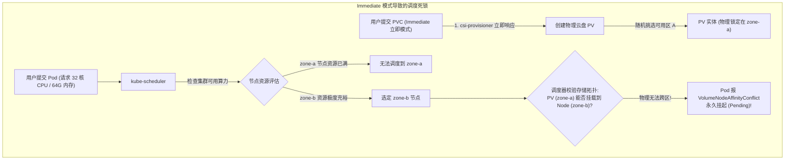
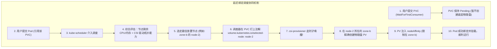
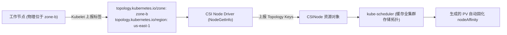

**TL;DR：** 在跨多个可用区（Multi-AZ）构建 Kubernetes 生产集群时，有状态应用开发者遭遇最多的报错莫过于 `VolumeNodeAffinityConflict`：Pod 永远处于 `Pending` 状态，提示存储卷所在的可用区与 Pod 能调度的节点产生互斥。这一悲剧的根源在于默认 `StorageClass` 采用了粗放的 `volumeBindingMode: Immediate`。本文深度剖析分布式存储在公有云机房网络拓扑下的**物理局限性（单块云盘/EBS 无法跨可用区挂载）**，详解 Kubernetes 调度器如何通过 **`WaitForFirstConsumer`（延迟绑定）** 联合计算与存储约束，剖析 CSI 拓扑标签的动态传递机制，并给出兼顾跨机房高可用与局部亲和性的 StatefulSet 最佳部署拓扑。

---

## 一、 经典生产惨案：`Immediate` 绑定导致的“跨区孤立卷”

在公有云物理基础设施中，一块分布式块存储（如 AWS EBS、阿里云 ESSD、腾讯云 CBS）通常在物理上**仅存在于特定的某一个可用区（Availability Zone, AZ）**内。云厂商的底层存储网络不支持将可用区 A 的一块 EBS 卷直接挂载给位于可用区 B 的虚拟机。



### 1.1 产生死锁的时序本质

为什么会发生上述灾难？核心在于**计算调度与存储供应的时间解耦与信息孤岛**：
1. **PVC 抢跑**：在 `volumeBindingMode: Immediate` 下，一旦 PVC 被创建，`csi-provisioner` 在完全不知道哪个 Pod 将要使用它的情况下，就闭着眼睛在云端创建了物理盘；
2. **算力受阻**：随后 Pod 被创建。由于算力资源紧张（或者 Pod 配置了特定的节点亲和性），Pod 必须调度到另一个可用区；
3. **永久死锁**：Pod 无法去 zone-a（没资源），磁盘无法去 zone-b（物理限制），导致整个有状态应用永久挂死。

---

## 二、 破局之道：`WaitForFirstConsumer` 延迟绑定架构

为了打破这一死锁，Kubernetes 在 StorageClass 中引入了革命性的 **`volumeBindingMode: WaitForFirstConsumer`（延迟绑定模式）**。



### 2.1 调度器的两阶段决策（Two-Phase Scheduling）

在延迟绑定模式下，控制权彻底反转：
1. **阶段一（Pod 驱动）**：PVC 提交后，`csi-provisioner` 按兵不动；
2. **阶段二（联合求解）**：`kube-scheduler` 的存储插件（`VolumeBinding` Plugin）全面介入 Pod 调度：
   - 过滤出既满足 CPU/Memory 请求，又在 StorageClass 允许的拓扑范围内（`allowedTopologies`）的候选节点；
   - 一旦锁定目标节点（如 `node-2`），调度器直接在 PVC 的注解中写入 `selected-node: node-2`；
   - `csi-provisioner` 读取该注解，提取目标节点的拓扑标签（如 `topology.kubernetes.io/zone=zone-b`），**靶向调用底层云 API 在特定机房精准创盘**。

---

## 三、 CSI 拓扑信息的底层传递：从 Node Label 到 PV nodeAffinity

CSI 插件与调度器之间是如何感知底层硬件机房位置的？这依赖一套标准化的拓扑标签传递链：



### 3.1 自动注入的 PV `nodeAffinity`

当 `csi-provisioner` 根据调度器决策创建出 PV 时，它会在 PV 的 spec 中**永久固化其物理归属**：

```yaml
apiVersion: v1
kind: PersistentVolume
metadata:
  name: pvc-12345678-ebs-volume
spec:
  capacity:
    storage: 100Gi
  accessModes:
    - ReadWriteOnce
  csi:
    driver: ebs.csi.aws.com
    volumeHandle: vol-0987654321fedcba
  # 关键点：物理拓扑亲和性硬约束
  nodeAffinity:
    required:
      nodeSelectorTerms:
        - matchExpressions:
            - key: topology.ebs.csi.aws.com/zone
              operator: In
              values:
                - us-east-1b
```

此后，无论该 Pod 经历多少次重启或漂移，`kube-scheduler` 在评估该 PV 时，都会由于这个 `nodeAffinity` 的存在，**确保 Pod 绝不会被调度到除 `us-east-1b` 以外的任何节点**。

---

## 四、 跨多可用区有状态系统的容灾架构实践

在构建诸如 ZooKeeper、Kafka、Elasticsearch、PostgreSQL 等三节点高可用集群时，我们既希望**每个副本落在不同的可用区（跨区容灾）**，又要求**每个副本各自独占其所在可用区的本地存储**。

### 4.1 生产级 StorageClass 配置：拓扑白名单约束

通过 `allowedTopologies` 限制该存储池只在特定的几个核心可用区供应，排除没有部署存储网关的老旧机房：

```yaml
apiVersion: storage.k8s.io/v1
kind: StorageClass
metadata:
  name: topology-aware-gp3
provisioner: ebs.csi.aws.com
volumeBindingMode: WaitForFirstConsumer # 强制启用延迟绑定
allowVolumeExpansion: true
parameters:
  type: gp3
  iops: "3000"
  throughput: "125"
# 限制物理供给的故障域白名单
allowedTopologies:
  - matchLabelExpressions:
      - key: topology.ebs.csi.aws.com/zone
        values:
          - us-east-1a
          - us-east-1b
          - us-east-1c
```

### 4.2 生产级 StatefulSet：反亲和与存储卷模板协同

通过结合 `podAntiAffinity` 与 `volumeClaimTemplates`，实现**三节点在三个可用区的完美均匀散列**：

```yaml
apiVersion: apps/v1
kind: StatefulSet
metadata:
  name: zookeeper-cluster
  namespace: stateful-apps
spec:
  serviceName: "zk-hs"
  replicas: 3
  selector:
    matchLabels:
      app: zookeeper
  template:
    metadata:
      labels:
        app: zookeeper
    spec:
      affinity:
        # 强制每个 Pod 互斥在不同的可用区
        podAntiAffinity:
          requiredDuringSchedulingIgnoredDuringExecution:
            - labelSelector:
                matchExpressions:
                  - key: app
                    operator: In
                    values: ["zookeeper"]
              topologyKey: "topology.kubernetes.io/zone"
      containers:
        - name: zookeeper
          image: zookeeper:3.9
          volumeMounts:
            - name: zk-data
              mountPath: /data
  # 动态生成每个副本独享的 PVC
  volumeClaimTemplates:
    - metadata:
        name: zk-data
      spec:
        accessModes: ["ReadWriteOnce"]
        storageClassName: "topology-aware-gp3"
        resources:
          requests:
            storage: 50Gi
```

运行结果分析：
1. `zk-0` 被调度到可用区 A，其 PVC 立即在可用区 A 动态生成专属 PV；
2. `zk-1` 由于反亲和性被推向可用区 B，其 PVC 在可用区 B 动态生成专属 PV；
3. `zk-2` 落在可用区 C，生成可用区 C 的 PV。
4. **计算与存储拓扑完全对齐，彻底消灭了跨可用区冲突，达成了真正的企业级多机房高可用。**

---

## 结论与演进思考

拓扑感知卷调度是云原生存储走向成熟的分水岭：
- **`Immediate`** 代表了早期的粗放模型，只适合单机房单节点的简单实验环境；
- **`WaitForFirstConsumer`** 将存储纳入了 Kubernetes 全局调度的多维约束求解矩阵中，通过**以算力定存储**的逆向延迟决策，优雅化解了物理硬件与云端网络的割裂。

然而，在公有云上依赖单一厂商的闭源云盘（如 EBS/云硬盘），企业不仅要面临昂贵的跨区流量账单，还会受限于单盘挂载数量上限。在自建机房或混合多云环境中，**如何用纯开源的软件定义存储在裸金属服务器上构建高性能分布式存储池？**

在下一篇文章中，我们将视角转向目前云原生生态最主流的分布式软件定义存储体系，深度拆解 **Rook-Ceph 云原生分布式存储内核——CRUSH 算法、BlueStore 引擎与 CRD 控制循环实战**。
