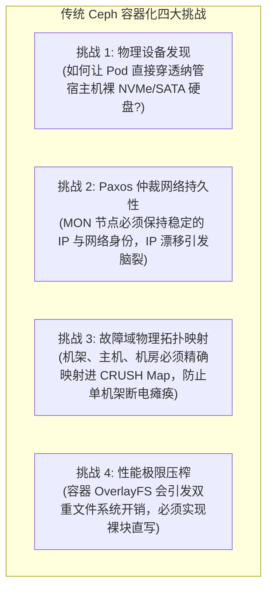
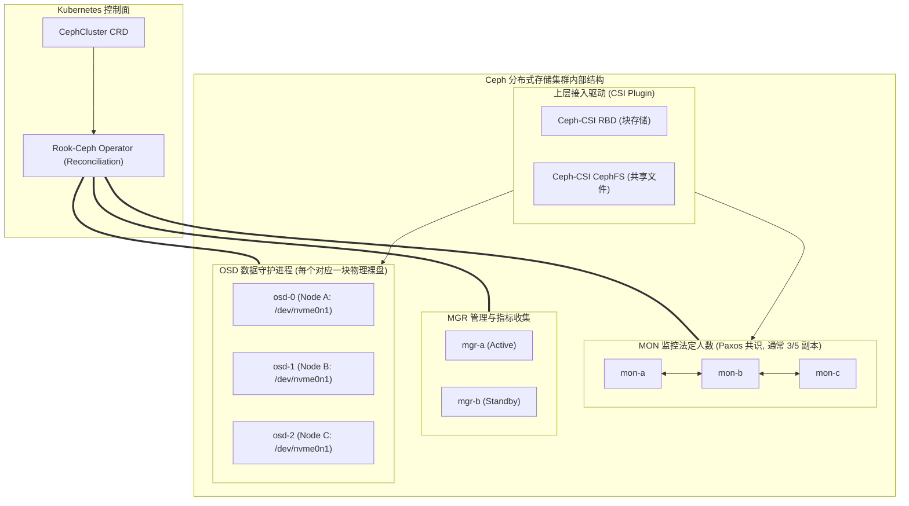
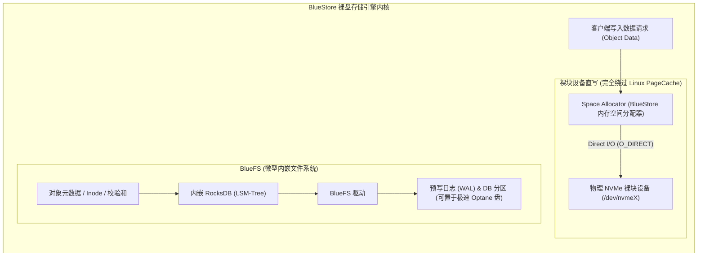
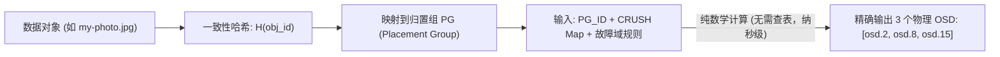

**TL;DR：** 在自建机房、私有云或避免公有云厂商锁定的场景下，运行在 Kubernetes 上的软件定义存储（SDS）是必经之路。而在开源分布式存储领域，**Ceph** 凭借其统一的块（RBD）、文件（CephFS）与对象（RGW）接口占据了统治地位。然而，传统 Ceph 的运维极度复杂，涉及大量的网络配置、密钥分发、OSD 故障自愈与权重调优。**Rook** 作为 CNCF 毕业的云原生存储编排 Operator，成功将 Ceph 的全套生命周期转换为声明式 CRD。本文深入剖析 Rook-Ceph 的核心架构，拆解其 MON 仲裁、OSD 容器化编排流程，深入 BlueStore 存储引擎的裸盘无锁写入链路，并系统解析无中心寻址的 **CRUSH 算法**。

---

## 一、 为什么将 Ceph “Kubernetes 容器化”如此艰难？

传统无状态微服务容器化只需要打个 Docker 镜像、写个 Deployment。但 Ceph 是一个高度底层的分布式系统，将其搬上 Kubernetes 面临四大天堑：



**Rook** 的核心价值，正是作为 **Ceph 的专家级数字孪生 Operator**，自动将 Kubernetes 的节点、标签、PV 与 Ceph 的底层物理抽象进行无缝对齐。

---

## 二、 Rook-Ceph 控制面架构与守护进程矩阵

在 Kubernetes 中部署 Rook-Ceph 后，系统由 Operator 控制循环统一编排四类核心守护进程：



### 2.1 各核心组件权责

- **MON（Monitor）**：集群的“真理之源”。维护全局的 Cluster Map（包括 MonMap、OSDMap、PGMap、CRUSH Map）。基于 **Paxos 强一致性共识算法**运行，通常部署 3 或 5 个奇数副本，负责在节点宕机时进行仲裁并推进集群状态；
- **MGR（Manager）**：负责集群指标暴露（Prometheus Metrics）、仪表盘（Dashboard）管理、自动均衡（Balancer）与模块化插件扩展；
- **OSD（Object Storage Daemon）**：真正存放物理数据的底层守护进程。**一块物理 SSD/NVMe 硬盘对应一个独立的 OSD 进程**。OSD 之间通过双向心跳监控彼此健康，并在后台自动执行数据复制（Replication）、重平衡（Rebalance）与坏盘擦除编码恢复（Erasure Coding Recovery）。

---

## 三、 突破 Linux 文件系统瓶颈：BlueStore 存储引擎内核

在早期 Ceph（FileStore 时代），OSD 是建立在普通 Linux 本地文件系统（如 XFS）之上的。这意味着一个客户端写操作必须经历：
`Ceph 写入 -> XFS Journal 写入 -> XFS PageCache -> 底层磁盘`。
这引发了灾难性的**写放大（Write Amplification）**与双重日志开销。

现代 Ceph（也是 Rook 强制推行的标准）全面采用了 **BlueStore 引擎**：



### 3.1 BlueStore 的三大核心设计原则

1. **彻底告别本地文件系统（Bypassing VFS & PageCache）**：
   BlueStore 直接使用 `O_DIRECT` 标志打开底层块设备，**自行管理裸盘上的扇区与块空间分配**，完全消除了 Linux 操作系统 PageCache 刷脏页停顿与文件系统锁竞争；
2. **元数据归宿：RocksDB on BlueFS**：
   Ceph 对象的海量元数据（如 Object Key、属性、分片列表、CRC32 校验和）不再以零碎的小文件存储，而是写入一个专门定制的高性能 LSM-Tree 引擎——**RocksDB**。为了让 RocksDB 能够运行在裸设备上，Ceph 专门写了一个微型的极简只读/只追加文件系统——**BlueFS**；
3. **消除双写日志（No Double-Write Penalty）**：
   对于大块写入，BlueStore 采用写时复制（Copy-on-Write）技术，直接将数据写入裸设备的新空闲块中，随后仅向 RocksDB 提交元数据指针变更，彻底消除了传统 Journal 的双写性能惩罚。

---

## 四、 无中心化的数学奇迹：CRUSH 算法原理

绝大多数分布式文件系统（如 HDFS、GFS）都依赖一个集中的元数据节点（如 NameNode）记录“文件 A 存放在节点 1 和节点 2”。当集群扩展到百 PB 级别、数十亿小文件时，**中心元数据节点必定成为内存耗尽与单点瓶颈的灾难现场**。

Ceph 采用了天才般的 **CRUSH（Controlled Replication Under Scalable Hashing）算法**，实现了：**无需查表，通过纯数学计算直接定位数据物理位置**！



### 4.1 CRUSH 的三层映射流水线

1. **第一层：对象映射到归置组（Object $\rightarrow$ PG）**
   Ceph 将全量数据在逻辑上打散到固定数量的**归置组（Placement Group, PG）**中：
   $$\text{PG\_ID} = \text{Hash}(Object\_Name) \pmod{\text{Total\_PG\_Count}}$$
2. **第二层：CRUSH 伪随机加权选择（PG $\rightarrow$ OSD List）**
   CRUSH 算法将 `PG_ID` 与代表集群物理拓扑的 **CRUSH Map** 作为输入，沿着物理树状结构进行层层过滤：
   $$\text{OSD\_List} = \text{CRUSH}(\text{PG\_ID}, \text{CRUSH\_Map}, \text{Rule})$$
3. **第三层：故障域物理隔离强制保障（Failure Domain Enforcement）**
   如果规则配置为 `step chooseleaf firstn 3 type rack`：
   - 算法在挑选 3 个物理 OSD 时，**严格保证它们分属于 3 个不同的物理机架（Rack）**；
   - 即使机架 A 的供电模块发生火灾全盘断电，剩余的两份数据依然安然无恙地存活在机架 B 和机架 C，保证了绝对的硬件级容灾确定性。

---

## 五、 生产级 Rook-Ceph 部署 CRD 全貌

通过 Rook 提供的声明式 CRD，我们在 Kubernetes 中仅需几十行配置即可拉起一个具备企业级跨机架容灾的高性能 Ceph 集群：

```yaml
apiVersion: ceph.rook.io/v1
kind: CephCluster
metadata:
  name: rook-ceph
  namespace: rook-ceph
spec:
  cephVersion:
    image: quay.io/ceph/ceph:v18.2.2 # Ceph Reef 稳定版
  dataDirHostPath: /var/lib/rook
  mon:
    count: 3                       # 3 节点 MON Paxos 法定人数
    allowMultiplePerNode: false    # 严格禁止单节点混部多个 MON
  storage:
    useAllNodes: false
    useAllDevices: false
    # 明确指定纳管特定节点的裸 NVMe 物理盘
    nodes:
      - name: "storage-node-01"
        devices:
          - name: "/dev/nvme0n1"   # 自动格式化并初始化为 BlueStore OSD
      - name: "storage-node-02"
        devices:
          - name: "/dev/nvme0n1"
      - name: "storage-node-03"
        devices:
          - name: "/dev/nvme0n1"
---
apiVersion: ceph.rook.io/v1
kind: CephBlockPool
metadata:
  name: replicapool
  namespace: rook-ceph
spec:
  failureDomain: host             # 故障域设定为主机级 (生产可设为 rack)
  replicated:
    size: 3                       # 3 副本高可用
```

---

## 结论与演进思考

Rook 与 Ceph 的结合是云原生存储的巅峰工程之作：
- **Rook Operator** 接管了 Paxos 仲裁、坏盘替换、版本平滑升级等繁琐的运维工作；
- **BlueStore 引擎** 打破了 Linux VFS 双写枷锁，将物理 NVMe 硬件的数十万 IOPS 极限释放给上层 Pod；
- **CRUSH 算法** 用数学函数替代了中心元数据，赋予了集群近乎无限的横向水平扩展能力。

然而，在面对多样化的业务应用时，存储架构师必须做出艰难的技术选型：**是选择高性能的块存储（RWO），还是选择支持多 Pod 并发写入的分布式文件系统（RWX）？本地 NVMe 盘（Local PV）在极致性能与高可用之间又是如何取舍的？**

在下一篇文章中，我们将直击云原生存储的选型腹地，深度拆解 **块存储（RWO）、共享文件系统（RWX）与本地存储（Local PV）的性能与锁竞争瓶颈**。
